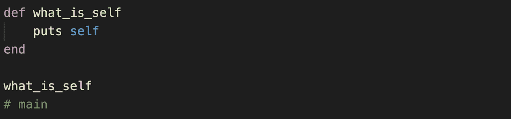
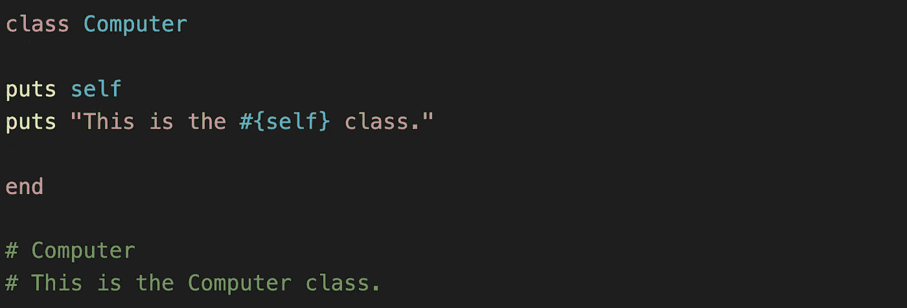
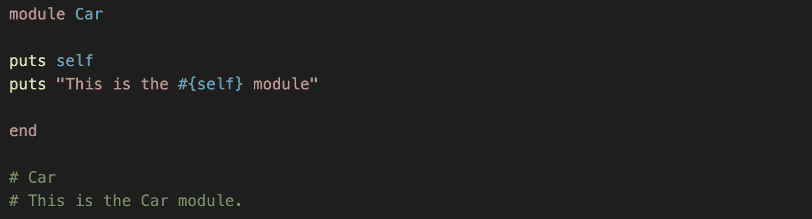
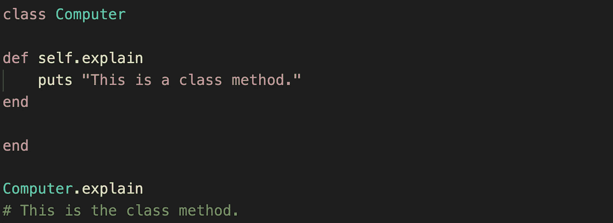
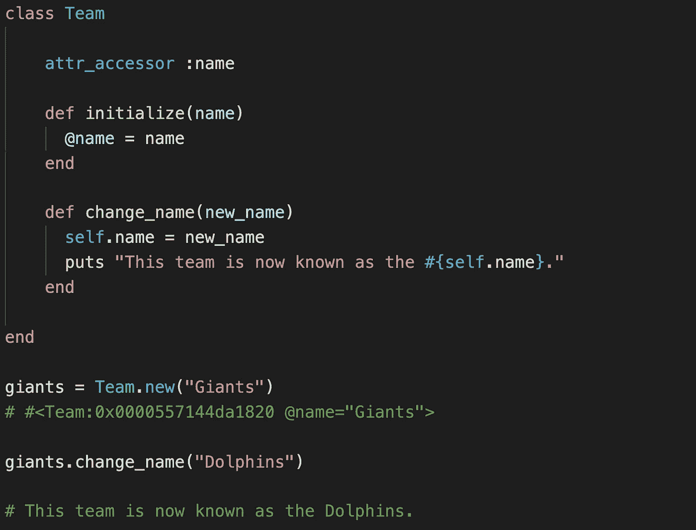
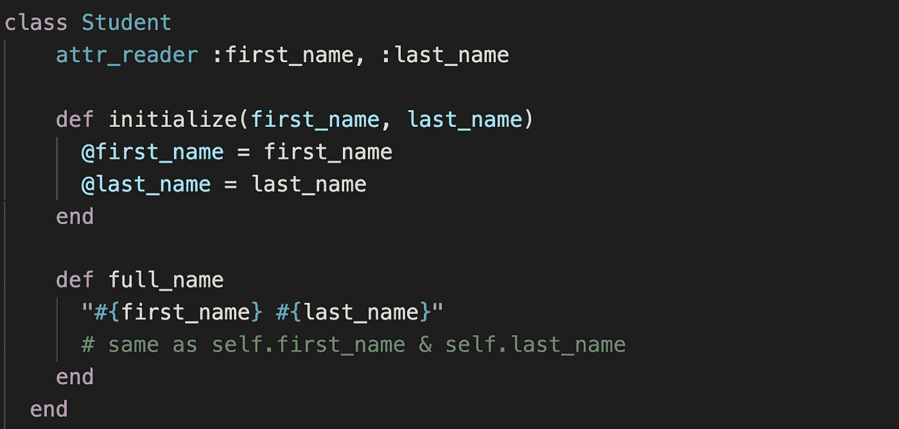

# 露比的自我意识

> 原文：<https://medium.com/nerd-for-tech/rubys-self-consciousness-d8b6db3d2a40?source=collection_archive---------1----------------------->

在你进一步阅读之前，不，这不是一个关于一个名叫鲁比的女孩的精神启蒙的故事。相反，我们将探索 Ruby 编程语言中的 `self` *关键字，并理解它是如何被普遍使用的。*

> 红宝石& `*self*`

根据定义，自我意识被描述为一种高度的自我意识(T21 意识)。在像 Ruby 这样的面向对象程序中，这句话再正确不过了。

从字面上看，每个对象都是有自我意识的，并且可以在自身上操作方法。稍后会有更多的介绍，但首先是一个简短的历史。

> 面向对象的起源

Simula 67 被广泛认为是第一种面向对象的编程语言。当它在 1967 年首次亮相时，它引入了对象、类、子类和许多其他概念，为今天使用的 OO 语言提供了框架。其中一个概念是创建一个关键字来显式引用本地对象；关键词是`this`。

从那时起，编程语言不断进化和发展，但大多数仍然有一些关键字服务于相同的目的。在 Ruby 中是`self`。

> 什么是`self`？

在 Ruby 中，`self`是一个关键字，用于访问与当前正在执行的代码*相关联的对象——这意味着使用`self`的上下文将决定该代码中的对象`self`。*

> *如何确定和使用`self`*

*要理解`self`是什么，首先要看它使用的语境。它的使用有三个一般准则。*

***1。**如果上下文在任何`method` / `class` / `module`定义之外，`self`始终代表`main`。`main`是直接内置到 Ruby 中的顶级对象。*

**

*当 **self** 在任何方法、类或模块之外使用时，Ruby 自动将 **self** 解释为 **main** 。*

***2。**如果上下文在`class` / `module`定义**内，并且**在`method`定义之外，`self`表示具体的`class` / `module`本身。*

**

*Ruby 将 **self** 解释为计算机类。*

**

*当在一个模块的上下文中使用 **self** 时， **self** 代表模块本身。*

*在这个上下文中使用`self`还提供了通过在类方法名前面加上`self.`来构建类级方法的能力*

**

*这里的`**self**`相当于`**Computer**`，类名。*

*3.最后，如果上下文在实例方法定义中，`self`是方法的接收者。它将表示调用该方法的特定实例。*

**

*在 **change_name** 方法中， **self** 代表执行该方法时被调用的 **Team** 实例。因此，当**giants . change _ name(" Dolphins ")**被执行时，我们调用 **giants.name** 来等于 **"Dolphins"** 的新参数。*

> *隐式与显式`self`*

*根据经验，当试图访问一个类、类方法或实例方法中的`self`时，有一种东西被称为隐式自我。如果一个方法在没有显式 self 的情况下被调用(实际上在方法之前写出了`self.`), Ruby 使用隐式 self，这是它对方法(如果之前定义的话)正在调用对象本身的理解。让我们在下面的例子中进一步探讨这一点。*

**

*在 **full_name** 方法中，Ruby 使用隐式 self 对 **first_name** 和 **last_name** 进行字符串插值，因为它通过 attr_reader 宏识别这些方法。*

*Student#full_name 方法使用来自 Student#first_name 和 Student#last_name 的值，但不显式使用`self.`，而是依赖于隐式 self 的值。*

> *最后*

*Ruby 中的`self`关键字是一个强大的工具，它允许开发者 ***根据上下文*** 引用一个特定的对象。当试图弄清楚`self`在你的代码中是什么或者将会是什么时，试着记住关于上下文的一般准则，并问自己:“在这个特定的用法中，`self`是谁？”*

*有意识地理解如何使用`self`将为阅读和编写 Ruby 代码提供坚实的基础。*