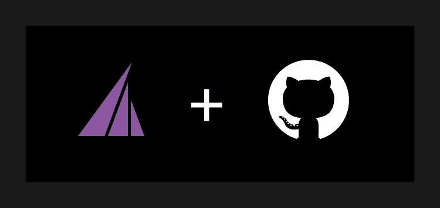

# RudderStack + GitHub 赞助商:让开源对开发者来说更可持续

> 原文：<https://medium.com/nerd-for-tech/rudderstack-github-sponsors-making-open-source-more-sustainable-for-developers-b49dd9c2d205?source=collection_archive---------29----------------------->

我们无时无刻不在使用**开源软件(OSS)** ，甚至在我们不知道的时候。互联网的主干是建立在开放源码软件之上的。OSS 使得站在编码巨人的肩膀上就像分叉回购一样容易，这对于封闭源码软件来说是不可能的。然而，绝大多数开发和设计 OSS 的开发者，除非是极少数被公司或组织雇佣来做开源工作的幸运儿，他们的工作是没有报酬的。我们正在努力改变这种状况。

# 方向舵堆栈合作伙伴为公司推出 GitHub 赞助商

我们与 GitHub 合作，在 [GitHub Universe 2020](https://githubuniverse.com/) 上为公司推出 [GitHub 赞助商](https://github.com/sponsors)。开源开发者应该为他们的工作得到补偿，GitHub 赞助商为公司提供了一个新的、更好的补偿渠道。我们很高兴能使用这个渠道。

2019 年推出的 GitHub 赞助商。它允许个人支持开源项目和开发者。GitHub 赞助商已经向开源开发者支付了数百万美元，有些人甚至一年赚六位数。这有助于使开源更加可持续，并鼓励一些开发人员将开源作为他们的全职工作。

GitHub 赞助商为公司提供了同样的能力来投资 GitHub 生态系统中的开源软件，使得公司和他们赞助的任何人的补偿过程更加容易。由于 GitHub 赞助商的工作方式及其最初的意图，个人赞助开源项目和开发者所做的工作，几乎所有目前参与 GitHub 赞助商的公司都支持开源项目和公司使用或其工程师投票赞助的开源项目的贡献者。我们决定采取不同的方法。

# 增强奖金

由于 RudderStack 是开源的，我们希望我们的项目有更多的外部贡献，我们正在使用 GitHub 赞助商通过我们所谓的增强奖金直接补偿开发者我们希望完成的工作。在我们的 [rudder-server repo](https://github.com/rudderlabs/rudder-server) 中的 GitHub 问题中定义了每个赏金，其中包括标签“$$$ Bounty”。我们已经有两个增强奖金，[一个是 Jamstack instrumentation](https://github.com/rudderlabs/rudder-server/issues/655) 的奖金，接近完成，[一个是 Roku SDK](https://github.com/rudderlabs/rudder-server/issues/656) 的奖金，还没有人来领取。每个人都有 2000 美元的奖金。你可以在我们的 [dev.to post](https://dev.to/rudderstack/devs-wanted-get-paid-to-contribute-to-rudderstack-s-open-source-software-bjp) 中阅读我们最初的公告。我们的第一个赏金的结果很好，由[克里斯·雷](https://github.com/cwray-tech)为方向舵堆栈构建的盖茨比插件已经发布到 [npm](https://www.npmjs.com/package/gatsby-plugin-rudderstack) 和[盖茨比的插件页面](https://www.gatsbyjs.com/plugins/gatsby-plugin-rudderstack/) (GitHub repo [这里](https://github.com/rudderlabs/gatsby-plugin-rudderstack))。

我们将很快推出新的增强奖金，每个奖金都将在[我们的 dev.to](https://dev.to/rudderstack) 以及[我们的 Twitter](https://twitter.com/RudderStack) 上发布。请关注我们，了解未来增强奖金机会的信息。

# 今天试试方向舵堆栈

开始构建更智能的客户数据管道。使用你所有的客户数据。回答更难的问题。向您的整个客户数据堆栈发送见解。今天就报名参加[舵栈云免费](https://app.rudderlabs.com/signup?type=freetrial)。

加入我们的 [Slack](https://resources.rudderstack.com/join-rudderstack-slack) 与我们的团队聊天，查看我们在 [GitHub](https://github.com/rudderlabs) 上的开源报告，订阅[我们的博客](https://rudderstack.com/blog/)，在社交上关注我们: [Twitter](https://twitter.com/RudderStack) 、 [LinkedIn](https://www.linkedin.com/company/rudderlabs/) 、 [dev.to](https://dev.to/rudderstack) 、 [Medium](https://rudderstack.medium.com/) 、 [YouTube](https://www.youtube.com/channel/UCgV-B77bV_-LOmKYHw8jvBw) 。不要错过任何更新。[立即订阅](https://rudderstack.com/blog/)我们的博客！

*原载于 https://rudderstack.com***。**