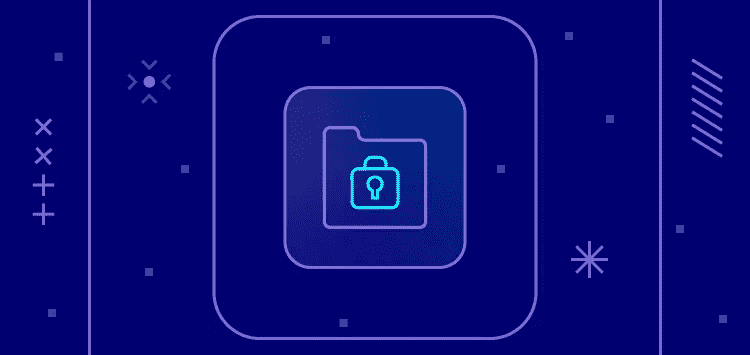

# 方向舵堆栈确保 SOC 2 型认证

> 原文：<https://medium.com/nerd-for-tech/rudderstack-secures-soc-2-type-ii-certification-e8a6b504aed0?source=collection_archive---------5----------------------->

在 RudderStack，我们认为安全性至关重要，尤其是当涉及到我们客户的专有数据时。因此，我们很高兴地宣布，我们已经实现了系统和组织控制(SOC)2 II 型合规性。RudderStack 的这一合规水平是通过第三方审计机构 Prescient Assurance 实现的，该机构运行一份内部控制报告，记录 RudderStack 如何保护客户数据和实施控制。

那么这对 RudderStack 的客户意味着什么呢？SOC 2 Type II 报告验证了 RudderStack 满足高度受控行业客户的要求，这些客户需要专家评估供应商如何处理安全原则。RudderStack 的客户现在知道，如果发生大规模网络攻击，他们的数据在 RudderStack 上是安全的。此外，RudderStack 为我们的所有客户提供一流的警报程序、审计跟踪和可操作的取证。

这份完整的评估是在 RudderStack 经历巨大增长并为我们超过 11，000 个站点和应用程序处理大量数据之际完成的。获得 SOC 2 Type II 认证强化了我们的承诺，即帮助我们的客户从一个平台轻松、安全地同步所有客户数据进出仓库。

如果您想在一个安全的平台上开始访问实时事件流、ETL 和反向 ETL，[今天就免费试用 RudderStack】。](https://app.rudderstack.com/signup?type=freetrial)

*本博客最初发布于:* [*https://rudder stack . com/blog/rudder stack-secures-SOC-2-type-ii-certification/*](https://rudderstack.com/blog/rudderstack-secures-soc-2-type-ii-certification/)