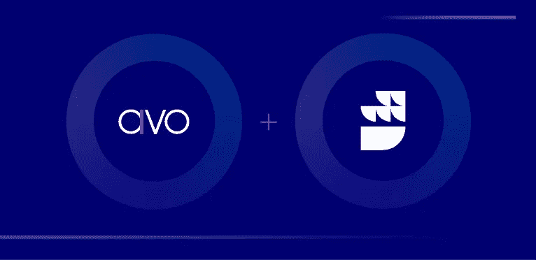

# 方向舵堆栈 x Avo

> 原文：<https://medium.com/nerd-for-tech/rudderstack-x-avo-f9fc8d744d84?source=collection_archive---------1----------------------->

今天，我们很兴奋地宣布我们与 Avo 的合作伙伴关系。RudderStack 和 Avo 合作，以更高的数据质量更快地提供分析跟踪。使用 Avo，您可以在实现事件和属性并将其发送到 RudderStack 之前，准确地设计它们的外观。Avo 使开发人员能够获得关于如何实现 Rudderstack 事件的详细说明，以及验证实现是否符合规范的工具。

# 什么是 Avo？

Avo 是下一代分析治理。今天，Avo 正在改变产品经理、开发人员和数据科学家跨组织规划、跟踪和管理分析的方式。在 Avo 之前，团队被迫在产品交付速度和可靠的见解之间做出选择。

# Rudderstack 的追踪计划是什么？

Rudderstack 的跟踪计划使您能够根据您事先定义的计划，主动监视进入 Rudderstack 源的事件数据并对其采取行动。我们的服务器端实施允许您选择是否丢弃或上下文化不符合的事件，以供以后处理。

# 一起更好

数据质量对于从我们的客户行为数据中获取价值至关重要。Avo 的跟踪计划管理和开发工具能够发布到 Rudderstack 的新[跟踪计划 API](https://documenter.getpostman.com/view/16242548/TzeWFT6D#7df289e7-8758-4ec0-a86e-3aa08bd3260e) 中，使开发人员能够与产品经理和数据经理合作，以更快 10 倍的速度和更好的数据质量实施分析数据。

[点击此处](https://documenter.getpostman.com/view/16242548/TzeWFT6D#7df289e7-8758-4ec0-a86e-3aa08bd3260e)了解 Avo 和 RudderStack 如何合作的更多信息。

*本博客最初发表于:* [*https://rudderstack.com/blog/rudderstack-x-avo*](https://rudderstack.com/blog/rudderstack-x-avo)