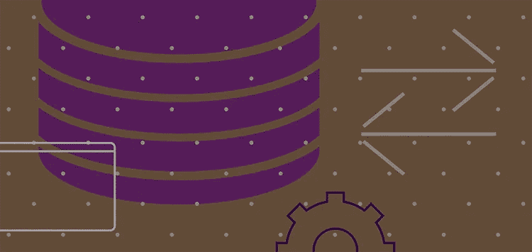

# RudderStack 的转换 API

> 原文：<https://medium.com/nerd-for-tech/rudderstacks-transformations-api-2d30724a3554?source=collection_archive---------26----------------------->

**RudderStack 转换**让你转换你通过 RudderStack 发送的任何数据。您可以在事件流、仓库操作和云提取管道中使用它们。它们易于构建、调试和管理；它们在数据收集之后、发送到目的地之前实时运行。简单地说，它们是数据转换，像你认为的那样工作。

尽管 Transformations 是最受欢迎的 RudderStack 特性之一，但它的 API 直到现在才被用户使用。我们很高兴发布**方向舵堆栈转换 API** 。通过它，您可以以编程方式向平台添加和移除转换，创建一个组织范围的沙箱，在将转换发布到真实环境之前，您的团队可以在其中存储转换，定义库，并对您的转换进行版本控制。

# 什么是 RudderStack 转换 API？

转换 API 允许您通过 HTTP API 调用对转换和库执行各种操作。API 与 RudderStack UI 集成在一起，因此您可以轻松地访问和管理您的转换和库。您甚至可以在一个操作中发布多个转换，这是 RudderStack UI 上还没有的功能。

转换 API 是一个 RESTful API。它允许您创建和使用转换，并获得一个 JSON 对象作为响应。您可以利用标准的 HTTP 响应代码来确定您的 API 请求是成功还是失败。

转换 API 的一些其他关键特性包括:

*   允许您对所有转换进行版本控制，以便转换中的每次更改都会创建一个新版本。
*   允许您在发布转换之前将其存储在组织范围内的沙盒中。
*   使用转换库——您可以在转换中使用的模块化、可重用的 JavaScript 块。
*   通过[基本 HTTP 认证](https://developer.mozilla.org/en-US/docs/Web/HTTP/Authentication)机制进行认证。
*   检查新转换的编译和执行是否成功。

# 转换上的 CRUD 操作

转换 API 允许您对转换执行标准的 CRUD(创建、检索、更新、删除)操作。

通常，您可以创建一个转换并获得一个 JSON 对象作为响应。用任何变更更新转换会创建一个新的版本或者**修订**。API 还为这些操作提供了一个可选的参数(`publish)`),它允许您发布最新版本的转换，并使代码对传入的事件流量有效。

API 为每个发布的转换分配一个 ID。您可以利用这个 ID 来检索、更新或删除一个转换。此外，您可以获得对该转换所做的所有修改。

# 版本控制

API 为每一个变更创建一个新版本的转换或者库，允许您跟踪转换/库的整个血统。

转换 API 实现版本控制的方式非常有趣。假设您创建了一个转换。其中的任何更新或变更都会导致 RudderStack 将转换的旧版本保存为修订版。您可以对转换进行多次这样的修改，API 将记录每一次这样的修改，而当前版本总是可供您发布和使用。API 还允许您回滚并使用您想要通过它的 Publish API 发布的转换的任何特定版本。

# 转换库

转换 API 为您的转换提供了更好的开发工作流程库。它们为您提供了重用和维护不同版本的转换代码的灵活性，同时免除了您手动的、重复的编码工作。

如上所述，这些库是 JavaScript 函数，您可以编写、导出和重用。假设您编写了一个函数，您希望在 RudderStack 中为每个目的地配置的多个转换之间重用该函数。您所要做的就是导出它，并在所需的转换中通过库名导入模块。

> ***注意*** *:您也可以将上一节提到的所有 CRUD 操作应用到库中。*

有关使用 RudderStack 转换 API 的更多信息和技术细节，请查看[文档](https://docs.rudderstack.com/adding-a-new-user-transformation-in-rudderstack)。我们还构建了一些方便的转换模板，您可以使用它们来创建您的转换。在我们的 [GitHub 资源库](https://github.com/rudderlabs/sample-user-transformers)中找到它们。

# 免费注册并开始发送数据

测试我们的事件流、ELT 和反向 ETL 管道。使用我们的 HTTP 源在不到 5 分钟的时间内发送数据，或者在您的网站或应用程序中安装我们 12 个 SDK 中的一个。[入门](https://app.rudderlabs.com/signup?type=freetrial)。

本博客最初发布于:
[https://rudder stack . com/blog/rudder stacks-transformations-API](https://rudderstack.com/blog/rudderstacks-transformations-api)