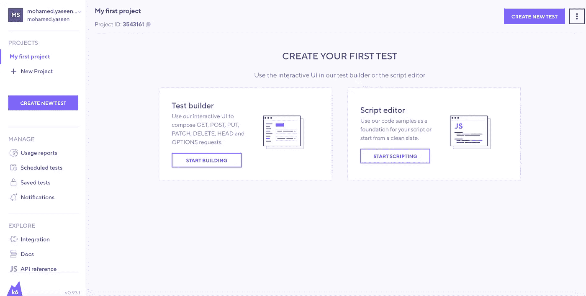
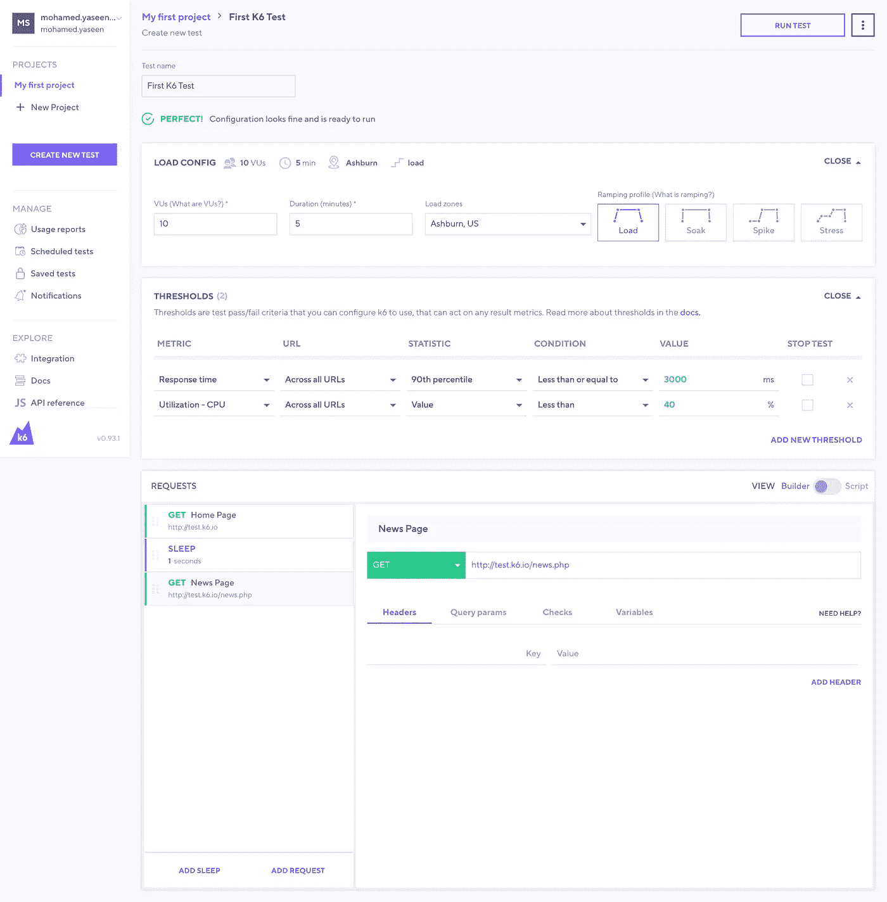
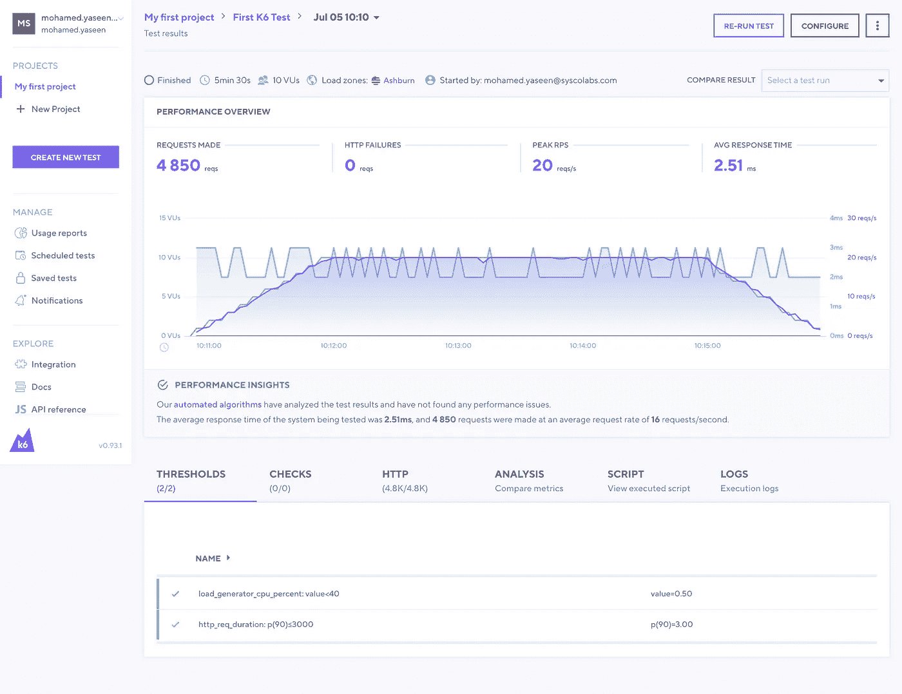
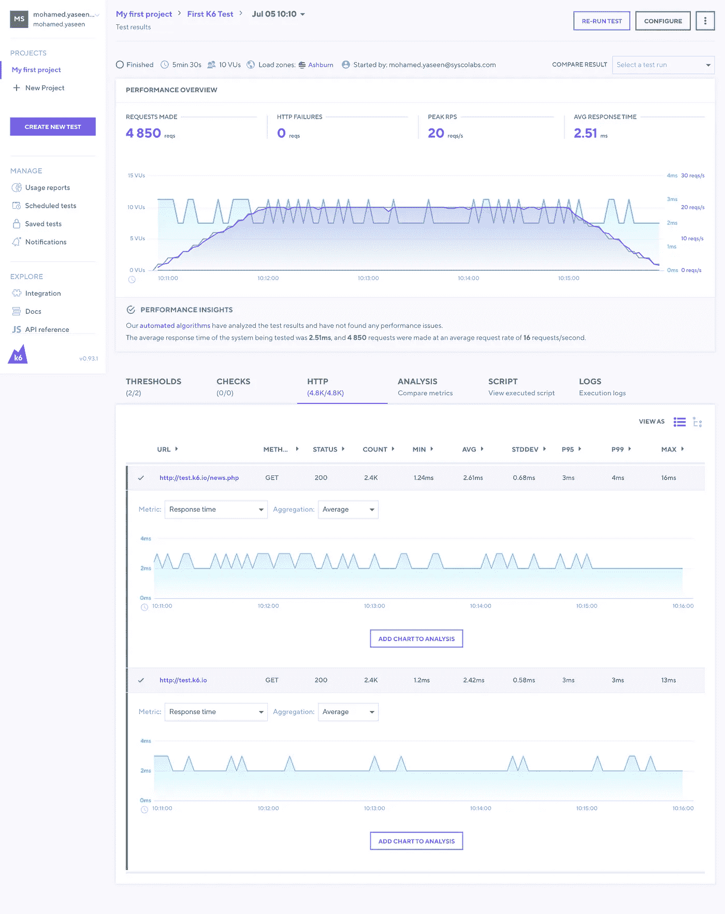
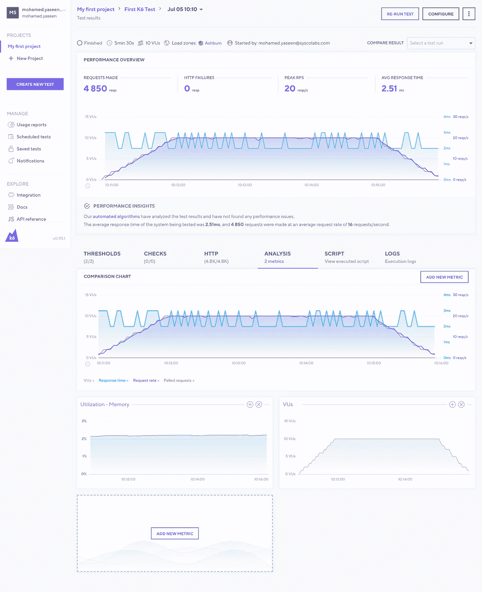
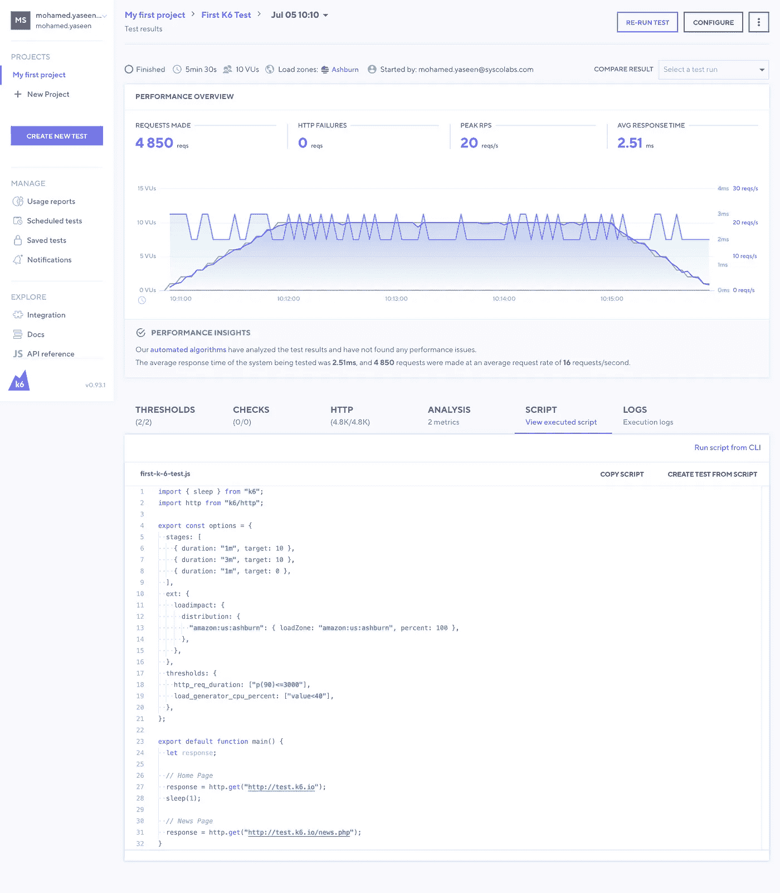

# 在 K6 在线测试生成器上运行负载测试

> 原文：<https://medium.com/nerd-for-tech/run-a-load-test-on-k6-online-test-builder-6eedfb9663f2?source=collection_archive---------10----------------------->

# 介绍

k6 测试构建器允许您使用图形界面构建 k6 测试。要使用测试构建器，您需要一个 k6 云帐户。它是免费使用的，但是，使用这个功能，你不需要一个活跃的成员。测试构造器根据您的输入自动为您生成 k6 脚本。复制完脚本并执行 CLI 测试后。

虽然我坚定地认为基于脚本/代码的工具将帮助您利用您的性能评估工作，但是像 test builder 这样的基于 GUI 的工具可以以这种方式帮助您。加速测试的发展。
2。K6 API 快速学习。2.
3。与非编码人员一起构建测试。

# 注册和登录

1.  用你的邮箱注册 [K6 云账号](https://app.k6.io/account/login)。
2.  输入您将获得的激活码。
3.  [登录](https://app.k6.io/account/login)进入 k6 云。
4.  在侧边栏菜单上，点击[创建新测试](https://app.k6.io/tests/new)按钮。
5.  选择测试生成器。
6.  现在，您可以使用图形界面开始构建您的 k6 测试。

# 做我们的第一个测试

1.  我们将删除测试名称作为第一个 K6 测试。它会自动保存。
2.  让我们转到配置部分。
3.  选择 VUs 为 10。(虚拟用户(vu)模仿真实用户的行为。它们用于执行测试脚本的单独和并发执行，对网页或 API 发出 HTTP(s)和 WebSocket 请求。)
4.  设置持续时间为 5 分钟
5.  选择装载区域为美国阿什伯恩(默认)
6.  选择斜坡轮廓作为负载。(使用 k6 可以执行多种类型的测试，每种类型有不同的用途。冒烟测试的作用是验证您的系统可以处理最小负载，没有任何问题。负载测试主要关注评估系统在并发用户或每秒请求数方面的性能。压力测试和峰值测试关注的是评估您的系统在极端条件下的极限和稳定性。浸泡测试告诉你你的系统在长时间内的可靠性和性能。)
7.  让我们转到配置阈值部分(阈值是您可以配置 k6 使用的测试通过/失败标准，它可以作用于任何结果指标)
8.  增加一个阈值，即响应时间的 90%小于或等于 3000 毫秒。
9.  当 CPU 利用率小于或等于 40%时，再增加一个阈值。
10.  添加第一个请求主页—[GET->[http://test . K6 . io](http://test.k6.io)]
11.  增加睡眠 1 秒钟。
12.  添加第二个请求新闻页面—[GET->[http://test . K6 . io](http://test.k6.io/news.php)/News . PHP]

让我们使用运行测试按钮(右上角)运行，并等待 5 分钟完成。

测试完成。现在你可以看到结果了

*   超过了阈值
*   默认度量标准(HTTP)

*   分析——我们可以在图表中添加更多的分析。

*   脚本—它显示了 UI 流的实际 javascript 代码。

*   日志—在此选项卡中，您可以找到执行日志和 console.log 输出。当调试一个测试脚本时，或者当意外错误发生时，作为获得额外的文本上下文的一种手段，日志记录是非常有用的。