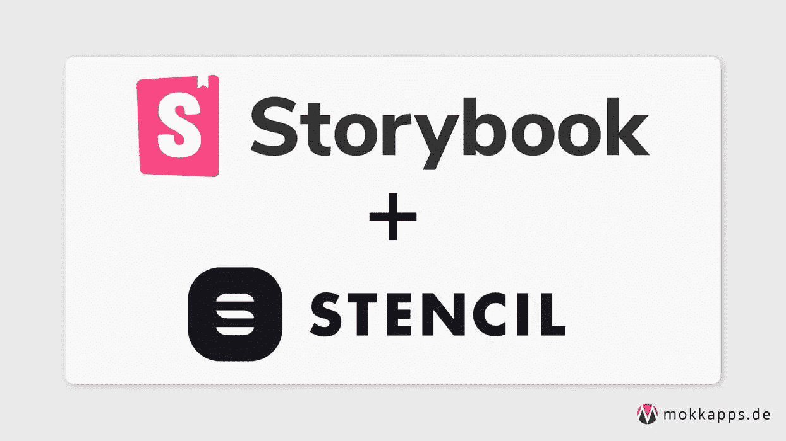
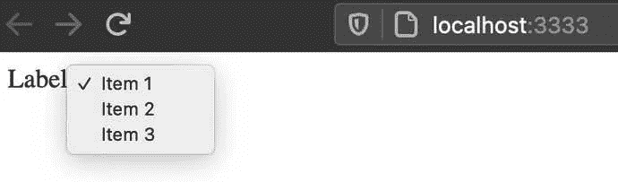
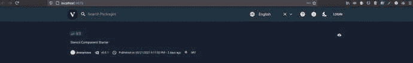
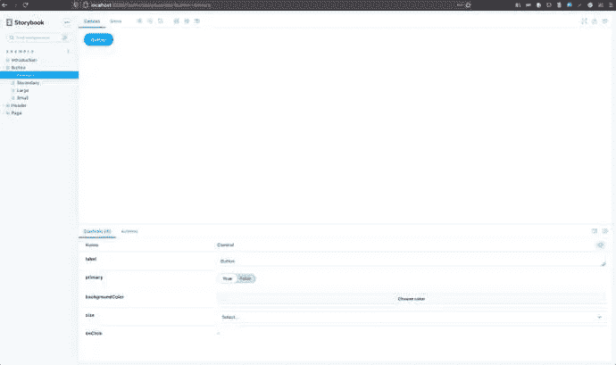
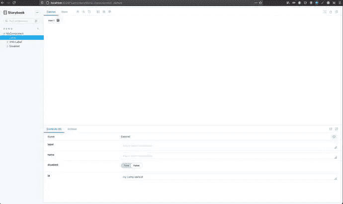

# 从一个存储库运行、构建和部署模板和故事书

> 原文：<https://medium.com/nerd-for-tech/run-build-deploy-stencil-and-storybook-from-one-repository-5f398c4070dc?source=collection_archive---------9----------------------->



我最近加入了一个项目，团队基于[模板](https://stenciljs.com/)和[故事书](https://storybook.js.org/)为他们的 web 组件使用了两个独立的 Git 存储库。但是 Storybook 的想法是，所谓的“故事”存在于组件源代码的旁边。因此，将这两个工具放在不同的存储库中对我来说毫无意义，我将它们合并在一个存储库中。

我的目标是开发人员也可以在开发过程中通过热重载来使用故事书故事。此外，应该仍然可以将 web 组件分别部署到一个 [npm](https://www.npmjs.com/) 注册表，并将 Storybook 部署到一个公共 URL。

本文描述了将故事书和模板结合到一个存储库中的必要步骤。我写这篇文章是因为目前还没有关于如何使用模板故事书的官方文档。让我们从一些基本的开始。

# 蜡纸

> Stencil 是一个工具链，用于构建可重用、可扩展的设计系统。生成运行在每个浏览器上的小型、超快的、100%基于标准的 Web 组件。

Stencil 将“最流行的框架的最佳概念结合到一个简单的构建时工具中”，例如:

*   类型脚本支持
*   JSX 支持
*   单向数据绑定

从这些精选的概念中可以看出，Stencil 是一个受 [React](https://reactjs.org/) 启发的 web 组件库。我以前使用过 [lit-element](https://lit-element.polymer-project.org/) ，但是由于上面提到的特性，我更喜欢使用模板，尤其是在 React 项目中。

让我们创建一个新的模板项目，它将成为本文演示项目的基础，该项目可从 [GitHub](https://github.com/Mokkapps/stencil-storybook-demo) 获得:

```
npm init stencil
```

我们选择了`component` starter，因为我们想要构建一个可以通过 npm 共享的 web 组件库:

```
? Pick a starter › - Use arrow-keys. Return to submit.ionic-pwa     Everything you need to build PWAsapp           Minimal starter for building a Stencil app or website❯ component   Collection of web components that can be used anywhere
```

现在我们将自动创建的`my-component.tsx`修改得更复杂一些:

```
export interface CompOption {
  value: string;
  displayText: string;
}

@Component({
  tag: 'my-component',
  styleUrl: 'my-component.css',
  shadow: true,
})
export class MyComponent {
  /**
   * The text which is shown as label
   */
  @Prop() label: string;

  /**
   * Is needed to reference the form data after the form is submitted
   */
  @Prop({ reflect: true }) name: string;

  /**
   * If true, the button is displayed as disabled
   */
  @Prop({ reflect: true }) disabled = false;

  /**
   * Define the available options in the drop-down list
   */
  @Prop() options: CompOption[] = [];

  render() {
    return (
      <div>
        <label htmlFor={this.name}>{this.label}</label>

        <select name={this.name} id={this.name} disabled={this.disabled}>
          {this.options.map(o => (
            <option value={o.value}>{o.displayText}</option>
          ))}
        </select>
      </div>
    );
  }
}
```

我们的演示组件是一个本地 HTML select 组件，它通过属性传递选项。一些值，如标签文本、组件名称，以及组件是否被禁用，也通过 props 传递给 web 组件。

为了能够在本地测试我们的演示组件，我们需要调整`src/index.html`,它在我们启动模板时使用:

```
<!DOCTYPE html>
<html dir="ltr" lang="en">
  <head>
    <meta charset="utf-8" />
    <meta
      name="viewport"
      content="width=device-width, initial-scale=1.0, minimum-scale=1.0, maximum-scale=5.0"
    />
    <title>Stencil Component Starter</title>

    <script type="module" src="/build/ui-kit.esm.js"></script>
    <script nomodule src="/build/ui-kit.js"></script>
  </head>
  <body>
    <my-component
      id="my-comp"
      label="Label"
      name="MyComp"
      disabled="false"
    ></my-component>
  </body>
  <script>
    document.getElementById('my-comp').options = [
      {
        value: 'Item 1',
        displayText: 'Item 1',
      },
      {
        value: 'Item 2',
        displayText: 'Item 2',
      },
      {
        value: 'Item 3',
        displayText: 'Item 3',
      },
    ];
  </script>
</html>
```

现在我们可以通过运行`npm run start-stencil`来本地测试我们的演示组件，这是一个从 Stencil 自动生成的 npm 脚本。组件现在应该在`[http://localhost:3333](http://localhost:3333:)` [:](http://localhost:3333:) 处可见



下一步是将我们的组件部署到 npm 注册中心。对于这个演示，我使用的是“轻量级开源私有 npm 代理注册表”。首先，它需要全球安装

```
npm install -g verdaccio
```

然后可以在本地启动:

```
▶ verdaccio 
warn --- config file - /Users/mhoffman/.config/verdaccio/config.yaml warn --- Verdaccio started 
warn --- Plugin successfully loaded: verdaccio-htpasswd 
warn --- Plugin successfully loaded: verdaccio-audit 
warn --- http address - http://localhost:4873/ - verdaccio/4.12.0
```

现在我们在`http://localhost:4873/`有一个本地的 npm 注册中心，所以我们需要告诉 npm 使用这个注册中心，例如，通过修改`.npmrc`:

```
registry=http://localhost:4873
```

此外，我们需要在注册表中创建一个用户:

```
npm adduser --registry [http://localhost:4873](http://localhost:4873)
```

最后，我们可以打包软件包并将其发布到 npm 注册表:

```
npm pack
npm publish
```

现在应该可以在我们的私有注册中心`[http://localhost:4873/](http://localhost:4873/:)` [:](http://localhost:4873/:) 看到它了



至此，我们有了一个可以部署到任何 npm 注册表的工作模板 web 组件库。下一步是将故事书集成到我们的知识库中。

# 故事书

> *Storybook 是一个开源工具，用于为 React、Vue、Angular 等开发独立的 UI 组件*

[Storybook](https://storybook.js.org/) 的一个典型用例是拥有一个 web 组件库的可视化表示。这使得任何开发人员或设计人员都可以看到哪些组件是当前可用的，以及它们的外观和行为。

当模板组件被编译成 web 组件时，我们可以使用 HTML 的[故事书](https://storybook.js.org/docs/guides/guide-html/)项目类型:

```
npx -p @storybook/cli sb init -t html
```

如果我们现在运行`npm run storybook`，它会在`http://localhost:6006`打开一个浏览器窗口，显示一些自动生成的组件&故事:



现在让我们为我们的`<my-component>`演示 web 组件写一个故事:

```
export default {
  title: 'Demo/MyComponent',
  argTypes: {
    label: { type: 'text', description: 'The text which is shown as label' },
    name: {
      type: 'text',
      description:
        'Is needed to reference the form data after the form is submitted',
    },
    disabled: {
      type: 'boolean',
      description: 'If true, the button is displayed as disabled',
      defaultValue: { summary: false },
    },
  },
};

const defaultArgs = {
  disabled: false,
};

const Template = args => {
  return <my-component {...args}></my-component>;
};

export const MyComponent = Template.bind({});
Default.MyComponent = { ...defaultArgs };
```

在我们的故事中，我们定义了[控件](https://storybook.js.org/docs/react/essentials/controls#gatsby-focus-wrapper)来操作 Storybook 中的组件属性。我们还添加了一些默认值和描述。

但不幸的是，我们无法在 Storybook 中看到我们的组件，需要对项目设置做一些进一步的调整。

首先，我们需要在`.storybook/preview.js`中加载并注册我们的 web 组件，以便将它们包含在 webpack 的依赖图中。这段 JavaScript 代码被添加到每个故事书故事的预览画布上，因此可用于 webpack 构建:

```
// highlight-start
import { defineCustomElements } from '../dist/esm/loader';

defineCustomElements();
// highlight-end

export const parameters = {
  actions: { argTypesRegex: '^on[A-Z].*' },
};
```

现在我们需要添加 [@storybook/react](https://www.npmjs.com/package/@storybook/react) 以便能够在故事中使用我们的组件:

```
npm add -D @storybook/react
```

下一步是修改我们的`my-component.stories.js`:

```
//highlight-next-line
import React from 'react';
//highlight-next-line
import MyComponent from '../../../dist/collection/components/my-component/my-component';

export default {
  title: 'Demo/MyComponent',
  //highlight-next-line
  component: MyComponent,
  argTypes: {
    label: { type: 'text', description: 'The text which is shown as label' },
    name: {
      type: 'text',
      description:
        'Is needed to reference the form data after the form is submitted',
    },
    disabled: {
      type: 'boolean',
      description: 'If true, the button is displayed as disabled',
      defaultValue: { summary: false },
    },
  },
};

const defaultArgs = {
  disabled: false,
};

const Template = args => {
  return <my-component {...args}></my-component>;
};

export const Default = Template.bind({});
Default.args = { ...defaultArgs };
```

最后，我们需要添加两个新的 npm 脚本:

```
"scripts": {
  "build-stencil:watch": "stencil build --docs-readme --watch --serve",
  "start-storybook": "start-storybook -p 6006 -s dist"
},
```

通过用`--watch`标志运行 Stencil 的构建过程，它用我们在`preview.js`文件中引用的`esm/loader.mjs`文件生成正确的输出。然后我们只需要告诉 Storybook 使用模板构建命令生成的`dist`文件夹，并禁用其缓存机制。

如果我们现在在单独的终端中运行`build-stencil:watch`，然后再运行`start-storybook`，我们可以在 Storybook 中看到我们的组件:



您现在还可以修改您的模板 web 组件，由于热重新加载，您可以立即在 Storybook 中看到您的更改。

您可能还想知道我们如何通过属性设置选项？通过使用`my-component.stories.js`中模板函数内的`setTimeout`可以确保组件已经加载:

```
const Template = args => {
  args.id = args.id ? args.id : 'my-component';
  setTimeout(() => {
    document.getElementById(args.id).options = [
      {
        value: 'Item 1',
        displayText: 'Item 1',
      },
      {
        value: 'Item 2',
        displayText: 'Item 2',
      },
      {
        value: 'Item 3',
        displayText: 'Item 3',
      },
    ];
  });
  return <my-component {...args}></my-component>;
};
```

最后，我们希望将 Storybook 部署到一个公共 URL，因此我们使用了 [storybook-deployer](https://github.com/storybookjs/storybook-deployer) ，它提供了一种将它部署到 GitHub Pages 或 AWS S3 的好方法。我们将通过安装该工具将其部署到 AWS S3

```
npm i @storybook/storybook-deployer --save-dev
```

并且给`package.json`添加了一些新的脚本:

```
"scripts": {
  "build-storybook": "build-storybook -o ./distStorybook",
  "predeploy-storybook": "npm run build-storybook",
  "deploy-storybook": "storybook-to-aws-s3 --existing-output-dir ./distStorybook --bucket-path <AWS_BUCKET_PATH>",
},
```

在我们部署 Storybook 之前，我们触发一个构建，这是通过使用`build-storybook`作为[前脚本](https://docs.npmjs.com/cli/v7/using-npm/scripts#pre--post-scripts)来完成的。您还需要确保您的 [AWS S3 允许公众访问](https://havecamerawilltravel.com/photographer/how-allow-public-access-amazon-bucket/)。

例如，我的演示项目位于[http://mokkapps-stencil-story book-demo . S3-website . eu-central-1 . amazonaws . com](http://mokkapps-stencil-storybook-demo.s3-website.eu-central-1.amazonaws.com)。

# 结论

将模板和故事书结合起来有点棘手，最好有这个主题的官方文档。

但我认为这是值得努力的，而且由于 Storybook 的特性，它还可以改进本地组件开发。

演示项目的代码可从 GitHub 获得。

如果你喜欢这篇文章，请在 [Twitter](https://twitter.com/mokkapps) 上关注我，从我这里获得关于新博客文章和更多内容的通知。


*最初发布于*[*https://www . mokkapps . de*](https://www.mokkapps.de/blog/run-build-and-deploy-stencil-and-storybook-from-one-repository/)*。*