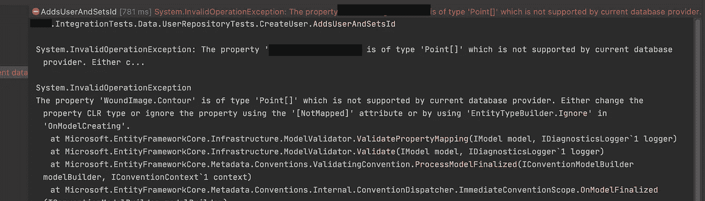
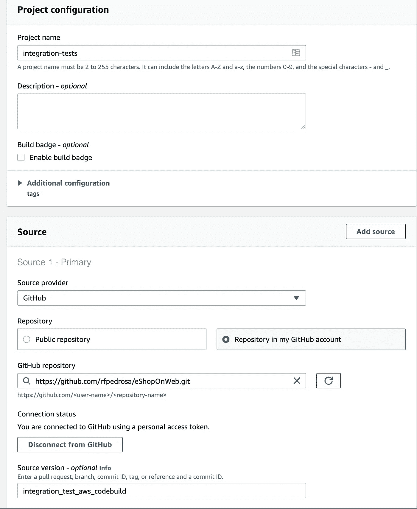
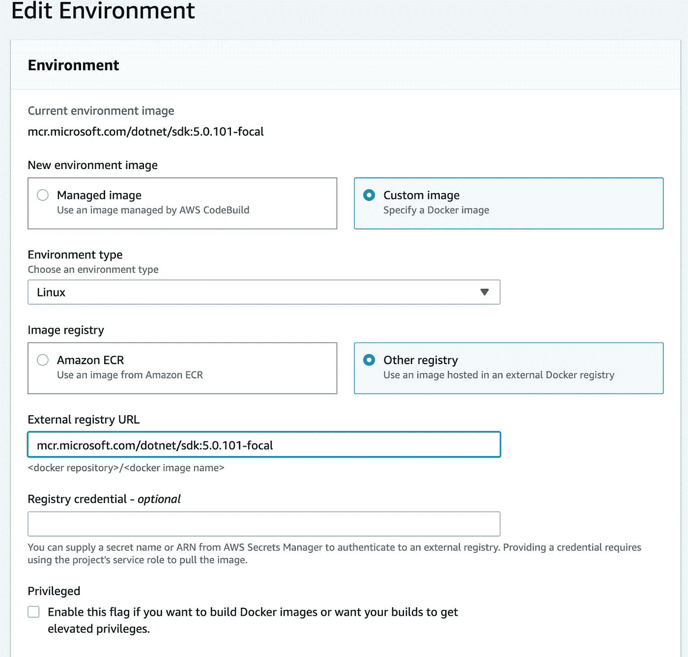
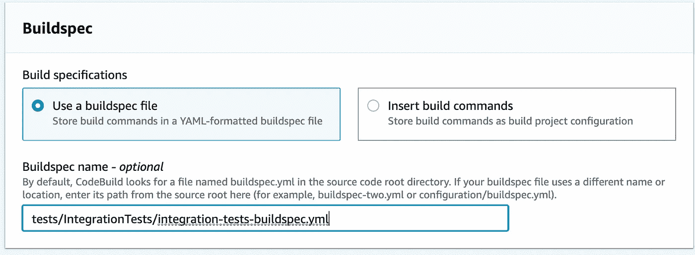
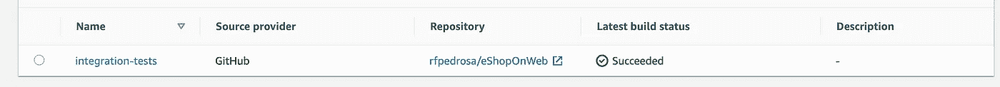

# 使用带有真实数据库的公共 Docker 映像，以可重复且隔离的方式运行 EF 核心集成测试

> 原文：<https://medium.com/nerd-for-tech/run-ef-core-integration-tests-in-a-repeatable-and-isolated-way-using-a-public-docker-image-with-a-e912a89c7bf4?source=collection_archive---------0----------------------->

集成测试是有价值的，它们不同于 T2 单元测试，更难达到理想状态，尤其是当你使用真实的数据库(而不是内存数据库)时。

至少在你读到这篇文章之前是这样的😎我们将:

1.  从微软 eShopOnWeb ASP.NET 核心参考应用程序获得一个[示例集成测试，该测试以可重复且隔离的方式在 docker 映像和真实数据库中运行；](https://github.com/dotnet-architecture/eShopOnWeb/blob/master/tests/IntegrationTests/Repositories/BasketRepositoryTests/SetQuantities.cs)
2.  在 AWS CodeBuild 中设置一个示例持续集成(CI)管道，以在每次我将代码推送到 GitHub 时提取标准/公共 docker 映像并运行测试。您将能够轻松地用您喜欢的另一个 CI 工具(如 Azure DevOps 或 GitHub actions)替换 AWS CodeBuild，而无需更改代码；

# 首先:为什么是真正的数据库而不是内存数据库？

在我们动手之前，您可能会问:为什么是真正的数据库而不是内存数据库？

嗯，如果您正在运行或想要开始编写涉及实体框架(EF)核心中的内存数据库的测试，很可能在某个时间点，您可能想要对一个真实的数据库运行这些测试。你可能想进行更准确、更有价值的测试。用[微软的话说](http://Testing with the EF In-Memory Database):

> EF 内存数据库的行为通常与关系数据库不同。如[使用 EF 内核的测试代码](https://docs.microsoft.com/en-us/ef/core/testing/)中所讨论的，只有在充分理解相关的问题和权衡之后，才使用 EF 内存数据库。

特别是如果您正在使用 SQL Server，您可能希望将 InMemory 数据库与 SQLite 一起使用，因为它非常符合常见的关系数据库行为，但仍然需要提醒的是，这并不完全相同。 [SQLite 提供程序有许多迁移限制。这些限制大部分是由于底层 SQLite 数据库引擎的限制造成的，并不是 EF](https://docs.microsoft.com/en-us/ef/core/providers/sqlite/limitations) 所特有的。

在这种情况下，您仍然可以使用 InMemory DB 进行有价值的集成测试，但是如果您可以在可接受的时间内对真实的数据库运行这些测试，那么您就不会有任何损失，反而会有所收获。例如，在我的例子中，我使用内置 JSON 支持的 [Postgres DB。SQLite 和 InMemory DB 都不支持 Postgres JSON 类型](https://www.npgsql.org/efcore/mapping/json.html?tabs=data-annotations%2Cpoco)，所以我别无选择，只能使用一个真实的数据库来运行我想要的测试！



系统。InvalidOperationException:使用 Postgres 内置 JSON 支持/column 对 InMemoryDb 运行集成测试

# 是时候动手了！🤓

只需克隆 [eShopOnWeb repo](https://github.com/dotnet-architecture/eShopOnWeb) 并获得一个本地运行的 Postgres 数据库。Get [在本地运行 Postgres DB 实例就像使用 docker](https://hub.docker.com/_/postgres) 运行一个命令一样简单(如果您喜欢的话，同样的概念也适用于 SQL Server ):

```
docker run --name some-postgres -e POSTGRES_PASSWORD=mysecretpassword -d postgres
```

接下来，我只需更新[设置数量。RemoveEmptyQuantities](https://github.com/dotnet-architecture/eShopOnWeb/blob/master/tests/IntegrationTests/Repositories/BasketRepositoryTests/SetQuantities.cs#L29) 集成测试使用我的本地 Postgres DB(并为 [Npgsql 实体框架核心提供者](https://www.npgsql.org/efcore/index.html)替换 InMemoryDB):

eShopOnWeb—tests/integration tests/set quantities . cs 与 real Postgres 数据库

eShopOnWeb —使用真实数据库测试/integration tests/integration tests . csproj

如果您现在运行测试(`dotnet test tests/IntegrationTests/IntegrationTests.csproj`)，**第一次成功**，但是**在连续执行**时失败，无论您重试多少次。它之所以失败，是因为与 InMemoryDB 不同，数据库在测试运行后并没有被销毁，所以它被影响新运行的来自以前运行的数据所污染。换句话说，测试是不可重复的。

在继续前进之前，[让我们一致认为](https://ardalis.com/running-integration-tests-in-build-pipelines-with-a-real-database/):

> 首先，让我们同意，在所有条件相同的情况下，我们希望我们的自动化测试是隔离的、可重复的和快速的。我们以什么顺序运行它们并不重要。如果我们并行运行它们，应该没有问题。我们什么时候运行它们应该没关系。每一个测试都应该存在于它自己的现实的小分支中，并且建立和破坏这个现实应该不需要时间和资源。
> 
> 我们不太可能达到这种理想状态，但在我们评估不同选项时，有必要提出一些我们追求的目标。

达到理想状态的一个方法是在我每次运行集成测试时旋转并关闭一个新的数据库。它们肯定是独立的和可重复的，我们稍后将评估“有多快”。所以，让我们首先创建一个`BaseEfRepoTestFixture`:

eShopOnWeb—tests/integration tests/baseefrotestfixture . cs

我们的`SetQuantities`集成测试现在扩展了`BaseEfRepoTestFixture`:

eShopOnWeb—tests/integration tests/set quantities . cs 扩展 BaseEfRepoTestFixture.cs

如你所见:

1.  `BaseEfRepoTestFixture.cs`它将始终确保为每个测试类创建一个新的唯一数据库(`var dbSuffix = $"{testName}_{Guid.NewGuid()}"`)；
2.  当测试运行结束时，这个数据库会被自动删除，这样就不会污染您的本地数据库实例。这仅在您本地运行时相关，因为在 AWS CodeBuild 中，像在许多其他 CI 工具中一样，包含数据库的容器将在构建结束后被销毁(见下文)；

**在这一点上，我们有办法以一种隔离的&可重复的方式运行我们的数据库集成测试，而不管您最终可能使用的 CI 工具是什么**。然而，**测试的大部分价值在于以自动方式在我们的 CI/CD 管道中运行**(就像每次有人推送代码一样)。

# 让它在 AWS CodeBuild(或您喜欢的另一个 CI 工具)中自动运行🚀

简单！😎。我们所需要的只是在安装了 Postgres DB 的服务器上运行`dotnet test tests/IntegrationTests/IntegrationTests.csproj`!大多数 CI 工具允许您配置用于运行您的构建的服务器/主机。在 AWS 代码构建中，有多种方式:

1.  通过[定制构建环境](https://aws.amazon.com/codebuild/features/?nc=sn&loc=1):

> 您可以将自己的构建环境与 AWS CodeBuild 一起使用，例如 Microsoft。NET 框架。您可以将用于构建的运行时和工具打包到 Docker 映像中，并将其上传到公共 Docker Hub 存储库或 Amazon EC2 Container Registry(Amazon ECR)。当您创建一个新的构建项目时，您可以指定 Docker 映像的位置，CodeBuild 将提取该映像并将其用作构建项目配置。

2.通过[指定构建命令](https://aws.amazon.com/codebuild/features/?nc=sn&loc=2)，确保 Postgres DB 已安装并运行:

> 您可以定义希望 AWS CodeBuild 执行的特定命令，例如安装构建工具包、运行单元测试和打包代码。构建规范是一个 YAML 文件，允许您选择在构建的每个阶段运行的命令和其他设置。CodeBuild 帮助您快速了解常见场景的示例构建规范文件，例如使用 Apache Maven、Gradle 或 npm 的构建。

我选 1。因为:

*   **如果你想在你喜欢的另一个 CI 工具中做这件事**，你有更多的东西可以重用。例如， [Ardalis 也在使用 docker 镜像在 Azure DevOps](https://ardalis.com/running-integration-tests-in-build-pipelines-with-a-real-database/) 中运行集成测试；
*   在我写作的时候，AWS CodeBuild [不支持。NET 5 作为一个运行时](https://docs.aws.amazon.com/codebuild/latest/userguide/build-spec-ref.html#build-spec.phases.install.runtime-versions)，所以如果我用 2，我必须手动安装。[支持。NET 5 即将到来](https://aws.amazon.com/blogs/developer/net-5-on-aws/)；
*   它比构建命令等更灵活；

因此，让我们创建一个 AWS 代码构建项目:



AWS 代码构建—源代码配置

在这一步，您可以配置 webhooks 来自动触发构建，以响应类似于`push`或`pull request`的事件(为了简洁起见，我省略了这些事件)。接下来，在环境步骤，确保您选择了一个[官方的微软 Ubuntu docker 映像，它包含。NET 5 SDK 安装](https://hub.docker.com/_/microsoft-dotnet-sdk)。这个映像不包含 Postgres DB，所以我们将在下一步中安装一个。不太重要但仍然值得一提的是，docker 图像是公开的，因此您不需要设置任何凭证就可以下载:



AWS 代码构建—环境配置

最后但同样重要的是，我们需要指定一个构建规范文件，我们将在该文件中告诉 AWS CodeBuild 运行我们的测试:

> 构建规范是一个 YAML 文件，允许您选择在构建的每个阶段运行的命令和其他设置



AWS 代码构建—构建规范配置

eShopOnWeb—tests/integration tests/[integration-tests-build spec . yml](https://gist.github.com/rfpedrosa/299da67aa2e8090f375411c82b20c0fb#file-integration-tests-buildspec-yml)

如你所见，我(按此顺序):

1.  安装 Postgres 数据库。这需要时间，所以在未来，我可能会想使用一个 docker 图像已经安装了 Postgres 数据库😉
2.  确保数据库正在运行，并且`postgres`用户拥有连接字符串中的密码；
3.  运行测试！

瞧！如果现在触发生成，测试将成功运行。每次做的时候！不管你做多少次。因为它们是可重复的，并且通过每次测试使用一个独立的真实数据库来隔离。恭喜你。👏👏🚀



AWS 代码构建—成功构建


AWS 代码构建—测试成功

# 大概有多快？

嗯，[首先是](https://docs.microsoft.com/en-us/aspnet/core/test/integration-tests?view=aspnetcore-5.0#introduction-to-integration-tests):

> 不要为数据库和文件系统的数据和文件访问的每一种可能的排列编写集成测试。不管应用程序中有多少地方与数据库和文件系统交互，一组集中的读取、写入、更新和删除集成测试通常能够充分测试数据库和文件系统组件。使用单元测试对与这些组件交互的方法逻辑进行常规测试。在单元测试中，使用基础设施伪造品/模拟会导致更快的测试执行。

其次，从上面的截图可以看出，在 15 GB 内存、8 个 vCPUs 的 AWS CodeBuild 实例中运行 2 次集成测试只需要不到 3.5s 的时间。通过简单的数学计算，并假设在未来的集成测试中有类似的复杂性，我猜想运行 100 次大约需要 175 秒。

第三，您还应该考虑服务器是否能够并行运行所有这些测试(默认情况下是这样的)。例如，我有一个客户/项目有 35 个测试，在我的 2，3 GHz 8 核 Intel Core i9 / 32GB mac 上本地运行这些测试很快，但当我试图在 AWS CodeBuild 15 GB 内存、8 个 vCPUs 实例上运行这些测试时，构建因超时而失败！它们只能在 AWS CodeBuild 145 GB 内存和 72 个 vCPUs 实例中运行，但很自然，这很昂贵，并且表明我没有走上正确的道路。解决方案？嗯，我刚刚给[项目添加了一个`xunit.runner.json`文件，确保测试按顺序(也不是并行)运行](https://stackoverflow.com/questions/1408175/execute-unit-tests-serially-rather-than-in-parallel)。对我来说，他们仍然在一个可接受的时间内执行，在每一个稳定的分支。对你来说还是太久了？你有很多测试吗？替代品？[有些人使用共享数据库](https://github.com/ardalis/Specification/blob/master/ArdalisSpecificationEF/tests/Ardalis.Specification.EF.IntegrationTests/SpecificationTests.cs)，你也可以考虑将集成测试拆分到一个单独的测试套件中，并可能在不同于我的单元测试套件的时间表上运行它们(例如，每晚而不是每次提交)，等等，但所有这些解决方案看起来都像是 B 计划，因为在测试可重复且孤立的状态下更难实现。

# 综上

我希望通过展示一种方法来帮助您:

1.  编写以可重复和隔离的方式运行的 EF 核心集成测试(不管您使用什么 CI 工具)；
2.  让它在一个 CI 工具(AWS CodeBuild)中运行，以一种可以移植到您喜欢的另一个 CI 工具的方式；
3.  围绕集成测试讨论一些常见问题(和解决方案)；

[所有代码都在我的 GitHub 账号](https://github.com/rfpedrosa/eShopOnWeb/tree/integration_test_aws_codebuild)里。这意味着一些小的改进，比如[为每个环境设置不同的连接字符串](https://github.com/rfpedrosa/eShopOnWeb/blob/integration_test_aws_codebuild/tests/IntegrationTests/Repositories/BaseEfRepoTestFixture.cs#L43)。


反馈