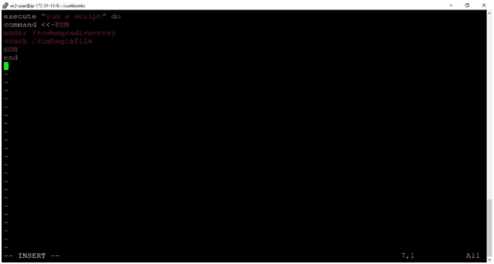
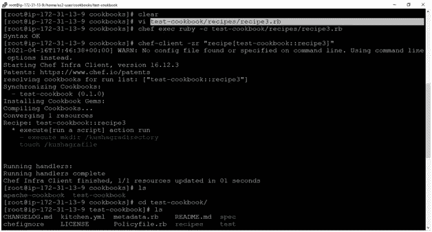
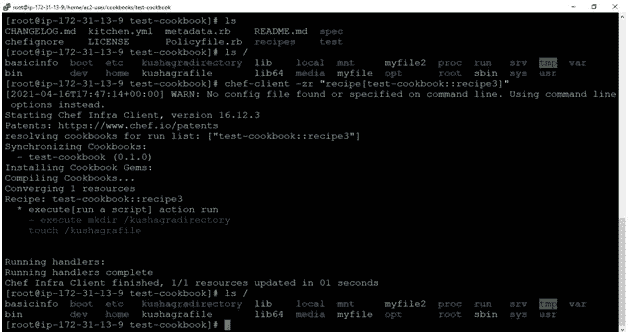
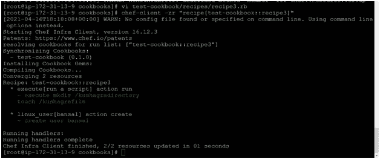
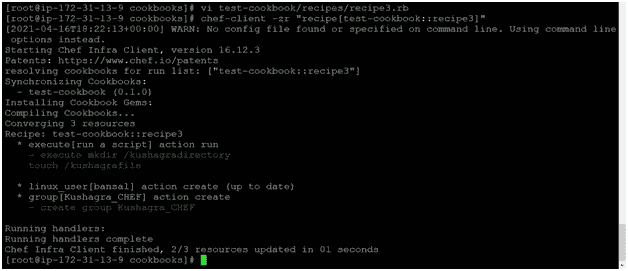
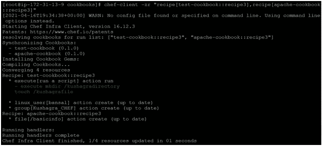
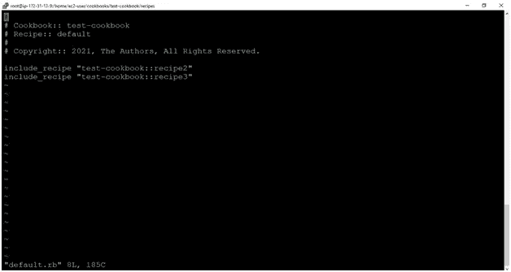
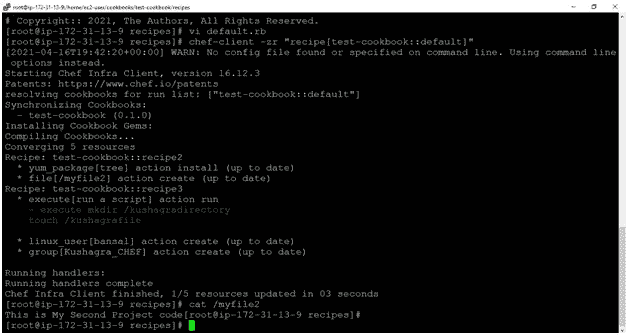

# 运行列表、多个食谱、Linux 组和 CHEF 中的用户

> 原文：<https://medium.com/nerd-for-tech/runlist-multiple-recipes-linux-group-users-in-chef-170afcb51fba?source=collection_archive---------6----------------------->

先决条件:[https://bansalkushagra . medium . com/how-to-create-a-cookbook-and-recipe-in-chef-AE 62 e 9 ba 8156](https://bansalkushagra.medium.com/how-to-create-a-cookbook-and-recipe-in-chef-ae62e9ba8156)

**步骤 1:** 访问您的亚马逊 EC-2 机器，并遵循以下命令:

> 须藤秀
> 
> cd 烹饪书

**第二步:**

让我们使用 chef 中的 ruby 脚本在 Linux 机器上创建一个目录和一个文件，并看看菜谱中的 ruby 脚本和菜谱中运行的 Linux 命令之间的区别。

目录和文件名是 kushagradirectory 和 kushagrafile

首先，创建一个食谱并输入一个代码

> vi 测试-cookbook/recipes/recipe3.rb

**代码:**

> 执行“运行脚本”做什么
> 
> 命令<
> 
> mkdir /kushagradirectory
> 
> touch /kushagrafile
> 
> EOH
> 
> end

Second, execute the recipe using below command

> Ø chef-client -zr “recipe[test-cookbook::recipe3]”
> 
> Ø ls /

In the output, we see the green color status which means the script is run successfully and directory & file has been created.

This command will help you to see the entire root directory.

As we discussed earlier if we execute the same script again it first checks the current state stored in ohai and if the state of the node is the same it does not overwrite instead shows an output “up-to-date”. But, since here we are using the Linux command, here it executes the same script again and again. Follow the below output.

**步骤 3:**

让我们使用 chef 在 Linux 机器上创建一个用户和组

首先，打开菜谱并继续添加以下代码

> 用户“ban sal”do
> 
> 操作:创建
> 
> 结束

运行该脚本后，我们看到 2/2 的资源被更新，这意味着用于创建目录和文件的早期代码以及用于添加用户的当前脚本都已被执行。

其次，现在通过添加延续中的代码/脚本来添加一个组

**代码:**

> “kusha gra _ CHEF”do 组
> 
> 操作:创建
> 
> 成员' bansal '
> 
> 附加真
> 
> 结束

在下面的输出中，我们看到 2/3 的资源更新，因为我们添加的用户纯粹是一个 ruby 脚本，我们知道 ruby 脚本不会覆盖。

我们可以使用下面的命令来验证用户名和组名

> 卡特彼勒/etc/集团

**步骤 4:**

运行两个不同食谱的两个食谱

> chef-client-Zr " recipe[test-cookbook::recipe 3]，recipe[Apache-cookbook::recipe 3]

**第五步:**

运行特定食谱的一个或多个食谱。在“测试食谱”中创建多个食谱。比如说默认的，接收 2.rb，接收 3.rb，接收 4.rb

首先，我们可以在任何想要运行的配方中调用一个或多个配方

> VI/test-cookbook/recipes/default . Rb

这里我们采用 default.rb 配方

第二，运行默认配方，从中执行多个配方。

> chef-client -zr "食谱[测试食谱::默认]"

