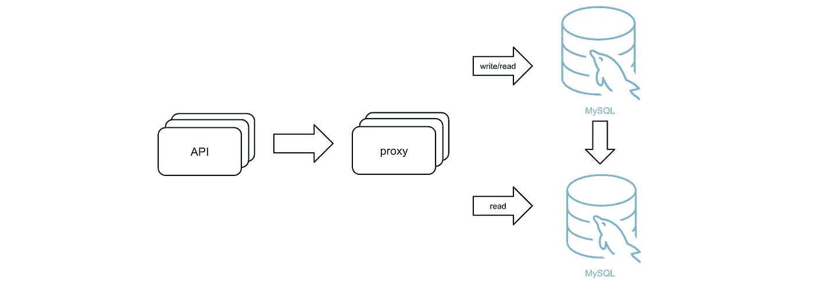
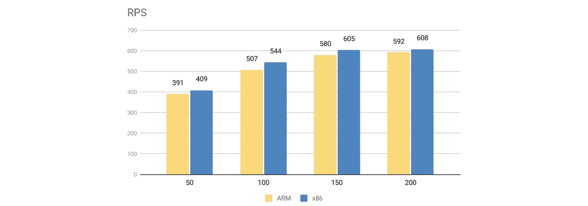
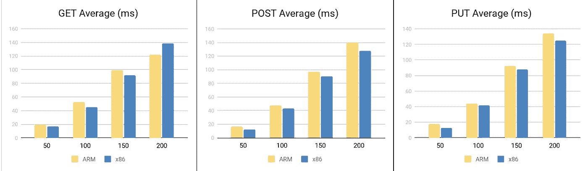
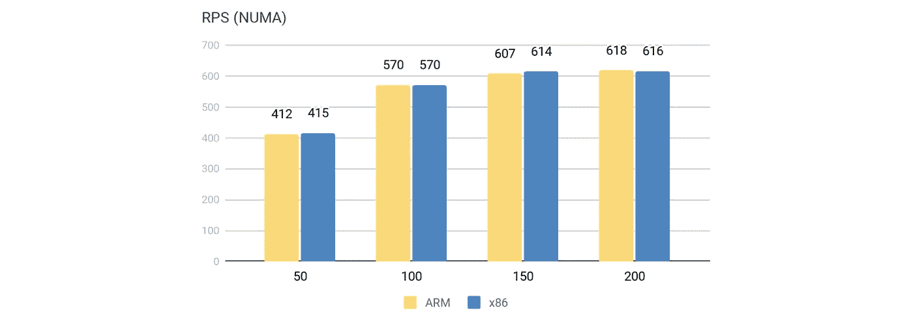

# 作为 MySQL 的替代方案，在 ARM 上运行横向扩展数据库

> 原文：<https://medium.com/nerd-for-tech/running-a-scale-out-database-on-arm-as-a-mysql-alternative-a3f626e32fb3?source=collection_archive---------0----------------------->

行业:媒体和娱乐

作者:黄碧荣(U-Next 高级工程师)

U-Next 是一个基于订阅的视频流媒体平台，在日本拥有最大的市场份额。在过去几年中，我们的业务增长迅速，而我们的旧 IT 基础架构已经跟不上发展的步伐。我们需要升级我们的系统。

我们以前的 MySQL 集群很难扩展，而且，当服务器经历高并发时，集群具有高延迟。为了解决这些问题，我们将数据迁移到了 [TiDB](https://docs.pingcap.com/tidb/dev) ，这是一个开源的分布式 SQL 数据库，提供了水平可伸缩性和高性能。它使用 MySQL 协议，在我们的 [ARM 架构](https://en.wikipedia.org/wiki/ARM_architecture)上完美运行。感谢 TiDB，我们能够为我们的用户提供更优质的服务。

在本文中，我将与您分享为什么我们选择将数据放在 TiDB 中并在 ARM 上运行。此外，我将提供详细的 TiDB 在 ARM 上的基准测试。我希望我们的故事可以帮助您找到适合您的应用程序的数据库解决方案。

# 为什么我们选择 TiDB 来取代 MySQL

在我们迁移到 TiDB 之前，我们使用 MySQL。为了提高数据库性能，我们选择了 [Atlas](https://github.com/Qihoo360/Atlas) ，它是 [MySQL 代理](https://github.com/mysql/mysql-proxy)的一个分支，来拆分 MySQL 集群的读写请求。系统架构如下所示:

我们以前的系统架构

然而，这种实现有几个问题:

*   Atlas 项目很少得到维持。如果出现了 bug，我们的工程团队没有资源自己解决它。
*   横向扩展后端 MySQL 集群是一件痛苦的事情。
*   随着服务器并发性的增加，延迟也急剧增加。

我们回顾了我们面临的困难和我们业务的新要求，并决定迁移到一个新的数据库，该数据库:

*   **没有明显的瓶颈。**我们想要一个水平可扩展的数据库。例如，我们有一个每月增长 1 亿行的表。每个用户登录都需要访问该表。如果数据库不能横向扩展，可能会严重影响我们的服务质量。
*   **高可用。**我们希望能够在线升级和扩展新数据库。
*   **拥有活跃的社区和可用的技术支持。使用开源项目的一个潜在问题是作者可能会停止维护它。因此，我们能够获得长期、可持续的技术支持非常重要。**
*   **迁移成本低。**迁移到一个新的数据库既麻烦又昂贵，不仅因为我们需要购买新的硬件和软件，还因为我们必须修改应用程序代码。所以我们希望尽可能少地修改代码。

考虑到这些因素，我们认为 TiDB 是 U-Next 的最佳选择。TiDB 是一个分布式数据库，提供水平可伸缩性和高可用性。此外，TiDB 在 GitHub 上有超过 25，000 颗星，这是其活跃社区的证明。最后但同样重要的是，它是 MySQL 兼容的。我们只需要修改一小部分代码就可以将应用程序集成到 TiDB 中。

# 为什么我们在 ARM 上运行任务关键型 TiDB 数据库

正如我提到的，我们在 ARM 架构上运行 TiDB。因为大多数公司使用 x86 作为他们的服务器，所以我们在 ARM 上运行数据库似乎不太寻常。我们选择 ARM 有三个主要原因:成本、兼容性和维护。

*   **ARM 处理器更便宜**，所以更适合中小型公司。
*   **TiDB 已经在 ARM** 上正式测试验证。[TiDB 背后的团队 PingCAP](https://pingcap.com/) 发布了一份针对 ARM64 和 x86–64 的[官方基准测试报告](https://pingcap.com/blog/porting-tidb-to-arm64-for-greater-flexibility/)，确认 TiDB 与 ARM 不存在兼容性问题。
*   **手臂可靠。** U-Next 多年来一直使用 ARM 作为其分布式存储平台，并且进展顺利。我们的工程团队在维护 ARM 方面经验丰富。

因此，我们决定在 ARM 上运行任务关键型 TiDB，就像我们的其他应用程序一样。

# ARM 和 x86A 上的基准测试 TiDB

为了确保 TiDB 在我们的应用中与 ARM 兼容，我们在采用 ARM 和 x86 架构的服务器之间进行了基准测试。我们将测试环境设置如下:

基于我们自己的应用模型，我们使用[轨迹](https://github.com/locustio/locust)来模拟在线请求负载。每个客户端每秒发送一个请求。我们测试了一个有 3 亿行样本数据的表。每个操作包括一个`Get`、一个`Post`和一个`Put`方法。我们总共发送了 200，000 个 API 请求。

下图显示了每秒请求数(RPS)结果。x 轴代表客户端数量，y 轴代表已处理的 RPS 数量:

ARM 和 x86 的 RPS 结果

当有 50、100、150 和 200 个客户端时，ARM 的执行速度比 x86 稍慢，这是可以接受的。

我们还测试了`GET`、`POST`和`PUT`方法的响应延迟:

GET、POST 和 PUT 的响应延迟

如果我们将两组结果结合起来，很明显，当有大约 150 个客户机时，单个 API 服务器的瓶颈就出现了。当客户端数量超过 150 时，即使我们添加更多的客户端，RPS 也不会变高，但延迟可能会继续增加。

从这个测试中，我们知道 TiDB 的性能在 ARM 和 x86 之间没有显著差异。对于我们的应用程序，这种微小的差异是可以接受的。

2019 年底，我们把数据迁移到 TiDB。在迁移之前，我们在高峰时段经常有多达 6，000 个缓慢的请求(响应> = 500 毫秒)。但是，在迁移之后，同一时间段的慢速请求数量下降到 600 个以下。换句话说，TiDB 将我们应用程序中的慢速请求数量减少了 10 倍。

我们还将 TiDB 迁移到了另一个数据中心。API 服务器和 TiDB 位于不同的数据中心，并通过专用连接进行连接。即使网络延迟增加了 1-2 毫秒，TiDB 仍然改善了整体服务。这太令人兴奋了。

# 面向 ARM 的性能调优

我们还专门针对 ARM 架构调整了 TiDB 集群的性能。此次调优主要集中在[透明大页](https://www.percona.com/blog/2019/03/06/settling-the-myth-of-transparent-hugepages-for-databases/) (THP)和 NUMA 装订。

多亏了 PingCAP，我们发现 THP 在 ARM 性能上有所作为。当测试数据量大约为 100 GB 时，THP 可能会导致 TiKV 内存不足的情况。所以我们强烈建议在 ARM 上禁用 THP。

在我们的平台上，ARM 有四个 [NUMA](https://en.wikipedia.org/wiki/Non-uniform_memory_access) 节点。在 ARM 上，CPU 参与内存处理。如果默认情况下 CPU 内核没有映射到 NUMA 节点，那么 NUMA 节点越多，延迟就越高。因此，为了减少延迟，我们将进程和网络接口卡绑定到相应的 NUMA 节点。

TiDB 的性能非常好，除了数据极其庞大的场景，它不需要进行性能调优。在我们调整了 NUMA 配置之后，ARM 和 x86 之间的基准测试结果几乎相同:

配置 NUMA 后 ARM 和 x86 的 RPS 结果

# 结论

TiDB 帮助 U-Next 建立了一个更稳定、更快速的视频流平台，使我们能够为客户提供优质服务。它通过横向可扩展性和惊人的性能解决了传统 MySQL 架构的痛点。我希望这篇文章能帮助你了解更多关于 TiDB 的知识，以及如何在 ARM 上运行 TiDB。