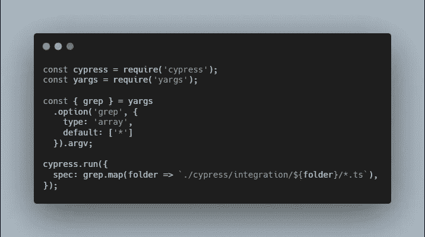
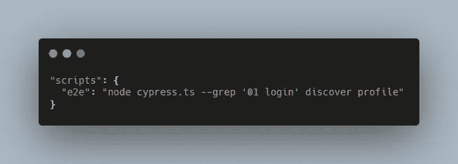
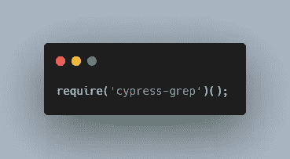
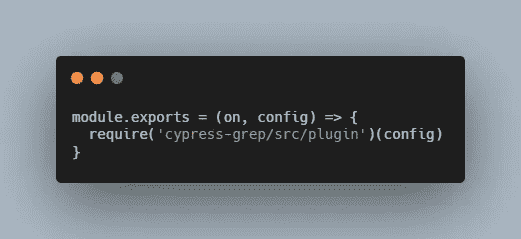
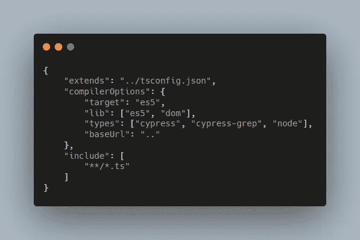
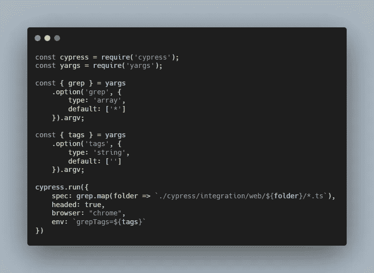
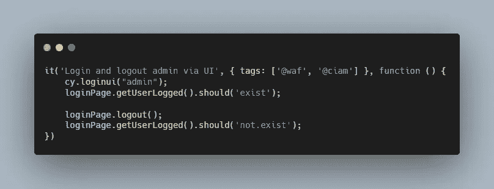
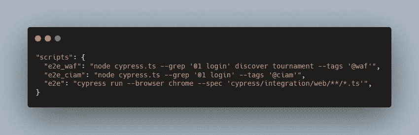

# 使用 Grep 和 Test 标签运行 Cypress 测试的子集

> 原文：<https://medium.com/nerd-for-tech/running-a-subset-of-cypress-tests-using-grep-and-test-tags-394dac8b700e?source=collection_archive---------4----------------------->

## 使用赛普拉斯[模块 API](https://docs.cypress.io/guides/guides/module-api) 和[测试标记](https://github.com/cypress-io/cypress-grep)组合测试标记，以方便地过滤和运行测试的子集。

泰勒·尼克斯在 [Unsplash](https://unsplash.com?utm_source=medium&utm_medium=referral) 上拍摄的照片

测试自动化很少是静态的，因为它需要定期维护。您可能需要添加额外的测试来增加覆盖率，或者添加测试来覆盖特定的用户流。或者，您可能需要将 web 应用程序的测试、应用程序 CMS 的测试和 enabler 的测试分开——这并不完全是一个测试，但更像是一个过程自动化，因为您可能在做重复性的任务，比如定期下载报告。test enabler(或 RPA)的另一个好例子[是你可以使用 GitHub 做一些网站废弃和自动化的过程。](https://deepstacker.com/2020-02-20-using-cypress-to-do-rpa/)

因此，这是我寻找过滤和运行 Cypress 测试子集的完美方法的旅程(这是特定于文件夹和特定测试的)。

# 开始

像我这样的普通开发人员或初学者肯定会使用 Google 来搜索过滤 Cypress 测试的可用解决方案。根据搜索词的不同，您肯定会看到这些很棒的结果:

*   [我如何用 Cypress.io 过滤测试。](/geekculture/how-i-filtered-tests-with-cypress-io-9c7a85460a1d)
*   使用标签过滤你的 Cypress 测试。
*   [如何将标签应用于 E2E 如烟的柏树测试。](https://testersdock.com/cypress-test-tags/)

第一篇和第二篇使用自定义函数`TestFilters`，第三篇使用 Gleb Bahmutov 编写的插件`cypress-select-tests`。

不幸的是，没有一个建议的解决方案足够适用于我的情况。如果您不介意将`describe`或`it`包装在`TestFilters`中，并且不介意将它写在整个规范文件中，那么使用自定义函数可能会很好。使用`cypress-select-tests`也不适用，因为标签被放在测试标题或文件名中，更不用说插件本身被否决了。

# 测试 Grepping 到救援

Filip Hric 有一篇关于[测试 grepping](https://filiphric.com/test-grepping-in-cypress-using-module-api) 的非常好的文章，我的解决方案就是基于这篇文章。它足够简单，易于理解和遵循，我认为它对大多数情况都足够有帮助。基本上，您提供要运行的测试文件夹。

但是，等等！我还需要过滤掉 spec 文件中的特定测试，例如:如何在一个文件夹中运行所有的阳性测试，并在不同的文件夹中结合一些其他的阳性测试？

# 输入 cypress-grep

从 TestersDock 解决方案中阅读和挖掘关于`cypress-select-tests`的内容，实际上会导致 [cypress-grep](https://github.com/cypress-io/cypress-grep) 。一个来自 Cypress guru 的超级方便的插件。您可以使用测试标题的一部分和使用显式标签来运行特定的测试，这完全符合我的需要。

# 最终解决方案

那么，我如何将 test grepping 解决方案与 cypress-grep 结合起来呢？无论如何不要被这个名字搞混了，因为它们包含同一个单词“grep”。

*   遵循菲利普·赫里克的测试结果。在根文件夹`cypress.ts`中创建一个新文件，并修改`package.json`以合并更改

cypress.ts

package.json

*   通过执行`npm install --save-dev cypress-grep`安装 cypress-grep。
*   在支持文件中添加所需模块。注意，你真的应该**用** `require`而不是`import`，否则插件就不能用了。

柏树/支架/索引. ts

*   自述文件说你可以选择从插件文件加载和注册。反正我是要加的。

赛普拉斯/插件/索引. ts

*   将`cypress-grep`添加到 tsconfig 文件中的类型。

cypress/tsconfig.json

*   最后，为`grepTags`(如果需要，还有`grep`)添加附加参数，类型为`string`，默认为`''`。

最终 cypress.ts 文件

测试用例的一个例子应该是这样的。

登录.规格. ts

更新了 package.json 以支持按标签执行和执行所有测试而不管标签

那都是我送的。我希望我寻找过滤柏树测试的完美配方的旅程能对你有用。如果你有任何改进的建议，请告诉我。感谢阅读！