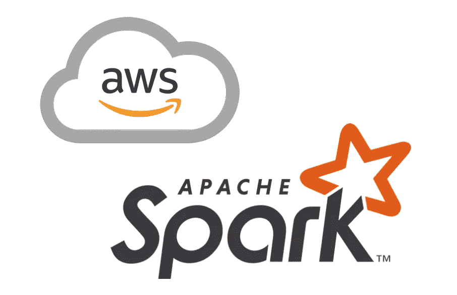
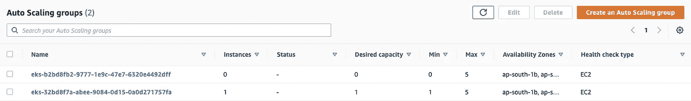
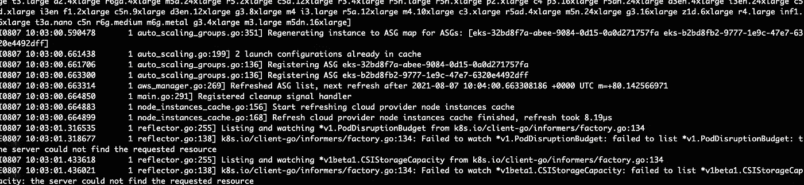
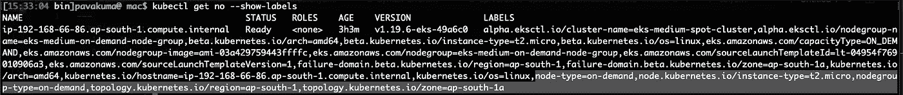
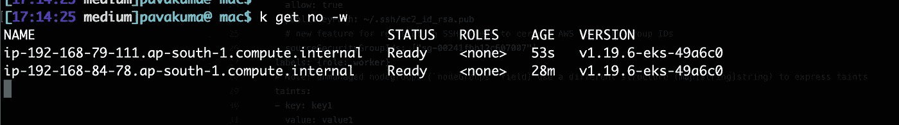
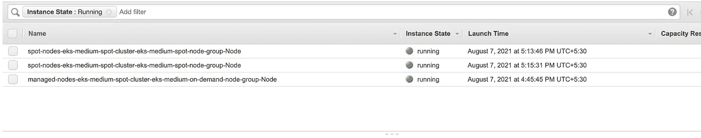
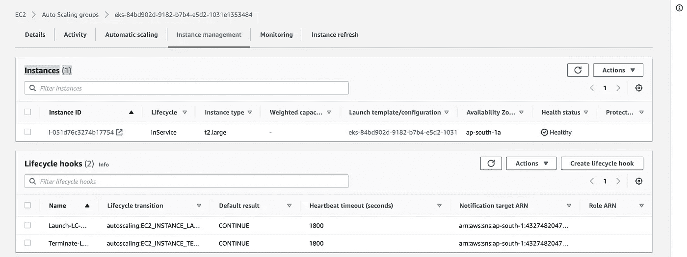

# 使用 AWS Spot 实例在 EKS 上运行 Apache Spark

> 原文：<https://medium.com/nerd-for-tech/running-apache-spark-on-eks-with-aws-spot-instances-f8ce91d319b9?source=collection_archive---------1----------------------->

通过 AWS Spot 实例为 EKS 上的 Apache Spark 工作负载有效节约成本

Apache Spark 是一个数据处理框架，可以在巨大的数据集上执行快速处理任务，并可以将数据处理任务分布在多个节点上。随着应用程序的快速容器化，组织也开始在像 Kubernetes 这样的容器化平台上运行 spark，并在生产中使用它们。理想情况下，在 Kubernetes 上运行 spark 有两种方式。

a) Spark Submit:这是一个用于提交 Spark 程序和启动 Kubernetes 集群应用程序的脚本。

示例:

b) spark 操作符:Spark 操作符允许以声明的方式定义 Spark 应用程序，并支持使用`SparkApplication`的一次性 Spark 应用程序和使用`ScheduledSparkApplication`的 cron 调度应用程序。

示例:

一旦您确信了上面提到的任何模式，您就决定在 EKS 上运行您的 spark 工作负载。但是，你的经营方式正确吗？我在这里举个例子。让我们假设您的应用程序 Kubernetes pods 需要 t2.micro 类型的实例，但是您的 spark 工作负载可能需要 t2.large 类型的工作节点。这种分割节点的方式有 50%的效率。我们如何实现剩下的 50%？这可以通过使用 AWS spot 实例来完成。是的，由于 spark 工作负载并不保持 24/7 全天候运行，我们可以用 spot 实例配置一个自动伸缩组，并将最小计数设置为 0。即时实例比按需实例便宜 90%。在本文的范围内，我们将了解如何设置一个带有 Spot Instances 节点组的 EKS 集群来运行 spark 工作负载。



图片来源:[谷歌图片](https://www.google.com/url?sa=i&url=https%3A%2F%2Fanalyticsindiamag.com%2Fbeginners-guide-to-pyspark-how-to-set-up-apache-spark-on-aws%2F&psig=AOvVaw3ChIFZKzCwVygzpPUpGE5p&ust=1628411869919000&source=images&cd=vfe&ved=0CAsQjRxqFwoTCKi64Y7BnvICFQAAAAAdAAAAABAD)

# 整个故事是关于什么的？(TLDR)

1.  设置具有两个不同节点组(按需和现场实例节点组)的 EKS 集群。
2.  在 Spot 实例上执行 spark 工作负载(使用 spark-submit 和 Spark Operator)。

## 这篇文章没有涉及到什么

1.  如何写一个 spark 提交文件/ Spark 操作符文件？
2.  如何建立基于生产的 EKS 集群？

# 先决条件

1.  AWS 帐户。
2.  Helm，eksctl，spark-提交二进制安装。

# 故事资源

1.  GitHub 链接:【https://github.com/pavan-kumar-99/medium-manifests 
2.  GitHub 分支: [aws-spot-spark](https://github.com/pavan-kumar-99/medium-manifests/tree/aws-spot-spark)

## 使用 eksctl 创建 AWS EKS 集群

市场上有很多方法可以创建 EKS 集群。其中使用最多的是 Terraform，eksctl。我们将在本文的范围内使用 eksctl。 [**eksctl**](https://eksctl.io/) 是一个简单的 CLI 工具，用于在 EKS 上创建和管理集群——亚马逊为 EC2 提供的托管 Kubernetes 服务。它是用 Go 编写的，使用 CloudFormation，由 [Weaveworks](https://www.weave.works/) 创建。可以在文件(YAML 格式)中定制集群配置。eksctl 可以解析输入文件并从中创建集群。这里是我们将用来创建 EKS 集群的 eksctl 配置文件。

现在让我们了解一下配置文件

a) metadata.name:要创建的 EKS 集群的名称。

b) managedNodeGroups.name:受管理的 Kubernetes 工作节点组的名称。

c)managednodegroups . instance type:要在节点组中使用的实例的类型。

d)managedNodeGroups.min/max/desired:自动缩放节点组的最小、最大、期望计数。

e)**managednodegroups . spot**:指定节点组是否应该有 spot 实例的布尔值。

因此，上面的配置创建了一个包含 2 个受管节点组的 EKS 集群。

1.  **eks-medium-on-demand-node-group**:这个节点组创建时最少需要 1 个 t2.micro 实例，并且可以自动扩展到 8 个。这里的所有实例都是按需实例。
2.  **eks-medium-spot-node-group:**该节点组由 **0** 个实例创建。是的，你没看错。节点组将有 0 个点实例，并且可扩展到最多 5 个实例。

现在让我们创建 EKS 集群。

```
**$** git clone [https://github.com/pavan-kumar-99/medium-manifests.git](https://github.com/pavan-kumar-99/medium-manifests.git) \
-b aws-spot-spark**$** cd medium-manifests/**$** eksctl create cluster -f eksctl-cluster.yaml
```


使用 2 个受管节点组创建的 EKS 集群



使用 2 个受管节点组创建的 EKS 集群

> 需要注意的一点是，eksctl 没有用配置文件中指定的标记来标记 ASG。 [**应该为集群自动缩放器手动标记 ASG，以向上扩展具有 0 个节点的 ASG**](https://github.com/kubernetes/autoscaler/blob/master/cluster-autoscaler/FAQ.md#how-can-i-scale-a-node-group-to-0)(以便 nodeAffinity / nodeSelector 工作)。

ASG 的标签

现在让我们安装 Kubernetes 集群自动分类器。kubernetes Cluster auto scaler**根据您的工作负载需求，自动调整给定集群中工作节点的数量。您不需要手动添加或删除节点，也不需要过度配置集群。相反，您可以为集群指定最小和最大大小，扩展是自动的，由集群自动缩放器自行完成。我写了一篇关于 Kubernetes 集群自动缩放器的详细文章。一旦我发布了链接，我会在这里分享它。现在，让我们安装集群 autosclaer 舵图。**

```
$ git clone [https://github.com/pavan-kumar-99/medium-manifests.git](https://github.com/pavan-kumar-99/medium-manifests.git) \
-b aws-spot-spark$ cd medium-manifests/$ helm repo add autoscaler [https://kubernetes.github.io/autoscaler](https://kubernetes.github.io/autoscaler)$ helm upgrade -i medium-ca-aws autoscaler/cluster-autoscaler -f ca-values.yaml
```

****

**集群自动缩放日志**

**现在，您应该看到集群自动缩放窗格检测到了正确的自动缩放组。好了，现在让我们检查节点。**

****

**创建了单个节点**

## **使用 Spark 提交部署 Spark 应用程序**

**我们现在创建了一个节点，这是一个按需节点。从节点显示的节点标签中也可以明显看出这一点。现在让我们使用 spark-submit 命令来提交一个 spark 作业。这次的不同之处是在 spark-submit 命令中添加了这个新的节点选择器参数。**

```
$ --conf spark.kubernetes.**node.selector.nodegroup-type=spot**
```

**根据 spark 的[文档](https://spark.apache.org/docs/latest/running-on-kubernetes.html)spark . kubernetes . node . selector .**【label key】**，添加到驱动程序舱和执行程序舱的节点选择器，键`labelKey`和值作为配置的值。因此，最终的 spark-submit 作业将如下所示**

**在我们提交作业之前，应该为 driver pods 创建一个 Kubernetes 服务帐户，以创建 executor pods 并访问它们的服务。**

```
$ git clone [https://github.com/pavan-kumar-99/medium-manifests.git](https://github.com/pavan-kumar-99/medium-manifests.git) \
-b aws-spot-spark$ cd medium-manifests/$ kubectl apply -f spark-rbac.yaml $ ./spark-submit.sh
```

**一旦我提交了我的 spark 作业，我应该看到 spot 实例 ASG 中的节点开始从 0 扩展到 2。(基于创建的 spark-submit 作业的数量)。**

********

**节点向上扩展(定点实例)**

****

**由于现货实例，我所有的钱都被节省了:)**

****

**正按比例放大的 Spot 实例**

**让我们也用 Spark 操作符进行同样的尝试，看看这是否可行。**

## **使用 Spark Operator 部署 Spark 应用程序**

**spark 操作符允许以声明的方式定义 Spark 应用程序，并支持使用`SparkApplication`的一次性 Spark 应用程序和使用`ScheduledSparkApplication`的 cron 调度应用程序。让我们首先部署 spark 操作符。**

```
$ helm repo add spark-operator\ https://googlecloudplatform.github.io/spark-on-k8s-operator$ helm install spark-operator spark-operator/spark-operator\ 
--namespace spark-operator --create-namespace$ k get po -n spark-operatorNAME                              READY   STATUS    RESTARTS   AGEspark-operator-5fb7bcf764-qm8np   1/1     Running   0          21m
```

**现在让我们部署 spark 应用程序。spark 应用程序如下所示。**

**在整个 yaml 文件中，突出显示的部分是 **nodeAffinity** 部分。这种相似性确保了 spark 应用程序(驱动程序和执行程序都可以部署在 spot 实例上)。与 spark-submit 不同，在 Spark-submit 中，驱动程序和执行器都有相同的 nodeSelector ( Spark submit 目前不支持节点关联)，在 spark operator ( SparkApplication)中，我们可以灵活地为驱动程序和执行器指定不同的关联。有些情况下，我们可能希望在“按需”节点上运行驱动程序窗格，在“现场”节点上运行执行器窗格。在这种情况下，spark operator 允许我们分别为驱动程序和执行程序创建关联。**

```
$ git clone [https://github.com/pavan-kumar-99/medium-manifests.git](https://github.com/pavan-kumar-99/medium-manifests.git) \
-b aws-spot-spark$ cd medium-manifests/$ kubectl apply -f spark-app.yaml$ k get SparkApplicationNAME         STATUS      ATTEMPTS   START                  FINISH                 AGEpyspark-pi   COMPLETED   1          2021-08-07T12:19:30Z   2021-08-07T12:21:49Z   16m
```

****

**被触发的 Spot 实例**

## **有效处理现场实例终止**

****AWS 节点终止处理程序:**这个项目确保 Kubernetes 控制平面适当地响应可能导致您的 EC2 实例变得不可用的事件，例如 [EC2 维护事件](https://docs.aws.amazon.com/AWSEC2/latest/UserGuide/monitoring-instances-status-check_sched.html)、 [EC2 现场中断](https://docs.aws.amazon.com/AWSEC2/latest/UserGuide/spot-interruptions.html)、 [ASG 扩大](https://docs.aws.amazon.com/autoscaling/ec2/userguide/AutoScalingGroupLifecycle.html#as-lifecycle-scale-in)、 [ASG AZ 重新平衡](https://docs.aws.amazon.com/autoscaling/ec2/userguide/auto-scaling-benefits.html#AutoScalingBehavior.InstanceUsage)，以及通过 API 或控制台终止 EC2 实例。如果处理不当，您的应用程序代码可能无法正常停止，需要更长的时间来恢复完全可用性，或者意外地将工作调度到正在关闭的节点。**

**项目链接:[https://github.com/aws/aws-node-termination-handler](https://github.com/aws/aws-node-termination-handler)**

## **清除**

```
$ eksctl delete cluster -f [eksctl-cluster.yaml](https://github.com/pavan-kumar-99/medium-manifests/blob/aws-spot-spark/eksctl-cluster.yaml)
```

**我希望这篇文章能够介绍如何使用 AWS Spot 实例以最小的成本在 Kubernetes 集群上有效地部署 spark 应用程序。请在评论区随意评论您的想法和您对 AWS spot 实例的最佳体验。**

**再次感谢您阅读我的文章。希望你喜欢它。以下是我的一些其他文章，你可能会感兴趣。**

**直到下次……..**

**[](/nerd-for-tech/deep-dive-into-thanos-part-i-f72ecba39f76) [## 深入灭霸——第一部分

### 使用灭霸和普罗米修斯操作员监控 Kubernetes 的工作负载

medium.com](/nerd-for-tech/deep-dive-into-thanos-part-i-f72ecba39f76) [](/nerd-for-tech/free-and-automatic-ssl-certificates-in-kubernetes-using-cert-manager-6fb65ac63d5) [## 使用证书管理器在 Kubernetes 中免费提供自动 SSL 证书

### 使用证书管理器获得免费和自动 SSL 证书，让我们加密

medium.com](/nerd-for-tech/free-and-automatic-ssl-certificates-in-kubernetes-using-cert-manager-6fb65ac63d5) [](/nerd-for-tech/network-policies-demystified-in-kubernetes-d57fc2548043) [## Kubernetes 揭秘网络政策

### 使用 Cilium 编辑器在 Kubernetes 中可视化网络策略

medium.com](/nerd-for-tech/network-policies-demystified-in-kubernetes-d57fc2548043) [](https://faun.pub/introduction-to-bitnami-sealed-secrets-bb5ae74d9a25) [## 比特纳米密封秘密介绍

### 如何使用 Sealed Secrets 和 Kubese 在 GitHub 中存储您的秘密

faun.pub](https://faun.pub/introduction-to-bitnami-sealed-secrets-bb5ae74d9a25) [](/swlh/introduction-to-jenkins-operator-f4cb7ebc2e0b) [## 詹金斯算子简介

### Kubernetes 中的 Jenkins 运算符入门

medium.com](/swlh/introduction-to-jenkins-operator-f4cb7ebc2e0b)**