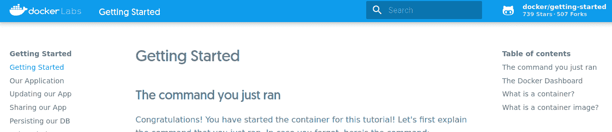
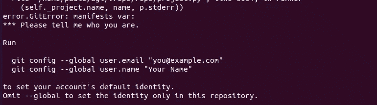
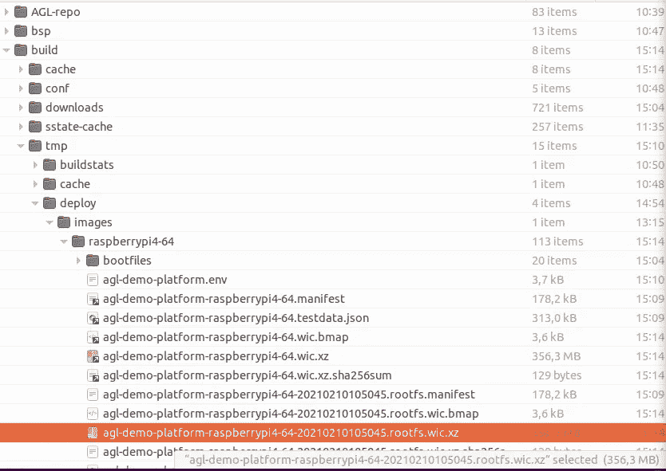
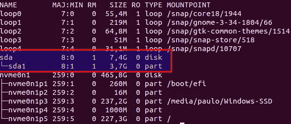
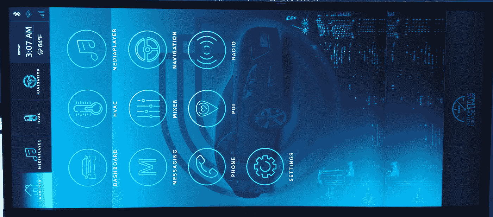

# 在 Raspberry Pi 4 上运行汽车级 Linux

> 原文：<https://medium.com/nerd-for-tech/running-automotive-grade-linux-on-a-raspberry-pi-4-535490ddda82?source=collection_archive---------2----------------------->


这篇文章的目的是描述我如何设法为一个 Raspberry Pi4 目标构建汽车级 Linux 演示应用程序。为此，我将介绍 AGL，描述所发现的问题，以及我如何超越它们。

TL 博士:AGL 摇滚。安装 docker，运行一个容器，运行您的构建并获取最终的系统映像。如果您对如何操作有疑问，请向下滚动到*使用 Docker* 为 RPi4 构建 AGL 部分。如果有时间，通读:)

# 关于汽车级 Linux

不久前，我开始研究针对汽车行业的 Linux 应用程序和项目，因为了解这个行业的技术和趋势是成功的关键之一。

我很快就发现了汽车级 Linux，这是一个看起来很整洁的项目，它提供了一个 Linux 发行版，其中包含了汽车行业的所有商品。

汽车级 Linux (AGL)是一个开源的合作项目，是 Linux 基金会的一部分，旨在成为事实上的行业标准。它的一些目标是:改进汽车用例的开源组件，在发布改进时遵循上游优先的策略，以及使用通用的参考平台进行测试和集成。

虽然 AGL 最初的重点是信息娱乐，但 AGL 也计划解决所有的车载软件:信息娱乐、仪表组、平视显示器(HUD)、远程信息处理/联网汽车、高级驾驶辅助系统(ADAS)、功能安全和自动驾驶。要了解更多关于如何与 AGL 互动的信息，请访问 https://www.automotivelinux.org/和该项目的维基 https://wiki.automotivelinux.org/。

支持的设备范围有点广:

*   QEMU——本质上不是一个目标硬件，但是对于测试来说仍然非常有用；
*   Raspberry Pi —支持的硬件:RPi4(推荐)、RPi3、RPi2(在最新和最好的版本上已弃用)；
*   瑞萨 R-Car-M3；
*   英特尔 Up2
*   恩智浦 i . MX6
*   高通骁龙 410；
*   可能有更多我不知道的兼容目标。

要获得这种工具的神奇之处，有几个选项:

[从 git 下载最新源代码](https://wiki.automotivelinux.org/agl-distro/source-code#download_master_branch)
[下载最新稳定版代码](https://wiki.automotivelinux.org/agl-distro/source-code#download_latest_stable_release)
[下载最新 AGL UCB 版](https://wiki.automotivelinux.org/agl-distro/release-notes#latest_stable_release)
[最新稳定版的预建二进制和源代码压缩包](https://wiki.automotivelinux.org/agl-distro?&#supported_hardware)

出于学习的目的——也可能是为了获得更深入的知识——我相信，如果打算用代码的方式使用它，你至少应该能够构建这个东西。这就是我想要的。

# 愿问题开始

因此，AGL 是一个基于 [Yocto 项目](https://www.yoctoproject.org)的项目。我不会在这里深入讨论 Yocto 的内部情况，但是，请不要客气，请你自己去看看吧。引用这一页的标题就足够了:“Yocto 项目。它不是嵌入式 Linux 发行版，而是为您创建一个自定义发行版”。

编译 Yocto 项目可能是一个时间问题:它很大程度上依赖于您的主机。因此，如果您要在当前的操作系统机器上编译一个最新版本，它很可能会无缝地工作。我过去去过那里。输入一些命令行，等待几个小时，收集价值 120 千兆字节的软件，这是一件美好的事情。

但是，随着时间的推移，你最终更新你的操作系统，旧的程序开始弹出各种错误。那正是发生在我身上事。我甚至开始尝试修补和向前推进。我发现 GCC 10 不能被正确识别，m4 不能构建，还有一个 elf 二进制工具，我现在记不起来了。我解决了这些问题。然后更多的出现了。

那时，我放弃了，尝试了一个经典的方法:将 VirtualBox 移植到旧的操作系统中。这“奏效”:经过一夜的构建，我已经成功运行了 8270 个任务中的 1000 个，我很快得出结论，这也不是一条路可走。

我只剩下几个选择:降级我的主机或者尝试看看在野外有什么。第二个让我在[码头](https://www.docker.com/)到达。Docker 使用“操作系统级虚拟化来交付被称为容器的软件包中的软件。容器是相互隔离的，捆绑了它们自己的软件、库和配置文件”。

这似乎正是我一直在寻找的:以最小的开销虚拟化操作系统。过去，我已经使用 chroot 实现了这一点，但我不会为此再走那么远。

# 使用 Docker 为 RPi4 构建 AGL

所以，直截了当地说，这是 Ubuntu 20.10 主机的程序。

## 码头设备

首先，确保你没有以前的 Docker 安装。

然后，安装 Docker:

```
sudo apt update
sudo apt-get -y install apt-transport-https ca-certificates curl gnupg-agent software-properties-common
curl -fsSL [https://download.docker.com/linux/ubuntu/gpg](https://download.docker.com/linux/ubuntu/gpg) | sudo apt-key add
sudo add-apt-repository “deb [arch=amd64] [https://download.docker.com/linux/ubuntu](https://download.docker.com/linux/ubuntu) $(lsb_release -cs) stable”
sudo apt update
sudo apt-get -y install docker-ce
```

有关此过程的更多信息，请访问[在 Ubuntu 上安装 Docker 引擎](https://docs.docker.com/engine/install/ubuntu/)。

要测试您最近安装的 Docker 包，请运行入门映像:

```
sudo docker run -p 80:80 docker/getting-started
```

实例运行后，进入浏览器，通过访问 [http://0.0.0.0](http://0.0.0.0) 打开本地主机。您应该得到一个在您刚刚启动的 docker 容器中运行的页面。很迷人，是吧？



您的 docker 自托管入门页面。

现在，您可以通过 CTRL+C '进入终端来停止正在运行的 docker 进程。

## 在 Docker 上运行 Yocto 构建

所以，现在我们已经解决了这个问题，我写了一个 Dockerfile 文件来加速这个过程。我从头开始酝酿这个，它可能还没有完全优化，因为我对 docker 相当陌生。

现在，为了构建映像，对您的 git 用户名和电子邮件进行调整:

```
mkdir ~/agl && cd ~/agl
wget [https://github.com/pauloasherring/agl-playground/raw/main/Dockerfile](https://github.com/pauloasherring/agl-playground/raw/main/Dockerfile)
sudo docker build \
--build-arg USER_NAME=$USER \
--build-arg HOST_UID=`id -u` \
--build-arg HOST_GID=`id -g` \
--build-arg GIT_USER_NAME=yourUserName \
--build-arg GIT_EMAIL=your@Email.com \
-t agl:latest .
```

未能调整您的 Git 凭据可能会导致以下错误消息:



如果您错过设置 git 用户的常见问题。

接下来，运行容器:

```
rm -rf out
mkdir out
sudo docker run -it \
-v $PWD/out:/home/$USER/agl \
agl:latest
```

此时，您在正在运行的 docker 中*。接下来，运行 Yocto 构建:*

```
./../bin/repo init -b koi -u https://gerrit.automotivelinux.org/gerrit/AGL/AGL-repo
./../bin/repo sync
source meta-agl/scripts/aglsetup.sh -m raspberrypi4 agl-demo agl-appfw-smack
bitbake agl-demo-platform
```

然后去喝杯咖啡。去他妈的，点个披萨，吃了它，睡了它。观看原版指环王三部曲。您有足够的时间，并且希望处理器空闲时间很少:)

漫长的冬天过后，您应该在`~/agl/out/build/tmp/deploy/images/raspberrypi4–64`文件夹中看到构建结果:



AGL 生成的结果树的一部分。

## 闪烁的树莓 Pi 4

最后，闪烁时间。插入你的 sd 卡，找出它在/dev 文件夹中的路径。你可以运行`lsblk`并在`/dev`上找到你的 sd 卡的入口。下面是我的系统中的一个例子:



lsblk 输出示例

在这个例子中，我有一个 4 GiB 的 sd 卡，只有一个分区。`/dev/sda`是磁盘的路径，`/dev/sda1`是它的分区。当发出下面的命令时，你应该参考你的 ***磁盘*** ，而不是它的*分区，即* `/dev/sda`。此外，请记住，您的图像名称可能有些不同。

从终端导航至`~/agl/out/build/tmp/deploy/images/raspberrypi4–64`。在那里，你会发现一个 flashable 图像，一个用 xz 压缩的 wic 文件。要刷新您的新映像，请运行:

```
xzcat {*yourimagename*}.wic.xz| sudo dd of=/dev/{*your-sd-disk*} bs=4M status=progress
sync
```

## 投入运行

将 sd 卡插入您的目标并通电。第一次启动应该需要更长一点的时间——在这里，只需要不到一分钟。下一次，内核加载后 10 秒多一点——因此，总的来说，考虑到 bootloader 和通常的进入 U-Boot、内核加载和初始系统设置的三秒钟，时间会多一点。



汽车级 Linux 笨拙地运行在我当时仅有的一个屏幕上:一个 29 英寸的显示器。

# 结论

虽然汽车级 Linux 可能不是第一次接触嵌入式 Linux 的合适人选，但它无疑为竞争激烈的行业领域(如汽车行业)打包了许多产品，是一个相关的框架。

作为一个开源项目，它遇到了同行中一个非常常见的问题:项目(和代码，它的依赖项，等等)在发展，而文档却没有，特别是当涉及到教程方法时，比如我试图带给你的方法。

希望对你有帮助:)

如果有，请告诉我。此外，反馈将非常感谢，因为这是我的第一篇文章。