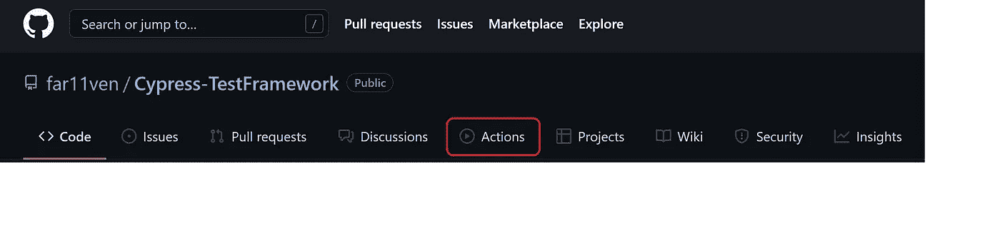
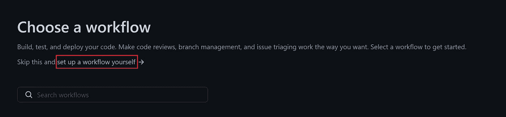
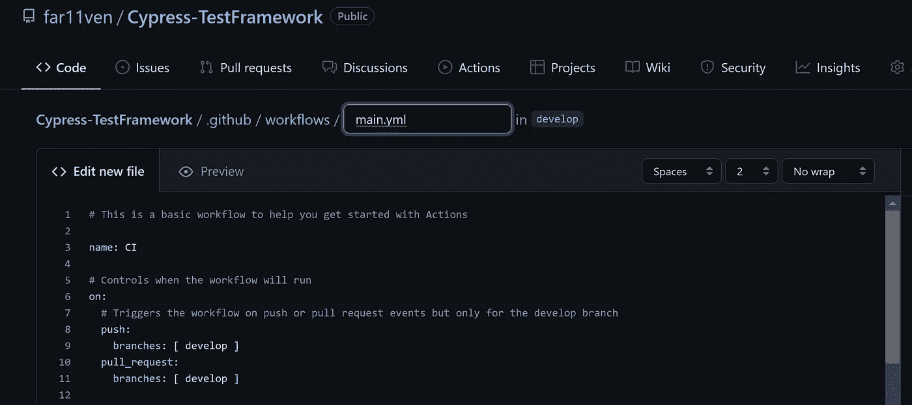
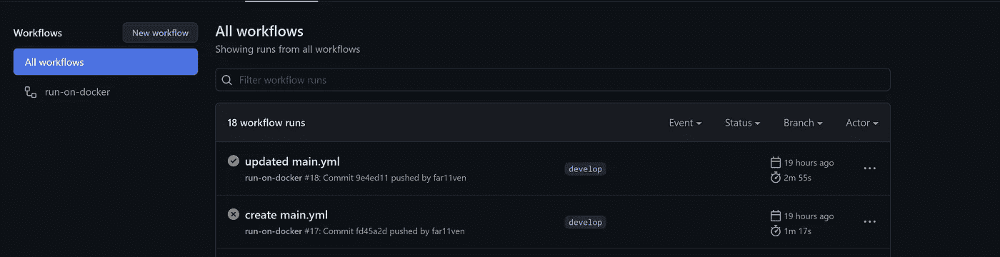
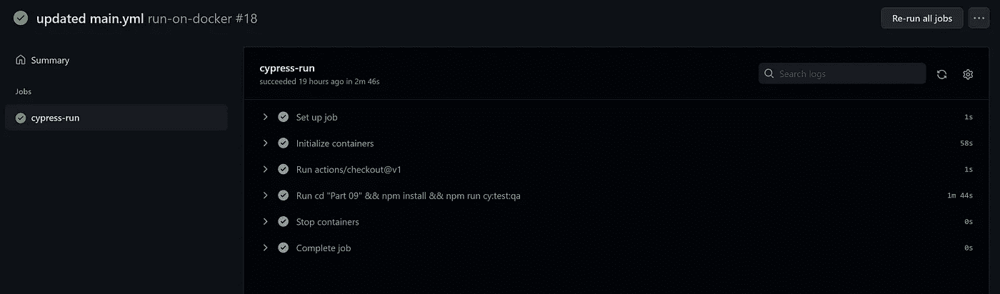
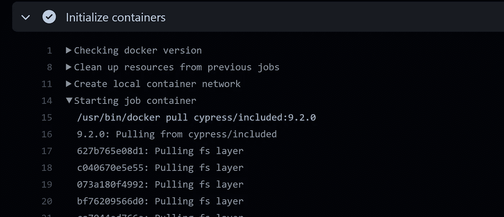
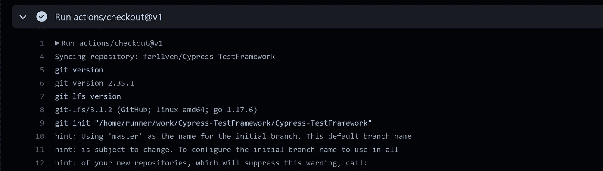
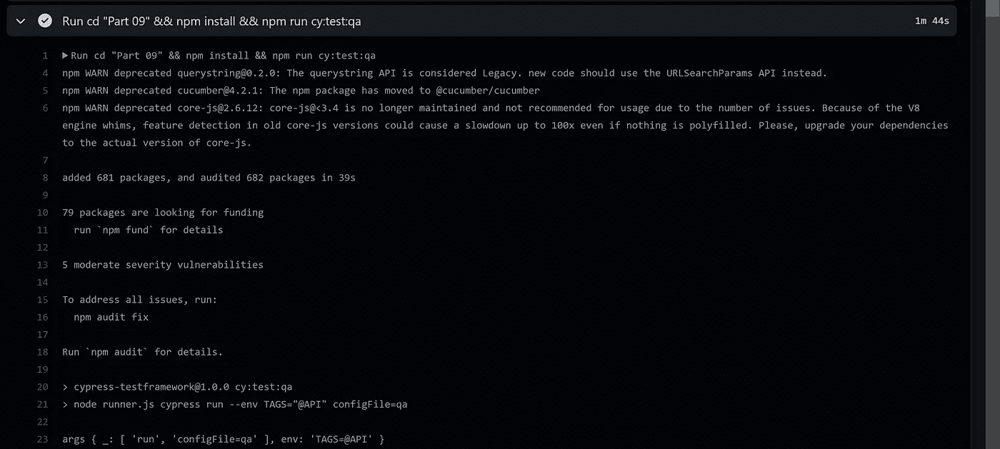
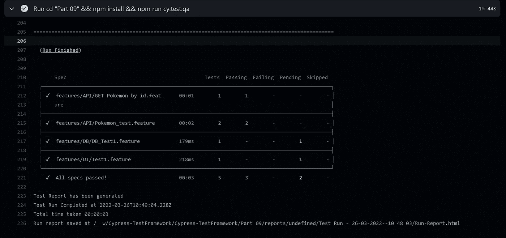

# 在 GitHub 操作中运行 Cypress 测试(第 10 部分)

> 原文：<https://medium.com/nerd-for-tech/running-cypress-tests-in-github-actions-part-10-8a3d406668bc?source=collection_archive---------2----------------------->


带有 Github 操作的 Cypress

沙洛姆，

在本系列的前一篇文章[在 docker 中运行 Cypress 测试(第 9 部分)](https://kushalbhalaik.xyz/blog/running-cypress-tests-in-docker-part-9/)中，我们讨论了如何从 Docker 容器中的 [Cypress-TestFramework](https://kushalbhalaik.xyz/blog/building-a-test-automation-framework-using-cypress-io-part-1/) 运行测试，现在在本文中，我们将看到如何使用 [GitHub 操作](https://docs.github.com/en/actions)在 Docker 中自动运行这些测试

# 开始使用:

GitHub 在每个存储库上都提供了动作特性选项:



回购中的 GitHUb 操作按钮

> GitHub Actions 提供了许多现成的工作流程

然后点击“**新建工作流**按钮，选择“**自行设置工作流**



您将在屏幕上看到以下编辑器:



在 repo 中创建 main.yml 工作流

现在用以下配置细节替换 **main.yml** 的内容:

```
name: run-on-docker
on:
  # Triggers the workflow on push or pull request events but only for the develop branch
  push:
    branches: [ develop ]
jobs:
  cypress-run:
    runs-on: ubuntu-latest
    # Docker image with Cypress pre-installed
    # https://github.com/cypress-io/cypress-docker-images/tree/master/included
    container: cypress/included:9.2.0
    steps:
      - uses: actions/checkout@v1
      - run: cd "Part 09" && npm install && npm run cy:test:qa
```

**main . yml 的解释:**

在对该 repo 的开发分支进行推送/每次提交时，代码将在 docker 容器中运行，由 GitHub Actions 使用 docker image "**cypress/included:9 . 2 . 0**"运行 *ubuntu-latest*

现在，步骤部分使用了可以安全使用的“ **actions/checkout@v1** ”，该操作在 **$GITHUB_WORKSPACE** 下签出您的存储库，因此您的工作流可以访问它。

> 也可以使用“actions/checkout@v2”或“actions/checkout@v3 ”,然后命令***CD“Part 09”&&NPM install&&NPM run cy:test:QA***在工作流内部运行。

它首先将上下文更改为 repo 子文件夹" *Part 09* "并运行" **npm install** "命令从 npm 注册表下载所有完成的依赖项。最后，它使用" **npm run** "调用脚本，这将在" *QA* "环境中运行测试

因为人们可能不会像我们一直使用的那样使用带有子文件夹的 repo，所以您可以简单地使用***NPM install&&NPM run cy:test:QA***

添加完 **main.yml** 后，只需将其提交给 repo，repo 将自动触发 *Github Actions* 工作流。

# 分析结果:

工作流运行后，您将看到基于您的提交名称的成功运行



然后转到 ***成功的工作流程>柏树-运行*** ，这将给你一个发生的所有动作的很好的摘要



这些操作如下(展开每个单独的操作后，您可以获得更多详细信息):

*   设置作业
*   初始化容器



柏树/含:9.2.0 正在拔

*   运行操作/签出@v1



查看回购协议

*   运行 cd“第 9 部分”&& npm 安装&& npm 运行 cy:test:qa



运行“运行”命令



决赛成绩

*   停止集装箱
*   完成作业

Lehitra'ot！

> **Github 代码:**
> 
> [https://github . com/far 11 ven/Cypress-test framework/actions/runs/2044277040](https://github.com/far11ven/Cypress-TestFramework/actions/runs/2044277040)

*原发布于*[https://kushalbhalaik . XYZ](https://kushalbhalaik.xyz/blog/running-cypress-tests-in-github-actions-part-10/)