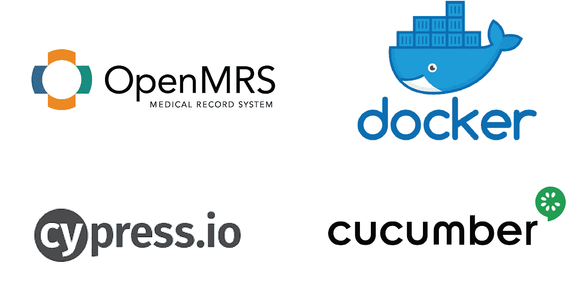
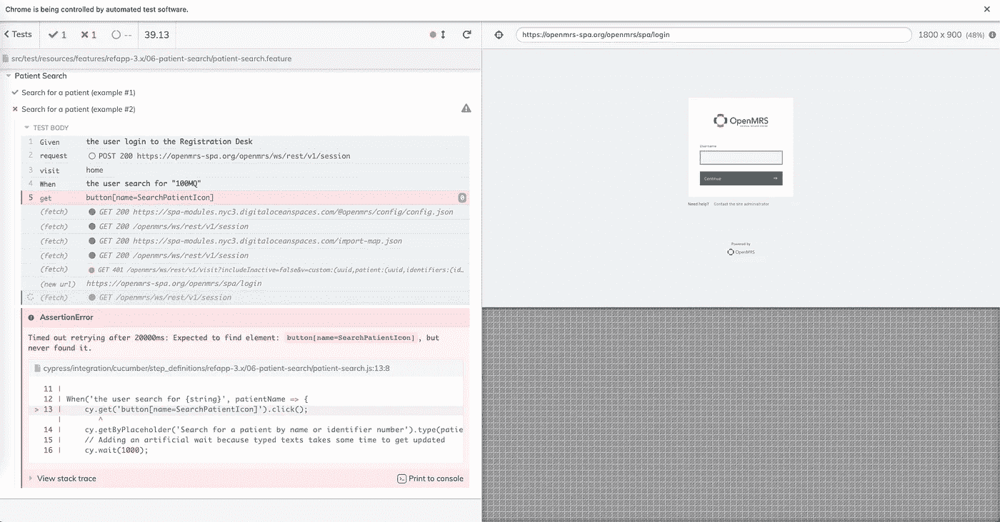
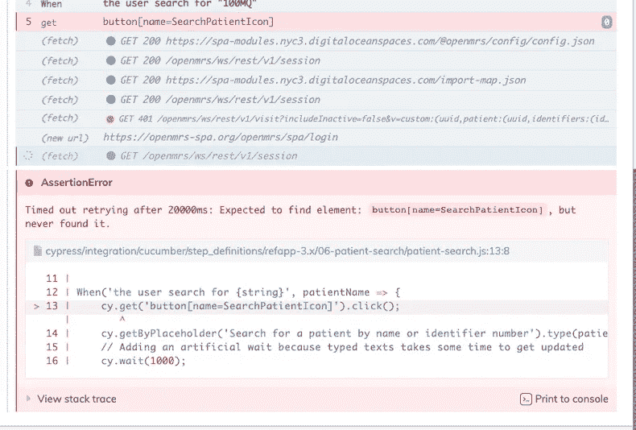
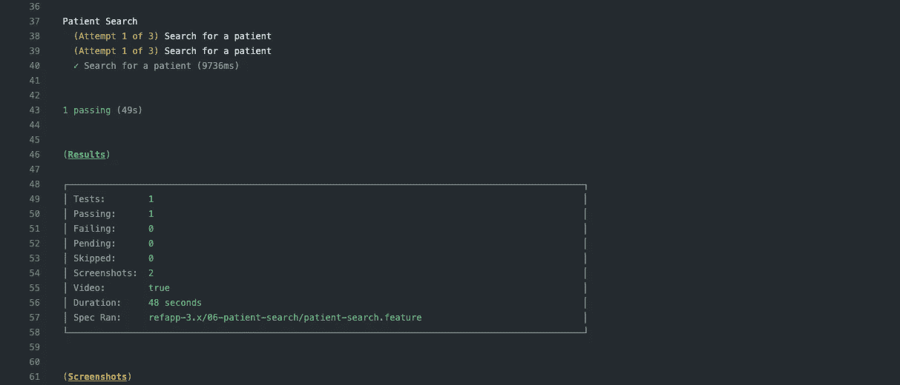
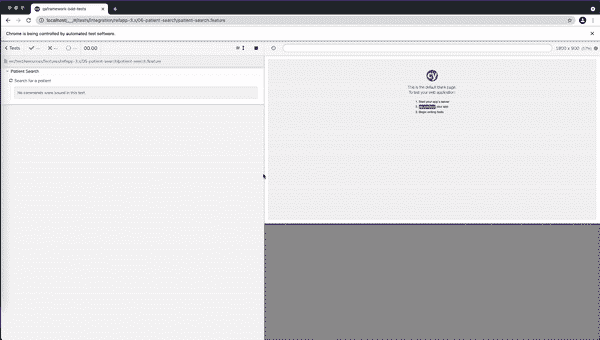

# 在 Dockerized 环境中运行 E2E 测试

> 原文：<https://medium.com/nerd-for-tech/running-e2e-tests-in-a-dockerized-environment-9e7dfe5adf24?source=collection_archive---------1----------------------->

大家好。在本文中，我将分享我在为 OpenMRS 做贡献时获得的新体验。

**端到端(E2E)测试**

端到端测试是一种从头到尾测试整个软件的技术，以确保应用程序流按预期运行。它定义了产品的系统依赖关系，并确保所有集成功能按预期协同工作。端到端(E2E)测试的主要目的是通过模拟真实的用户场景和验证系统，从最终用户的体验出发进行测试。E2E 测试可以手动进行，也可以通过自动方法进行。

OpenMRS 3.x 使用 Cypress 和 Cucumber 来自动化他们的测试。

在 OpenMRS 3 中。x E2E 测试是在生产服务器上进行的。3.x QA 团队在修复和改进 E2E 测试工作流程时，遇到了各种各样的问题。主要原因是生产服务器需要很长时间来加载。因此，有时预览不显示或者测试找不到一些组件。由于这些原因，一些测试工作流会失败。

针对生产服务器进行测试

作为这个问题的解决方案，他们考虑对 docker 容器中托管的 OpenMRS 应用程序运行测试。这以前已经实现过，但是由于 docker 镜像中的一些问题而失败了。然而最近 docker 镜像中的问题已经解决了，我有机会实现它。

为了实现这个特性，我首先获得了 3.x 图像文件，并在本地机器的 docker 容器中构建它。接下来，为了测试这一点，我使用了患者搜索测试。当根据 docker 图像运行患者搜索测试时，该测试应该首先在系统中创建一个患者，因为最初数据库中没有记录患者。因此，一旦完成这些更改，接下来我将更改患者搜索 Github 操作工作流的结构，以便针对 docker 图像运行。这是之前由 [Jayasanka Weerasinghe](https://medium.com/u/cd6875870f78?source=post_page-----9e7dfe5adf24--------------------------------) 完成的，所以它对我帮助很大。

然后，我在 Github 中将更改推送到我的原点(forked repo ),并手动触发工作流进行测试。几分钟后宾果！！工作流通过。

Github 操作中的构建结果

*Github 动作构建* [*链接*](https://github.com/kumuditha-udayanga/openmrs-contrib-qaframework/runs/4949350651?check_suite_focus=true) *。*

这解决了在 OpenMRS 3.x 的 E2E 测试中出现的许多问题

这是用 docker 运行患者搜索测试的屏幕记录。

根据 docker 映像进行测试

这就把我们带到了文章的结尾。别忘了也看看我的其他文章。有兴趣为 OpenMRS 做贡献吗？请访问此[链接](https://openmrs.org/get-involved/)，看看您如何开始投稿。
感谢您的阅读，保持安全…