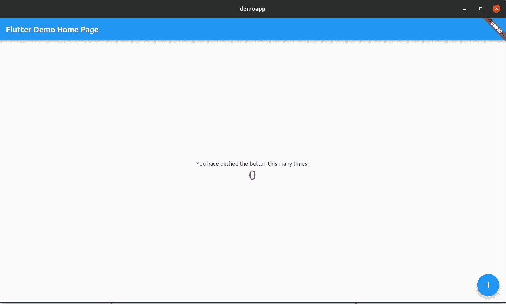
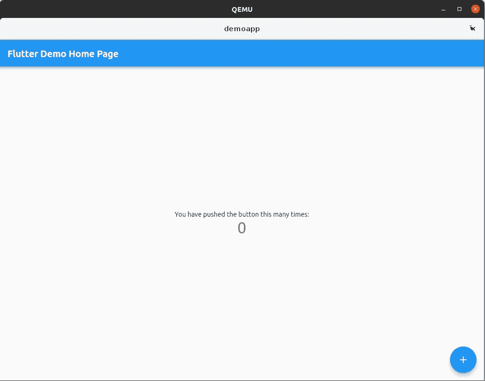
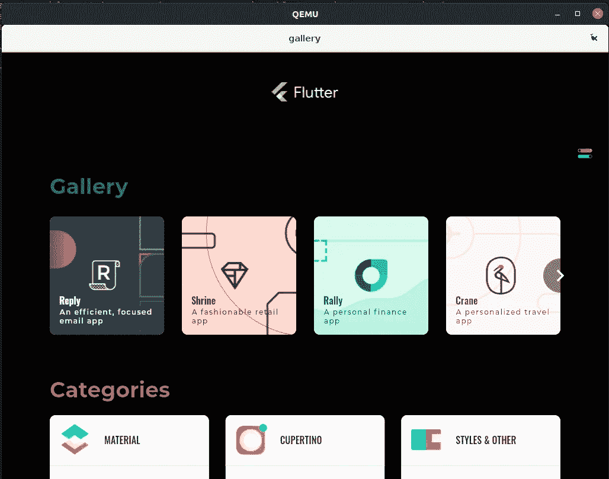

# 在 Ubuntu Core 上运行 Flutter 应用

> 原文：<https://medium.com/nerd-for-tech/running-flutter-apps-on-ubuntu-core-31453d4fed2a?source=collection_archive---------12----------------------->

自 2000 年以来，Qt 一直统治着需要 UI 的嵌入式 Linux 设备。最近，Flutter 在 x11 和/或 Wayland 上引入了原生 Linux 支持。因此，现在甚至有可能在嵌入式 Linux 上运行 Flutter 应用程序。

本文介绍了如何在 Ubuntu Core 上运行任何 Flutter 应用。作为第一步，我们将看到一个 Flutter 应用程序在桌面上运行。然后，我们将创建一个快照包，最后，我们将进行调整，使其能够在 Ubuntu 核心设备上运行。让我们开始吧。

# **先决条件**

*   假设您熟悉快照。Snap 是由 Canonical 开发的软件打包和部署系统。你可以在 [Snapcraft](https://snapcraft.io/docs) 上找到更多关于它的信息
*   假设你已经知道 Ubuntu Core，但如果你不知道，它是 Canonical 的 Linux 发行版，目标是嵌入式和物联网设备，完全基于 snaps，并承诺安全性作为一个区分因素。更多信息，可以访问 [Ubuntu 核心文档](https://ubuntu.com/core/docs)。
*   假设您已经在 Ubuntu 核心设备上安装并运行了 mir-kiosk。Mir 基于 Wayland 协议提供安全的客户端-服务器通信。强烈推荐阅读官方[网站](https://mir-server.io/)和艾伦·格里菲思的帖子[这里](https://snapcraft.io/blog/mir-kiosk-uses-mir)和[这里](https://ubuntu.com/blog/creating-graphical-shells-try-mir-in-a-virtual-machine)。
*   假设您已经安装了 snapcraft。``sudo snap install snapcraft --classic`
*   假设你已经安装了 Flutter。我强烈推荐使用 snap 包通过一个命令来安装它；`sudo snap install flutter --classic`
*   建议使用 lxd 来创建快照。可以用`sudo snap install lxd`安装，用`lxd init`初始化。欲了解更多信息，请访问官方[文档](https://linuxcontainers.org/lxd/getting-started-cli/#ubuntu)。

# 创建和构建 Flutter 应用

默认情况下，Flutter 不启用桌面支持。你必须使用下面的命令`flutter config --enable-linux-desktop`来明确地配置你的 Flutter CLI 工具。剩下的就是创建项目并运行它。很简单。

```
$ flutter config --enable-linux-desktop
$ flutter create flutterdemo
$ cd flutterdemo
$ flutter run -d linux 
```

这就是了



运行在 Linux 上的标准 Flutter 应用

等等，我们还没说完。我们必须在 Ubuntu 核心上运行它。因此，我们必须让这个应用程序能够与 Ubuntu Core 和 mir-kiosk 一起运行。

# 创建快照

由于有了`snapcraft` CLI 工具，从现有应用程序创建快照包变得非常容易。

```
$ cd your-app-directory
$ snapcraft init
```

现在，它需要一点点关注。这是我们应用程序的初始版本的`snapcraft.yaml`文件。让我们称我们的应用程序为超级酷的应用程序:)

我们的`snapcraft.yaml`已经可以建造了。建议在构建快照时使用 lxd，这样您的机器就不会被污染。

```
$ snapcraft --use-lxd
```

如果一切顺利，您将在目录中拥有您的 snap 包。您可以使用以下命令安装它。我们必须使用`dangerous`标志，因为我们没有将应用程序部署到商店。

```
$ sudo snap install <your-app-name.snap> --dangerous
$ super-cool-app
```

现在，您应该能够看到它在桌面上工作。太好了。您将应用程序转换为 snap 包格式，并使其可以在桌面上运行:)

但是，我们必须调整我们的`snapcraft.yaml`文件，通过利用 mir-kiosk 让它在 Ubuntu 核心上运行。

# Ubuntu 核心的调整

为了在 Ubuntu Core 上运行 Flutter 应用程序，我们需要注意三点。

*   目前，Ubuntu 核心平台没有 Flutter 应用程序所需的字体。
*   UI 应用程序通常必须在启动时可用，因此为了满足这一点，我们必须创建一个守护进程。
*   由于 Flutter 应用程序运行在 mir-kiosk 之上，我们必须对 mir 集成进行必要的调整。

这里是解决所有提到的问题的`snapcraft.yaml`。

修改后重新创建快照，现在我们准备在 Ubuntu Core 上测试它。

您可以使用 qemu 和预构建的 [Ubuntu Core18](https://cdimage.ubuntu.com/ubuntu-core/18/stable/current/) 或 [Ubuntu Core20](https://cdimage.ubuntu.com/ubuntu-core/20/stable/current/) 映像来测试生成的快照。



我们的应用程序运行在 Ubuntu Core yey 上！

如果您正在寻找更高级的应用程序，这里就是



颤振廊应用


来自 Flutter Gallery 的个人理财应用程序 Rally

在这里你可以找到 GitHub 库。

*   [https://github.com/bugraaydogar/flutterdemo](https://github.com/bugraaydogar/flutterdemo)
*   [https://github.com/kenvandine/flutter-gallery-snap](https://github.com/kenvandine/flutter-gallery-snap)

# 摘要

正如所解释的，在 Ubuntu Core 上运行 Flutter 应用程序是非常容易的。看起来 Qt 现在在嵌入式 Linux 市场上有了一个竞争对手，我真的很好奇随着这些发展，嵌入式 Linux 市场在未来会如何发展…

# 参考

[1][https://flutter.dev/docs/deployment/linux](https://flutter.dev/docs/deployment/linux)

[2][https://medium . com/flutter/announcing-flutter-Linux-alpha-with-canonical-19eb 824590 a9](/flutter/announcing-flutter-linux-alpha-with-canonical-19eb824590a9)