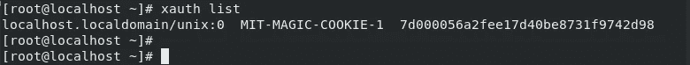
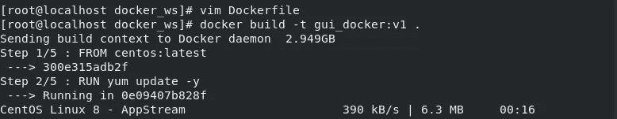
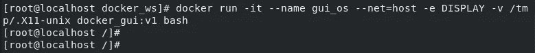
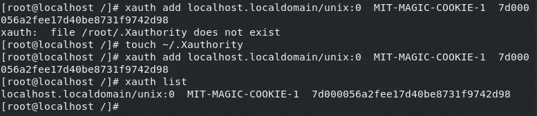
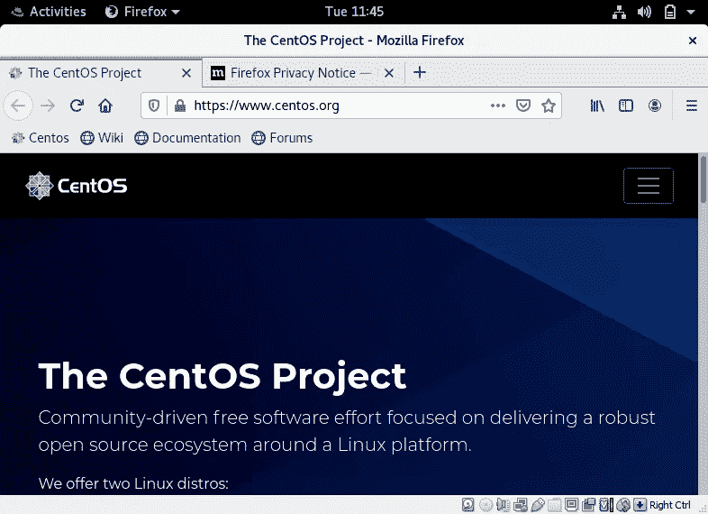
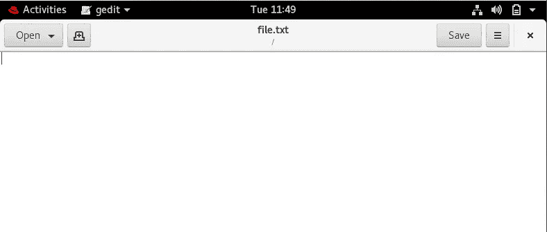

# 在 Docker 容器中运行基于 GUI 的应用程序。

> 原文：<https://medium.com/nerd-for-tech/running-gui-based-applications-inside-a-docker-container-645399ca2ef0?source=collection_archive---------3----------------------->


图 2 Docker 容器上的 GUI 应用程序

今天，整个 IT 世界都在接受容器化技术，主要用于企业服务器应用程序。docker 仍然是一个领先的平台，可以在由服务器组成的分布式环境中快速部署应用，并根据需要移动应用。作为应用程序可移植性的优先工具，使用 Docker 来安装和运行 GUI 应用程序的想法甚至没有被想到过。

此外，由于 Docker 本质上是用于后端项目的，所以你通常将在后台运行的应用程序(或服务)容器化，如数据库、web 服务器等。但是，你有没有想过部署 GUI 应用程序，运行在前台(显然！)?

你能在 Docker 中运行 GUI 应用程序吗？

答案是肯定的！！

但是使用普通的 docker 运行命令，你将无法看到这些应用程序或与之交互。为此，您需要将显示器与容器连接起来。在本文中，我们将讨论如何做到完全一样。

在这里，我们将看到如何在 docker 容器中运行 firefox 浏览器和 gedit 这样的文本编辑器，并在您的主机中与之交互。为此，首先需要将本地 Linux 机器的 X11 套接字转发到容器，以便容器可以直接使用它。

> X11 是 Unix 操作系统中的 GUI 环境，是每个 Linux 桌面环境的一部分，如果不是，您需要安装 XLaunch。

完成此操作后，您需要转发 display 环境变量。即使在这之后，它也可能失败，因为我们还没有为 X 服务器主机设置权限。起初，这似乎是一项艰巨的任务。让我们通过代码来运行这些步骤。

1.  **创建 dockerfile**

你首先需要创建一个 docker 文件，这将有助于我们建立一个相同的形象。使用以下代码创建 docker 文件:

```
#set centos:latest as base image
FROM centos:latest#installation of dependencies
RUN yum update -y
RUN yum install firefox -y 
RUN yum install gedit -y
RUN yum install xauth -y#Exposing a port number
EXPOSE 8687#run cmd firefox as default 
CMD /usr/bin/firefox
```

在上面的 *dockerfile，*我们已经拉了一个 Centos 作为基础图像。之后，在上面运行 yum update，然后安装一些 GUI 应用程序，如 firefox、gedit 和 Xauth。然后它暴露端口 8887 并运行 Firefox。 **Xauth** 仅仅允许 Docker 容器访问显示服务器。

2.**复制 cookie 以连接显示服务器**

要访问 cookie，请在您的主机上运行以下命令:

```
xauth list
```

输出将是如下所示的形式。复制输出。



授权 cookie

3.**构建 Docker 映像**

使用以下命令使用上面创建的 Docker 文件创建 Docker 映像:

```
docker build -t <image-name>:<version> .
```



构建图像

使用上面创建的图像启动 docker 容器。以下是相同的完整命令:

```
docker run -it --name <container_name> --net=host -e DISPLAY -v /tmp/.X11-unix <image-name> bash
```



Docker 图像现在已经构建好了，它会弹出一个新的已创建图像的 bash。

6.**将 cookie 添加到列表中**

现在，在 bash 中，您需要使用下面的命令添加上一步中复制的 cookie。

```
xauth add <the output cookie copied eariler>#to verify that the host system is connected to the remote system
xauth list
```



6.**运行 GUI 应用程序**

只需在 bash 中键入“firefox ”,您就会发现 Firefox 浏览器会在您的本地机器上弹出，尽管它是在 Docker 容器中运行的。执行类似的过程，您可以在 Docker 容器中运行几乎任何 GUI 应用程序，并在屏幕上显示它们并与之交互。



在 Docker 容器中运行 GUI 应用程序真的是一种很棒的体验，它永远不会损害/使用你的主机文件系统。这完全取决于你的 Docker 容器。

在本文中，我们看到了如何使用*Docker 文件*创建 Docker 映像，并构建和运行该映像。我们还讨论了如何将 Docker 容器的显示连接到本地机器的显示，并访问了在本地机器上的容器内部运行的 UI 应用程序。通过这项技术，我们可以使用更多的 GUI 应用程序。

到此结束吧！

对于任何类型的疑问，建议，反馈，请写在评论中，这样我就可以改进或更新我的内容。

谢谢大家！

享受:-)