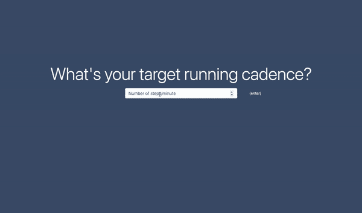
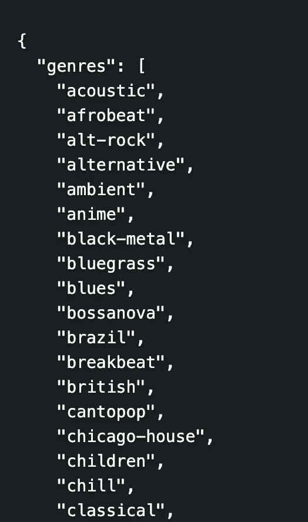
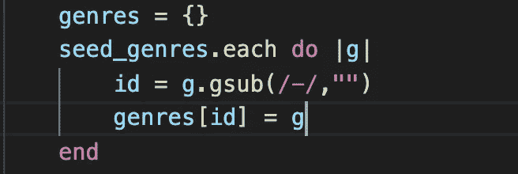
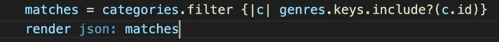

# 运行播放列表生成器 ft。DJ Spotify 推荐

> 原文：<https://medium.com/nerd-for-tech/running-playlist-builder-ft-dj-spotify-recs-cc96fd920d75?source=collection_archive---------13----------------------->

我最近的项目是一个单页 web 应用程序，前端用面向对象的 Javascript 和 HTML/CSS 编写，后端用 Rails 编写，两者之间用 AJAX 交互。

该应用程序是我在 Flatiron 的第一个项目的演变，这是一个纯粹的 Ruby CLI 程序，它连接到 Spotify API，根据目标跑步节奏(步数)和音乐类型生成歌曲记录(注释)。就上下文而言，跑步者通常希望在跑步过程中保持较高的步数(即使是寒冷的时候！)因为更高的脚周转率可以自然地改善跑步状态，从而降低受伤的机会。

你有没有发现自己在听欢快的歌曲时跑得更快？改变跑步节奏的最简单的方法之一就是听与你的步伐节奏相关的歌曲——跟着节奏跑！

Spotify API 有一个非常酷的[推荐端点](https://developer.spotify.com/documentation/web-api/reference/#endpoint-get-recommendations)，它接收艺术家、流派、曲目等种子参数，以及 min_popularity、target_danceability 等数据点，你猜对了: **target_tempo** ，以每分钟节拍数衡量，与跑步节奏直接相关。

我的命令行播放列表构建器的第一个实现将一个种子流派和目标节奏作为种子参数。在对 CLI 版本进行一些现场测试时，我发现 Spotify 推荐的歌曲偶尔会偏离目标节奏。因此，这一次我想确保提供更多的种子参数，希望它能够扩大匹配曲目的范围，并返回一个由 20 个非常接近所需节奏的推荐组成的列表。

我坚持将流派作为主要种子参数，而不是艺术家或曲目，主要是因为 1)当我个人制作运行播放列表时，我通常希望探索流派允许的新音乐，2)如果提供五个流派而不是五个艺术家，推荐池可能会更大。因此，在输入目标节奏(歌曲 BPM)后，系统会提示用户选择他们喜欢的 1-5 个种子流派:

捕捉节奏和风格

添加风格照片是我为这个网络应用设计的另一个功能进化。在通过 [get a category endpoint](https://developer.spotify.com/documentation/web-api/reference/#endpoint-get-a-category) 发现类别图标可用之后，我立即创建了一个请求，使用 seed 流派端点提供的 id 来检索它们各自的图标，不幸的是，seed 流派请求没有提供这些图标。

作为一个旁注，我回顾了一篇[之前的博客文章](https://brownjer3.medium.com/spotifinding-your-ideal-running-playlist-394043d2745a)，并非所有 Spotify 的流派都可以用作推荐种子，这就是为什么他们将“种子流派”与“获取所有类别”端点分开。这里的另一个要点是，由于我仍在试图找出的原因，种子流派请求中提供的 id 字符串与您获得所有类别时提供的 id 不匹配。因此，不仅需要单独调用 API 来检索种子流派的图标，还需要迭代种子流派 id 字符串，以便它们的格式与图标请求的类别 id 相匹配。我的实现如下:

1.  请求返回 id 字符串数组的所有种子流派:

2.格式化字符串以匹配类别 id——我选择使我的生活更容易，并简单地从多词中删除破折号，这确保了所有单词 id 和大多数多词 id 的匹配，但错过了像“R&B”这样的独特流派(id 翻译为“rnb”)。

3.请求最多 50 个类别以最大化匹配计数

4.过滤类别，只保留那些可以用作种子的(对不起，R&B 球迷..)

从那里，抓取风格图像 url 来呈现在前端是简单明了的，并且绝对使播放列表构建体验更好。我仍然不太确定 Spotify 为什么会给出不同的 id，或者“流派”和“类别”之间有什么区别，但似乎开发者可能经常想要更多的数据点来补充种子流派，我希望很快会有更新。

请让我知道我是否遗漏了什么，或者你是否找到了更简单的方法来做这件事！你可以看看我的项目，Cadence Tunes v2 on [Github 这里](https://github.com/brownjer3/cadence-tunes-v2)。