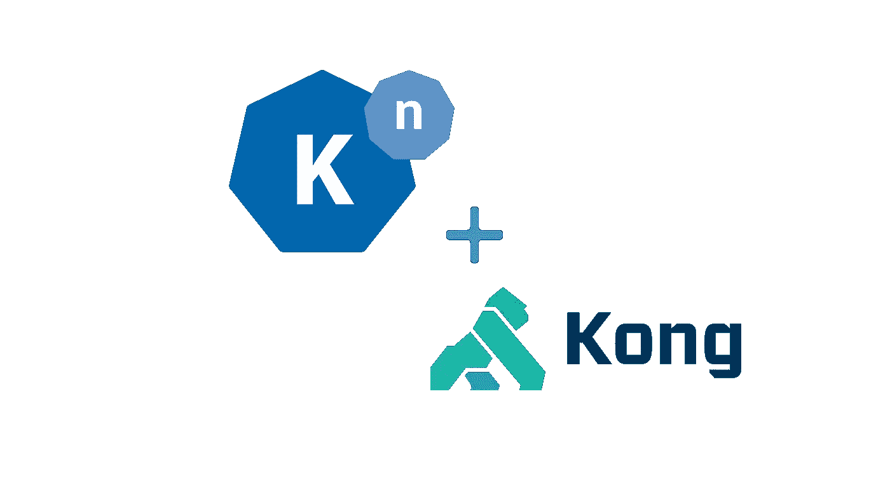
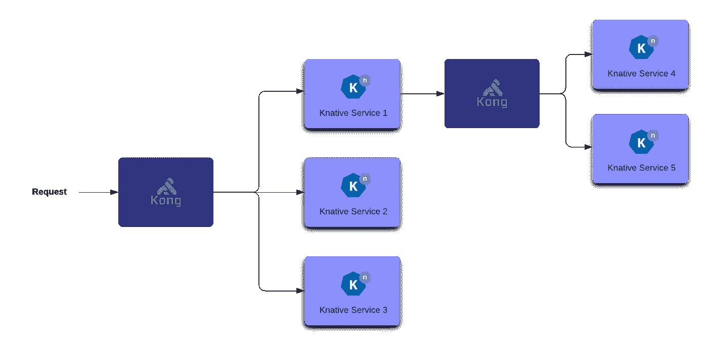
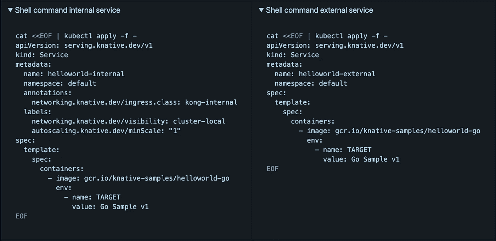
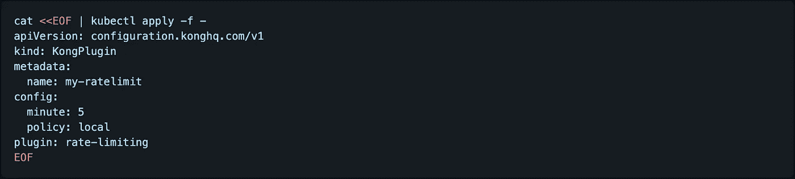
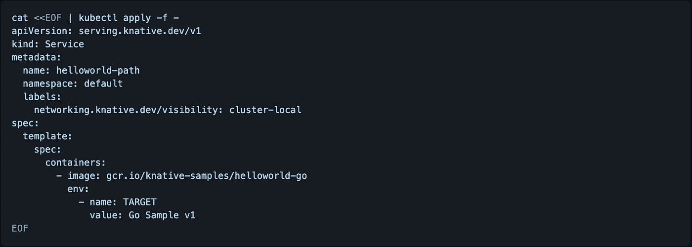
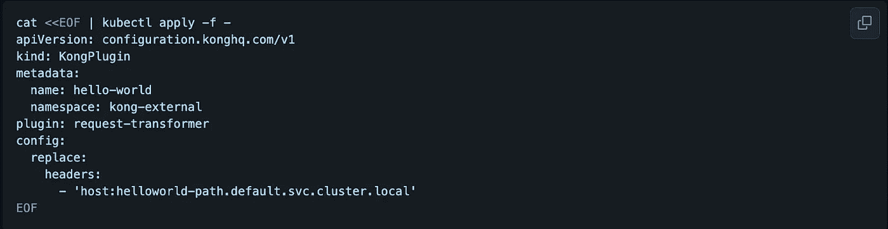
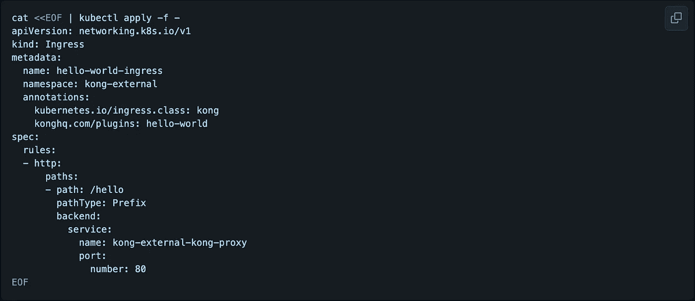

# 与 Knative & Kong 一起经营服务

> 原文：<https://medium.com/nerd-for-tech/running-services-with-knative-kong-3135c0d94dfa?source=collection_archive---------1----------------------->



孔庆东和孔庆东是天造地设的一对…我们是天生的一对！

> 在这里的 [direktiv.io](https://github.com/vorteil/direktiv) 我们广泛使用[Knative](https://knative.dev/)…因为这确实是一个令人惊叹的项目！

大多数开发人员和系统管理员将 Knative 视为一个无服务器的框架，但是它还有更多的功能**(无服务器组件只是其中的一小部分)**。

它通过为每个服务仅定义一个 yaml 来抽象服务部署和管理，同时提供额外的功能，如基于报头的路由和流量分流…所有这些都允许我们在 Direktiv 中运行同一服务的不同版本。这是我们实时迁移功能的关键部分！

在这篇文章中，我将展示如何使用带 Knative 的[孔](https://konghq.com/)入口控制器来获得更多的好处！

# 设置它

首先，您需要一个 Kubernetes 环境(显然)。从你最喜欢的云提供商那里选择一个服务或者安装 [k3s](https://k3s.io/) (我更喜欢这个)。

如果您从未使用过 Knative，我们将开始安装。Knative 可以通过提供的 [YAML](https://knative.dev/docs/admin/install/serving/install-serving-with-yaml/) 文件轻松安装:

```
# kubectl apply -f https://github.com/knative/serving/releases/download/v0.25.1/serving-crds.yaml# kubectl apply -f https://github.com/knative/serving/releases/download/v0.25.1/serving-core.yaml
```

这将安装 Knative 的服务部分，但它也需要一个网络组件来处理路由。安装说明书建议 [Kourier](https://github.com/knative-sandbox/net-kourier) 、[大使](https://getambassador.io/)、[轮廓](https://projectcontour.io/)和 [Istio](https://istio.io/) 。所有这些组件当然都是有效的选项，并且工作得非常好，但是还有一个选项在这里没有提到: [Kong 代表 Kubernetes](https://konghq.com/solutions/kubernetes-ingress/)

Kong 提供了一个支持开箱即用的 Knative 的入口控制器。所有服务都可以通过 Kong 自动路由并得到适当的管理。

(对我们来说)好处是显而易见的。使用 Kong 的**完整特性集使得 Knative services 更容易专注于**业务功能**，而 Kong 则处理支持功能，如**认证、响应转换和请求限制**。**

请看下图(它显示了从集群外部和内部访问的服务):



从集群外部到内部的服务可访问性

Knative 区分可从群集外部访问的外部服务和仅供群集内部使用的私有服务。为了支持这两者，我们将在 Kubernetes 集群中安装两个 Kong 实例。

孔配备了舵图，所以我们将使用这些安装。所有配置选项请查看[孔掌舵图 github](https://github.com/Kong/charts) 页面。对于这个例子，我们将使用一个基本的方法。

为了确保这两个实例是独立的，我们为每个实例配置了自己的名称空间: *kong-internal* 和 *kong-external* 。除了 Kubernetes 服务的类型之外，安装几乎完全相同。用于外部服务的 Kong 使用一个`LoadBalancer`，而内部服务使用一个`ClusterIP`(因此不能从集群外部访问)。

为了区分这两者，我们还分配了不同的入口类别。

## 对外服务孔

让我们为外部服务安装孔:

```
# helm repo add kong https://charts.konghq.com
# helm repo update

# kubectl create namespace kong-external
# helm install -n kong-external kong-external kong/kong
```

## 孔为内部服务

让我们安装孔为内部服务:

```
# kubectl create namespace kong-internal
# helm install -n kong-internal --set proxy.type=ClusterIP --set ingressController.ingressClass=kong-internal kong-internal kong/kong
```

## 确认

服务将在几秒钟内可用，两个名称空间中的所有 pod 都应该处于运行状态。

```
# kubectl get pods -n kong-internal
NAME                                 READY   STATUS    RESTARTS   AGE
kong-internal-kong-77dc9c4cf-tb2b5   2/2     Running   0          24s

# kubectl get pods -n kong-external
NAME                                   READY   STATUS    RESTARTS   AGE
svclb-kong-external-kong-proxy-9cbcl   2/2     Running   0          30s
kong-external-kong-79668fdf45-rk7s2    2/2     Running   0          30s
```

要在生产环境中使用外部服务，需要进行 DNS 更改，如 Knative 文档中所述。在这种情况下将使用 [sslip.io](https://sslip.io/) 进行测试。Knative 提供了一个名为 default-domain 的 Kubernetes 作业，该作业将 Knative 服务配置为使用 sslip.io 作为默认 DNS 后缀:

```
# kubectl apply -f https://github.com/knative/serving/releases/download/v0.25.0/serving-default-domain.yaml
```

在我们设置好所有组件并使它们运行之后，我们现在需要将它们“粘合”在一起。

> 听起来很难，但实际上非常容易...我们只需要告诉 Knative 使用 Kong 作为入口控制器…

这是一个简单的命令，用于修改 Knative 的一个配置图。这定义了默认的入口类别，并且可以根据服务进行覆盖。在我们的例子中，如果没有另外指定的话，所有的请求都通过外部 Kong 进行路由。

```
kubectl patch configmap/config-network \
  --namespace knative-serving \
    --type merge \
      --patch '{"data":{"ingress.class":"kong"}}'
```

# 配置和测试服务

是时候将这个设置付诸实施并看看它是如何工作的了。第一步是安装服务。我们希望安装一个内部服务和外部服务来与孔一起工作。

## 配置服务

为此，我建议使用以下两个服务示例:

孔内部服务

孔对外服务



为孔应用服务配置

如您所见，除了内部服务有额外的注释和标签之外，它们几乎是相同的。但是他们做什么呢？

*   *networking.knative.dev/visibility:集群-本地*:该标签将其标记为集群可访问的服务。
*   【autoscaling.knative.dev/minScale: " 1 "*:如果一个服务从零开始扩展，需要几秒钟才能得到第一个响应。使用此设置，总是有一个服务实例在运行。*
*   *networking.knative.dev/ingress.class:孔-内部*:安装时内部孔实例指定入口类*孔-内部*。该设置确保请求通过内部 Kong 实例而不是外部实例进行路由。

服务本身的[配置](https://knative.dev/docs/reference/api/serving-api/#serving.knative.dev/v1.RevisionTemplateSpec)(容器名、环境变量、秘密等。)类似于默认的 Kubernetes 部署，基本上是 Kubernetes 的 PodSpec 的子集。

Knative 在安装期间创建并部署服务，如果该过程成功完成，则将其标记为就绪。第一次部署服务可能需要更长时间，特别是如果服务中的图像还没有下载到 Kubernetes 节点。如果此过程成功，服务就可以使用了:

```
# kubectl get ksvc
NAME                  URL                                                        LATESTCREATED               LATESTREADY                 READY   REASON
helloworld-internal   http://helloworld-internal.default.svc.cluster.local       helloworld-internal-00001   helloworld-internal-00001   True    
helloworld-external   http://helloworld-external.default.192.168.1.1.sslip.io   helloworld-external-00001   helloworld-external-00001   True
```

## 测试服务

好极了……


如果没有 curl，软件故障排除会是什么样子？

可以用一个简单的`curl`命令调用外部服务。因为安装了模拟 DNS 的`sslip.io`,所以调用看起来像:

```
# curl http://helloworld-external.default.192.168.1.1.sslip.io
Hello Go Sample v1!
```

第二个服务是一个内部服务，具有 Kubernetes 内部 URL[*http://hello world-internal . default . SVC . cluster . local*](http://helloworld-internal.default.svc.cluster.local/)。要调用内部服务，我们需要运行一个带有`curl`的交互式 pod，并从那里调用服务:

```
# kubectl run test-service --rm -i --tty --image curlimages/curl -- sh
# curl http://helloworld-internal.default.svc.cluster.local
```

# 使用插件

## 请求限制器插件示例

在开始的时候我们提到了孔的插件以及它们在 [Direktiv](http://www.direktiv.io) 中的作用。在这个例子中，我们将把一个插件([请求限制插件](https://docs.konghq.com/hub/kong-inc/rate-limiting/))连接到 Knative 服务。

将插件安装或应用到服务需要两个步骤:

步骤 1:创建插件:这个例子将使用[请求限制插件](https://docs.konghq.com/hub/kong-inc/rate-limiting/)，所以我们需要先创建它。这将把请求限制为每分钟最多 5 个。



**步骤 2:使用创建的插件的名称来注释服务:**。这可以在服务创建期间或之后完成。我们将用请求限制器注释外部服务。如果超出限制，重复调用该服务将会返回错误。

```
# kubectl annotate ksvc helloworld-external konghq.com/plugins=my-ratelimit
```

全部完成—速率限制插件已部署！

## 基于路径的路由示例

第二个配置展示了如何根据 URL 中请求的路径将外部请求路由到内部 knative 服务。我们使用“主机”报头来利用 [Knative 的路由](https://knative.dev/docs/serving/samples/knative-routing-go/)。如果一个请求到达网关(在本例中是 Kong ), kna tive 使用消息头路由到请求的“Host”消息头中指定的后端服务。为了启用基于路径的路由，Kong 可以通过一个[请求转换器插件](https://docs.konghq.com/hub/kong-inc/request-transformer/)自动添加这个报头。


基于路径的路由示例

要路由到的服务需要部署到具有相同入口类*的入口控制器(即，在外部 Kong 入口控制器中需要有内部服务)*。如前所述，一个简单的标签会将一个 Knative 服务部署为“集群本地”:



Kong 集群-本地安装

下一步是配置插件来添加标题。请求转换器插件需要安装在入口控制器的名称空间 *kong-external:*



Kong 外部集群安装

成功创建插件后，需要使用插件创建相应的入口。

下面 YAML 加一条路线*/你好*。该路由使用前面的插件将主机头添加到请求中，并将请求再次路由到 Kong 代理，后者返回 Knative 服务的结果。这可以用一个简单的`curl`*[http://hello world-external . default . 192 . 168 . 1 . 1 . sslip . io/hello](http://helloworld-external.default.192.168.1.1.sslip.io/hello)请求来测试:*

**

*为请求添加了“你好”路线*

# *最后的想法*

*Knative 支持简单的、版本控制的部署，Kong 围绕 API 和路由添加了一组丰富的特性。不幸的是，Knative 没有得到应有的重视，因为它不仅仅是一个无服务器解决方案(**这些只是我的想法**)。但是这两种工具结合使用可以显著简化 Kubernetes 环境中的微服务部署和管理。*

*一如既往…乐意回答任何问题！*