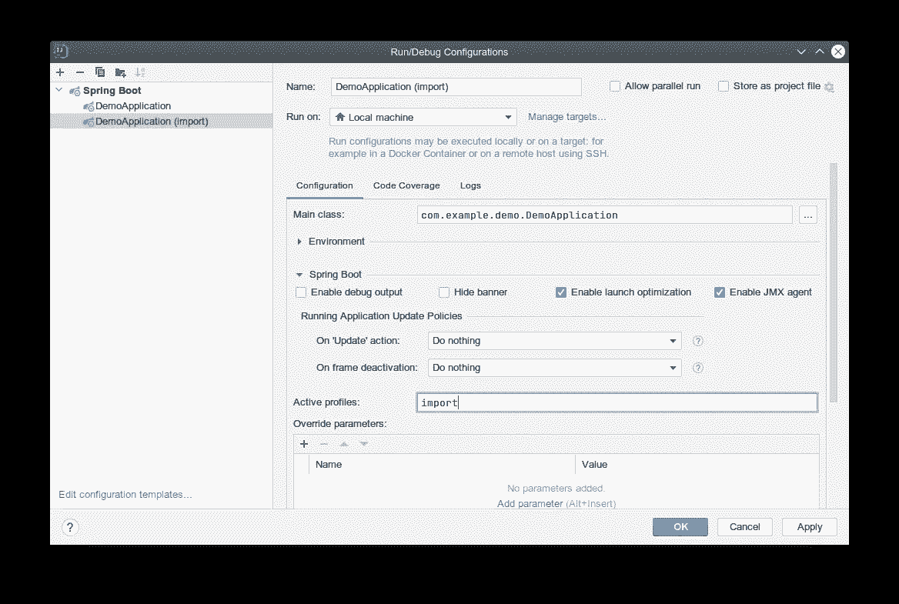
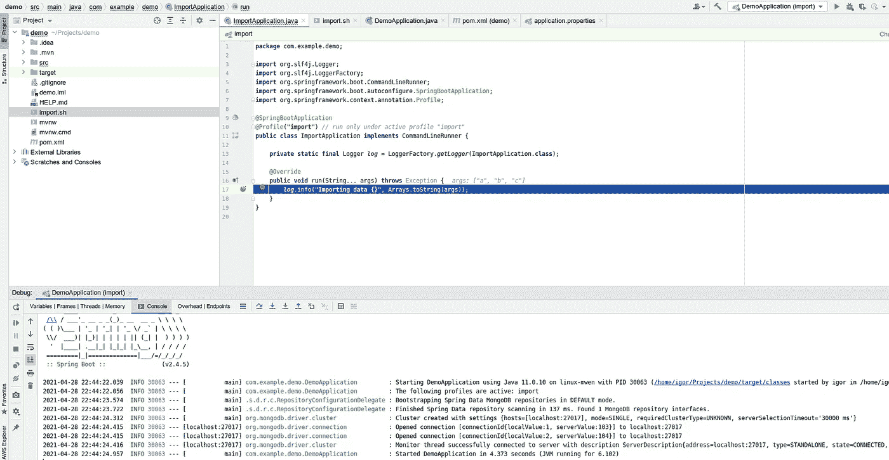
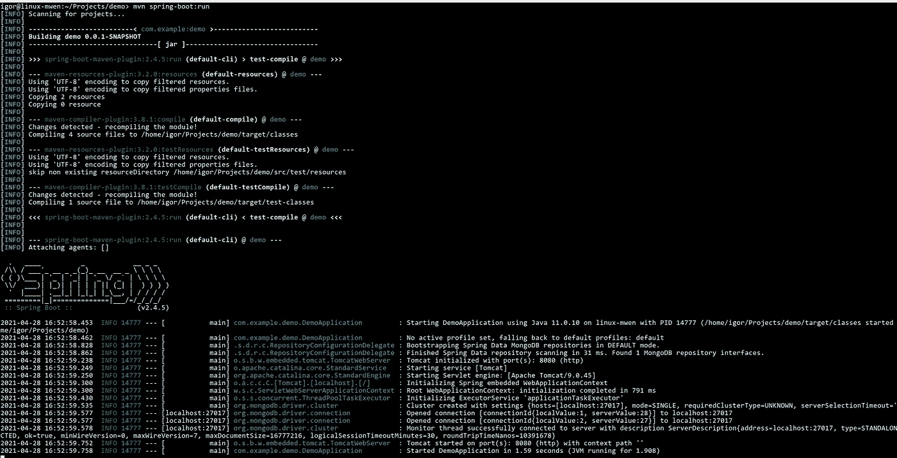
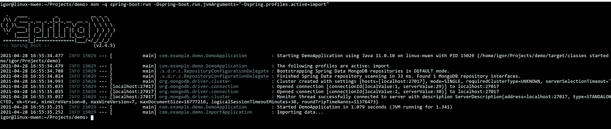
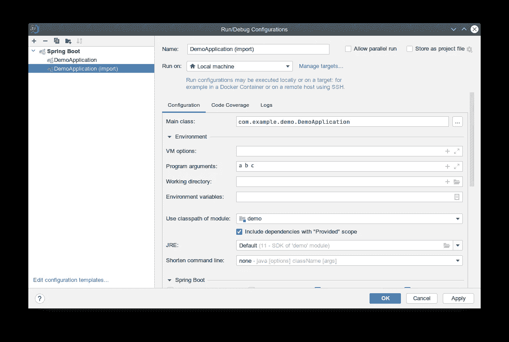
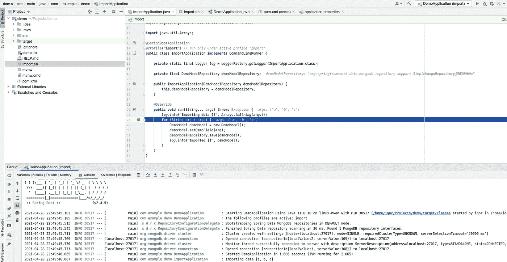
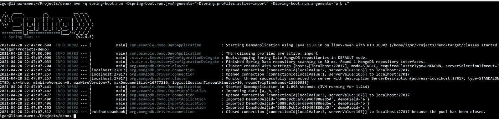
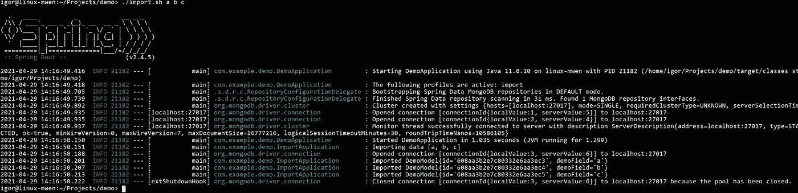
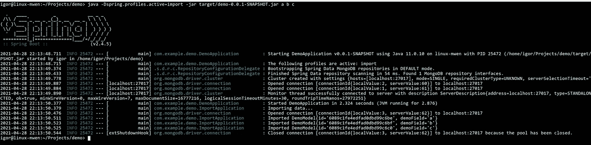

# 在 IDE & Maven 下运行 Spring Boot 控制台应用程序

> 原文：<https://medium.com/nerd-for-tech/running-spring-boot-console-application-under-ide-maven-16b59465a7e0?source=collection_archive---------1----------------------->

Spring Boot 是 web 应用程序的一个很好的框架，但是在编写控制台应用程序时，它并不像 web 那样简单。

例如，你想，正如我需要的，从一些数据源导入数据，如 CSV 文件。从污染 REST API 和安全考虑的角度来看，为此创建 web 端点可能不太实际。因此，CLI 应用程序是一个很好的选择。

通过重用持久性模型来遵循 [DRY](https://en.wikipedia.org/wiki/Don%27t_repeat_yourself) 原则，还必须拥有 Spring 上下文。因此，无论何时模型发生变化，我们都要确保导入功能保持不变，因为导入逻辑在大多数情况下也会受到影响，并且在编译器级别上可见，除此之外，这个安全网可以通过单元或集成测试轻松增强。此外，它应该与 web 应用程序代码一起运行。

以下解决方案不需要任何外部依赖:

# 实现 CommandLineRunner

# 仅在定义的配置文件下运行，并禁用 web 应用程序

添加注释:

```
@Profile("import")
```

向*src/main/resources/application-import . properties*添加属性以禁用“导入”配置文件下的 web 应用程序

之后，在“导入”配置文件下运行将禁用 web 部件，只运行控制台部件。

# IntelliJ 理念下的调试和运行

复制现有的演示应用程序，根据需要重命名并添加“导入”配置文件



只需点击“调试”图标:



# 在 Maven 下运行

通常我们使用 [Spring Boot Maven 插件](https://docs.spring.io/spring-boot/docs/current/maven-plugin/reference/htmlsingle/)运行 spring boot 应用程序，就像这样

```
mvn spring-boot:run
```



要运行我们的控制台应用程序，我们必须在“import”概要文件处于活动状态的情况下运行它(-这里的 q 开关用于抑制编译器输出):

```
mvn -q spring-boot:run -Dspring-boot.run.jvmArguments="-Dspring.profiles.active=import"
```



# 传递参数

在 IntelliJ 理念下非常简单，在运行配置中，我们已经在上一步中进行了配置，只需展开“环境”选项卡并添加参数:



这导致:



在 Maven 下就有点棘手了，因为参数不是直接提供给应用程序的，所以我们必须通过[spring-boot . run . arguments](https://docs.spring.io/spring-boot/docs/current/maven-plugin/reference/htmlsingle/#goals-run-parameters-details-commandlineArguments)变量传递参数来解决这个问题:

```
mvn -q spring-boot:run -Dspring-boot.run.jvmArguments="-Dspring.profiles.active=import" -Dspring-boot.run.arguments="a b c"
```



我们可以使用包装外壳脚本将常规参数转换为 spring-boot.run.arguments 变量，以更方便的方式运行导入作业:

所以我们可以简单地运行

```
./import.sh a b c
```



# 在包装好的罐子里运行

因为参数是直接传递的，所以更加简单:

```
mvn package
```

和

```
java -Dspring.profiles.active=import -jar target/demo-0.0.1-SNAPSHOT.jar a b c
```



# github 上的演示项目

[](https://github.com/cmyker/spring-boot-console-application) [## cmyker/spring-boot-控制台-应用程序

### 在 GitHub 上创建一个帐户，为 cmyker/spring-boot-console 应用程序的开发做出贡献。

github.com](https://github.com/cmyker/spring-boot-console-application)