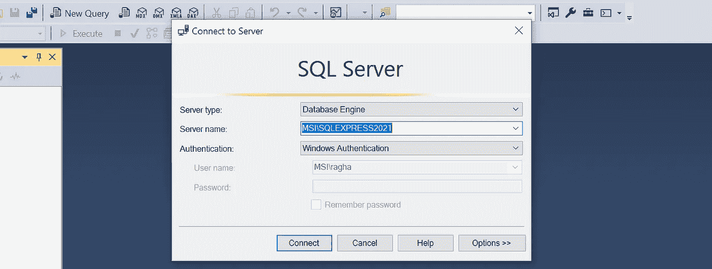
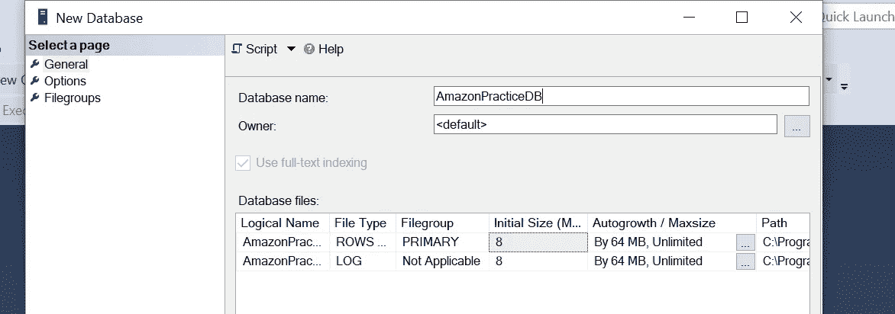
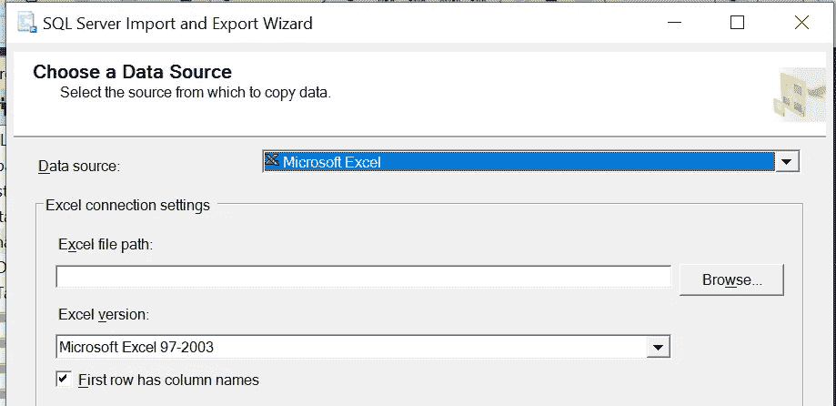
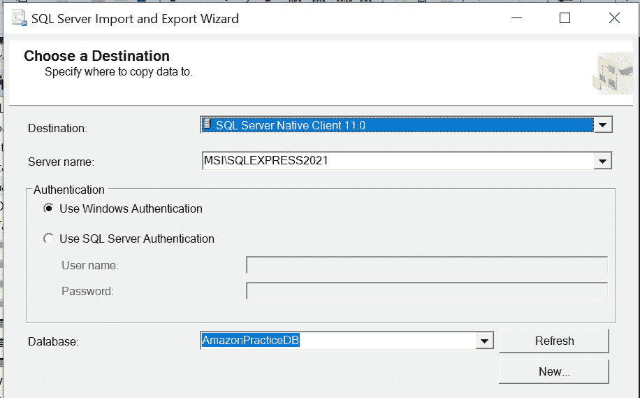
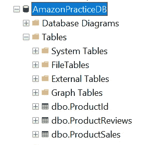
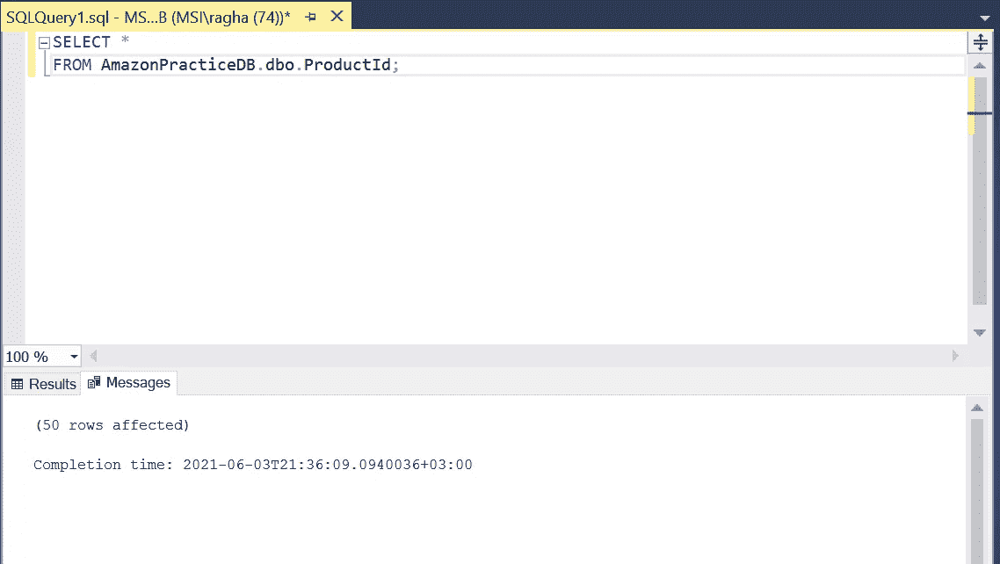
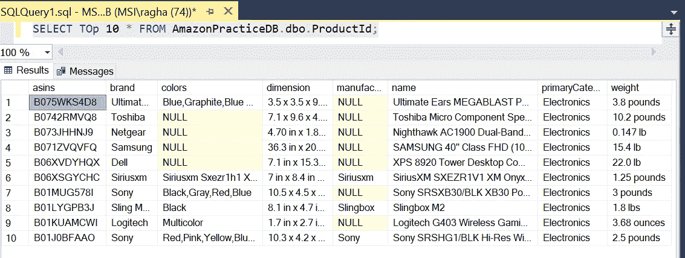
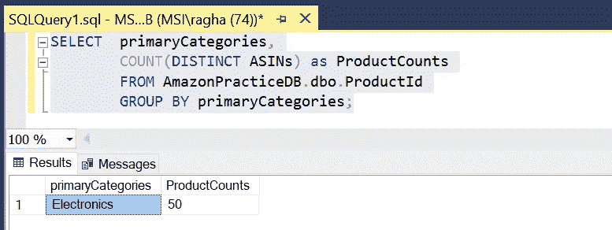
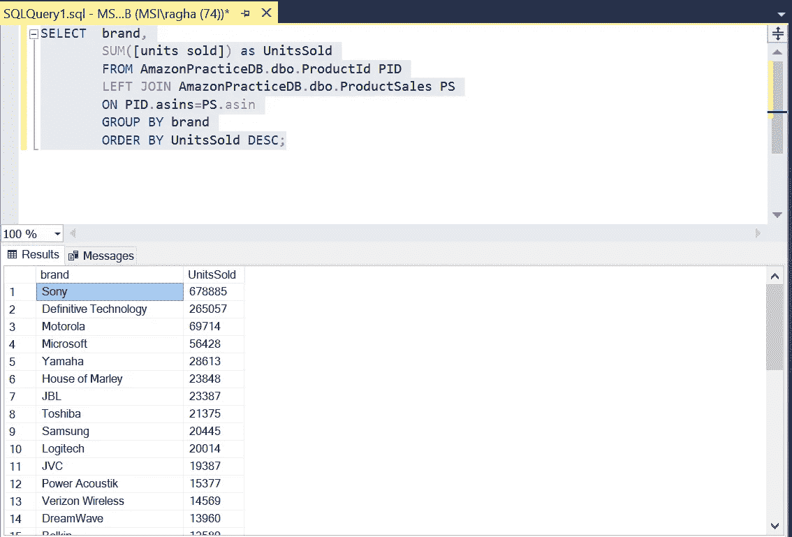

# 对本地 excel 文件运行 SQL 查询

> 原文：<https://medium.com/nerd-for-tech/running-sql-queries-on-local-excel-files-2233f41dcb4c?source=collection_archive---------7----------------------->

> 在工作时，我常常想，是否有一种方法可以从平面文件或本地 excel 文件中创建数据库，并对它们执行查询操作。经过一番探索后，我想出了一个方法，我们可以这样做，并想到记录和分享给任何人寻找同样的东西。

卡斯帕·卡米尔·鲁宾在 [Unsplash](https://unsplash.com?utm_source=medium&utm_medium=referral) 上的照片

这篇文章的结构如下，我将详细介绍:

1.  我们将使用的数据
2.  我们将使用的工具
3.  将数据导入数据库的过程
4.  启动查询控制台
5.  查询数据库和表

# 关于数据

在这里，我使用了亚马逊的评论和销售数据，这些数据是我从以下地方创建的:
**1。点评数据:** [亚马逊和百思买电子—数据集由 data initi | data . world](https://data.world/datafiniti/amazon-and-best-buy-electronics)
**2。销售数据:** [Mockaroo —随机数据生成器和 API 模仿工具| JSON / CSV / SQL / Excel](https://www.mockaroo.com/)

从这些资源，我能够创建 3 个 excel 平面文件，我将导入到 SSMS 和查询它们。
文件的简要描述:
**1。ProductIdTable:** 有 50 种产品的 ASIN 级别数据。
②**。ProductReviews:** 有 ASINs 的评论数据以及每个产品评论被查看的时间。
**3。ProductSales:** 有 ASINs 的销售数据。

# 关于工具

我在这个练习中使用了 windows 上的**SQL Server Management Studio(SSMS)**和 **SQL Server 2019 配置**。对于您可以跟随此视频的设置过程，它向您展示了一步一步的设置过程:[如何在 Windows 10 中安装和配置 Sql Server 2019](https://www.youtube.com/watch?v=3o2xvWoNBIA&t=368s)*——(请喜欢视频并订阅频道)*

# 关于将 excel 文件作为表格导入数据库

SSMS 启动并运行后，我们可以继续上传文件，请遵循以下流程:

1.  登录 **SSMS** 并连接到您本地的 **SQL 服务器**。

我将 SQL server 设置为“SQL EXPRESS 2021 ”,因此将连接到该服务器。

2.在对象浏览器中，右键点击**“Databases”**，选择**“新建数据库……”**，将打开**新建数据库对话框**，然后命名数据库，点击**“确定”**。

我已经将这个数据库命名为“AmazonPracticeDB ”,并且没有添加任何文件，我们稍后会添加。

3.您会注意到数据库已经在对象资源管理器中创建好了。现在，我们将把表添加到数据库中。为此，我们需要右键单击数据库，并转到**任务>导入数据**，这将打开 **SQL Server 导入**和**导出向导**。

在**数据源下拉菜单**中，您必须选择 **Microsoft Excel** ，这将允许您浏览并选择您想要**导入**的 Excel 文件。点击下一步。

这基本上就像你的进口来源。

接下来，您需要选择**目标源**，它应该设置为**“SQL Server Native Client 11.0”**。点击下一步。

注意，数据库选择是我之前创建的 AmazonPracticeDB，表明导入的文件将作为这个 DB 中的一个表。

在**导入**三个数据集后，我们可以看到它们在我们创建的**Amazon pricedb**下显示为表格。

您也可以右键单击这些表来重命名它们。

# 关于访问查询控制台。

完成上述所有步骤后，我们终于可以开始从数据库和表中进行查询了。点击**“新查询”**，将打开查询选项卡，您可以从这里开始。

在结果选项卡中，您可以看到结果或错误(如果有)。

# 让我们做一些示例查询！

我将从拉动产品表的**前几行**开始。

产品表中似乎有 8 列。

让我们来看看表中可用的 asin 的分类计数**。**

似乎只有一个类别(电子产品)有 50 种不同的 ASINs。

让我们将产品表与销售表连接起来，并查看**品牌明智销售**。

正如我们所见，索尼和权威技术似乎有最大的销量。

# 结束语和资源。

我希望这对于那些试图学习自己查询他们熟悉的数据的人有所帮助，因为我知道在在线 ide 上工作有时感觉就像只是编辑预先编写的查询，几乎没有留给实验的空间。

我将在下面链接一些非常棒的**资源**，在那里你可以学习 **SQL，也可以练习在线查询**。

[SQL 教程(w3schools.com)](https://www.w3schools.com/sql/)
[SQLZOO](https://sqlzoo.net/)
[SQL 数据探索— YouTube](https://www.youtube.com/watch?v=qfyynHBFOsM) *(这是我了解导入过程的来源—请喜欢视频并订阅频道，这是一个非常好的地方，有很多好的内容)*

请继续关注下一部分，我将深入分析一些复杂的查询，并希望从数据中获得一些有趣的东西。