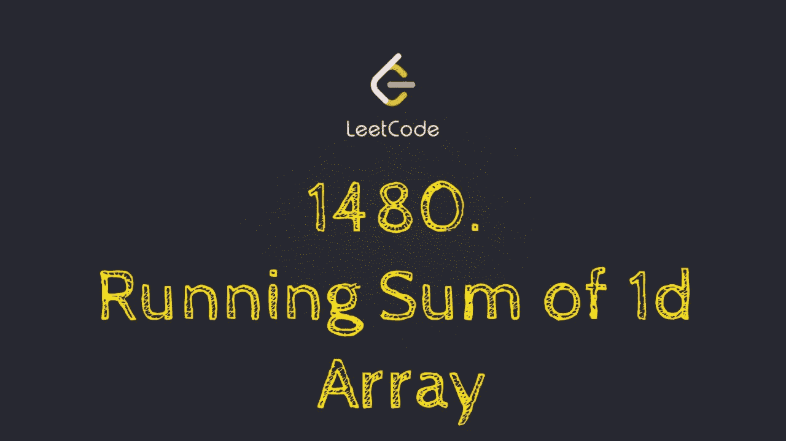
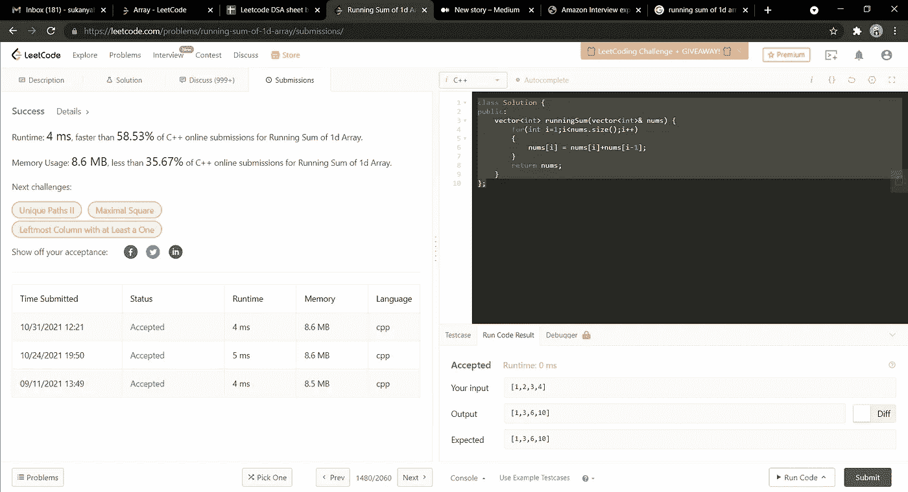

# 一维数组的运行总和

> 原文：<https://medium.com/nerd-for-tech/running-sum-of-1d-array-45f50fcaca7b?source=collection_archive---------3----------------------->

(LeetCode Easy 问题的解决方案)



给定一个数组`nums`。我们将数组的运行总和定义为`runningSum[i] = sum(nums[0]…nums[i])`。

归还`nums`的流水账。

**例 1:**

```
**Input:** nums = [1,2,3,4]
**Output:** [1,3,6,10]
**Explanation:** Running sum is obtained as follows: [1, 1+2, 1+2+3, 1+2+3+4].
```

**例二:**

```
**Input:** nums = [1,1,1,1,1]
**Output:** [1,2,3,4,5]
**Explanation:** Running sum is obtained as follows: [1, 1+1, 1+1+1, 1+1+1+1, 1+1+1+1+1].
```

**例 3:**

```
**Input:** nums = [3,1,2,10,1]
**Output:** [3,4,6,16,17]
```

**约束:**

*   `1 <= nums.length <= 1000`
*   `-10^6 <= nums[i] <= 10^6`

这是一个简单的优化方法。这里的**时间复杂度**为 **O(n)** 空间复杂度**为 **O(1)** 。**

在这种情况下，我们只需遍历向量，并通过向向量中添加前一个元素来不断更新元素，这让我们在一个示例的帮助下更好地理解这种方法。

```
nums = [1,2,3,4]
Now nums[1] = nums[1] + nums[0] = 1 + 2 =  3
**nums = [1,3,3,4]**Now nums[2] = nums[2] + nums[1] = 3 + 3 = 6
**nums = [1,3,6,4]**Now nums[3] = nums[3] + nums[2] = 6 + 4 = 10
**nums = [1,3,6,10] which is the required answer.** **class Solution {
public:
    vector<int> runningSum(vector<int>& nums) {
        for(int i=1;i<nums.size();i++)
        {
            nums[i] = nums[i]+nums[i-1];
        }
        return nums;
    }
};**
```



希望这有所帮助！坚持编码，保持一致！！🙌💻

既然你喜欢看我的博客，为什么不请我喝杯咖啡，支持我的工作呢！！[https://www.buymeacoffee.com/sukanyabharati](https://www.buymeacoffee.com/sukanyabharati)☕