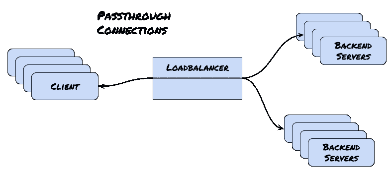

# 拉斯特和 AF _ XDP；又一次负载平衡冒险

> 原文：<https://medium.com/nerd-for-tech/rust-and-af-xdp-another-load-balancing-adventure-42aab450453e?source=collection_archive---------4----------------------->

我之前写了一个通用的网络负载均衡器，我称之为 [Convey](https://github.com/bparli/convey/tree/feature/xdp) 。虽然最初的意图并不是要让这个系列持续下去，但它变成了一个有趣的项目来继续进行黑客攻击，所以我们来了；[第 1 部分](/@bparli/adventures-in-rust-and-load-balancers-73a0bc61a192)和[第 2 部分](/@bparli/more-rust-and-load-balancer-adventures-fad07f4fb095)供参考。

以前的直通负载平衡实现相当快，但是严重依赖 Linux 内核进行数据包转发；所以还有很大的提升空间。随着 eBPF 和 XDP 越来越受欢迎，我决定重新投入进来，试图挤出更多的吞吐量。在许多情况下，团队决定完全绕过内核，在用户空间执行所有网络功能(例如 [DPDK](https://www.dpdk.org/) 和 [Netmap](https://github.com/luigirizzo/netmap) )。做得好，这将是非常快的。当然，问题是我们的用户空间程序需要处理内核网络栈通常从我们这里提取的所有东西。最近的内核(从 4.8 开始)已经很好地平衡了这个问题；XDP。

# 为什么是 XDP AF

AF_XDP 如何适应这个负载平衡器项目？回想一下，在直通负载平衡中，客户端的 TCP 会话不会在负载平衡器处终止。相反，数据包被处理、操纵并转发到后端服务器，在那里进行 TCP 握手。负载平衡器需要内部 bookeeping 来跟踪和管理通过的连接，但是从客户端的角度来看，所有的通信仍然与负载平衡器进行。这有时被称为第 4 层交换。



在以前的 Convey 实现中，数据包实际上是在负载均衡器(第 2 层)中被嗅探、处理，然后通过原始套接字转发出去(设置了 [IP_HDRINCL](https://www.man7.org/linux/man-pages/man7/raw.7.html) 选项)。用户空间负载平衡程序在 TCP 和 IP 报头中设置适当的字段。然而，要让它工作起来，需要一些 iptables 设置，这感觉有点不太好。一个更干净、更高效的实现实际上会完全绕过内核网络堆栈，但只针对我们真正关心的流量。

理想情况下，我们可以在内核空间过滤流量，只将我们感兴趣的内容传递给我们的用户空间负载平衡程序。内核仍然可以可靠地处理任何其他事情。

# XDP(快速数据路径)和 XDP 航空公司

XDP 背后的想法是将包处理程序安装到内核中；这些程序将为每个到达的数据包执行。因为我们在内核中，所以 XDP 的编程语言是 eBPF(扩展的 Berkeley 包过滤器)；先前定义(和加载)的 eBPF 程序决定分组处理(即正常传递到内核网络栈，丢弃、中止或发送到用户空间程序)。在中断处理之后，但是(理想情况下)在网络堆栈本身所需的任何内存分配(即 [SKB 分配](http://vger.kernel.org/~davem/skb_data.html))之前，在 NIC(网络接口)驱动程序中设置钩子。事实证明，跳过 SKB 分配非常有效，因为它是对每个数据包执行的一项非常昂贵的操作。因此，我们的 eBPF 程序在包生命周期的早期执行，甚至在内核可以对包本身进行操作之前(例如，没有 tcpdump 或 qdiscs)。欲了解 eBPF 的更多背景信息，请查阅[优秀纤毛参考文献](https://docs.cilium.io/en/latest/bpf/)。

XDP/eBPF 计划可以附加到几个不同的点上。最好的选择是在内核分配 SKB 之前挂接设备驱动程序。这被称为*原生*模式，但是问题是你的驱动需要明确支持这个模式([驱动支持列表](https://github.com/xdp-project/xdp-project/blob/master/areas/drivers/README.org))。回退选项是在*通用*模式下运行；这里 XDP 钩子是从[*netif _ receive _ skb()*](https://github.com/torvalds/linux/blob/master/net/core/dev.c#L5281)*调用的，它发生在分组 skb 分配之后；结果，我们不幸失去了大部分性能优势。但至少我们仍然可以使用通用模式开发和测试我们的程序，而不需要特殊的驱动程序。*

*当 XDP 程序处理完数据包时，它应该返回以下 XDP 操作之一:*

*   ***XDP _ 传递**:让数据包继续进入内核网络堆栈*
*   ***XDP _ 掉包**:默默掉包*
*   ***XDP _ 中止**:丢弃跟踪点异常的数据包*
*   ***XDP_TX** :将数据包反弹回它到达的同一个网卡*
*   ***XDP _ 重定向**:通过 AF_XDP 地址族将数据包重定向到另一个网卡或用户空间套接字*

*拼图的最后一块是 AF_XDP。一个重要的区别是 XDP 本身并不能满足我们的需求，因为它并不意味着是一个内核旁路设施。正如优秀的 [xdp 教程所指出的](https://github.com/xdp-project/xdp-tutorial/tree/master/advanced03-AF_XDP) XDP 是一个内核快速通道，它在原始帧到达普通的 Linux 内核网络堆栈之前对其进行“内联”操作。纯 XDP 并不意味着将帧传递到用户空间。这就是 XDP 航空公司的切入点。AF_XDP 是一个新的地址系列，针对高性能数据包处理进行了优化。XDP 程序通常使用 *bpf_redirect_map()* 助手函数将入口帧重定向到其他支持 XDP 的网络设备，而 AF_XDP 套接字使 XDP 程序有可能将帧重定向(仍然使用 *bpf_redirect_map()* 助手函数)到用户空间应用程序(在我们的例子中是 Convey 负载平衡器)中的内存缓冲区(或 UMEM，更多信息请见下文)。实际上，为了将原始帧快速传递到用户空间，XDP 可以通过 XDP 重定向到一个包含 AF XDP 套接字的特殊 BPF 映射来绕过 Linux 内核网络堆栈。*

*有趣的是，AF_XDP 背后的一个基本理念可以追溯到[范·雅各布森](https://en.wikipedia.org/wiki/Van_Jacobson)关于[网络频道](https://lwn.net/Articles/169961/)的演讲。演讲的重点是创建一个无锁[通道](https://lwn.net/Articles/169961/)直接从驱动程序接收队列进入(AF_XDP)套接字。由于 AF_XDP 绕过了所有的内核队列和锁，套接字使用了无锁的单生产者和单消费者环。单个生产者环绑定到特定的 RX 队列 id。从那里 [NAPI 软中断](https://lwn.net/Articles/687617/)确保只有 1 个 CPU 处理 1 个 RX 队列 id。同样，单个消费者是单个应用程序。单个生产者/单个消费者环在很大程度上是 AF_XDP 的性能来源。问题是，任何同步都需要在用户空间中处理。当然，这将违背目的，牺牲性能；本着 Van Jacobson 的无锁通道的精神，我们将尽量保持用户空间同步最小化。*

*请加快速度*

# *使用 AF_XDP 简化直通负载平衡*

*所以理论上应该行得通，但是实际上会怎么样呢？为此，我们需要 1)编写并编译 eBPF 程序，2)将它加载到内核中(从运行在用户空间的 Convey 程序中)，3)设置 AF_XDP 套接字(也是从 Convey 程序中)。首先是一些概念，以便更好地理解实现和设置。*

## *更多有用的概念*

*   *AF_XDP 插座的 RX 和 TX 描述符环指向一个称为 UMEM 的存储区中的数据缓冲区。UMEM 是一个连续(虚拟)内存区域，分为大小相等的帧。回想一下，我们避免了每个包的内存分配。用于包的 UMEM 存储区是预先分配的，执行分配是用户空间程序的责任。*
*   *我们需要关注四种不同的振铃:填充、完成、接收和发送。所有的环都是单个生产者/单个消费者，所以如果多个进程/线程在读/写它们，用户空间应用程序需要明确的协调(但是同样，最好避免共享它们)。*
*   *环本身是基于头(生产者)/尾(消费者)的环。这意味着生产者在由 [*结构* *xdp_ring*](https://github.com/torvalds/linux/blob/ab159ac569fddf812c0a217d6dbffaa5d93ef88f/net/xdp/xsk_queue.h#L16:L26) 生产者成员指出的索引处写入数据环，并且增加生产者索引。一个消费者在由*[*struct xdp _ ring*](https://github.com/torvalds/linux/blob/ab159ac569fddf812c0a217d6dbffaa5d93ef88f/net/xdp/xsk_queue.h#L16:L26)消费者成员指出的索引处读取数据环，并且增加消费者索引。**
*   **一个 AF_XDP 是链接到单个 UMEM 的套接字(尽管一个 UMEM 可以有多个 AF_XDP 套接字，这很有用)。UMEM 有两个单生产者/单消费者环，用于在内核和用户空间应用程序之间转移 UMEM 帧的所有权。**
*   **单个消费者环从指向 UMEM 区域的环中读取描述符。**
*   **更具体地说，UMEM 使用两个环进行协调:填充和完成。与 UMEM 关联的每个 AF_XDP 套接字必须有一个 RX 队列和/或 TX 队列。因此，如果设置有四个插座(都用于发送和接收)，那么将有一个填充环、一个完成环、四个发送环和四个接收环。在填充环中:应用程序给内核一个包区域来进行 RX 填充。在完成环中，内核告诉应用程序一个包区域的 TX 已经完成(然后可以重用)。该方案用于在内核和用户空间应用程序之间转移 UMEM 包区域的所有权。**
*   **尽管许多负载平衡器和应用程序通常会随着更多的 CPU 而扩展，但是由于单个生产者/单个消费者环的语义，这种实现仅随着额外的 CPU:RX 队列对而扩展。**

**唷！记住所有这些，让我们开始实现吧。此外，更多概念细节参见[内核 AF_XDP 文档](https://www.kernel.org/doc/html/latest/networking/af_xdp.html)。**

## **eBPF 计划**

**我们首先需要编译我们自己的 bpf 程序[来加载到内核中。让我们看看发生了什么:](https://github.com/bparli/convey/tree/feature/xdp/ebpf)**

**设置 AF_XDP 套接字的映射，用于将数据包重定向到。注意这是一个特殊的 BPF 地图，专门用于 AF_XDP 插座。**

```
**struct bpf_map_def SEC("maps") xsks_map = {                        .type = BPF_MAP_TYPE_XSKMAP,                        
.key_size = sizeof(int),                        
.value_size = sizeof(int),                        
.max_entries = 64,  /* Assume netdev has no more than 64 queues */                       };**
```

**对于实际的 eBPF 计划:**

1.  **指定程序的名称，这样我们可以在以后从我们的用户空间程序中加载它。**
2.  **其中一些是 XDP 的样板。我们的函数被作为参数传递给了`xdp_md`结构。从中我们可以得到需要解析的数据块。**
3.  **设置我们要解析的网络头，从以太网头开始。必要的内核头文件和 eBPF 助手[已经被导入](https://github.com/bparli/convey/blob/feature/xdp/ebpf/af_xdp_kern.c#L3:L13)。**
4.  **从那里，我们解析以太网报头以得到 IP 报头。**
5.  **最后，我们解析到 TCP 报头。在这里，我们可以决定这是否是我们关心的流量(即，数据包的目的地是负载平衡器端口)。如果是这样，eBPF 助手函数允许验证相应的队列 id 是否绑定了一个活动的 AF_XDP 套接字(`bpf_map_lookup_elem`)，然后将数据包重定向到适当的 AF_XDP 套接字(通过`bpf_redirect_map`)。**

```
**SEC("xdp_filter_80")
int xdp_filter_prog(struct xdp_md *ctx)
{
    int index = ctx->rx_queue_index;
    void *data_end = (void *)(long)ctx->data_end;
    void *data = (void *)(long)ctx->data;
    struct ethhdr *eth;
    struct hdr_cursor nh = { .pos = data };
    struct iphdr *iph;
    struct tcphdr *tcph;
	int eth_type, ip_type;

    eth_type = parse_ethhdr(&nh, data_end, &eth);
    if (eth_type == bpf_htons(ETH_P_IP)) {
        ip_type = parse_iphdr(&nh, data_end, &iph);
        if (ip_type == IPPROTO_TCP) {
		    if (parse_tcphdr(&nh, data_end, &tcph) < 0) {
			    return XDP_ABORTED;
            }
            if (bpf_ntohs(tcph->dest)==80 ) {
                if (bpf_map_lookup_elem(&xsks_map, &index))
                    return bpf_redirect_map(&xsks_map, index, 0);
            }

            // catch ephemeral ports as well.  
            // Comment this section out for
            // runnning in DSR mode 
            if (bpf_ntohs(tcph->dest)>=33768 ) {
                if (bpf_map_lookup_elem(&xsks_map, &index))
                    return bpf_redirect_map(&xsks_map, index, 0);
            }
        }
    }

    return XDP_PASS;
}**
```

**其他的，我们简单地传递到内核网络栈(`XDP_PASS`)。这是最初的目标；过滤掉所有我们不关心的东西，让内核继续做它的事情。现在，只有我们进行负载平衡的流量会重定向到 AF_XDP 套接字另一端的用户空间程序。**

**虽然这是一个 Rust 项目，但是没有办法用 c 编写 eBPF 程序。为了构建这个对象，我简单地重用了非常有用的 [xdp-tutorial](https://github.com/xdp-project/xdp-tutorial) 中的工具。一旦设置好子模块，只需更新 eBPF 程序，运行`make`，我们就有了 eBPF 对象。**

## **自动对焦 _XDP 设置**

**现在我们已经准备好 eBPF 对象和程序以及 XSKS 映射，我们可以继续从用户空间进行设置了。我们也可以回去写 Rust 代码。首先我们需要[加载 eBPF 程序并映射](https://github.com/bparli/convey/blob/feature/xdp/src/passthrough/xdp.rs#L51)(使用 [rebpf 箱](https://github.com/rebpf/rebpf))。**

```
**libbpf::bpf_set_link_xdp_fd(&interface, Some(&bpf_fd), xdp_flags)?;let info = libbpf::bpf_obj_get_info_by_fd(&bpf_fd)?;info!("Success Loading\n XDP prog name: {}, id {} on device: {}",
  info.name()?,
  info.id(),
  interface.ifindex()
);let _bpf_map = libbpf::bpf_object__find_map_by_name(&bpf_object, map_name)?;**
```

**完成后，我们现在准备好 AF_XDP 设置。虽然 AF_XDP 是一个相对较新的发展，但已经有一个工作箱，我们可以利用；afxdp 箱负责必要的 libbpf 绑定以及许多 AF_XDP 细节。**

**我们需要专门的工作人员来接收、处理和转发数据包。在这种情况下，工作线程的数量应该对应于内核和 RX 队列对的数量(原因如上所述)。使用`ethtool -l <device_name>` 查看您的设备驱动程序中有多少 RX(或组合)队列可用。根据需要使用`ethtool -L` 进行更新。**

```
**ethtool -l eth0

Channel parameters for eth1:
Pre-set maximums:
RX:             0
TX:             0
Other:          0
Combined:       4
Current hardware settings:
RX:             0
TX:             0
Other:          0
Combined:       4**
```

**在我们讨论单个工人之前，先设置一个全局内存映射区。这实际上将被划分给每个工人，然后他们将设置自己的专用 UMEM(回想一下，我们希望避免工人之间的任何同步开销)。每个工作者还设置自己的 AF_XDP 套接字，并绑定到负载平衡器接口的特定 RX 队列(同样，每个 RX 队列只有一个套接字)。这一切都发生在这里。还有一些设置，如 ARP 缓存和学习网络路由，因为我们的用户空间程序现在负责这些细节(请记住，我们在这里是自己的，因为我们完全绕过负载平衡器定向流量的内核网络堆栈)。然而，我们仍然可以利用非常有用的`/proc`文件系统。作为参考，大多数情况发生在[这里](https://github.com/bparli/convey/blob/feature/xdp/src/passthrough/utils.rs)或者[这里](https://github.com/bparli/convey/blob/feature/xdp/src/passthrough/arp.rs)。由于这些细节不太有趣，我将跳过任何进一步的描述。**

**最后，每个工作线程都产生在一个本地线程中，并将自己固定在一个内核上。在处理循环开始之前，必须预先分配 UMEM。这里发生，与`afxdp`板条箱处理[细节](https://github.com/aterlo/afxdp-rs/blob/master/src/umem.rs#L215)(即包装*_ xsk _ ring _ prod _ _ reserve()*，*_ xsk _ ring _ prod _ _ fill _ addr()*，以及*_ xsk _ ring _ prod _ _ submit()*)*。***

## **处理循环**

**随着各种设置的完成，负载平衡处理循环现在可以开始了:**

*   **首先检查 AF_XDP 套接字的完成环，将 UMEM 帧的所有权从内核空间转移到用户空间。**
*   **接下来在 AF_XDP 插座的 RX 环上接收那批帧。**
*   **对于收到的任何一批帧，根据负载平衡器逻辑进行处理。请注意，这都是在框架本身上完成的，没有任何复制。这里发生的是(与之前类似)。**
*   **通过 AF_XDP 套接字的 TX 环转发一批处理过的数据包。**
*   **通过 AF_XDP 套接字的填充环将已处理数据包/缓冲区的所有权从用户空间转移回来。**
*   **重复**

**由于用户空间程序负责及时地将帧返回给 UMEM，因此快速的分组处理步骤尤其重要。无可否认，共享临时端口和跟踪连接状态会有一些锁定开销，但是在大多数情况下，锁是读锁，所以开销应该很小。**

# **最终注释**

**我无法得到一个支持 AF_XDP 的网络驱动程序。看起来大多数 10GB 的网卡都支持它，但是我家里没有这样的网卡。最好/最接近的选择可能是 AWS ena 驱动程序，它确实支持 XDP 和 *bpf_redirect_map* 函数，但(还)不支持 AF_XDP。一旦我能够获得一个完整的基准测试环境(作为参考的测试环境 [Cloudformation](https://gist.github.com/bparli/dfea853e23d61a431cde6de5d03c3a2d) 模板),我将更新令人印象深刻的数据。我要说的是，即使使用不支持的驱动程序运行一些快速负载测试，也会产生显著的性能提升和更少的延迟差异。**

**这个项目的 AF_XDP 特性由于需要内核 5.4 以上，所以在一个单独的分支中维护:【https://github.com/bparli/convey/tree/feature/xdp[](https://github.com/bparli/convey/tree/feature/xdp)**

**再次向 [afxdp 机箱](https://github.com/aterlo/afxdp-rs)喊话；我真的很高兴遇到这种情况。**

**我也推荐 [xdp 教程](https://github.com/xdp-project/xdp-tutorial)。**

# **参考**

**[](https://github.com/xdp-project/xdp-tutorial/tree/master/advanced03-AF_XDP) [## xdp-项目/xdp-教程

### 理解 XDP 本身并不是一个内核旁路工具是很重要的。XDP 是一个内核快速通道，即…

github.com](https://github.com/xdp-project/xdp-tutorial/tree/master/advanced03-AF_XDP)  [## AF _ XDP——Linux 内核文档

### AF_XDP 是一个为高性能数据包处理而优化的地址系列。本文件假设…

www.kernel.org](https://www.kernel.org/doc/html/latest/networking/af_xdp.html) [](/swlh/building-a-xdp-express-data-path-based-peering-router-20db4995da66) [## 构建基于 XDP(快速数据路径)的对等路由器

### 在过去的几年中，我们已经看到了加速 Linux 联网的项目和计划的增加。因为…

medium.com](/swlh/building-a-xdp-express-data-path-based-peering-router-20db4995da66)**