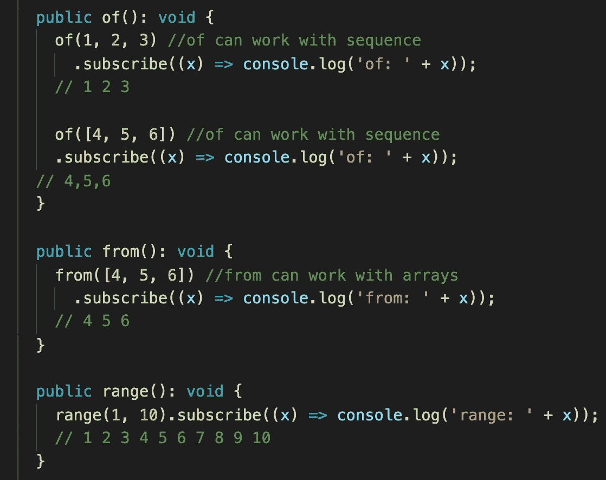
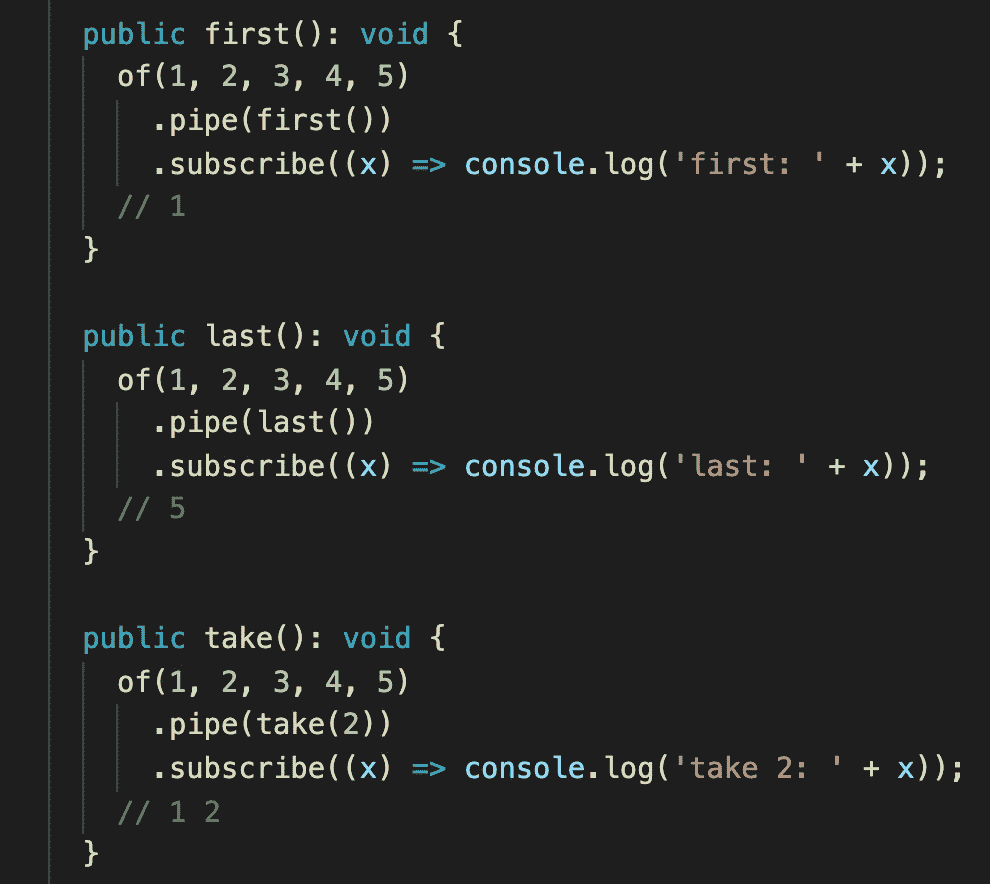
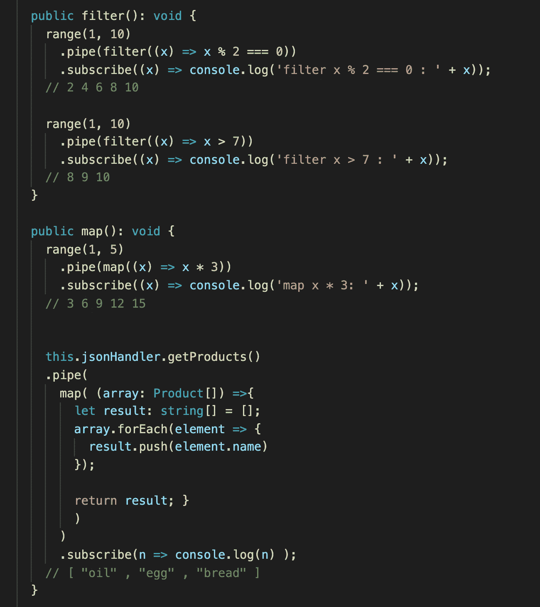
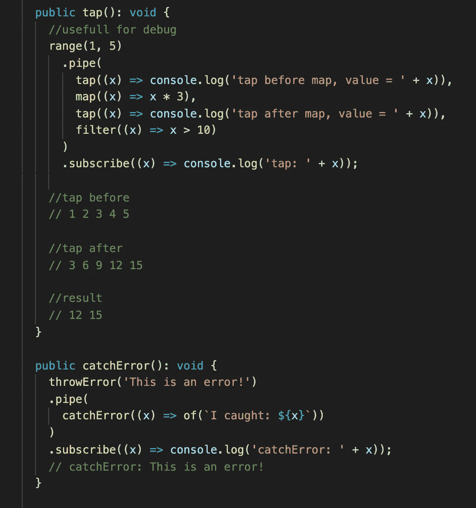
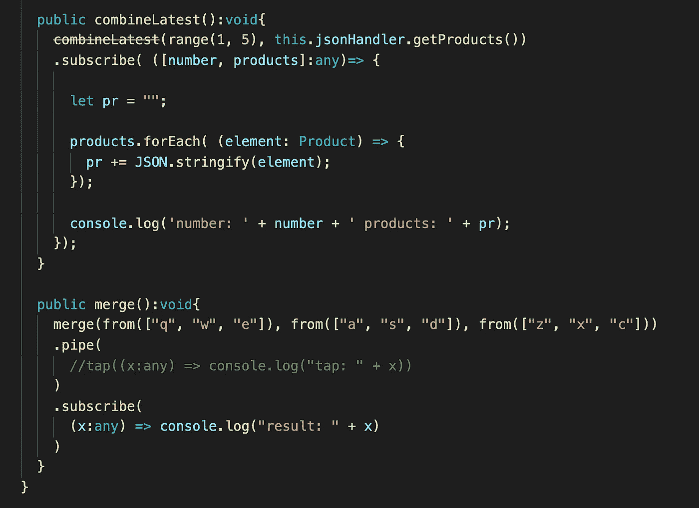
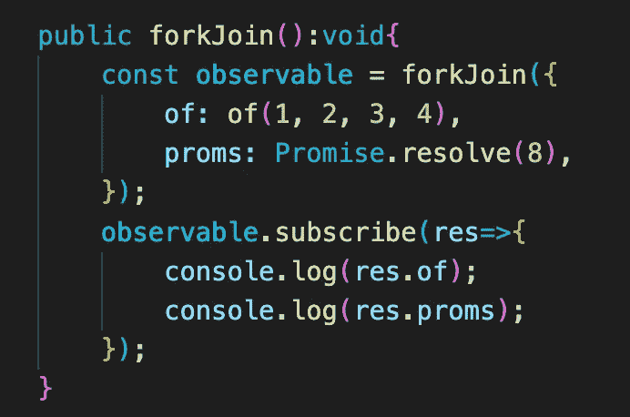

# RXJS 运算符。最常用的运算符。

> 原文：<https://medium.com/nerd-for-tech/rxjs-operators-most-common-use-operators-ba979af91a94?source=collection_archive---------11----------------------->

在本文中，我们将讨论 [RxJS](https://rxjs-dev.firebaseapp.com/) 库以及我们可以使用该库归档的内容。我将描述几个有用的 [RxJS](https://rxjs-dev.firebaseapp.com/) 操作符。在这个角度投影的例子中。

该命令将在我们的项目
*中安装 [RxJS](https://rxjs-dev.firebaseapp.com/) 库——NPM install RxJS。*

起点是的操作符**、**的操作符**和**的操作符**。使用这些运算符，我们可以创建自己的可观测量。运算符可以处理一系列对象。From 运算符可以在数组中迭代。Range 显然创造了一个范围。**

接下来是**最后一个**、**第一个**、**拿**。我们需要把这些操作符像参数一样放在管道方法中。我们可以在管道方法中放入任意多的参数。管道方法中的参数会影响结果值。在 first 的结果中，我们将只看到第一个值，last —只看到最后一个值，而在 **take** 中，我们将只看到前两个值。

在**过滤器**操作符中，我们放了一个条件，我们将看到的结果取决于这个条件。使用**映射**操作符，我们可以创建全新的结果类型或更改值。

**tap** 操作符有助于调试。我们可以把它们放在任何地方，看看价值。我们用来捕捉错误，例如，我们发出一个 HTTP 请求，如果 URL 是错误的，我们可以通过使用这个操作符来捕捉错误。

我们放置了几个观察值，只有在所有观察值都有结果或错误时，才会调用订阅。**合并**将可观测量合并成一个可观测量。

在管道中，我们可以放置任何序列的操作符。这个顺序决定了优先级。

最后一个是异步管道。使用异步管道有很多优点:当组件初始化时订阅 observable，当发出新项时返回每个发射器值，组件被标记为检查更改，当组件被销毁时取消订阅。

如果我们需要等到完成所有的观察，而不是在订阅中创建一个订阅阶梯等。我们可以使用 **forkJoin** 运算符。我们正在创建一个对象，其中每个属性都是一个可观察的或一个承诺，把它放在 forkJoin 订阅中，我们只有在有结果后才会去做。

如果你想知道更多关于 RxJS 库的细节，你应该查看官方文档。如果你需要仔细看看这个项目[，这里有链接。](https://github.com/8Tesla8/rxjs-angular)

*原载于 2021 年 5 月 22 日 http://tomorrowmeannever.wordpress.com***。**