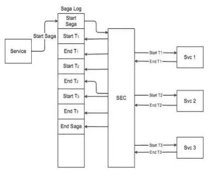
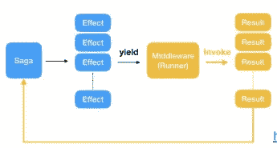
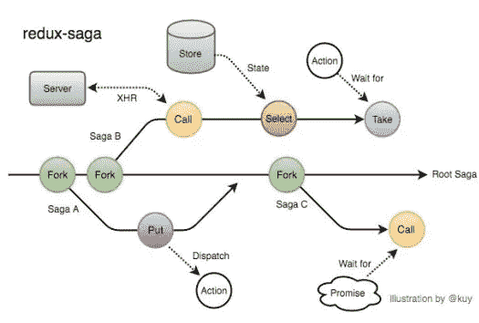
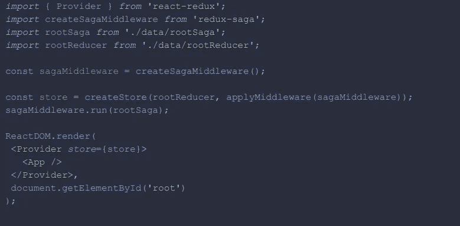
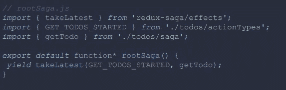
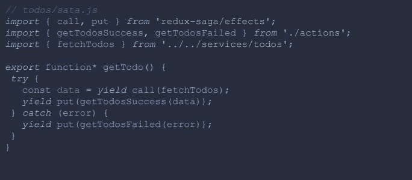

# 佐贺模式？

> 原文：<https://medium.com/nerd-for-tech/saga-pattern-971d59be3722?source=collection_archive---------0----------------------->

Redux-saga 是什么，我们为什么要用它？

Sagas 是由埃克托·加西亚-魔线和肯尼思·塞勒姆于 1987 年从普林斯顿大学引进的，所以还是比较近的概念。在讨论 redux-saga 之前，我想介绍一下术语“saga 模式”本身及其诞生的背景。

假设我们试图让你登录我们的系统。首先，我们会为您在数据库中找到用户名，并检查密码。如果都匹配，那么返回前面请求中请求的信息。我刚才解释的需要数据库事务，这种类型的事务被称为[长寿命事务](https://en.wikipedia.org/wiki/Long-lived_transaction)。但是，问题出现了！

如果我们的服务规模很大，并且有多个应用服务器在运行，那会怎么样？当第一个服务器正在工作时，其他服务器可能会进来并尝试使用当前正在处理的数据，这将导致问题。我们在操作系统中遇到过类似的术语信号量或锁，但基本上，问题是[并发控制](https://en.wikipedia.org/wiki/Concurrency_control)。

关于佐贺的图像

该模式用于处理数据库中的活事务，以便在 MSA 中处理分布式事务。基本上，saga 是一系列本地事务。

正如您在图中看到的，使用 saga 模式的服务请求可以防止副作用，并使用 saga 模式完成其工作。因此， **saga 模式**是**更新每个服务并发布消息或事件以触发下一个事务步骤的事务序列。**

现在回来才反应过来。redux-saga 是一个库，它可以轻松管理应用程序的副作用(异步数据请求、浏览器缓存、任何不纯的请求),并通过简单的测试有效地执行精确的失败日志。为此，saga 使用了 javascript 中的生成器函数。

react 中的传奇

Saga 从生成器接收产量并执行另一个功能。Saga 产生纯对象，称为包含命令的效果，中间件翻译这些命令并执行它们，将结果返回给 saga。

让我们更深入地探讨一下术语。Saga 产生称为效果的纯对象。Effect 是一个简单的 javascript 对象，包含将由中间件执行的命令。这些命令是什么？命令包括调用异步函数、向存储分派动作等动作。Redux-saga 提供了一些帮助器效果，包装内部函数，以便在一些特定的动作被分派到商店时产生任务。这就是所谓的效果创建者，使用调用，上传，我们可以创建效果。

效果创建器功能

仍然理解整个 redux-saga 是非常困难的，所以让我们看看代码和它是如何被使用的！

为了使用 redux-saga，我们只需创建一个 saga 中间件，并创建一个包含该中间件的商店。

带有 Redux 的 App.js

现在，我们创建一个根传奇，它将等待采取行动。

rootsaga.js

这个根传奇将通过从生成器获取动作并与商店通信来控制传奇模式。

todos/saga.js

这是如何行动被派遣到根佐贺。首先，对于让步调用，我们基本上是在等待一个承诺或一个功能完成。然后我们有一个 put，它基本上将一个动作分派给一个根传奇。很简单。

Saga 通过倾听动作，让开发者看到统一的结果，限制副作用。Redux-thunk 也非常有用，它允许异步调度操作，但是它们不会返回统一的结果。有时，结果是简单的物体，有时是其他的动作。佐贺作为一个倾听者，将通过限制副作用来解决这个问题。