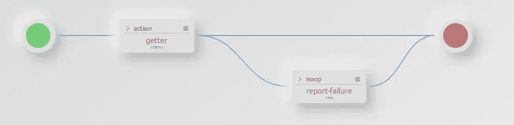
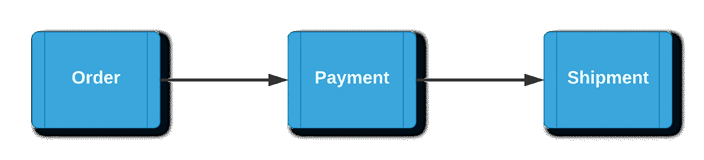
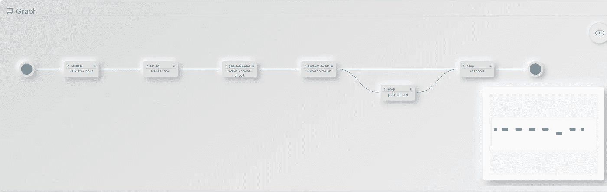
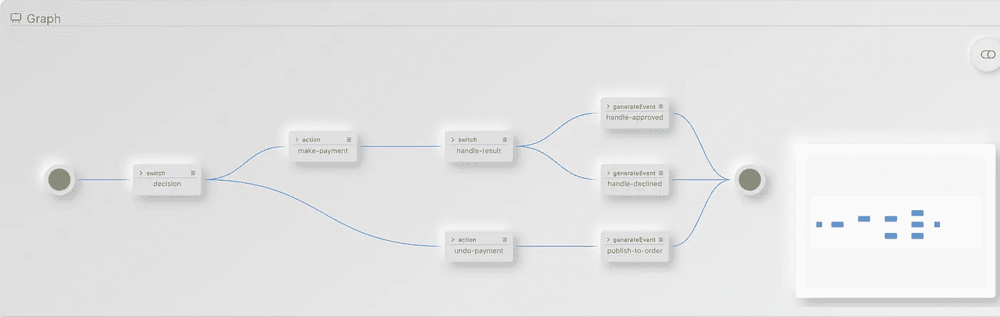
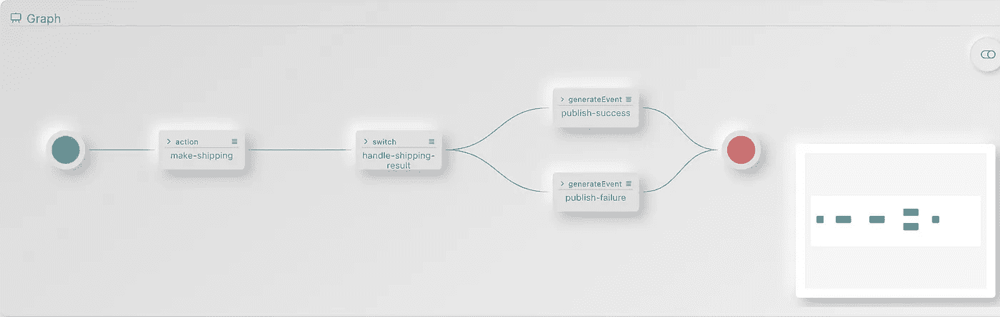

# Saga 模式:direktiv 工作流中的分布式事务

> 原文：<https://medium.com/nerd-for-tech/saga-pattern-distributed-transactions-in-direktiv-workflows-8430ef367c4?source=collection_archive---------2----------------------->

Saga 模式是微服务界流行的设计模式。它解决了分布式系统中的事务问题。这篇博文不打算详细解释这种传奇模式，因为已经有很好的解释和[例子](https://docs.microsoft.com/en-us/azure/architecture/reference-architectures/saga/saga)了。相反，它将展示如何在 [direktiv](https://github.com/vorteil/direktiv) 中实现它，这是一个基于 knative 的编排和聚合引擎。

> 完整的例子可以从 [GitHub 这里](https://github.com/wwonigkeit/saga-blog)获得！它可以完美地运行在 direktiv 的开源版本上——这里有[的](https://github.com/vorteil/direktiv)！

# 问题是

事务是数据库中使用了几十年的一个众所周知的概念。它们是一个包含一个或多个命令的工作单元，并且只能作为一个单元来完成(可以认为是全部或没有)。这确保了数据库中数据的完整性和有效性(原子性、一致性、隔离性和持久性)。

在微服务时代，后端服务采用每个微服务一个数据库的模式来实现与其他服务的独立性。这种方法需要一种策略来处理跨多个微服务的业务事务，以便为总体服务提供回滚/提交机制，从而提供数据完整性(同样…类似于数据库两阶段提交)。

有两个世家概念可以实现这一目标:

*   **编排**:通过事件的协作
*   **编排**:通过集中式编排器进行协作

## 服务和目录流之间的区别

> 问题是:我们如何在 direktiv 中实现这种模式？

理解服务和 direktiv 流之间的区别是很重要的。Direktiv 是一个编排和聚合引擎，它管理流中涉及的容器以及流本身。

一个流可以包含多个函数，这相当于服务，并提供条件语句、错误处理和重试。

> **一个流基本上可以充当一个或多个服务的编排者。**

下面的例子展示了 direktiv 中一个简单的后端服务调用。它包括一个函数，一个重试定义和错误处理。在编排传奇中，这将是 direktiv 流的单位大小；一个函数加上异常处理。

通过这种方式，传奇中的各个步骤可以交换事件，并对即将到来的事件做出反应。

简单的 direktiv 流

流程的配置如下所示:

# 构建简单的流程

让我们尝试使用我们的 Saga 模式定义在 direktiv 中构建以下流程:

从订单到发货的简单流程

# 舞蹈编排的结构

在一个编排中，涉及两种不同类型的 direktiv 流:

1.  第一个处理初始请求，并启动实际的流(或传奇)——我们称之为**发起者**
2.  第二个是实际流量(传说)或**参与者**

## 发起人(订单)

发起者的主要目的是提供一个 API 来启动、验证和响应请求。它的设计与工作流中的后续参与者不同。启动器应包括多达四种状态:

1.  *验证状态(可选状态)*
2.  *发布事件状态*
3.  *等待状态*
4.  *响应状态(可选)*

*发起方流程概述*

1.  ***验证状态(可选):***

验证状态使用 [JSON 模式](https://docs.direktiv.io/docs/specification.html#schemadefinition)来验证进入服务的 JSON。这不是强制性的，而是推荐性的。如果数据没有通过验证，服务会以错误响应。或者，它可以转换到响应状态，并向请求者返回标准化错误。

验证“订单”的状态

**2。发布事件状态:**

第二个状态是以一个事件开始传奇(在 direktiv 中，这是一个 *generateEvent* 状态)。

这种状态导致了从“订单”流程到“支付”流程的转变。这个状态向 direktiv 的事件总线发布一个 [CloudEvent](https://cloudevents.io/) 。在下面的`yaml`中，一个名为`transaction`的附加上下文属性被附加到 CloudEvent JSON 上。

这用于标识跨多个工作流参与者的事务。不需要附加唯一标识符作为上下文。

> 它也可以是数据有效载荷的一部分…只要唯一标识符存在。

***3。等待状态:***

这一步是 direktiv 中基于编舞的传奇中最重要的一步。它等待由“发布事件状态”触发的来自服务的事件，如上所述。

尽管每个状态都有一个默认的 15 分钟超时，但建议为该状态添加一个更具体的流超时，以便在出现故障或错误时提供早期反馈。

在超时的情况下，需要通知参与的流取消事件，以避免数据不一致。在上面的例子中，超时被捕获为一个错误，它转换到一个*发布-取消*状态，该状态可以向参与的流发布一个取消事件。

***4。响应状态(可选)***

Direktiv(在其核心)是一个国家机器。因此，流的默认响应是已完成的流的最后状态数据。有时为了响应请求，需要删除、添加或修改 JSON 数据。这可以在流程结束时通过简单的 *noop* 状态来实现。transform 属性使用`[jq](https://stedolan.github.io/jq/)`来改变流的返回值。

## 参与者(付款和运输)

工作流中的**参与者**需要提供一个事务和一个补偿事务，以防出错或取消。

这两个事务可以组合在一个 direktiv 流中，也可以组合在两个单独流中。在下面的例子中，我们将它分解为两个不同的流程— *付款* & *发货。*

*参与流程概述(支付)*

参与流程概述(装运)

**参与者**正在聆听最多三个事件:

*   **交易事件**:执行实际交易
*   **取消事件**:全局超时取消事件
*   **补偿事件**:从下一个流程调用补偿

这些事件在*付款*和*出货*流程的开始定义中定义:

付款流事件定义

装运流程事件定义

虽然取消事件和补偿事件是不同的事件类型，但是它们调用相同的函数来回滚事务(在上面的例子中 *undo-payment)* 。

为了处理技术错误，例如后端连接问题，函数调用使用重试和错误处理来避免不一致的状态。下面的例子确实做到了这一点，但是在正在进行的交易的回滚出错的情况下，转换到*撤销支付*状态也很重要。

为了正确处理所有状态，功能(服务)实现需要:

1.  [*等幂*](https://en.wikipedia.org/wiki/Idempotence) *:* 在重试的情况下，服务被多次调用，并且使用相同的数据。该服务需要正确处理重复的调用。通常，进入服务的数据需要一些唯一的标识符。在这个例子中，transaction-id 可以用来识别重复的请求。
2.  [*可交换的*](https://en.wikipedia.org/wiki/Commutative_property) *:* 在这个支付示例中，取消命令可能会在 *make-payment* 服务执行之前命中服务。该功能/服务需要正确处理这些情况。

调用函数后，流程需要评估函数的返回值。在 direktiv 中，这是 JSON 数据，一个切换状态将把流路由到成功或失败状态。

对于这两种结果，都需要发布事件(回滚以前的本地事务或继续工作流)。确保编排中的最后一个事件是为发起者发布一个事件(在我们的例子中是一个 *io.direktiv.order.result* 事件)是很重要的。

一旦该类型的事件出现在 direktiv 的 eventbus 中，发起者就向请求者返回响应。

# 事务发件箱

在许多关于 Saga 模式的帖子中，推荐使用[事务发件箱](https://microservices.io/patterns/data/transactional-outbox.html)来确保数据库或服务更新的可靠性或原子性。这种模式确保一旦执行了本地事务，就可靠地发布事件。

Direktiv 通过事件的*“至少一次交付”*以及 direktiv 是数据库支持的状态机这一事实来解决这个问题。尽管函数调用和事件发布发生在两种不同的状态，direktiv 确保了这两种状态的执行。

在示例中，在服务器崩溃或网络阻止事务完成的情况下，direktiv 从流程的最后一步中恢复。*这确保了事件总是被发布*。

# 结论

对于分布式事务，编排模式是一种易于使用的模式。

尽管 direktiv 通过将错误处理和事件发布外部化来消除部分复杂性，但是随着参与者数量的增加，复杂性也会增加。

因为 direktiv 在编排中为每个服务使用小型编排器，所以用 Direktiv 实现编排传奇是有意义的。

# 把所有的放在一起

下面是简单流的工作流定义:

完整订单定义工作流

完整付款定义工作流

完整的装运定义工作流