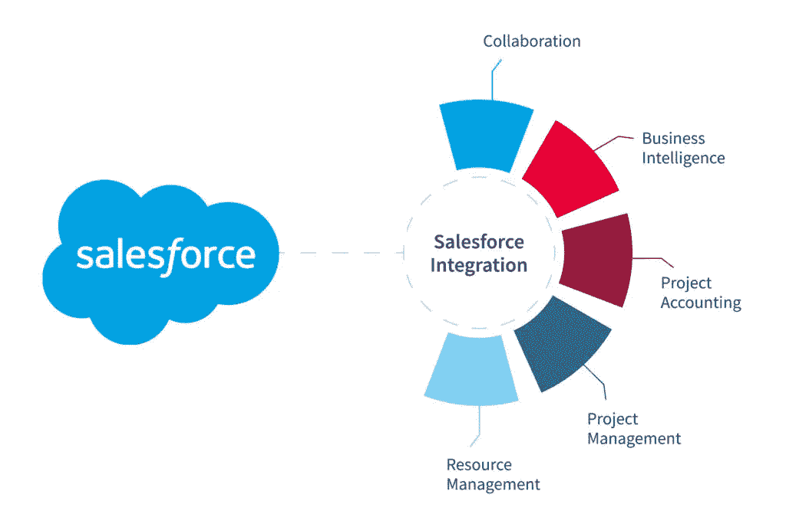
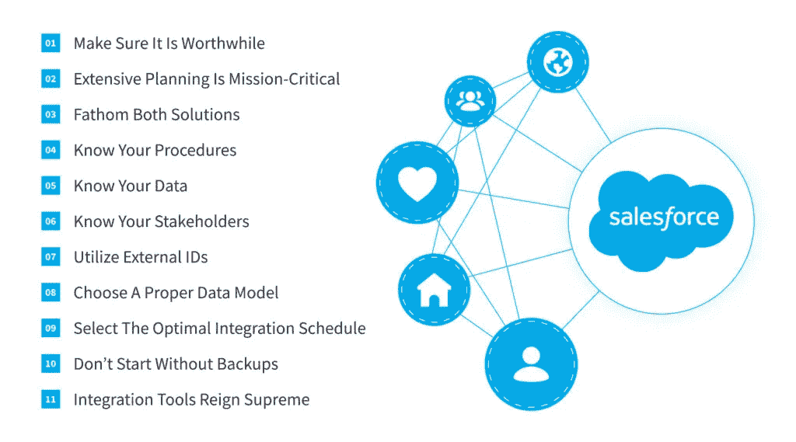
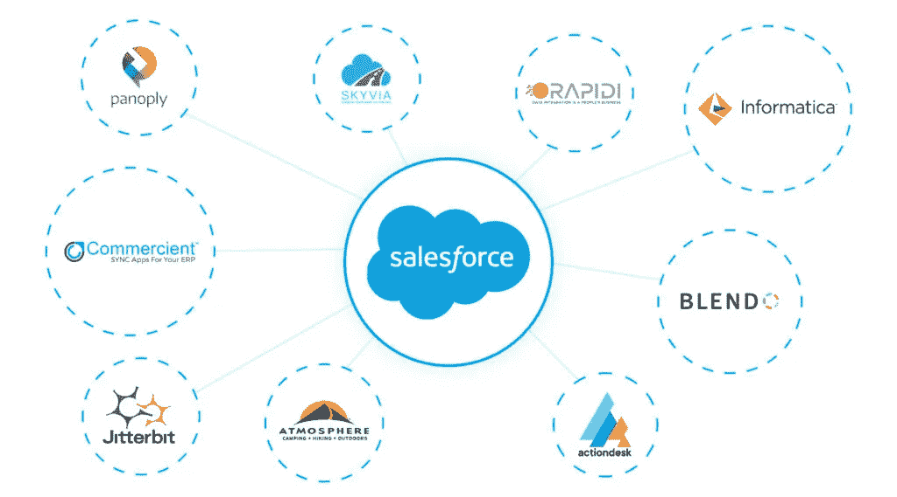

# Salesforce 集成:工具和最佳实践— NIX United

> 原文：<https://medium.com/nerd-for-tech/salesforce-integration-tools-and-best-practice-nix-united-36c412647a9a?source=collection_archive---------6----------------------->

在第三个千年的早期，商业世界已经完全电脑化了。任何有远大抱负的公司都离不开有助于简化内部工作流程和促进与客户互动的专业软件。在当今数字市场上的众多客户关系管理(CRM)系统中，Salesforce 已经在不同行业的[企业中占据了领先地位超过二十年。](https://nix-united.com/blog/crm-market-share-salesforce-bright-future-in-2020/)

这个平台给组织带来了大量的好处，但在最大程度地利用其最佳实践的方式上却提出了严峻的挑战。考虑到当代企业运营各个方面的数字化规模，这款出色的软件在管理所有客户相关流程方面非常有用，但在现实生活中很少作为独立的解决方案使用。通常，一个组织在日常工作中还会用到许多其他的 IT 产品。这就是为什么企业主应该认真考虑通过 Salesforce 集成最佳实践将它们绑定到一个环境中的主要原因。

# 什么是 Salesforce 集成？

术语“集成”预先假定将任何两个(或更多)软件的所有数据和功能合并在一起，使其用户在使用它们时享受统一的体验。因此，问题“什么是 Salesforce 集成？”很明显:它是通过 API 协调 it 和其他 it 产品之间的数据的过程，这将使公司的人员能够访问这两种解决方案的功能。

作为[集成和定制服务](https://nix-united.com/services/enterprise-it-integration-and-customization-services/)的专家，我们 NIX United 也看到了实施 Salesforce 集成的其他原因。通过将这种 CRM 与其他应用程序和平台结合，您将能够在它们之间轻松切换以执行某些操作，获得所有数据的完整可见性，无论您从哪个平台访问它们，并自动化一系列营销和销售程序。所有这些好处肯定会提高客户满意度，提高企业的生产率，从而增加其收入。

问题“什么是 Salesforce 中的集成？”因为这个过程可以用两种方法来实现:

*   应用驱动的 Salesforce 集成。名字本身就说明了一切。在这里，为了将 CRM 与其他解决方案集成，利用了专用的应用程序。一批这样的 Salesforce 集成工具提供了一个强大的集成平台，只需点击几下鼠标，即可实现 Salesforce 和其他软件之间的数据交互。
*   基于代码的销售队伍集成。在这种情况下，不使用 Salesforce 集成工具，而是使用特定的编程语言来实现集成。Apex 是一种语法与 Java 非常相似的语言。使用 Apex 进行 Salesforce 集成的主要优势包括其简单易用的特性、不同 API 版本的适用性以及对可以托管和控制该语言的 Salesforce Lightning 平台的内置支持。

实施集成的方法也有所不同:

*   批量集成。这是最简单和最常用的 Salesforce 集成技术。为了执行它，it 团队一次或分几次传输整个复杂的数据。但是，请记住，这个过程最适合处理长时间保持不变的平面文件，而移动其他文件类型可能会导致问题。
*   实时集成。在这里，数据传输是一个漫长的过程，在收集数据的过程中一直在发生。在此过程中，文件不只是被移动。它们也会被分析和转换，这是通过变更数据捕获(CDC)技术实现的。
*   实时混搭。这种方法依赖于 visual force——一个由 Salesforce 创建的用于构建自定义 ui 的框架。当您在其中构建一个时，您将能够立即访问第三方数据，不管这些文档有多少。

方式和方法的选择在很大程度上取决于受 Salesforce 集成影响的 CRM 层。

# Salesforce 集成的各个方面

CRM 有三个组件可以与其他解决方案集成:

*   UI 集成。这是最明显的一个，旨在为用户提供访问各种 app 的统一界面。为了形象化它是什么，想想脸书，那里的内容由众多代理发布在一个平台上。
*   数据整合。为了公司的成功运作，建立一个统一的数据库是至关重要的，以便授权员工可以访问他们需要的所有信息。通常，这是通过利用某些 API(例如，SOAP 或 REST)来完成的，这意味着不需要编码。
*   业务逻辑集成。当上述方法不起作用时，这是最复杂的 Salesforce 集成级别。这里，各种 Salesforce 集成工具用于处理入站(Apex Web 服务)和出站(Apex 标注)功能。

通常，公司的各个部门利用定制的解决方案来处理一些特定的领域(人力资源、财务、IT、运输等)。).这些目标软件产品中的每一个都依赖于自己的业务逻辑、安全协议、数据存储设施和 UI。此外，它们通常用不同的语言构建，并满足独特的需求。这就是为什么 Salesforce 整合是一个大胆的尝试，其实施应该非常小心。

# 成功的 Salesforce 集成:需要记住的要点

作为一家拥有超过四分之一世纪经验的经验丰富的供应商，NIX United 列出了一份清单，您应该仔细查看，以确保整合过程顺利进行。那么什么是 Salesforce 集成最佳实践呢？

# 1.确保它是值得的

在开始整合之旅之前，你应该抓住价格标签。不仅仅是你能不能负担得起，更多的是它有多大意义。您必须向自己证明 Salesforce 集成值得付出努力和费用。为此，您应该执行成本/收益分析，该分析必须考虑到您希望通过集成消除的棘手问题。如果你认为这些对你的组织的高效运作是至关重要的，并且花费是合理的，那就继续做下去。

# 2.广泛的规划是至关重要的

没有它，你的努力注定要失败。集成计划应包括要通过 Salesforce 集成实现的目标(业务和技术目标)、您将使用的技术组合、实施该计划的团队以及要遵守的时间表。绘制集成需求模板对此有很大帮助。通常，这样的模板包含数据、端点和可能的瓶颈。此外，该模板提供了一个依赖于常规框架的模式，该框架包含模式标识名称、力、上下文、问题、示例等。

# 3.理解两种解决方案

开发人员应该对他们将要集成的两个软件产品都有深刻的理解，以了解它们能在多大程度上相互配合。如果两个解决方案具有相似的数据架构，并且启用了 API，那么平滑的集成将会很容易。API 限制对于无缝集成也很重要。要回顾这些限制，您不仅应该认识到什么信息会在解决方案之间传递，而且应该选择集成类型。您还必须了解可用的配置选项，持续监控系统的身份验证，并构建一个定制的 API，以防您需要联系第三方来获取额外的数据。

# 4.了解你的程序

你应该对你要用这个软件做什么以及你期望得到什么结果有一个清晰的认识。这种意识有助于选择要使用的 Salesforce 集成工具和方法，确定数据交付的性能，并防止数据泄露。后者可以通过利用 IP 白名单来有效地实现，该白名单将限制对数据的访问，并只为授权人员引入对数据的更改。

# 5.了解您的数据

什么样的外部数据应该转移到 CRM 也是必须的，因为你必须意识到你想用它做什么。Salesforce 机制可用于扩充现有档案，自动化公司的工作流程，从使用数据分析的最佳实践中受益，或提高数据安全性。也许您的需求将排除在 Salesforce 中存储数据(如果您正在寻找围绕 Salesforce 记录的附加信息)。

无论是哪种情况，都要确保新环境对进一步的数据集成保持开放，因为你会很快习惯好的东西，一个肩膀上的羊肉会带动另一个肩膀。

# 6.了解你的利益相关者

多个数据源是一大群人的责任，他们每天都与数据源打交道，对它们的上下文了如指掌。集成团队应该准备好与许多员工互动，并在流程的所有参与者之间建立一个牢固的理解纽带。

# 7.利用外部 id

外部 ID 是一个自定义字段，包括来自其他应用程序和框架的唯一记录标识符。该机制可用于 CRM 的无限制、性能、企业和开发人员版本，极大地增强了 Salesforce 集成能力，并允许从外部来源更新系统记录。

# 8.选择合适的数据模型

复制源系统的数据结构以将其实现到新环境中并不是最好的策略。为什么？因为用户对它的需求可能会有很大的不同，以至于你最终会构建出很难被利用的功能。此外，它可能会变得不必要的复杂，所以采用更简单的架构是最佳选择。

# 9.选择最佳集成计划

在一个理想的世界里，你会执行一个双向积分，然后就到此为止。但是在现实世界中，许多因素会干扰这个完美的方案。您的组织可能有多个系统或数据，这些系统或数据在有限的时间内可用，其中一个系统不提供 API，或者您的财务资源目前有限。在这种情况下，建议从小规模开始，逐步添加应立即反映在 Salesforce 中的文件的实时更新。

# 10.没有备份不要开始

不要幻想一切从头到尾都很顺利，做好陷阱和挫折的准备。对于任何类型的问题，最好的准备是存储将要合并的每个系统的数据的备份副本。而且，只有在确保新环境能够按预期工作后，您才能删除这些副本(并禁用旧产品)。

# 11.集成工具至高无上

如果您希望您的 Salesforce 集成努力获得高质量和快速的成功，利用专业软件是必须的。但是你应该明智地选择工具。

# Salesforce 集成工具概述

根据工具提供商的不同，此类解决方案分为三类:

*   Salesforce 本机工具。Salesforce 团队确保他们的产品集包括两个旨在执行集成的解决方案——app exchange 和 MuleSoft Anypoint 平台。前者本质上是一个云市场，可以自动找到并推荐与 Salesforce 相吻合的软件。后者旨在简化软件的集成，这些软件不能吹嘘优秀的 Salesforce 兼容性。
*   app-原生工具。Salesforce 在世界范围内的流行是鼓励许多应用程序开发人员将其内置到产品集成工具中的主要原因。这包括 Mailchimp、Google Cloud、Dropbox、Outlook、Slack、QuickBooks、Hubspot、DocuSign 等等。这些工具最吸引人的地方在于它们的简单易用。一般来说，不需要编码或者复杂的 IT 任务——你只需要输入一个密码，然后在提示的指引下点击几下。
*   第三方工具。当前面两个选项都不起作用时，这些就会发挥作用。他们需要更多的努力和专业知识，但他们的范围是如此之广，你可以很容易地找到你的口味和 IT 熟练程度的东西。最受欢迎的第三方 Salesforce 集成工具有哪些？

# 1.Actiondesk

该解决方案提供了一个无代码工具来访问组织的数据，以便用户可以向其中添加结构化逻辑，并生成他们自己的报告和视图。此外，Actiondesk 的查找功能支持从多个来源收集和混合数据(自动更新)。

这个工具的主要目的是连接数据库和云应用程序。它可以与 MS SQL Server、PostgreSQL 和 Amazon Redshift 等云设施配合使用，员工可以从这些设施中将历史数据下载到他们的环境中。该工具的一个特别好处是能够选择从任何来源导出数据的频率。

# 3.Boomi 大气

Boomi 发布了几个不同功能和使用案例的版本，该工具旨在提供 SaaS 应用程序、基于云的解决方案和内部环境之间的集成。应用程序的集成是通过利用可视化界面来执行的。但是，如果您想在其他地方部署这样的集成解决方案，您将需要来自同一个供应商的另一个产品——Boomi Atom。

# 4.商业

如果您计划将 Salesforce CRM 与 ERP 系统集成并同步，Commercient 及其同步应用程序将是您的首选。您可以根据需要随时实施同步，也可以自动进行实时同步。所有这些看似复杂的操作使用这个工具都非常简单，因为你不需要掌握任何编码或映射技能，也不需要访问服务器。

# 5.吉特比特和声

该工具有助于管理端到端集成生命周期，不仅提供云、本地和混合环境功能，还提供 API 转换能力。用户最喜欢这种解决方案的地方是轻松的集成过程，它依赖于预先构建的模板，并利用了拖放配置技术。此外，由于 Jitterbit Harmony，你可以用人工智能增强你的应用程序。

# 6.信息

这是另一个利用 AI 技术(准确地说是机器学习)的软件。Informatica 产品组合的这种最先进的基础不仅提供了增强的集成功能，还提供了对许多分析选项的自助式访问。所有这些都适用于云、内部部署和混合部署。

借助 Skyvia 的数据集成工具，用户可以在其界面上从一系列场景中进行选择。他们可以从不同的来源上传/下载数据，从云中复制文件以部署在关系数据库中，并管理数据的双向同步，其中调度由任何用户自行决定。而这一切都是免费的！

如果您的组织在其核心运营中采用大数据，这款工具非常适合您。Panoply 的智能数据仓库通过一个不依赖 ETL 的集成管道提供了来自各种来源的结构化和半结构化数据的集成。它的柱状存储架构无需进一步建模或配置，并自动执行大量基于云的数据管理任务。

# 9.快速线

这是一整套云安全工具，除了它的名字，还包含 Rapidi 平台和 Rapidi Replicator。要使用它们，您不需要精通编码，因此在内部和远程团队之间同步数据变得轻而易举(即使是停机)。此外，该产品删除重复的数据条目，这使得这一套坚实的选择，任何集成事业。

# 结论

Salesforce 是一个强大的 CRM，使公司能够利用它来提高效率和增强客户的客户体验。当 Salesforce 与组织在其工作流程中采用的其他 it 产品结合使用时，其工作效率可以显著提高。由于这种整合是一项严肃的工作，因此将其委托给大联盟的专业人士是明智的。NIX United 拥有[专业技能和经验](https://nix-united.com/they-trust-us/)来实现 Salesforce 与您的企业所依赖的任何应用程序或框架的无缝集成。

*原载于 2022 年 3 月 30 日*[*【https://nix-united.com】*](https://nix-united.com/blog/a-detailed-guide-on-salesforce-integration/)*。*