# 样本容量与时间序列模型——以 ARIMA()过程为例。

> 原文：<https://medium.com/nerd-for-tech/sample-size-and-time-series-models-a-case-study-on-arima-processes-16c2afa3900d?source=collection_archive---------9----------------------->

# 目标和内容

作为常规商业科学课程的一部分，ARIMA 时间序列模型经常在计量经济学课程中教授，因此有时会被缺乏经验的数据科学家使用。

本案例研究的目的是理解简单 MA(1)模型背后的数据生成过程，并说明小样本情况下估计量的弱点。

# 结果

对于系数β= 0.3 的测试 MA(1)模型，需要至少 5000 个观测值的时间序列长度才能达到更窄的置信区间。

对预报质量的影响被评估，并主要取决于估计的系数。

# 情况

首先安装一些库:

```
#for confidence intervals and testing
library(lmtest)
#for plotting
library(ggplot2)
```

现在从流程中生成一些数据。这比使用真实世界的数据要好，因为我们知道在这个实验室设置中我们的目标是什么:50 个观察值，系数β=0.3 的简单 MA(1)模型:

```
n <- 50
beta <- 0.3
eps <- rnorm(n)
x <- vector(length = n)
x[1] <- eps[1]
for(i in 2:n){
  x[i] <- eps[i]+beta*eps[i-1]
}
```

现在，让我们进行拟合，看看用于生成数据的系数是否未被发现:

```
#do the fitting
fit <- arima(x,order=c(0,0,1),include.mean=FALSE)
coeftest(fit)
#confidence interval around it:
confint(fit, parm=c("ma1"), level=0.95)
```

系数测试的输出为:

```
z test of coefficients:Estimate Std. Error z value Pr(>|z|)
ma1  0.22259    0.15500   1.436    0.151
```

置信区间:

```
2.5 %    97.5 %
ma1 -0.08121368 0.5263858
```

经过 50 次观察后，置信区间相当宽，估计值略有偏差。让我们研究一下这种改进有多快:这个序列需要多长时间才能将置信区间紧紧包围在输入参数β=0.3 周围。

```
# generate a grid for different process lengths:
n.grid <- round(1.3^(2:40))
summary(n.grid)
n.length <- length(n.grid)
#reserve some space for the results
uppers <- vector(length = n.length)
lowers <- vector(length = n.length)
estimates <- vector(length = n.length)
counter <- 1
#iterate through the different process lengths and save the estimator
#as well as the confidence interval boundaries:
for(n in n.grid){
  #generate the data:
  eps <- rnorm(n)
  x <- vector(length = n)
  x[1] <- eps[1]
  for(i in 2:n){
    x[i] <- eps[i]+beta*eps[i-1]
  }
  fit <- arima(x,order=c(0,0,1),include.mean = FALSE)
  conf <- confint(fit, parm=c("ma1"), level=0.95)
  estimates[counter] <-  fit$coef[1]
  uppers[counter] <- conf[2]
  lowers[counter] <- conf[1]

  counter <- counter+1
}
```

现在绘制不同时间序列长度的估计量的发展表明:

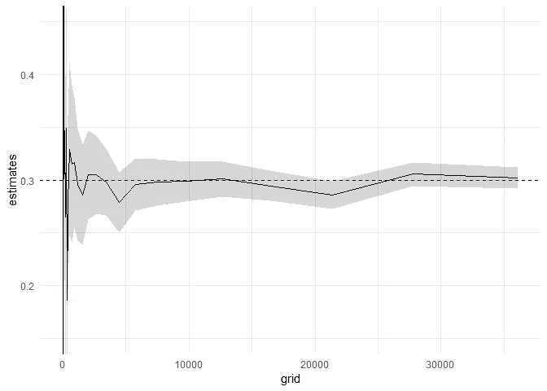

奇怪的是，大量的观察甚至没有达到“真实”值。让我们通过对具有相同数量观察值的多个估计值进行平均，来看看这是虚假的还是存在估计偏差:

```
n <- 5000
n.reps <- 2000
coeffs <- vector(length=n.reps)for(j in 1:n.reps){
  #generate the data:
  eps <- rnorm(n)
  x <- vector(length = n)
  x[1] <- eps[1]
  for(i in 2:n){
    x[i] <- eps[i]+beta*eps[i-1]
  }
  fit <- arima(x,order=c(0,0,1), include.mean = FALSE)
  coeffs[j] <- fit$coef[1]
}summary(coeffs)
```

带输出:

```
> summary(coeffs)
   Min. 1st Qu.  Median    Mean 3rd Qu.    Max. 
 0.2471  0.2909  0.3002  0.3003  0.3095  0.3441
```

因此，正如所料，对于大量重复，估计量是无偏的。

# 含义

为了得到足够紧的置信区间，观察值的数量需要很大，这重要吗？β=0.3 和β=0.35 的系数有什么区别，因为它指的是过去未观察到的随机冲击。

让我们研究一下在这些情况下的预测能力。生成一个 50，000 长的时间序列，对其应用 MA(1)过程，并创建一个 5 步预测:

```
n <- 50000
eps <- rnorm(n)
x <- vector(length = n)
x[1] <- eps[1]
for(i in 2:n){
  x[i] <- eps[i]+beta*eps[i-1]
}
#fit the MA(1) model to the process:
fit <- arima(x,order=c(0,0,1),include.mean=FALSE)
#generate the 5 step prediction:
predict(fit, n.ahead=5)
```

输出:

```
$pred
Time Series:
Start = 50001 
End = 50005 
Frequency = 1 
[1] 0.1125964 0.0000000 0.0000000 0.0000000 0.0000000$se
Time Series:
Start = 50001 
End = 50005 
Frequency = 1 
[1] 0.9961955 1.0415099 1.0415099 1.0415099 1.0415099
```

# 对不起:预测 MA 模型

奇怪的是，上述模型的预测在一个周期后中断了。让我们迅速调查一下这是怎么回事。

我们使用的最简单形式的 MA(1)模型由下式给出

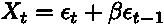

因此，一个时期的预测由下式给出

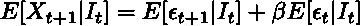

所有的预测都以过去为条件

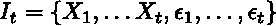

MA(p)过程的基本假设是误差项是 iid。随着

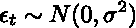

因此，

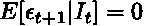

所以上式中的剩余项，

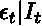

可以递归计算。因此，使用滞后操作符符号([https://en.wikipedia.org/wiki/Lag_operator](https://en.wikipedia.org/wiki/Lag_operator))重写过程描述 Xt:

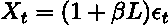

因此

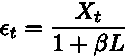

请注意，1/(1−x)=1+x+x2+x3+⋯的级数展开可以通过用 x 代替 x 来转换


因此，我们可以计算ϵt|It:

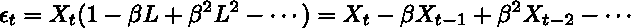

既然我们知道{Xt}的级数，我们也可以计算出未观测到的{ϵt}.级数还要注意，MA(1)过程只能预测一个步骤，因为

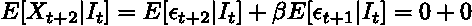

这是因为随机误差项是独立分布的。

让我们回到起点。我们这样做的原因是为了了解预测质量是否确实是预测 MA(1)模型的一个问题。在我们的具体例子中，β=0.3 和β=0.35 之间的差异可以计算如下:

```
forecast.errors <- vector(length=1000)
#construct the vector of betas
beta03.vec <- (-0.3)^(0:(n-1)) 
beta035.vec <- (-0.35)^(0:(n-1))
for(i in 1:1000){
  #one step forecast (as described above):
  X03 <- sum(beta03.vec*rev(x))*0.3
  X035 <- sum(beta035.vec*rev(x))*0.35
  #percentage error:
  forecast.errors[i] <- (X035/X03-1)^2
}
mean(sqrt(forecast.errors))
```

结果是 0.32-因此，当β的估计略有不同时，预测会偏离 32% (RMSE)。

# 外卖食品

*   MA(p)模型只能预测 p 期间。
*   尽管只估计了一个参数，但这些模型需要足够的样本量来获得窄的置信区间
*   检查置信区间宽度并调查对预测质量的影响是很重要的
*   对于经典的运筹学任务，有更好的拟合模型:通常通过调查曲线的潜在驱动因素可以更好地预测体积曲线，而不是遵循纯粹的单变量时间序列方法。