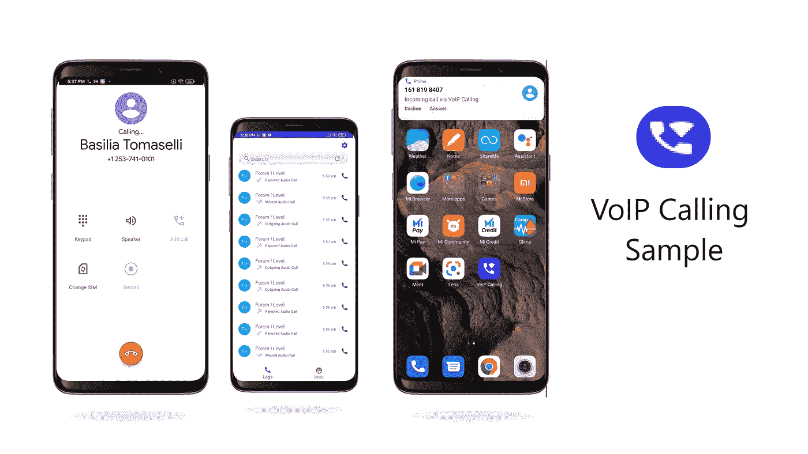

# Android 中的示例 VoIP 通话应用

> 原文：<https://medium.com/nerd-for-tech/sample-voip-calling-app-in-android-6db96d6b268b?source=collection_archive---------1----------------------->



本文描述了使用 CometChat Pro 设计和实现一个简单的 VoIP 呼叫应用程序。CometChat Pro 是 Messaging & Call SDK，它为开发人员集成聊天提供了大量功能。使用 CometChat Pro UI Kit，开发人员可以轻松地将实时消息和呼叫支持集成到他们的应用程序中。到本文结束时，您将创建一个功能完整的示例 VoIP 呼叫应用程序。

# 使用的关键组件和库

**CometChat Android UI Kit** —一个随时可用的 UI Kit 库，它将帮助我们在几分钟内开发示例应用中的实时消息传递&呼叫支持。

**Firebase** —当应用程序不在前台时，我们将使用 Firebase 推送通知来接收事件。

**ConnectionService** —一个抽象类，它将帮助你在一个示例应用中建立 VoIP 呼叫。它使用一个内置的系统 UI 来管理一个呼叫，也称为*系统管理的*。如果您希望使用自己的用户界面来管理通话，您可以使用*自我管理服务。*

# 先决条件

在深入了解更多细节之前，请确保您已经检查了以下几点。
*—您系统中安装的 Android studio。
—运行您的应用程序的 Android 设备或仿真器。*

*   我们将从从 GitHub 获取代码开始。

    您可以从[样例 VoIP 调用库](https://github.com/developerspace-samples/VoIP-Call-Sample)中**克隆**项目。

```
// Clone this repository*git clone* [https://github.com/developerspace-samples/VoIP-Call-Sample.git](https://github.com/developerspace-samples/VoIP-Call-Sample.git)
```

*   运行该应用程序需要 CometChat 帐户。

您可以在 CometChat 中创建您的帐户，并用您的帐户替换凭据。


另外，请确保在 CometChat 中设置推送通知扩展。
[请点击这里了解如何在 CometChat 中设置推送通知。](https://prodocs.cometchat.com/docs/android-extensions-enhanced-push-notification)

*   下一步是设置 Firebase 帐户并创建一个新项目。项目创建完成后，在 Firebase 项目中设置一个 Android 应用程序，并在您的“ **app** ”文件夹中添加***Google-services . JSON***文件

> [点击这里了解如何在安卓应用](https://firebase.google.com/docs/android/setup)中设置 Firebase

*   一旦上述配置完成，你就可以在 Android Studio 中打开项目了。您会发现该项目包含两个包' **app'** 这是我们的示例应用程序，而' **uiKit'** 是 CometChat 提供的库。
*   在' **app** 中，你会找到' **utils** '包，在这个包下我们有处理推送通知和 VoIP 呼叫的文件。

# PushNotificationService

它扩展了 FirebaseMessageService，后者用于处理从 Firebase 接收的推送通知。我们用它来通知当用户不活动时发送给他们的消息。我们还通过它处理呼入和呼出的电话。

**onMessageReceived() :** 每当您收到来自 firebase 的推送通知时，就会触发该方法。

**cometchathelper . processmessage()**:该方法由 CometChat SDK 提供，用于从远程消息中作为 JSON 对象接收的“ ***数据*** ”中获取 BaseMessage。

> BaseMessage 是 comet chat
> [https://docs . comet chat . io/Android/v 2.0/javadocs/com/comet chat/pro/models/base message . html](https://docs.cometchat.io/android/v2.0/javadocs/com/cometchat/pro/models/BaseMessage.html)中消息的基础模型

**initiateCallService(Call:Call)**:该方法用于每当接收到呼叫类型消息时，通过 ConnectionService 发起呼叫。

> Call 是 CometChat SDK 中使用的一类消息。[https://docs . comet chat . io/Android/v 2.0/javadocs/com/comet chat/pro/core/call . html](https://docs.cometchat.io/android/v2.0/javadocs/com/cometchat/pro/core/Call.html)

**showMessageNotification(base message:base message，title: String，alert: String) :** 该方法用于显示和处理特定用户收到的消息通知。

[点击此处获取**pushnotificationservice . kt**](https://github.com/team-developerspace/VoIP-Samples/blob/master/app/src/main/java/com/developerspace/voipcalling/utils/PushNotificationService.kt)的完整代码

# CallConnectionService

CallConnectionService 是自定义的 ConnectionService 类，它与应用程序绑定在一起以处理传入和传出的呼叫。你会在其中找到 *onCreateIncomingConnection()、onCreateOutgoingConnection()*方法。

**onCreateIncomingConnection():**每当 telecom manager . addnewincomingcall()成功接收到一个调用时，就会触发该方法。

**onCreateIncomingConnectionFailed():**每当 telecom manager . addnewincomingcall()未能接收到调用时，该方法被触发。

**onCreateOutgoingConnection()**:每当成功执行 telecomManager.placeCall()以发出外拨呼叫时，就会触发此方法。

**onCreateOutgoingConnectionFailed():**每当 telecomManager.placeCall() get 未能发出呼出呼叫时，该方法被触发。

目前，我们使用 CALL_PROVIDER 作为 ConnectionService 的功能。因此，您可以看到您的系统的本地来电和去电用户界面。如果你不想显示你自己的用户界面，你可以把它改成 SELF_MANAGED。

[**点击此处获取 callconnectionservice . kt**](https://github.com/team-developerspace/VoIP-Samples/blob/master/app/src/main/java/com/developerspace/voipcalling/utils/CallConnectionService.kt)的完整代码

# 呼叫连接

它是一个连接类，用于在用户收到呼入或呼出时启动连接。它通常帮助 ConnectionService 类处理连接请求及其回调。它包括某些方法，如 *onAnswer()、onReject()、onHold()、onDestroy()等。*每当用户收到一个来电，如果用户接受了呼叫，那么 onAnswer()将被触发。类似地，如果用户拒绝调用，那么 onReject()被触发。

**onAnswer()** :每当该方法被触发时，我们使用 *CometChat.acceptCall()* ，这将启动 CometChat 调用服务并启动调用会话。

**onReject()** :每当该方法被触发时，我们使用 *CometChat.rejectCall()* ，这将拒绝 CometChat 呼叫服务并结束呼叫会话。

**onDisconnect()** :每当呼叫的发起者在接收者接受呼叫之前结束呼叫，就会触发该方法。这将结束通话，使其成为未接来电。

[**点击此处查看 CallConnection.kt**](https://github.com/team-developerspace/VoIP-Samples/blob/master/app/src/main/java/com/developerspace/voipcalling/utils/CallConnection.kt) 的完整代码

# 调用处理程序

它是一个用于在您的应用程序中处理和集成 ConnectionService 的类。以下是您的应用程序中使用的方法。

***startIncomingCall(Call Call):***每当你需要开始一个来电的时候，都会用到这个方法。在这个方法中，您将找到*telecom manager . addnewincomingcall()*。该方法触发连接服务，并显示系统来电 UI 来处理来电。

***startOutgoingCall(Call Call):***该方法用于启动正在进行的呼叫，即每当用户试图发起呼叫时。在这个方法中，你会找到*telecom manager . place call()*。此方法代表您的应用程序拨打 VoIP 电话。

[**点击此处查看 CallHandler.kt**](https://github.com/team-developerspace/VoIP-Samples/blob/master/app/src/main/java/com/developerspace/voipcalling/utils/CallHandler.kt) 的完整代码

参考资料:

[](https://developer.android.com/reference/kotlin/android/telecom/ConnectionService) [## ConnectionService | Android 开发者

### AccessibilityServiceMagnificationController . OnMagnificationChangedListener

developer.android.com](https://developer.android.com/reference/kotlin/android/telecom/ConnectionService) [](https://firebase.google.com/docs/android/setup) [## 将 Firebase 添加到您的 Android 项目

### 安装或更新 Android Studio 至其最新版本。确保您的项目满足这些要求:目标…

firebase.google.com](https://firebase.google.com/docs/android/setup) [](https://prodocs.cometchat.com/) [## CometChat Pro 文档

### 将语音、视频和文本聊天快速添加到您的网站和移动应用程序中。

prodocs.cometchat.com](https://prodocs.cometchat.com/) [](https://firebase.google.com/docs/cloud-messaging/android/receive) [## 在 Android 应用程序| Firebase 中接收消息

### 根据接收应用程序的前台/后台状态，Firebase 通知的行为会有所不同。如果你…

firebase.google.com](https://firebase.google.com/docs/cloud-messaging/android/receive)