# 抽样分布和中心极限定理

> 原文：<https://medium.com/nerd-for-tech/sampling-distribution-and-central-limit-theorem-8da8e10c0ac3?source=collection_archive---------1----------------------->


卡森·阿里亚斯在 [Unsplash](https://unsplash.com?utm_source=medium&utm_medium=referral) 上的照片

在我们的现实世界中，我们经常搜索特定人群的参数或统计数据，如均值或标准差。但是从人口中估计这些统计数据是相当困难的。在这种情况下，我们可以从总体中收集一些随机数据或样本，并可以估计这些参数。这里，我们将选择一个特定的随机样本大小，并使用不同的试验来估计每个样本的统计量。在重复采样中，样本统计值会因样本而异。但是抽样分布的统计将非常类似于总体的实际统计。

让我们举一个简单的例子。一个班里有 50 名体重不同的学生。学生的权重如下:43，40，45，32，42，48，36，33，34，33，37，40，36，40，43，33，38，30，33，30，41，35，47，49，36，36，37，39，41，32，37，46，41，35，38，42，31，46 学生体重的实际平均值为 39，标准偏差为 5.19。

```
import pandas as pd
import numpy as np
import matplotlib.pyplot as plt
import seaborn as snspopulation = [43, 40, 45, 32, 42, 48, 36, 33, 34, 33, 37, 40, 36, 40, 43, 33, 38, 30, 33, 30, 41, 35, 47, 49, 36, 36, 37, 39, 41, 32, 37, 46, 46, 41, 35, 38, 42, 31, 46, 39, 38, 38, 48, 42, 40, 43, 44, 31, 38, 48]population.mean()
population.std()
```

但是班主任不知道上述数据，他想估计学生体重的平均值。因为他不能接近每个学生，所以他每次会随机选择 3 名学生并计算平均体重。

```
random_sample = [np.random.choice(population,3) for i in range(100000)]
```

在上面的例子中，随机抽取了 100000 个样本，样本大小为 3。这些值存储在名为 random_sample 的数组中。对于每个样本，将计算平均值并存储在名为 sample_mean 的数组中。

```
sample_mean=random_sample.mean(axis=1)
```

这些样本平均值可以绘制在直方图中，以便清楚地了解样本分布。

```
plt.hist(sample_mean, bins=100)
```

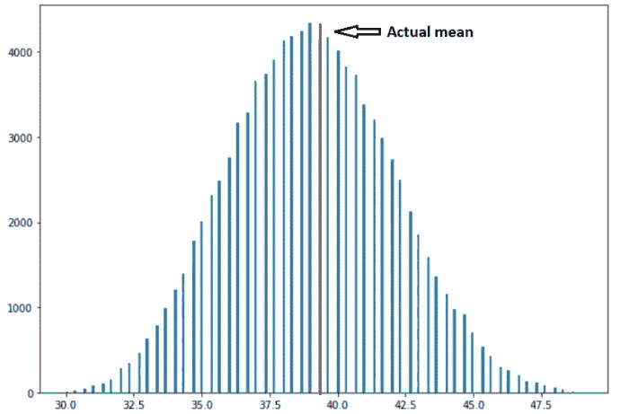

图 1:样本量为 3 时样本均值的抽样分布。(图片由作者提供)

在上图中，红线表示学生体重的实际平均值，即 39。抽样分布的样本均值非常接近总体的实际均值。

假设，我们要从一个特定的总体中随机抽取 n 个观测值的样本，其均值和标准差为σ。设 X₁，X₂，X₃,……，Xₙ是 n 个独立的观测值。如果 X_sample 表示这 n 次观察的平均值，则

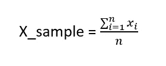

作者图片

X_sample 是代表样本平均值的样本统计量。它是一个具有概率分布的随机变量，我们可以称之为抽样分布。

抽样分布的两个主要特征是:

1.  *X _ sample 的抽样分布均值等于我们从中抽样的总体均值。*

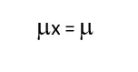

作者图片

2.*X _ sample 的抽样分布的标准偏差由:*给出

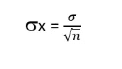

作者图片

从上面学生体重的例子中，我们看到抽样分布的平均值几乎与总体的实际平均值相同。然而，随着样本量的增加，抽样分布的标准偏差会变小。下面是同一示例的三个采样分布，样本大小分别为 2、4 和 8。

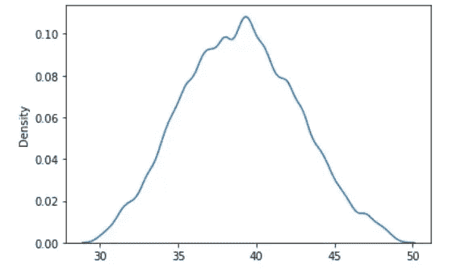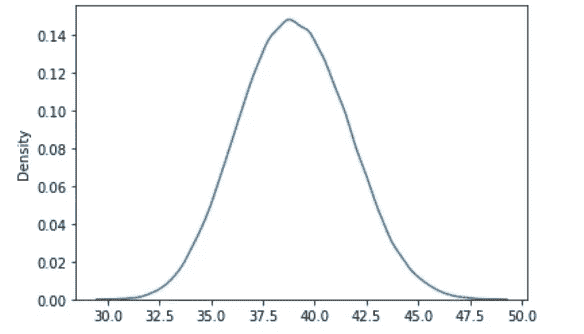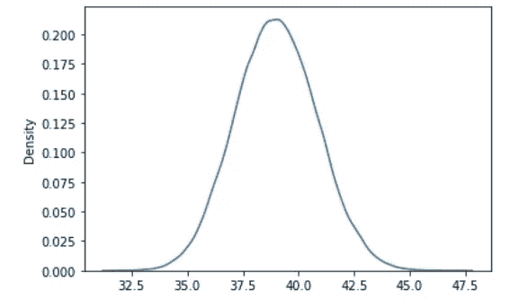

图 2:样本量分别为 2、4 和 8 的抽样分布(图片由作者提供)

从上图可以清楚地看到，随着样本量的增加，分布的平均值保持不变。但是分布的标准差变小了。

> 较小的标准差表明样本数据更能代表总体。

因此，大样本量往往能更准确地反映总体情况，因为他们的样本均值更有可能接近总体均值，这将导致较小的变化。

> 如果样本量很大，样本均值将接近实际总体均值。

# 中心极限定理；

如果我们从正态分布的总体中取样，样本均值就变成正态分布了(就像上面的例子，权重是正态分布的)。但是如果人口不正常呢？中心极限定理来了，根据它:

> **如果我们从非正态分布中取样，样本均值将呈正态分布，前提是样本量很大。换句话说，对于大样本量，样本均值将呈正态分布，而不管我们从哪个分布中取样。**

让我们举个例子来弄清楚这个定理。设 f(x) = aˣ是一个指数函数，其中 a=0.93。

```
x = list(range(1,100))
y = [(0.93)**i for i in x]
plt.plot(x,y)
```

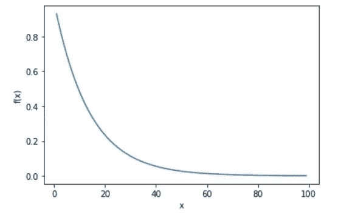

图 3 : f(x)=0.93ˣ(作者图片)

函数 f(x)的分布肯定不是正态的。现在，我们将从函数 f(x)中抽取 100000 个样本，样本大小为 3，并计算每个样本的平均值。

```
y = np.array(y)
random_sample = [np.random.choice(y,3) for i in range(100000)]
random_sample = np.array(random_sample)
sample_mean=random_sample.mean(axis=1)
```

现在，如果我们绘制样本平均值的抽样分布，我们将得到以下结果:

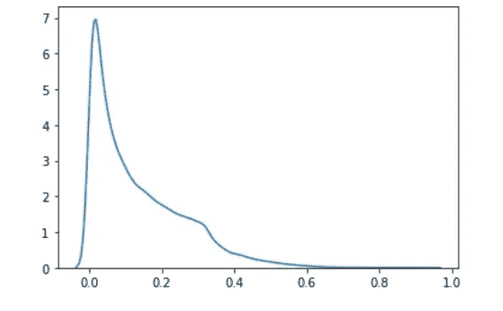

图 4:样本大小为 3 的样本分布(图片由作者提供)

接下来，我们将增加样本量，看看对分布的影响。

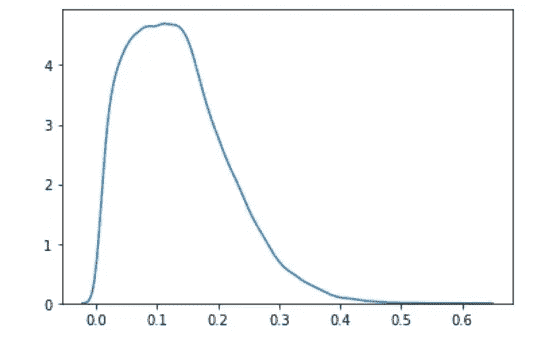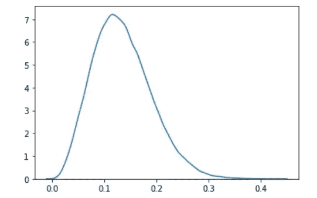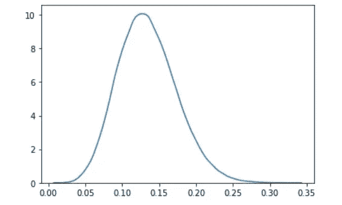

图 5:样本量分别为 7、15 和 30 的抽样分布。(图片由作者提供)

从上图中我们可以看出，随着样本量的增加，样本均值趋于正态分布，即使我们是从非正态分布的总体中取样。

> 中心极限定理说，我们可以使用基于正态分布的成熟的统计推断程序，即使我们从非正态分布中取样，只要我们有一个大的样本量。

今天到此为止。希望你们喜欢这篇文章。你可以看看我已经发表的关于统计学的文章。

1.  [可变性和扩散的测量:范围、四分位数、方差和标准偏差](/nerd-for-tech/measures-of-variability-and-spread-3a2c11cb647d)
2.  [离散概率分布:第一部分](/nerd-for-tech/discrete-probability-distribution-part-1-d8ee0fee2f57)
3.  [离散概率分布:第二部分](/nerd-for-tech/discrete-probability-distribution-part-2-ef007cb9cd29)
4.  [连续概率分布](/nerd-for-tech/continuous-probability-distribution-4255933bb454)

保持微笑。😃