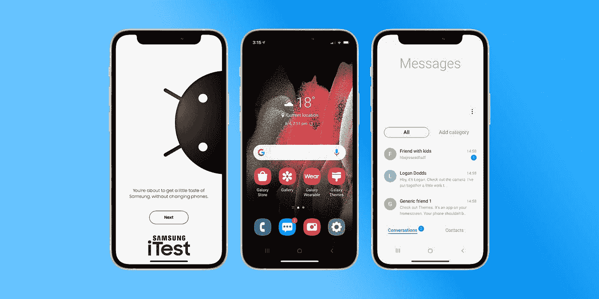

# 三星 iTest 让用户在 iPhones 上体验类似 Galaxy 的 Android 操作系统

> 原文：<https://medium.com/nerd-for-tech/samsung-itest-lets-users-experience-galaxy-like-android-os-on-iphones-c1373a2fc837?source=collection_archive---------20----------------------->

[https://9 to 5 MAC . com/WP-content/uploads/sites/6/2021/04/Samsung-itest . jpg？质量=82 &条=全部](https://9to5mac.com/wp-content/uploads/sites/6/2021/04/samsung-iTest.jpg?quality=82&strip=all)

韩国巨头三星是安卓世界最大的制造商之一。苹果是他们最大的竞争对手，他们正尽最大努力与苹果竞争。因此，三星玩得很好，试图通过推出一款网络应用将 iOS 用户转移到 Android。因此，他们宣布了一项名为 Samsung iTest 的新功能，在人们的 iPhone 上模拟类似 Android 操作系统的体验。

当用户打开 iTest 网站时，他们会在网站的主屏幕上看到一个 QR 码。扫描代码会提示用户在主屏幕上添加应用程序。一旦完成，用户可以在他们的 iPhone 上体验三星 OneUI 一样的体验。在那里，点击应用程序会进入一个模拟的 Galaxy 智能手机主屏幕，其中包含一系列应用程序和设置选项。你可以打开 Galaxy 商店，应用主题，甚至访问信息和手机应用程序。

如果你需要更多这样的内容，请继续关注。感谢您的加入。