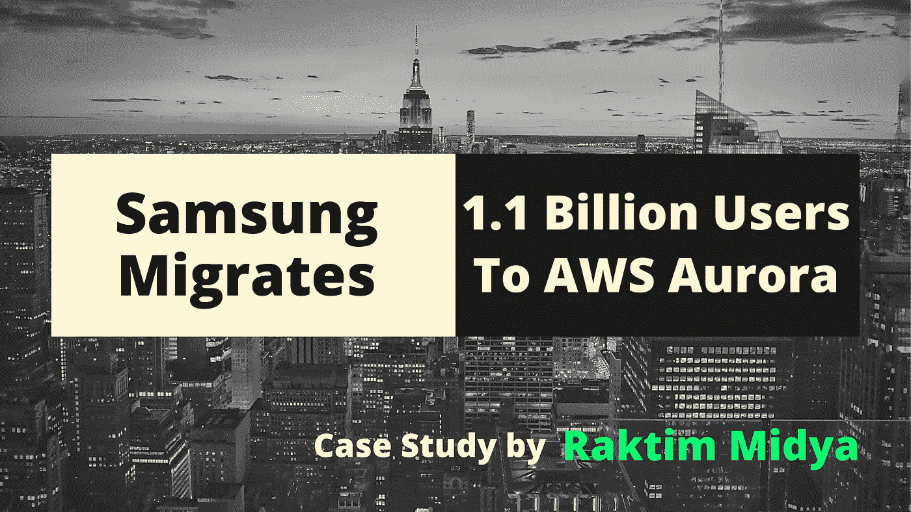
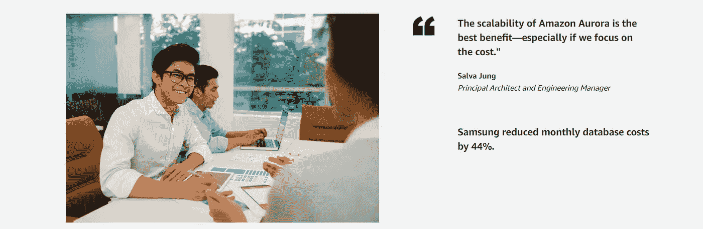
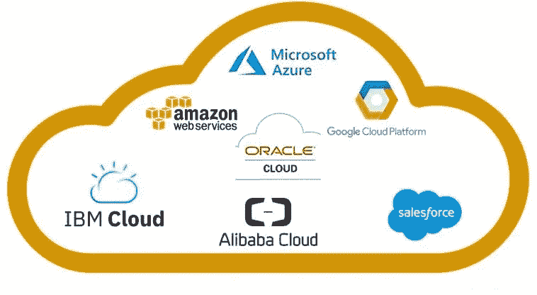
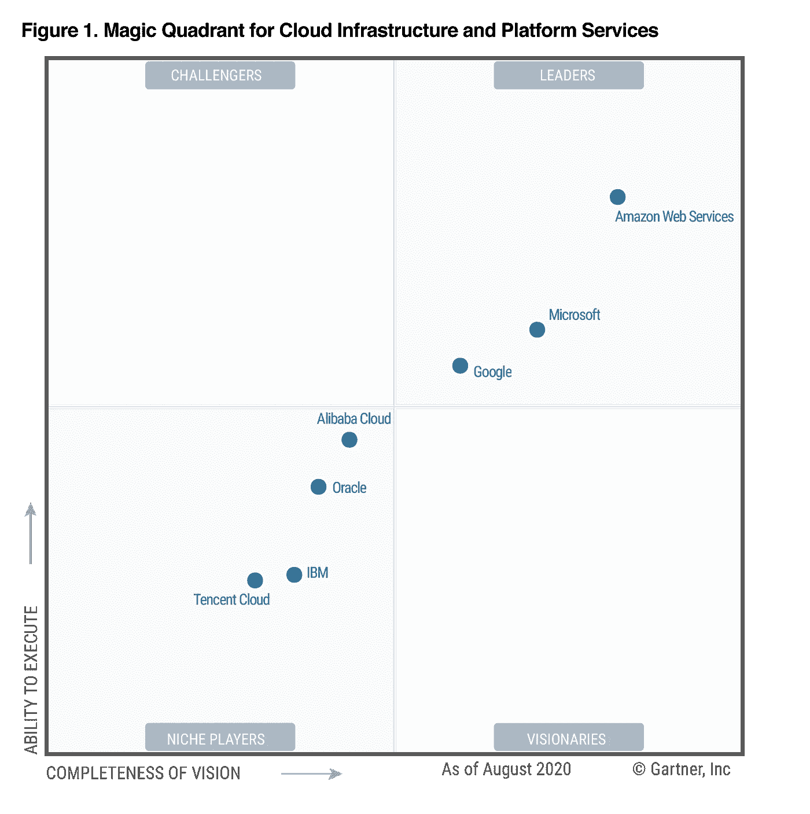
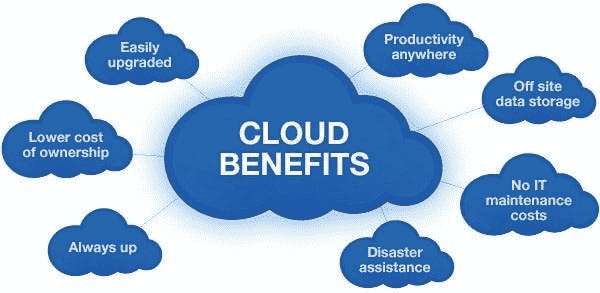
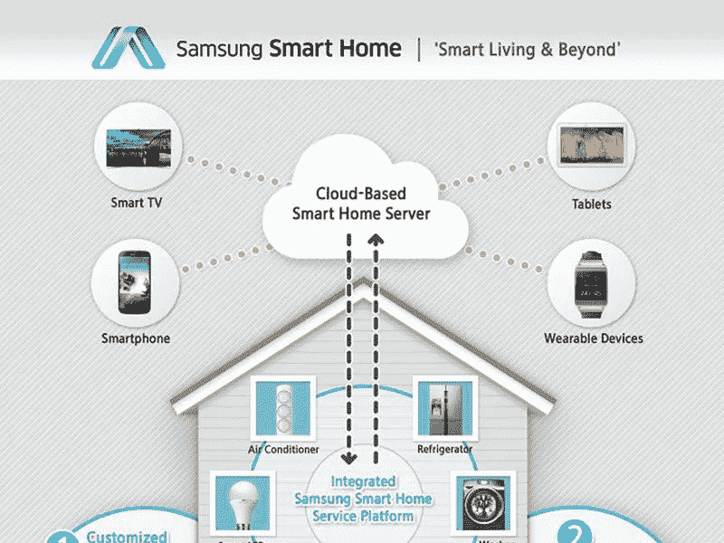
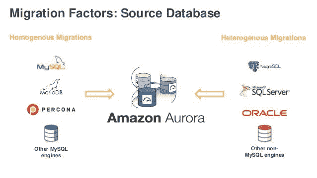
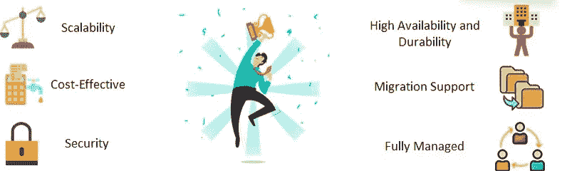

# 三星将 11 亿用户迁移到 AWS 极光:)

> 原文：<https://medium.com/nerd-for-tech/samsung-migrates-1-1-billion-users-to-aws-aurora-815bf13160ad?source=collection_archive---------0----------------------->

由 Raktim 创建

***你有没有想象过世界上最大的数据库是什么？*** 目前世界人口超过 78 亿，每天有近 50 亿人使用互联网，那么**谁在存储这么多人的数据？受欢迎的跨国公司如何能够每天为数百万甚至数十亿的顾客提供服务？**

> **让我们一起找出这些答案，并通过分析本案例研究，尝试了解谁在解决这些挑战以及他们是如何解决的……**

# “三星通过 AWS 数据库迁移服务将 11 亿用户从甲骨文迁移到亚马逊极光”

****【三星电子】是全球收入排名第二的 IT 公司，**意识到是时候将庞大的数据库从其**整体遗留的 Oracle 互联网数据中心(IDC)解决方案中移走了**。三星电子发现亚马逊网络服务(AWS)非常适合这种转变，仅在 18 个月内，**三星电子就将其全球三星账户数据迁移到了** [**亚马逊极光**](https://aws.amazon.com/rds/aurora/)**一个为云构建的兼容 MySQL 和 PostgreSQL 的关系数据库。****

> ******从 Oracle 进行的这一迁移大大降低了成本，因为 Samsung 能够摆脱本地传统数据库的限制性许可成本。随着迁移到云原生 Aurora，三星能够专注于创新，并为公司的预期增长进行定位。******

********

****来源:AWS 案例研究****

****因此，到目前为止，我们已经看到三星能够通过迁移到亚马逊 Aurora 来服务更多的客户。现在让我们试着找出我在文章开始时提出的那些问题的答案。然后，我们将再次尝试了解三星是如何让这种迁移成为可能的，以及目前他们获得了哪些好处…****

## ****世界上最大的数据库是什么？****

****在回答之前，让我们先了解一下云…****

********

****来源:谷歌****

*   ****云计算(主要是公共云)让我们能够在亚马逊 AWS、微软 Azure、谷歌 GCP 等云提供商的硬件上运行我们的应用程序。2006 年，亚马逊推出了自己的云服务，名为亚马逊网络服务(AWS ),目标是当时面临硬件成本问题的初创公司。当时这是一个非常新的概念，吸引了许多初创公司在 AWS 云上推出他们的应用程序。另外**公共云最好的部分是“随用随付”模式，这意味着只需为您使用的资源付费**。这为创业公司提供了极大的灵活性，让他们可以日复一日地赚取更多，并向公共云上的现有应用程序添加更多资源，从而实现业务的可持续增长。****
*   ****随着 AWS 根据客户和行业需求不断增加新的服务，下一次革命将会慢慢发生。**目前 AWS 中有超过 2.5k 项服务可用，世界上没有 AWS 没有采用的技术**。此外，AWS 继续在世界各地推出数据中心，这使其全球基础设施更加强大，从而为公司提供全球服务的机会。****

********

****资料来源:AWS****

******目前，AWS 是世界上最大的公共云，据 AWS 称，他们拥有无限的资源。AWS 的著名服务之一是 Amazon Aurora，这是一个完全托管的关系数据库引擎，兼容 MySQL 和 PostgreSQL。在谷歌，如果你试图找到世界上最大的数据库，那么你可能会在亚马逊极光上找到一些数据库，但这些数据库并不供公众使用。所以，最后**可供公众存储数据的最大数据库是亚马逊 Aurora。********

## ****受欢迎的跨国公司如何能够每天为数百万甚至数十亿的客户提供服务？****

*   **正如我在开始时所说的，在当今世界，每天的互联网用户是巨大的，最受欢迎的公司拥有数百万和数十亿的每日用户。**为了服务如此多的客户，所有顶级跨国公司都在使用公共云**。**
*   **因为有很多原因，很多公司在公共云上获得的设施是不可能在本地获得的。我之前讨论过**“按需付费”是公共云的最佳设施**，也是他们的**无限资源、全球基础设施、灾难恢复计划、最佳安全性、大量技术服务等。**这是当今世界几乎每个公司都在使用公共云的原因。**

****

**来源:谷歌**

*   **公共云使公司能够思考并在自己的产品和服务上投入更多的时间和资金来扩大规模，而不是在管理这些服务上投入时间。在这个公共云的世界里，最大的领导者是亚马逊网络服务，通常被称为 AWS。**

****现在让我们继续三星的案例研究……****

# **三星的用户群…**

**根据三星的报告，Samsung Account 的 11 亿用户中约有 4 亿活跃在该平台上，每秒钟约有 **8 万次请求，这使得为**提供服务变得至关重要。三星帐户是用户访问三星设备的门户。Bixby、SmartThings 和 Samsung Pay 是三星的热门服务，每天有数百万用户。**

****

**来源:谷歌+三星**

# **IDC 的问题…**

****IDC 或 Oracle 互联网数据中心是三星之前使用的解决方案。**尽管 Oracle 托管的 IDC 数据库解决方案在 10 年前建立时已经足够，但三星电子需要一个更加灵活、微服务驱动的解决方案来更好地服务于当前和未来的用户。**根据 Jung 的说法，Oracle 尚未为微服务架构做好准备，也没有合理的定价。****

> ****“基于 Oracle 的架构更难更新，因为它是一大块应用程序，因此被称为一个整体，”三星首席架构师兼工程经理 Salva Jung 解释道。**此外，在不停机的情况下纵向扩展过时的系统变得既危险又昂贵，令人担心它是否能够处理新用户和服务的规模以及他们产生的流量。“我们希望有新的技术和微服务架构来覆盖我们三星设备和服务即将到来的流量。”**通过转向 AWS，三星获得了诸如** [**亚马逊弹性计算云**](https://aws.amazon.com/ec2/) **(亚马逊 EC2)等工具，这些工具在云中提供安全、可调整大小的计算能力。****

# **三星接受迁移的挑战…**

****

**来源:越轨艺术**

**最大的挑战是这次迁移不应该中断用户持续使用的三星服务。此外，三星需要将其中央数据库分解为适合微服务和具有 PostgreSQL 兼容性的完全托管 AWS Aurora 的小部分，成为数据迁移的最佳目的地和最具成本效益的选择。**

**Aurora 最吸引人的特性之一是 Aurora 中 85–90%的 PostgreSQL 查询与现有的 Oracle 查询匹配，这意味着将查询转换为 Amazon Aurora PostgreSQL 几乎是自动的。该公司在欧盟、中国和美国这三个地区各有 2 到 4 TB 的数据要迁移。**

## **迁移开始—2018 年 10 月:**

> **三星电子于 2018 年 10 月开始在欧盟进行迁移，在 IDC 和应用程序编程接口(API)之间建立专线，作为通往 Aurora 的网关。**
> 
> ****然后** [**AWS 数据库迁移服务**](https://aws.amazon.com/dms/)**(AWS DMS)——支持数据迁移，包括 Oracle 到 Aurora 等不同数据库平台之间的异构迁移——发起数据的迁移。当数据离开 IDC 进入新家时，AWS DMS 确保源数据库保持运行，以便最终用户仍然可以照常访问 Samsung 帐户。****

****

**来源:谷歌**

> **与此同时，AWS DMS 复制了大规模异构数据库，在 3-4 天内复制了 2 或 3 TB 的用户数据，并将用户流量从 IDC 逐一路由到云。**仅用了大约 22 周，三星就过渡到了 Aurora，迁移了 4 TB 的数据并转换了近 3，000 个查询。****
> 
> **“AWS 在适当的时候为我们提供了最好的信息，”Jung 说。“AWS 有许多工具和服务来帮助迁移，AWS DMS 就是一个例子。”**

**三星在 2019 年 4 月前完成了欧盟迁移，在 2019 年 10 月前完成了中国迁移，在 2020 年 3 月前完成了美国迁移，所有迁移都实现了最短的停机时间。“我们有一些停机时间，但不多，”Jung 说。“重要的是，我们迅速发现了问题，并最大限度地减少了对用户的影响”。**

# **迁移到亚马逊极光后机会无限…**

****

**来源:谷歌**

****迁移后，三星有机会利用 Aurora 的强大功能，现在三星可以无缝扩展到 15 个 Aurora 副本******，Aurora 数据库集群中的独立端点用于扩展读取操作和提高可用性。**凭借 Aurora 的可扩展性，三星可以比以前更快地为更多用户提供服务，云解决方案的自动化也使三星能够更快地向用户提供更多功能。****

> ****钟彬娴承认，三星无法像使用旧系统那样为客户提供良好的服务。**“如果我们继续留在 IDC，我们将冒着服务器停机的风险，这将意味着三星账户系统的大量停机时间，”**他说。“一旦我们实现了迁移，我们就能够接收大量流量并提供大量服务。Aurora 的可扩展性是最大的优势，尤其是当我们关注成本时。”****

****根据三星数据库管理员 Byungyul Ko**的说法，与 Oracle 相比，该公司使用 Aurora PostgreSQL 每月节省 44%的运营成本，此外还有昂贵的 IDC 许可费和另外 22%的维护费。**有了 Aurora，三星可以按需付费，并且只为使用付费，没有前期费用或限制性许可。****

# ****三星的成就…****

********

****来源:谷歌****

****三星团队计划探索 AWS 数据库引擎如何提供更好的分析和见解。首席数据架构师 Kiheung Park 说:“我们希望今年建立数据湖。“在云中，我们有很多选择。我们可以将所有数据聚集在一个区域，这样我们就可以更好地分析用户数据。”****

****通过迁移到 Aurora，三星能够将其整体数据库架构转变为更快、更灵活、更具成本效益的解决方案，从而简化员工和最终用户的服务。这表明，没有一家公司，即使像三星这样的大公司，真正被其遗留的数据中心所束缚。云中有足够的空间，甚至更多的机会。****

*   *******注:这整个案例研究的来源你可以在这个链接中找到:***[***https://AWS . Amazon . com/solutions/case-studies/Samsung-migrates-off-Oracle-to-Amazon-aurora/***](https://aws.amazon.com/solutions/case-studies/samsung-migrates-off-oracle-to-amazon-aurora/)****

# ****最后一句话:****

*   ****我想现在你可以意识到这些初始问题的**答案是公共云。**了解到受欢迎的跨国公司如何利用公共云(尤其是 AWS 云)的力量，这也是一件好事。最后，AWS 上的大量服务如何帮助初创公司更多地参与创新。****
*   ******在接下来的几天里，我将发表大量关于云计算技术的文章，所以一定要关注我。******
*   ****这是我的 LinkedIn 个人资料链接，如果你有任何疑问，请在下面评论或在 LinkedIn 上给我发短信。****

**** [## 微软学习学生大使(Alpha) -微软学习学生大使 CEE |…

### ★我是一名技术爱好者，致力于更好地理解不同热门技术领域背后的核心概念…

www.linkedin.com](https://www.linkedin.com/in/raktim00/) 

**就这样…结束了…😊**

****