# SAP 教程:完整的 CAP Java 第 3 部分

> 原文：<https://medium.com/nerd-for-tech/sap-tutorial-complete-cap-java-3-adec221180bb?source=collection_archive---------2----------------------->

设置费奥里启动板和费奥里元素列表报告


照片由 [Unsplash](https://unsplash.com?utm_source=medium&utm_medium=referral) 上的 [Clément Hélardot](https://unsplash.com/@clemhlrdt?utm_source=medium&utm_medium=referral) 拍摄

## 内容

*   [之前:添加模拟数据、API 设置、服务 ui、创建模拟用户](https://bnheise.medium.com/sap-tutorial-complete-cap-java-part-2-217bc930857d)
*   **当前:设置费奥里发射台和费奥里元素列表报告**
*   [下一步:表格标题、列标题、隐藏字段、搜索、过滤和排序](https://bnheise.medium.com/sap-tutorial-complete-cap-java-4-6938e419f575)

欢迎阅读完整的 CAP Java 第 3 部分，在这里我将一步步向您展示如何构建 SAP 的[书店示例](https://github.com/SAP-samples/cloud-cap-samples-java)的克隆。一定要查看早期的部分，看看我们到目前为止一直在做什么，当然也要查看 [Git repo](https://github.com/toadslop/cap-java-bookstore-rebuild) 在一个地方查看所有代码。

在这一节中，我们将集中精力设置一个费奥里用户界面，包括我们自己的费奥里启动板。我们开始吧！

# 步骤 1:引导费奥里发射台

在本系列的第 2 部分中，我们在项目根目录下创建了一个名为 *app* 的文件夹，并在其中创建了一个名为*fiori.html*的文件，内容如下:

```
<!DOCTYPE html>
<html lang="en">
  <head>
    <title>Bookshop</title>
  </head>
  <body>
    <h1>Hello World</h1>
  </body>
</html>
```

让我们把这个文件变成一个费奥里发射台。首先，将这些 meta 标签添加到页面的 head 标签中:

```
<meta http-equiv="X-UA-Compatible" content="IE=edge" />
<meta http-equiv="Content-Type" content="text/html;charset=UTF-8" />
<meta name="viewport" content="width=device-width, initial-scale=1.0" />
```

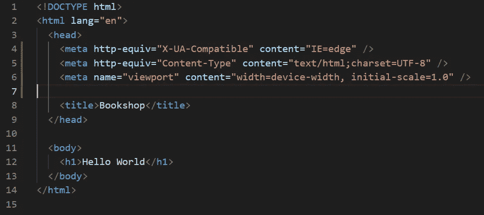

之后，添加以下两个脚本来引导费奥里 Launchpad 和 SAPUI5:

```
<script
  src="https://sapui5.hana.ondemand.com/test-resources/sap/ushell/bootstrap/sandbox.js">
</script><script
  src="https://sapui5.hana.ondemand.com/resources/sap-ui-core.js"
  data-sap-ui-libs="sap.m, sap.ushell, sap.collaboration, sap.ui.layout"
  data-sap-ui-compatVersion="edge"
  data-sap-ui-theme="sap_fiori_3"
  data-sap-ui-frameOptions="allow">
</script>
```

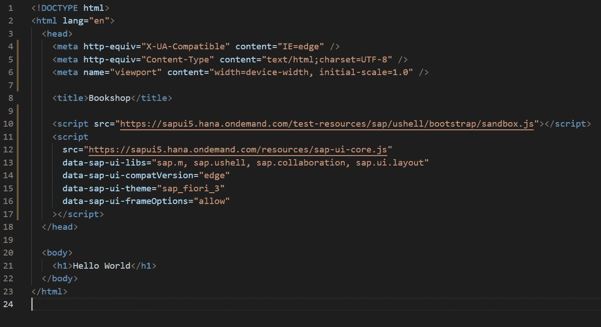

有了这两个脚本，我们的应用程序将从 SAP 的 SAPUI5 内容交付网络加载渲染我们的 UI 所需的所有文件。现在我们需要在主体中提供一个元素来接收内容，并提供一个脚本来注入内容。

首先，我们的身体元素。删除当前存在的整个 body 元素，并替换为:

```
<body class="sapUiBody" id="content"></body>
```


最后，在 head 标签的底部添加注入脚本:

```
<script>
  sap.ui
    .getCore()
    .attachInit(() =>
      sap.ushell.Container.createRenderer().placeAt("content")
    );
</script>
```

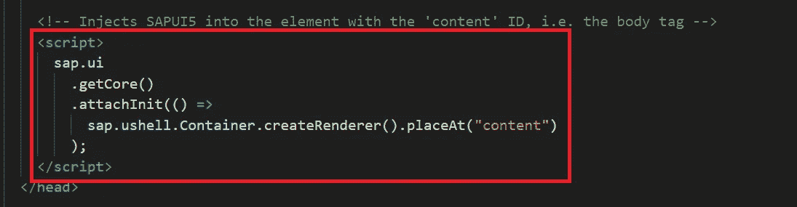

现在，启动和运行我们的 launchpad 的最后一步——我们需要一个*fiorisandboxconfig . JSON*。我们默认启动的费奥里沙盒在一个名为 *appconfig* 的文件夹中寻找它，所以让我们创建这个文件夹，并在其中创建*fiorisandboxconfig . JSON*，如下所示:

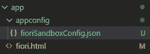

在该文件中，添加以下代码:

```
{
  "defaultRenderer": "fiori2",
  "applications": {
    "browse-books": {
      "title": "Browse Books",
      "description": "Find your favorite book",
      "additionalInformation": "SAPUI5.Component=bookshop",
      "applicationType": "URL",
      "url": "/browse/webapp",
      "navigationMode": "embedded"
    }
  }
}
```

现在尝试预订应用程序并打开[http://localhost:8080/fiori . html](http://localhost:8080/fiori.html)。您应该看到以下内容:

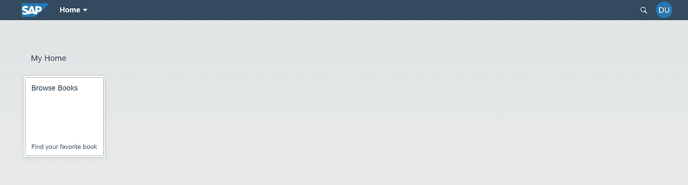

很好，是吧？在 applications 对象中，我们可以提供一个惟一的应用 id，在我们的例子中是“browse-books”。你可以随心所欲地添加这些应用，事实上，随着我们继续开发这个应用，我们还会添加更多的应用。每一个都将在 launchpad 中呈现为一个单独的图块。

在每个应用程序对象中，我们有几个要配置的属性。标题和描述是显示在图块本身上的内容。附加信息提供了该应用程序对应的 SAPUI 组件的名称。不过，我们还没有制造这个组件。接下来的两行，applicationType 和 URL 告诉应用程序在哪里可以找到应用程序组件——它在文件夹/browse/webapp 中。我们下次再做这个。

# 步骤 2:配置列表报告应用程序

如果您单击我们在上一步中制作的磁贴，将会导致一个错误，因为我们指示应用程序寻找一个尚不存在的 UI 组件。让我们继续前进并完成它。请注意，可以使用[费奥里工具](https://marketplace.visualstudio.com/items?itemName=SAPSE.sap-ux-fiori-tools-extension-pack)来生成一个费奥里元素应用程序，但我想让你更详细地了解应用程序的配置文件是如何工作的，所以在本教程中，我们将从头开始构建配置。

首先，在 *app* 文件夹中创建一个名为 *browse* 的文件夹，我们将其命名为与这个 UI 将要显示的 API 的 URL 相匹配。但是请记住，这实际上可以被命名为任何你想要的名称——它对应用程序的功能没有任何影响。为了清楚起见，我们使用这种命名约定——一个 oData API 对应一个应用程序，并且两者具有相同的名称。

在浏览文件夹中创建另一个名为 *webapp* 的文件夹。在该文件夹中创建一个名为 *Component.js* 的文件。这个文件的名称很重要，要确保它是大写的。结果应该是这样的:

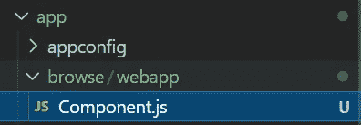

在该文件中，添加以下代码:

```
sap.ui.define(["sap/fe/core/AppComponent"], (ac) =>
  ac.extend("bookshop.Component", {
    metadata: { manifest: "json" },
  })
);
```

对于我们这些不熟悉 SAPUI5 的人来说，让我们来分析一下这里发生了什么(一定要查看 SAPUI5 文档[来了解关于这个框架的更多信息)。](https://sapui5.hana.ondemand.com/#/topic)

我们首先调用方法 [*定义*](https://sapui5.hana.ondemand.com/#/api/sap.ui/methods/sap.ui.define) (在名称空间 *sap.ui* 中)。它的目的是定义一个新的 SAPUI5 模块，在本例中是我们的费奥里元素应用程序。define 方法的第一个参数是一组 SAPUI5 依赖项。在我们的例子中，我们只有一个依赖项，AppComponent(它必须以完整的名称空间开头)。 [AppComponent](https://sapui5.hana.ondemand.com/#/api/sap.fe.core.AppComponent%23events) 是一个组件，必须对其进行扩展才能应用任何费奥里元素。下一个参数是一个匿名函数，它将依赖关系数组中的每个依赖关系按照它们被传入的顺序作为它的参数。在我们的例子中，这个函数有一个参数，AppComponent，缩写为 *ac* 。然后我们调用 AppComponent 类的[*extend*](https://sapui5.hana.ondemand.com/#/api/sap.fe.core.AppComponent%23methods/sap.fe.core.AppComponent.extend)*方法，该方法的第一个参数是一个字符串，我们的组件的名称，第二个参数是一个对象，它包含组件的配置。我们传入的对象只是告诉组件在一个名为 *manifest.json，*的文件中查找它的配置(元数据)，我们接下来将制作这个文件。*

*在与 Component.js 相同的文件夹中创建 *manifest.json* ，并添加以下代码:*

```
*{
 "_version": "1.8.0",
 "sap.app": {
  "id": "bookshop",
  "type": "application",
  "title": "Browse Books",
  "description": "Find your favorite book",
  "dataSources": {
   "CatalogService": {
    "uri": "/api/browse/",
    "type": "OData",
    "settings": {
     "odataVersion": "4.0"
    }
   }
  }
 },
 "sap.ui5": {
  "dependencies": {
   "libs": {
    "sap.fe.templates": {}
   }
  },
  "models": {
   "": {
    "dataSource": "CatalogService",
    "settings": {
     "synchronizationMode": "None",
     "operationMode": "Server",
     "autoExpandSelect": true,
     "earlyRequests": true,
     "groupProperties": {
      "default": {
       "submit": "Auto"
      }
     }
    }
   }
  },
  "routing": {
   "routes": [
    {
     "pattern": ":?query:",
     "name": "BooksList",
     "target": "BooksList"
    }
   ],
   "targets": {
    "BooksList": {
     "type": "Component",
     "id": "BooksList",
     "name": "sap.fe.templates.ListReport",
     "options": {
      "settings": {
       "entitySet": "Books"
      }
     }
    }
   }
  }
 },
 "sap.ui": {
  "technology": "UI5",
  "fullWidth": false
 }
}*
```

*那是一份很棒的文件。我去掉了加载页面所需的所有内容，但仍有大量内容需要查看。让我们花点时间一行一行地看一遍，消化一下。如果你想知道更多关于这个描述符及其功能的信息，请查看这个[文档](https://sapui5.hana.ondemand.com/#/topic/be0cf40f61184b358b5faedaec98b2da.html#loiobe0cf40f61184b358b5faedaec98b2da/section_sap_app)。*

***没有名称空间***

1.  *“_version”表示我们的元数据文件的版本。*

***sap.app***

```
*"sap.app": {
  "id": "bookshop",
  "type": "application",
  "title": "Browse Books",
  "description": "Find your favorite book",
  "dataSources": {
   "CatalogService": {
    "uri": "/api/browse/",
    "type": "OData",
    "settings": {
     "odataVersion": "4.0"
    }
   }
  }
 },*
```

1.  ***id:** 与我们在 Component.js 中定义的一样(书店中的*书店*)。组件)。我们的 fioriLaunchpadConfig.json 也必须匹配这个值。这个值在我们前端的各个组件中必须是唯一的。*
2.  ***类型:**基本上指定了我们的 app 是一个独立的应用还是另一个类别的 SAPUI5 组件。这算作一个独立的应用程序。*
3.  ***标题:**显示在 UI 标题栏的左侧。*
4.  ***描述:**人类可读的应用程序描述。*
5.  ***数据源:**这是我们告诉我们的应用程序如何与我们的 oData 服务交互的地方。*

*【sap.app/datasources/ 号*

```
*"dataSources": {
   "CatalogService": {
    "uri": "/api/browse/",
    "type": "OData",
    "settings": {
     "odataVersion": "4.0"
    }
   }
  }*
```

*这里列出了应用程序使用的每个数据源的元数据。在费奥里元素应用程序中，通常只有一个数据源，在我们的例子中是我们在本系列前面部分定义的 CatalogService。请注意，您可以随意命名每个数据源。这个键只是在我们的清单文件的其他部分中用作标识符，但是从技术上来说，它不需要与我们的服务相同；为了清楚起见，我们只是这样命名。*

*   *每个数据源都需要一个 URI。这应该是你打开 [http://localhost:8080](http://localhost:8080.) 时在服务顶部看到的，如下所示。*

*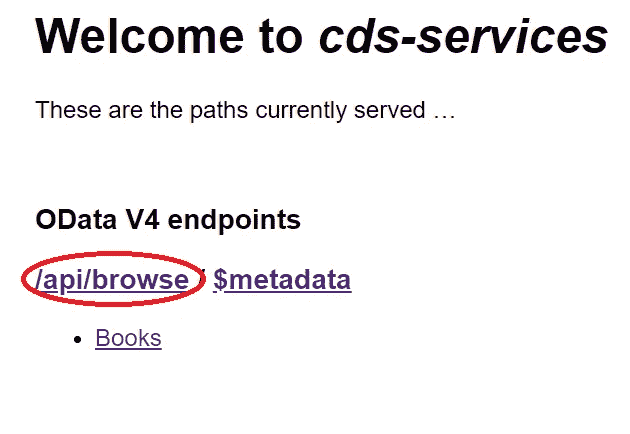*

*   *类型当然是 oData。我们也可以在 localhost:8080 检查这一点。*

*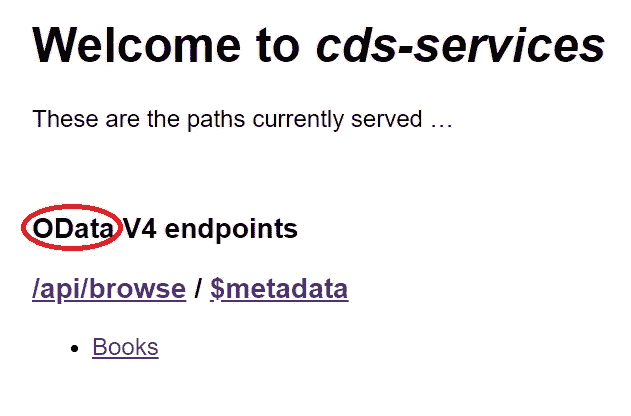*

*   *当然，在 settings 下，我们将其指定为“4.0”，这是 CAP 提供的 oData 的默认版本。您可以在位于[http://localhost:8080/API/browse/$ metadata](http://localhost:8080/api/browse/$metadata)的元数据文档中验证这一点*

*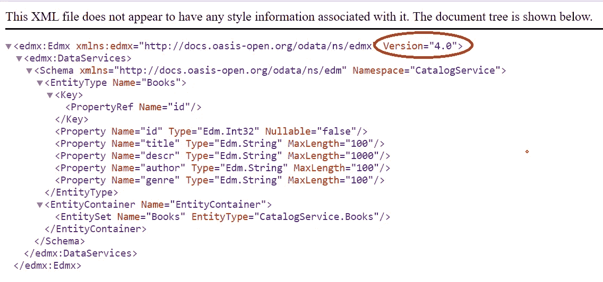*

***sap.ui5***

*这里我们只声明依赖项，sap.fe.templates 库，它包含费奥里元素。*

***型号***

```
*"models": {
   "": {
    "dataSource": "CatalogService",
    "settings": {
     "synchronizationMode": "None",
     "operationMode": "Server",
     "autoExpandSelect": true,
     "earlyRequests": true,
     "groupProperties": {
      "default": {
       "submit": "Auto"
      }
     }
    }
   }
  },*
```

*现在谈谈模特。SAPUI5 将根据我们在此定义的内容，自动生成将在我们的费奥里元素应用程序中使用的数据模型。*

*我们首先从一个空键开始。这告诉 SAPUI5 框架这是我们的默认数据源，这意味着它不需要用特定的关键字来引用。在费奥里元素应用程序中，因为我们实际上没有为这个配置文件之外的 UI 编写任何源代码，所以你必须将你的数据源定义为默认源代码。*

*接下来，在*数据源*下，我们引用我们在 **sap.app** 中定义的数据源。从数据源中，SAPUI5 可以识别出我们正在处理一个 oData V4，并因此选择正确的构造函数来构建模型。它还会自动读入并解析来自后端的元数据文档，以获取所需的大部分信息。我们只需要传入一个简单的 settings 对象进行一点额外的配置。要检查该对象的所有选项，请检查此[文档](https://sapui5.hana.ondemand.com/#/api/sap.ui.model.odata.v4.ODataModel%23constructor)。*

*首先，我们将 synchronizationMode 设置为 None。根据文档，这必须始终设置为 None。*

*接下来，我们定义操作模式。操作模式是指如何处理过滤和排序。将此设置为 server 意味着费奥里元素会将$filter 和$orderby 参数附加到发送到我们后端的请求中，后端会处理所有的过滤和排序。你可以点击查看其他选项[。](https://sapui5.hana.ondemand.com/#/api/sap.ui.model.odata.OperationMode%23properties)*

*接下来是 autoExpandSelect，应该理解为*自动展开和自动选择*的意思。这意味着当向后端发送请求时，FioriElements 将自动生成$expand 和$select 参数。*

*接下来是 earlyRequests，我们将其设置为 true。这告诉费奥里元素尽快从后端获取元数据文档和安全令牌。*

*最后，组属性。这控制了应用程序组的批处理请求(将多个后端请求捆绑成一个请求)的使用。这里，应用程序组 id 的映射应该用一个属性 submit 传递。在我们的例子中，我们提供了默认的*，所以所有的应用程序 id 将具有相同的行为，auto。您可以在这个[文档](https://sapui5.hana.ondemand.com/#/api/sap.ui.model.odata.v4.SubmitMode)中查看更多关于提交模式的信息。**

****路由****

```
**"routing": {
   "routes": [
    {
     "pattern": ":?query:",
     "name": "BooksList",
     "target": "BooksList"
    }
   ],
   "targets": {
    "BooksList": {
     "type": "Component",
     "id": "BooksList",
     "name": "sap.fe.templates.ListReport",
     "options": {
      "settings": {
       "entitySet": "Books"
      }
     }
    }
   }
  }
 },**
```

**路由可能是我们配置文件中最重要的部分，因为它是我们告诉我们的应用程序从一个页面移动到另一个页面的方式。如果我们犯了这个错误，不仅页面导航不起作用，甚至可以让我们导航到另一个页面的链接也不会显示。让我们一步一步地了解每个领域，看看他们是怎么做的。有关 SAPUI5 路由的更多信息，请查看此[文档](https://sapui5.hana.ondemand.com/#/topic/3d18f20bd2294228acb6910d8e8a5fb5)。**

**我们拥有的第一个键是 *routes* ，它包含一个 route 对象数组。每个路由对象包含一个*模式*、一个*名称*和一个*目标*。模式是激活路由的 URL 模式。*名称*是该特定路线的标识符，*目标*是将要生成的页面的标识符，其具体设置可以在下面的目标对象中找到。**

**在我们的例子中，我们目前有一条路由只包含“:？查询:“。？query 表示该路由接受查询参数，例如 *filter* 或 *select* 。如果您是 oData 的新手，请查看这个[文档](https://docs.oasis-open.org/odata/odata/v4.01/odata-v4.01-part2-url-conventions.html)，了解更多关于 oData 查询参数的信息。由于该路径中没有包含任何其他内容，因此该路径指向我们的费奥里应用程序的根页面。**

**我们的*名称*和*目标*字段都包含图书列表。我认为最好的做法是始终保持这些名称相同。每个的值可以是我们想要的任何值，但是对于列表报告费奥里元素页面来说，这是最佳实践，这就是我们正在做的，通过用 List 作为页面显示的实体名称的后缀来命名路由和目标。因为我们的实体是书，所以我们称之为书单。**

**接下来，目标部分。这包含特定于上面定义的路由的配置。在 targets 中，我们定义了一个对象，它的键是我们路由的目标:BooksList。这个键必须正确，否则 SAPUI5 运行时将无法找到路由的配置。**

**在 BooksList 对象中，我们将类型*指定为组件，这是所有费奥里元素应用程序的情况。接下来，我们指定一个惟一的 *id* ，为了简单起见，我们给它起了与对象本身相同的名字，BookList。接下来，在 *name* 键下，我们使用完全限定名指定要呈现的组件的名称。由于我们正在制作一个列表报告应用程序，我们使用了*sap . Fe . templates . List Report .*最后，我们提供了一个 *options* 对象，其中包含一个*设置*对象。这个对象包含一个字段， *entitySet* ，在这个字段中，我们指定希望这个页面显示 oData 服务中的哪个实体。自然地，因为我们只有一个实体，我们将使用它:书籍。***

*现在，如果我们使用 *mvn spring-boot:run* 启动我们的应用程序，打开位于[http://localhost:8080/fiori . html](http://localhost:8080/fiori.html)的应用程序，然后单击我们唯一的磁贴，我们将看到:*

*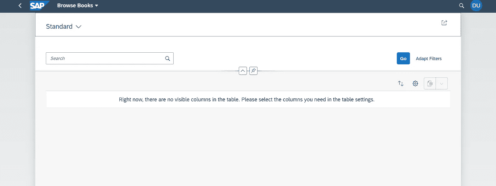*

*还没有显示任何数据，因为我们还没有指定默认情况下应该自动显示哪些字段(我们将在本系列的下一期中学习如何做到这一点)。不过现在，我们可以通过单击齿轮图标并选择一些要显示的字段来验证我们的应用程序是否可以显示我们的数据。*

*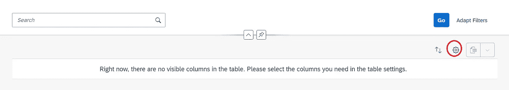**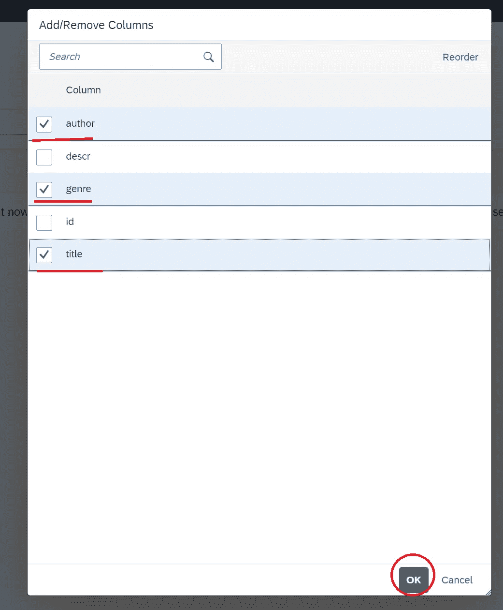**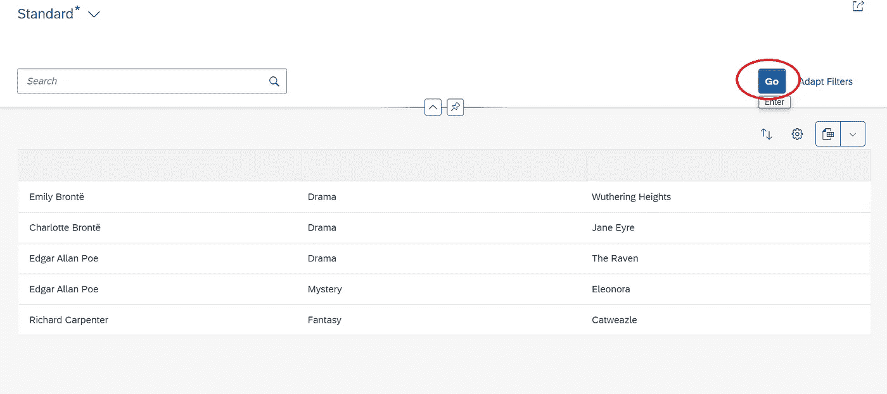*

# *结论*

*在完整的 CAP Java 教程的这一期中，我们学习了如何为书店应用程序设置一个基本的费奥里元素 UI，包括深入了解 SAPUI5 *manifest.json* 文件的细节。在本系列的下一部分中，我们将设置要在表中显示的标准字段，如何阻止某些字段的显示，以及如何实现过滤。*

*本教程中有什么不清楚的吗？请在下面留下问题，我会尽快回复您。有什么不对吗？请在下面留下评论，让我知道(更正的来源将是最有帮助的)。谢谢大家的评论！*

# *支持*

*你喜欢这个博客吗？想确保我能继续创作吗？然后考虑订阅 [Patreon](https://www.patreon.com/toadhousetutorials) ！*