# SAP 教程:应用程序初始化、创建模型和 API、CAP JAVA 中的手动 API 测试

> 原文：<https://medium.com/nerd-for-tech/sap-tutorial-complete-cap-java-part-1-fc1868c7bbba?source=collection_archive---------3----------------------->

完整的 CAP Java


卡斯帕·卡米尔·鲁宾在 [Unsplash](https://unsplash.com?utm_source=medium&utm_medium=referral) 上的照片

## 内容

*   **当前:App 初始化、模型和 API 创建、手动 API 测试**
*   [下一步:添加模拟数据、API 设置、服务 ui 和创建模拟用户](https://bnheise.medium.com/sap-tutorial-complete-cap-java-part-2-217bc930857d)

SAP 新的云应用程序编程模型是一个出色的新框架，可以让业务技术平台(BTP)的 web app 立即启动并运行。然而，尽管存在许多使用框架节点风格的教程，Java 版本仍然落后。下面的博客系列试图通过从头到尾提供一个完整的 CAP Java 教程来纠正这一点——定义数据模型和 API，编写定制逻辑，集成费奥里元素 ui，最后部署到 BTP 的 Cloud Foundry 环境。本教程的目标是重新创建这个 [Github repo](https://github.com/SAP-samples/cloud-cap-samples-java) 中的示例 CAP Java 应用程序。花点时间查看它，克隆它，并让它在本地运行。

当您完成本系列教程时，您应该能够从头开始构建一个这样的应用程序。让我们从第 1 部分开始，在这里我们初始化我们的应用程序，创建我们的第一个简单的数据模型，注册一个 API 来公开模型的数据，并手动测试 API。

# 先决条件

在我们开始之前，您需要设置您的开发环境。关于如何做到这一点的细节，请查看我的教程[中的步骤 1，用 CAP for Java 构建 Hello World 应用程序。](https://bnheise.medium.com/cap-java-tutorial-1-hello-world-app-66b4435a6e29)

# 步骤 1:初始化新的应用程序

有两种方法可以初始化 CAP Java 应用程序，如下所示:

```
cds init --add java
```

或者，

```
mvn archetype:generate -DarchetypeArtifactId=cds-services-archetype -DarchetypeGroupId=com.sap.cds -DarchetypeVersion=RELEASE
```

我更喜欢后者，因为它能让我们更好地控制应用程序的命名。让我们试一试。您将看到以下输出(不要担心警告):

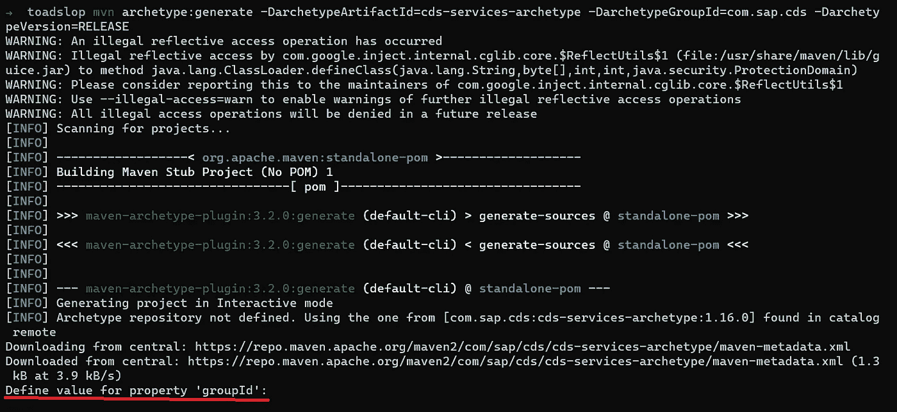

我们被要求输入一个用于命名空间的 groupId。如果我们只是使用 *cds init - add java* 我们会得到“customer”作为这里的缺省值，并且浏览所有生成的文件来改变它是一件痛苦的事情，这就是为什么我更喜欢使用 Maven 命令，即使它非常冗长。对于本教程，我使用我的 Github 用户名作为名称空间；官方书店 app 用的是“我的”。你喜欢什么就用什么。

接下来是 artifactId，它应该是您的应用程序的实际名称。在我们的例子中，让我们称它为“书店”,因为这就是我们正在做的。

最后，你会被问到目标平台是否是 *cloudfoundry* 。接下来，我将向您展示如何将这个应用程序部署到 BTP 的 Cloud Foundry 环境中，所以请在这里输入“Y”。

您将看到相当多的输出，但是如果您在最后看到这个，那么一切都很好:

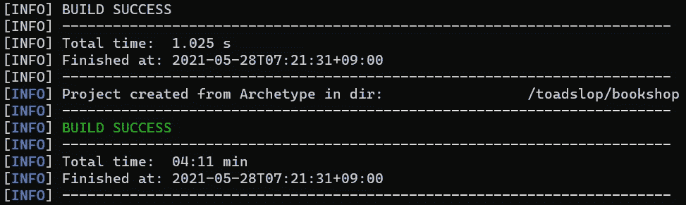

下一步，我们将建立我们的第一个数据模型。

# 步骤 2:创建我们的第一个模型

CAP 利用 SAP 的 CDS 语言来处理数据建模。如果你是 CD 新手，不要担心！我们会在这里告诉你一些基本的东西。然而，如果你想深入了解，一定要查阅[文档](https://cap.cloud.sap/docs/cds/)。简而言之，CDS 是一种单一的语言，用于处理我们的数据模型和 API 定义，并提供了一个与它们交互的单一接口。CDS 最好的特性之一是它可以向下编译到各种不同的数据库(例如 SQLite 和 SAP HANA)和 API 规范(oData V2、V4、Open API)。这意味着我们可以一次定义我们的数据模型和查询，无论我们是从 API 还是从数据库设置或查询，它们都可以工作。

让我们开始定义我们的第一个模型，它将代表我们书店的书籍。在项目根目录中，找到名为“db”的文件夹并打开它。在里面，创建一个名为“books.cds”的文件。

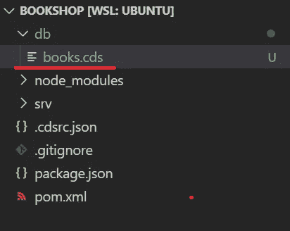

让我们从定义一个名称空间开始，这将有助于在我们的应用程序增长时，或者当我们决定导出我们的模型定义以在其他项目中使用时，防止命名冲突。按照惯例，我们将使用与应用程序相同的名称来命名我们的名称空间 *groupId* 和 *artifactId* 。

```
namespace toadslop.bookshop;
```

接下来，让我们添加定义我们的第一个数据模型，或 CDS 术语中的“实体”。

```
entity Books {}
```

通过这个命令，我们已经定义了没有字段的图书模型。那不行！让我们在模型中添加一些字段。

```
entity Books {
  key id : Integer;
  title  : String;
  descr  : String;
  author : String;
  genre  : String;
}
```

这里我们定义了 5 个字段； *id* 、*标题、描述、作者、*和*流派。*我们还将它们的数据类型指定为 ID 的*整数*和其余的*字符串*。此外，我们将 id 为*的字段指定为该表的关键字段。使用这些信息，我们的 CDS 开发工具包，并把我们的模型编译成各种格式。在您的控制台中尝试以下命令，看看您会得到什么:*

```
cds compile db/books.cds --to sql
cds compile db/books.cds --to json
```

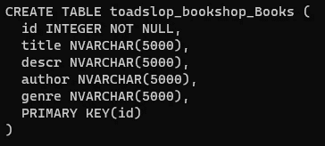

SQL 输出

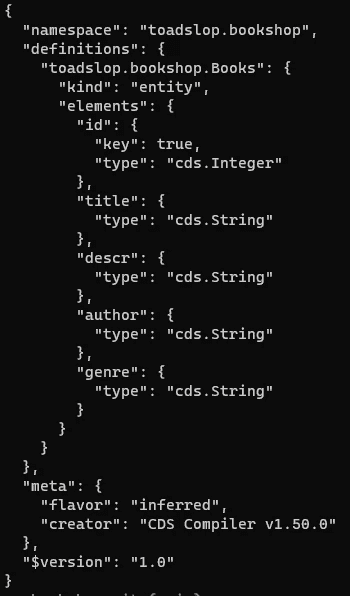

JSON 输出

现在你开始看到光盘的力量了！当我们继续时，继续运行这些命令来观察对我们的 CDS 文件的改变如何改变这些输出。

接下来，让我们给我们的字段添加一些字符限制。毕竟，我们不希望任何人在我们的*标题*字段中保存一整段文字，对吗？添加这些限制，如下所示:

```
entity Books {
  key id : Integer;
  title  : String(100);
  descr  : String(1000);
  author : String(100);
  genre  : String(100);
}
```

如果您运行 CDS compile to SQL，您会注意到字符限制已经更新。

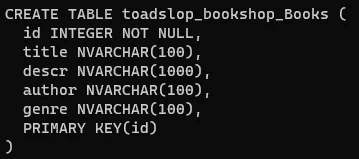

太好了！现在，关于数据模型的最后一件事。随着应用程序的增长，我们将在各自的文件中构建越来越多的模型，用于组织目的，但是当我们稍后必须导入它们时，这可能会变得很麻烦。在此之前，我们将在 *db* 文件夹中创建另一个文件， *index.cds* 。在这个文件中，我们将导入我们所有的模型，所以在应用程序的其他部分，我们可以从这个文件中导入一切。将以下代码添加到 index.cds 中:

```
using from './books';
```

现在让我们在终端中运行 *mvn 全新安装*来确保没有问题。您应该会看到很多输出，但是如果它像您下面看到的那样结束，那么一切正常:

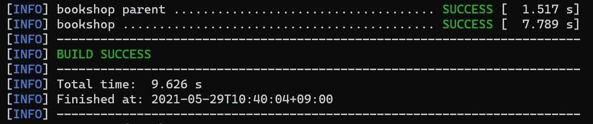

现在我们有了数据模型，但是如果我们不能向我们的应用程序客户端公开我们的数据，这又有什么用呢？下一步，我们将使用 CDS 将这个实体公开为一个 oData REST API。

# 步骤 3:定义服务

为了定义我们的服务，让我们移动到 *srv* 文件夹，这是我们的应用程序后端所在的位置。在这里，我们将创建一个服务来显示我们的图书目录，所以让我们创建一个名为 *cat-service.cds* 的文件。在该文件中，添加以下代码以导入我们在上一步中创建的数据模型:

```
using {toadslop.bookshop as bookshop} from '../db/books';
```

和以前一样，我们使用 *using* 关键字来指示一个导入，但是这一次我们在大括号内指示一个特定的导入和一个别名，首先是我们的名称空间*toad lop . bookshop，*然后是 *as* 关键字来指定别名。

接下来，让我们将我们的服务定义如下:

```
service CatalogService {
  entity Books as projection on bookshop.Books;
}
```

这里的 *service* 关键字表示我们正在定义一个名为 CatalogService 的 REST API 名称空间。该服务包含一个名为 Books 的实体。上的 *as 投影表示我们正在复制其他地方的定义，在本例中是上一步中的 Books 实体。随着项目的增长，将实体定义和服务定义混合在一起会导致庞大而混乱的 CDS 文件。这给了我们一个方便的方法来将两种 CDS 定义分开，使我们的代码更有条理。有关*投影*关键字和其他类似概念的更多信息，请查看本[文档](https://cap.cloud.sap/docs/cds/cdl#views)。*

让我们再次运行 *cds compile* ，看看这个服务定义发生了什么变化。

```
cds compile srv/cat-service.cds --to sql
```

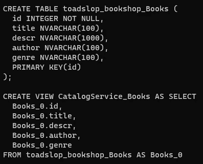

注意，我们仍然有原始的表定义，它是从我们在 *db* 文件夹中的原始 Books 模型生成的。然而，除此之外，我们还有一个视图，它是从我们的*实体* *书籍生成的，作为在书店上的投影。账簿*报表。这意味着，每当客户通过我们在这里定义的服务与我们的应用程序交互时，当他们的请求到达数据库时，它实际上将到达这个视图，而不是原始表本身。

接下来，让我们尝试编译成一个 oData 元数据文档，看看我们的 API 是什么样子的。如果您不熟悉 oData，这个文件是一个机器可读的文档，它指定了如何与我们的 API 交互，它有哪些端点，以及实体如何相互关联。

```
cds compile srv/cat-service.cds --to edmx-v4
```

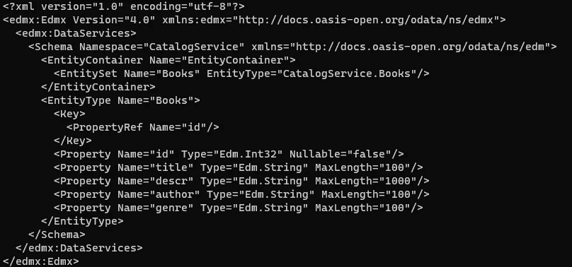

注意，我们在这里定义了 CatalogService，我们的实体书包括五个字段、它们的数据类型和字符限制。

让我们实际启动应用程序，看看到目前为止我们有什么。运行 *mvn spring-boot:在控制台运行*。接下来在[打开你的浏览器 http://localhost:8080/](http://localhost:8080/) 。

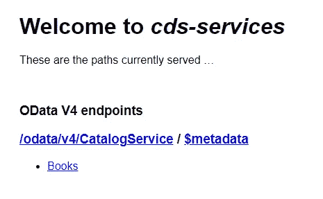

这里我们看到了 CAP 自动生成的后端控制台，在我们开发应用程序时，它可以方便地检查我们的工作。试着点击$metadata 链接，你会看到刚才我们用*CD compile*得到的同样的元数据文档。如果你点击*书籍*，你会得到我们数据库中的所有书籍。当然，由于我们没有任何数据，它将是空的，但无论如何这是一个开始。

# 步骤 4:测试我们的服务

接下来，我们将通过测试一些 CRUD 操作来证明我们已经拥有了一个全功能的 API。对于这一步，我们将使用 VS 代码的 [REST 客户端](https://marketplace.visualstudio.com/items?itemName=humao.rest-client)扩展，所以一定要先安装它。

在 *srv* 文件夹中创建一个名为 *api-test* 的子文件夹，并在里面创建一个名为 *cat-service.http* 的文件。将以下代码粘贴到内部:

```
### Get all books
GET http://localhost:8080/odata/v4/CatalogService/Books HTTP/1.1### Create a book
POST http://localhost:8080/odata/v4/CatalogService/Books HTTP/1.1
content-type: application/json{
  "id": 1,
  "title": "Wuthering Heights",
  "descr": "Wuthering Heights, Emily Brontë's only novel, was published in 1847 under the pseudonym Ellis Bell. It was written between October 1845 and June 1846\. Wuthering Heights and Anne Brontë's Agnes Grey were accepted by publisher Thomas Newby before the success of their sister Charlotte's novel Jane Eyre. After Emily's death, Charlotte edited the manuscript of Wuthering Heights and arranged for the edited version to be published as a posthumous second edition in 1850.",
  "author": "Jane Austen",
  "genre": "Drama"
}### Get the book
GET http://localhost:8080/odata/v4/CatalogService/Books(id=1) HTTP/1.1### Update the book
PATCH http://localhost:8080/odata/v4/CatalogService/Books(1) HTTP/1.1
content-type: application/json{
  "author": "Emily Brontë"
}### Delete the book
DELETE http://localhost:8080/odata/v4/CatalogService/Books(id=1) HTTP/1.1
content-type: application/json
```

如果您的 REST 客户机安装正确，您应该在每个请求上方看到一个“发送请求”链接，如下所示:

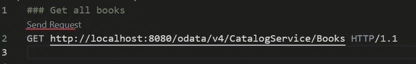

一个一个地点击它们，可以看到它们都可以工作，然后返回到浏览器中的页面，确认数据是持久化的。

现在，考虑到我们还没有对数据库做任何事情，你可能会马上问数据保存在哪里。答案是，默认情况下，CAP 会出于开发目的启动一个 SQLite 数据库，所以在开始考虑生产之前，您不必担心数据库。

# 结论

使用 SAP 的 CAP 框架，我们能够在几分钟内创建一个数据库、一个服务器和一个全功能的 REST API，而且我们甚至不需要编写一行 Java。在接下来的几周里，我们将了解如何进一步优化我们的 API 和数据模型，添加自定义逻辑，集成费奥里元素 ui，以及连接到外部服务，敬请关注。

本教程中有什么不清楚的吗？请在下面留下问题，我会尽快回复您。有什么不对吗？请在下面留下评论，让我知道(更正的来源将是最有帮助的)。谢谢大家的评论！

# 支持

你喜欢这个博客吗？想确保我能继续创作吗？然后考虑在 [Patreon](https://www.patreon.com/toadhousetutorials) 上订阅！