# SAP 教程:完整的 CAP Java 第 2 部分

> 原文：<https://medium.com/nerd-for-tech/sap-tutorial-complete-cap-java-part-2-217bc930857d?source=collection_archive---------2----------------------->

添加模拟数据、API 设置、提供 ui 和创建模拟用户


约书亚·阿拉贡在 [Unsplash](https://unsplash.com?utm_source=medium&utm_medium=referral) 上拍摄的照片

## 内容

*   [之前:App 初始化、模型和 API 创建、手动 API 测试](https://bnheise.medium.com/sap-tutorial-complete-cap-java-part-1-fc1868c7bbba)
*   **当前:添加模拟数据，API 设置，服务 ui，创建模拟用户**
*   [下一步:建立费奥里发射台和费奥里元素列表报告](/nerd-for-tech/sap-tutorial-complete-cap-java-3-adec221180bb)

欢迎完成 CAP Java 第 2 部分。在本教程系列中，我将一步步向您展示如何为 CAP Java 构建 SAP 的[书店示例应用程序](https://github.com/SAP-samples/cloud-cap-samples-java)。本教程系列假设没有任何先验知识，所以任何人都可以跟随。请务必查看第 1 部分[以了解我们到目前为止所做的工作。](https://medium.com/p/fc1868c7bbba/edit)

# 步骤 1:添加模拟数据

我们通过使用 VS 代码的 [REST 客户端插件](https://marketplace.visualstudio.com/items?itemName=humao.rest-client)来测试我们的 oData API 来结束第一部分，这让我们可以向数据库添加一些数据。但是，随着我们的开发，我们将需要一组一致的模拟数据，并且我们不希望每次都手工提交它。幸运的是，CAP 内置了一个数据库播种特性，所以只要我们有一个包含模拟数据的 CSV 文件，我们就可以在每次启动应用程序时将它自动部署到开发数据库中。让我们为我们的图书模型创建这样一个文件。

转到数据库文件夹，创建一个名为“data”的子文件夹，并在其中创建一个 CSV 文件。文件名很重要，因为它是 CAP 定位文件并将其与正确的数据模型相关联的方式。模式是 *<名称空间> - <型号 _ 名称>。csv* 。在本系列的第 1 部分中，我们将命名空间命名为 toad lop . bookshop，并将模型命名为 Books，因此我们的文件应该被命名为*toad lop . bookshop-Books . CSV*。

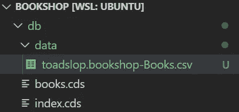

CSV 的标题行应该是我们的 Books 模型中定义的元素的名称，如下所示。你可以随意添加任何你喜欢的数据。或者，如果你只是想复制一些东西，签出这个项目的 Git repo 并复制它(确保你找到了与第 2 部分-步骤 1 相匹配的 commit 数据模型将在后面的步骤中改变，使得模拟数据文件对于该步骤无效)。

```
ID;TITLE;DESCR;AUTHOR;GENRE;
```

输入模拟数据后，运行 *mvn spring-boot:run* 并从我们在第 1 部分中创建的 REST 客户机文件中尝试我们的 get 请求，看看是否能获得数据。

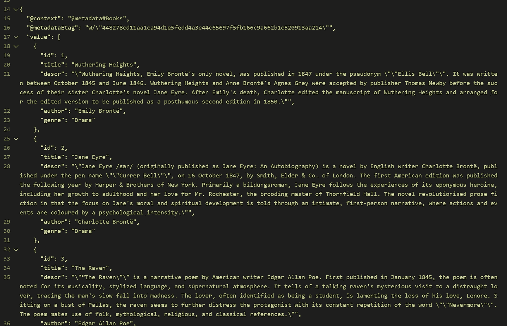

请注意，如果您的应用程序无法启动，很可能是因为您的 csv 文件的名称有错误。扫描输出中的以下错误消息:

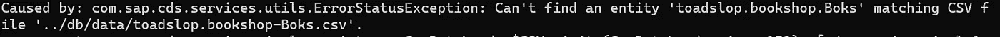

```
Caused by: com.sap.cds.services.utils.ErrorStatusException: Can't find an entity 'toadslop.bookshop.Boks' matching CSV file '../db/data/toadslop.bookshop-Boks.csv'.
```

如果您的应用程序启动良好，但您没有获得任何数据，这可能是因为您添加的值太长，超出了其字段的字符限制。如果您认为可能发生了这种情况，请扫描您的控制台输出，查看类似以下的消息:

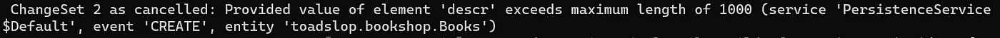

```
ChangeSet 2 as cancelled: Provided value of element 'descr' exceeds maximum length of 1000 (service 'PersistenceService$Default', event 'CREATE', entity 'toadslop.bookshop.Books')
```

如果发生这种情况，现在只需改变字符限制或减少您尝试提交的字符。在后面的教程中，我们将学习如何处理验证来防止这种错误。

# 步骤 2: API 设置

如果您启动 SAP 提供的书店示例，您可能会注意到提供 API 的 URL 与我们创建的 URL 之间存在一些差异。我们来对比一下。


api/browse/Books (SAP 的 CAP Java 示例)


odata/v4/目录服务/书籍

请注意，SAP 的示例以“api”开始，而不是我们默认的“odata/v4”，并且他们的 CatalogService 显示为“browse”。这是因为我们的应用程序正在显示 CAP 的默认设置——默认情况下，所有 API 都是 oData v4 APIs，因此它在该名称空间下标记它们，然后它在 CDS 文件中使用的相同名称下公开服务。这一切都很好，但有时我们希望使用除这些默认值以外的其他值。让我们学习如何。

首先，将“odata/v4”改为“api”。这是一个应用程序范围的设置，因此由一个名为 *application.yml* 的文件控制，你可以在文件夹 *srv/src/main/resources/* 中找到这个文件。如果你已经有了 Spring-Boot 的经验，你应该熟悉这个文件，因为它是 Spring-Boot 应用程序的标准配置文件(CAP Java 构建在 Spring-Boot 之上)。让我们打开文件，看看里面。

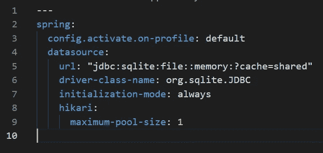

有意思！注意，我们已经有了一个默认的概要文件(对于以前的 Node 程序员来说，可以把它看作是您的开发环境),并且已经配置了一个数据库——内存中的 SQLite 数据库。这就是为什么我们能够在前面的步骤中用模拟数据播种数据库，而不必首先配置任何东西。

无论如何，要将我们的“odata/v4”更改为“api”，只需在文件底部添加以下代码:

```
cds:
  odata-v4.endpoint.path: "/api"
```

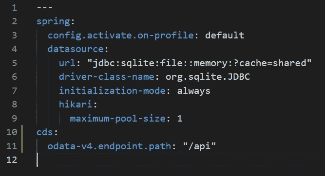

如果您想了解更多关于您可以在这里添加的配置，请查看这个[文档](https://cap.cloud.sap/docs/java/development/properties)。

让我们再次启动应用程序，看看结果！


一半完成了！接下来，我们需要更改 CatalogService 在 URL 中的显示方式。打开 cat-service.cds，将以下注释添加到我们的服务定义中:

```
@path : 'browse'
service CatalogService {
  entity Books as projection on bookshop.Books;
}
```

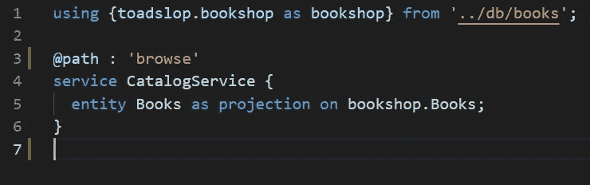

就这么简单。让我们来看看结果:


我们做到了！

# 步骤 3:准备好服务用户界面

现在我们有了一些数据，最好在 UI 中而不是简单的 JSON 文件中提供。当然，我们可以创建任何 UI，并对刚刚创建的端点进行 AJAX 调用，但在本教程中，我们将使用完整的 SAP，并向您展示如何设置[费奥里元素](https://sapui5.hana.ondemand.com/#/topic/03265b0408e2432c9571d6b3feb6b1fd)。在此之前，我们需要添加一些额外的设置，以使我们作为开发人员的生活更加轻松——也就是说，当我们处于开发模式时，我们需要配置我们的 Spring-Boot 后端来服务我们的 UI 文件。在生产中，我们的 UI 将被部署为一个单独的应用程序，因此它实际上不会由我们的生产后端服务，但在开发中，每次我们想要测试 UI 时，都必须启动一个完全不同的服务器，这将是令人烦恼的。不幸的是，这不是预先配置好的，但是设置起来并不难。让我们学习如何。

首先，让我们创建一个文件夹来保存我们的 UI 和一个 html 文件，以测试我们是否可以访问这个文件夹中的文档。首先，在根目录下创建一个名为 *app* 的文件夹，按照惯例，这是存储 CAP UIs 的地方；实际上，你可以随意命名。接下来创建一个名为 fiori.html*的文件，并将以下内容放入其中:*

```
<!DOCTYPE html>
<html lang="en">
  <head>
    <title>Bookshop</title>
  </head>
  <body>
    <h1>Hello World</h1>
  </body>
</html>
```

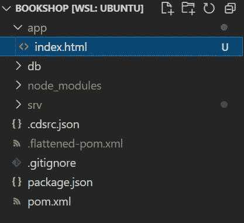

你可能会问为什么我们把 html 文件*叫做 fiori* 而不是 *index* 。原因是我们在本系列的第 1 部分看到的 CAP 测试我们后端的默认 UI 被称为*index.html*，所以如果我们命名我们的文件，我们将不再能够访问它。

现在尝试启动你的应用程序，并在浏览器中打开文件。你会注意到我们打不开它。这是因为我们的 Spring-Boot 后端不知道 *app* 文件夹。

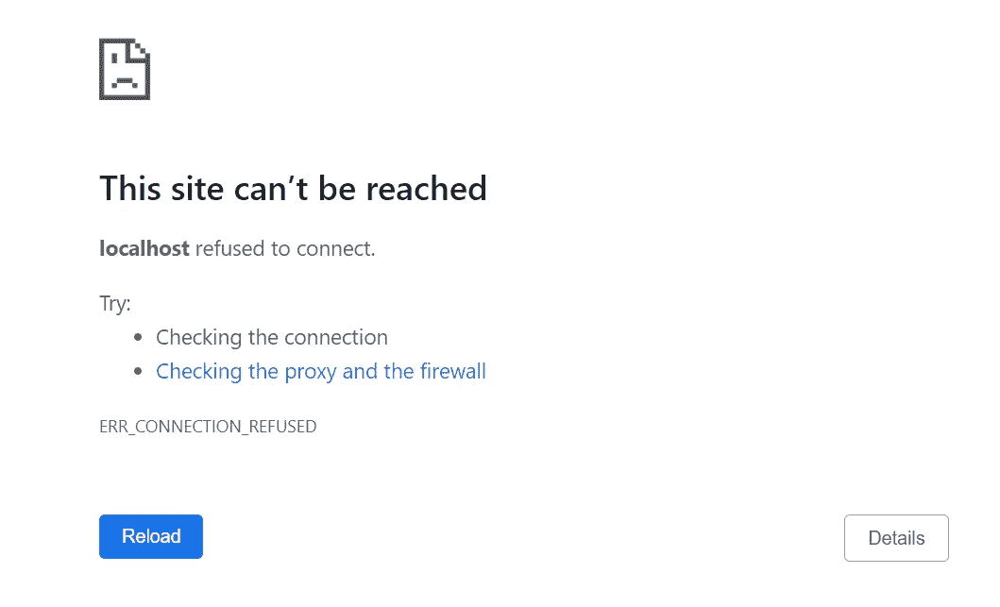

打开 *application.yml* 文件并将其添加到顶部，就在 *spring:* 下面

```
web.resources.static-locations: "file:./app"
```

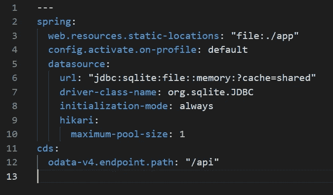

毫不奇怪，这一行告诉 Spring 静态文件在哪里。然而，如果你尝试打开 index.html，你仍然不能加载文件。这是因为 Spring 应用程序位于 *srv* 文件夹中，所以默认情况下，它假设其根文件夹是 *srv* ，这意味着它正在那里寻找 *app* 文件夹，而不是上一级文件夹。我们需要确保应用程序知道它需要在那里寻找。

打开 *srv* 文件夹中的 POM.xml 文件，找到注释<开头的部分！-弹簧开机插件- >。在其下方，找到<配置>标签，并在其中添加以下代码:

```
<workingDirectory>..</workingDirectory>
```

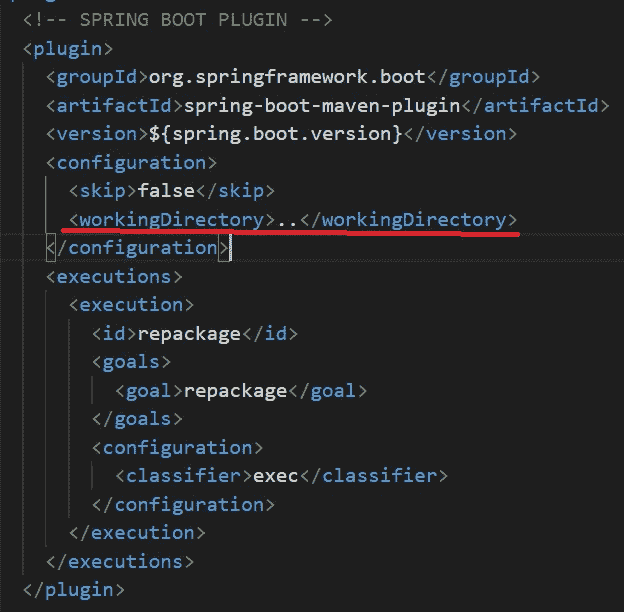

这个 workingDirectory 标签中的两个点只是告诉 Spring-Boot 应用程序的根目录是从 *srv* 文件夹向上的一个文件夹。现在应该可以找到我们的 *app* 文件夹和里面的 index.html 了。让我们试一试。重新启动您的应用程序，然后单击下面的链接:

[http://localhost:8080/index . html](http://localhost:8080/index.html)

哦，看那个！

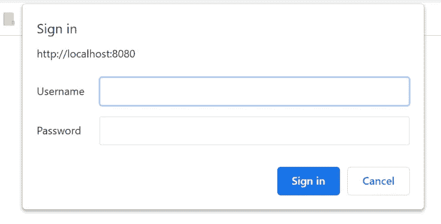

队长想让我们登录。默认情况下，它不允许您在没有登录的情况下访问 UI。不幸的是，我们还没有设置任何模拟用户，所以我们被困在这里。在下一节中，我将向您展示如何设置您的模拟用户，这样您就可以登录并显示您的 fiori.html*文件。*

# 步骤 4:创建模拟用户

幸运的是，创建模拟用户非常简单。只需再次打开 *application.yml* 文件，并在 *cds:* 标题下添加以下行:

```
security.mock.users:
```

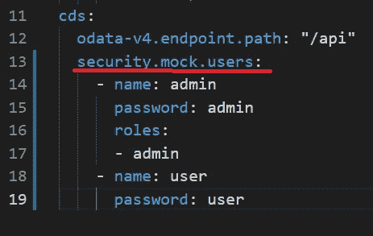

在那下面，正如你在上图中看到的，你可以创建一组具有各种属性的用户。出于我们的目的，我们将只创建两个用户，一个管理员和一个普通用户。请注意我们是如何向 admin 用户提供角色 *admin* 的。我们不会马上使用它，但请记住，这样的角色允许我们微调不同用户在我们的应用程序中可以看到和做什么。除了这些属性，我们还可以使用很多其他属性来配置我们的用户；点击查看[。](https://cap.cloud.sap/docs/java/development/properties)

现在，让我们再次尝试测试 UI。重启你的服务器，再次尝试进入[http://localhost:8080/fiori . html](http://localhost:8080/fiori.html)。输入我们两个用户之一的用户名和密码，看看结果——我们可以成功地显示我们的*fiori.html*文件。


# 结论

这就把我们带到了完整的 CAP Java 教程的第 2 部分的结尾。概括地说，我们学习了如何设置 CSV 文件，以便在启动应用程序时将模拟数据植入数据库，如何配置 API 的 URL，以及如何使用 CDS 为服务分配自定义端点。我们还配置了我们的 dev 后端来处理特定文件夹中的静态文件，这样我们就不需要两个单独的服务器来处理后端和前端，我们还学习了如何设置模拟用户。

在下周的文章中，我们将从头开始深入配置费奥里元素页面。

本教程中有什么不清楚的吗？请在下面留下问题，我会尽快回复您。有什么不对吗？请在下面留下评论，让我知道(更正的来源将是最有帮助的)。谢谢大家的评论！

# 支持

你喜欢这个博客吗？想确保我能继续创作吗？然后考虑在 [Patreon](https://www.patreon.com/toadhousetutorials) 上订阅！