# SAP 教程:完整的 CAP Java 第 5 部分

> 原文：<https://medium.com/nerd-for-tech/sap-tutorial-complete-cap-java-part-5-fb3ff81e64c1?source=collection_archive---------3----------------------->

使用 CDS 和费奥里元素中的单位


照片由[克里斯托弗·罗宾·艾宾浩斯](https://unsplash.com/@cebbbinghaus?utm_source=medium&utm_medium=referral)在 [Unsplash](https://unsplash.com?utm_source=medium&utm_medium=referral) 上拍摄

## 内容

*   [上一页:表格标题、列标题、隐藏字段、搜索、过滤和排序](https://bnheise.medium.com/sap-tutorial-complete-cap-java-4-6938e419f575)
*   **当前:使用 CDS 和费奥里元素中的单元**
*   [下一步:实施评级字段](https://bnheise.medium.com/sap-tutorial-complete-cap-java-part-6-81e9e867bc60)

欢迎完成 CAP Java，在这里，我将通过一步一步地向您展示如何构建 SAP 提供的[书店应用程序](https://github.com/SAP-samples/cloud-cap-samples-java)作为实际应用框架的示例，来教您如何使用 SAP 框架的 Java 版本——云应用程序编程模型。请务必跟随我们自己的 [Git repo](https://github.com/toadslop/cap-java-bookstore-rebuild) ，在这里您可以通过提交来了解应用程序是如何一步一步构建的。

到目前为止，我们已经建立了一个简单的图书数据模型，通过 oData API 公开了它，并使用 SAP 的费奥里元素页面模板生成了一个 UI。这是我们目前掌握的情况:

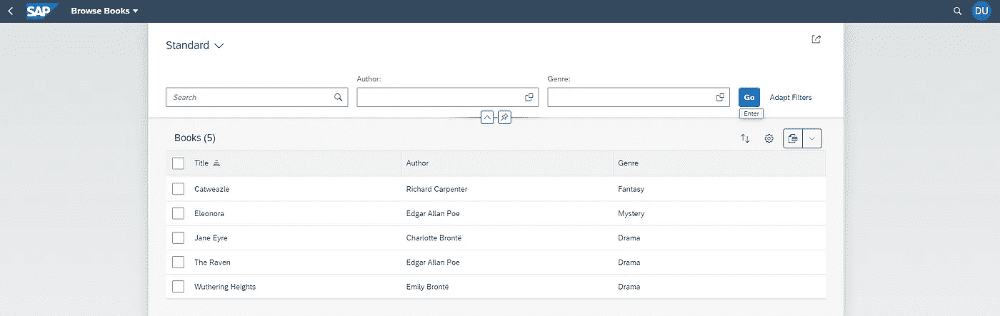

我们的书店应用程序

这是 SAP 版本的同一页面:

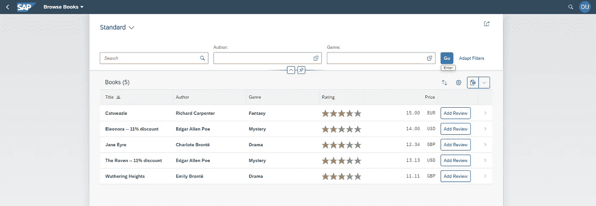

SAP 的版本

如你所见，这里仍然缺少了一些东西——评级栏、价格和添加评论按钮。在这一期文章中，我们将重点关注价格列的设置。

# 步骤 1:向数据模型添加价格和货币

首先，让我们仔细看看价格栏。注意，它实际上由两个独立的字段组成——价格和货币。

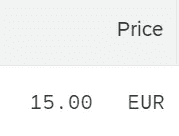

因此，我们需要将这两个字段添加到模型中。我们开始吧。

回想一下在第 1 部分的[中，我们在 *db/Books.cds* 中定义了图书模型。文件现在看起来是这样的:](https://bnheise.medium.com/sap-tutorial-complete-cap-java-part-1-fc1868c7bbba)

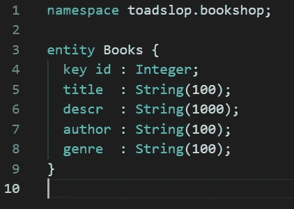

CDS 中定义的图书模型

首先，我们来补充一下价格。由于许多货币需要显示小数单位，我们将把*价格*字段定义为小数(有关 CDS 类型的更多信息，请查看此[文档](https://cap.cloud.sap/docs/cds/types))。在这个类型定义后面的括号中，我们还可以分别提供字段的*精度*和*比例*的值。作为参考，precision 是总位数，scale 是小数点右边的位数。我们将采用精度为 9，标度为 2 的方法。我们的定义应该像这样:

```
price : Decimal(9,2);
```

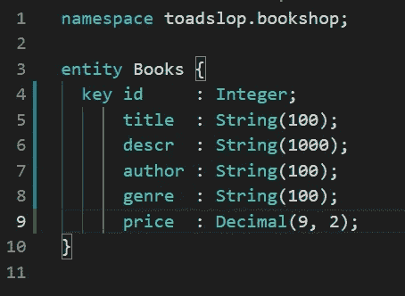

现在是货币领域。查看 SAP 版本的应用程序中显示的数据，我们可能会简单地将它变成一个长度为 3 的字符串。然而，货币有各种各样的相关信息——像 USD 这样的代码，像“dollar”这样的名称，以及像$这样的符号。将所有这些信息放在一起并适当地组织起来会很好，这样我们就可以根据上下文在我们的 UI 中适当地显示它们。幸运的是，SAP 通过提供一些预定义的复杂类型来帮助我们，使我们能够轻松、一致地对货币和其他类似类型的数据进行建模。查看[此处](https://cap.cloud.sap/docs/cds/common#code-types)了解更多关于 CAP 提供的常见类型的信息。

首先，我们必须导入类型。将下面一行添加到文件的顶部:

```
using { Currency } from '@sap/cds/common';
```

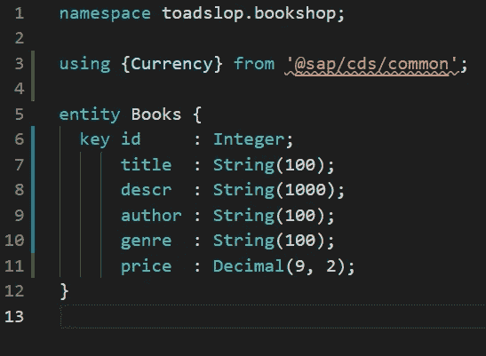

注意 VS 代码可能会给你一个警告，说它找不到包模块。忽略它——这是当前版本的 VS 代码 CDS 工具中的一个 bug。不管这个消息，你的 CDS DK 将能够在运行时解决它。

接下来，将这一行添加到实体定义的末尾:

```
currency : Currency;
```

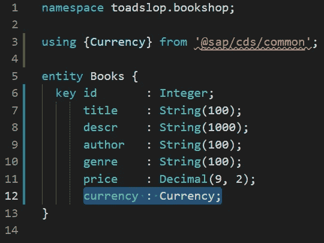

让我们运行 CDS 编译器，看看这个货币字段给出了什么:

```
cds compile db/books.cds --to sql
```

以下是部分结果:

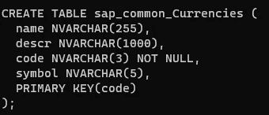

我们得到了一个包含字段*名称、* *desc* 、*代码*和*符号*的货币表。如果我们查看图书表，我们会看到:

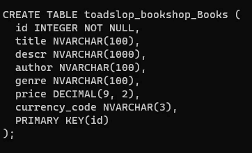

没有名为 *currency，*的字段，而是名为 *currency_code —* 的字段，这是一个外键，允许我们链接到货币表。通过这种方式，我们可以随心所欲地显示我们的货币。然而，这仍然给我们留下了另一个问题—我们需要数据库中的一些货币数据。让我们在 *db/data* 文件夹中创建另一个种子文件来处理这个问题。

请记住，要在应用程序启动时将数据自动播种到数据库中，我们需要将它放在一个用以下模式命名的 *csv* 文件中: *<名称空间> - <实体名称>。csv* 。如果我们做错了，应用程序将在启动时抛出一个错误，所以要小心！对于我们的货币数据，该文件应该被称为*sap . common-currences . CSV .*出于我们的目的，我们可以从 SAP 的书店应用程序中复制数据。在这里获取数据[。](https://github.com/SAP-samples/cloud-cap-samples-java/blob/main/db/data/sap.common-Currencies.csv)

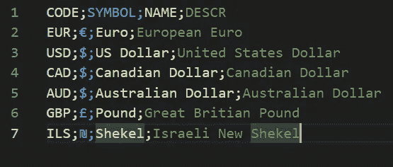

最后，我们必须更新我们的图书模拟数据，以使用我们新的*价格*和*货币*字段。添加价格；CURRENCY_CODE 添加到 csv 文件的标题行，然后添加一些价格和货币代码。您的结果应该如下所示:

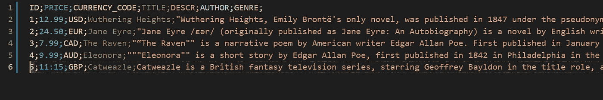

现在让我们回到我们的 UI，看看它是什么样子的。请注意，因为我们没有在 *LineItem* 注释中指定它们，所以它们在默认情况下不会出现，但是我们可以单击表格右上角的齿轮来显示一个弹出窗口，在这里我们可以将它们添加到显示的字段列表中。结果如下:

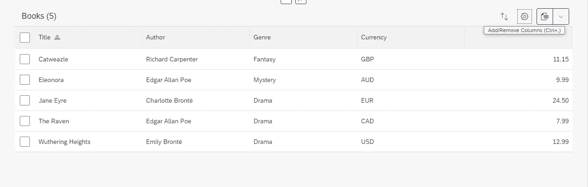

不是我们想要的，是吗？SAP 的书店示例有一个标签为*价格*的列，而*货币*列没有标签。另外，货币栏应该在价格的右边，而不是左边。让我们在下一节看看如何解决这些问题。

# 步骤 2:用 CDS 格式化价格和货币

我们的主要问题是，我们的费奥里元素应用程序实际上并不知道我们的货币和价格字段是相互关联的，也不知道它们有什么样的关系。让我们提供一些注释来传达这些信息。

首先，我们希望默认显示我们的价格字段，所以让我们将它添加到*app/browse/fiori-service . CDs*中的 *LineItems* 数组中。

```
{Value : price}
```

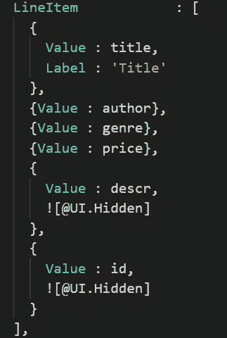

其次，我们用 *@title* 注释在 *app/common.cds* 中给它一个标签，因为我们想要这个标签。回想一下 *common.cds* 用于注释，我们希望影响所有费奥里元素应用程序，因为这个标签在所有应用程序中都应该相同，所以我们把它放在这里。

```
price  @title : 'Price';
```

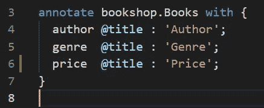

但是，如果我们现在启动应用程序，我们只会看到没有货币代码的价格。仍然不是我们想要的。为了让我们的货币包含在同一列中，我们必须在*价格*字段上提供一个 *@Measures* 注释，以将其链接到*货币代码*字段。

再次打开*app/browse/fiori-service . CDs*，并在文件末尾添加以下注释:

```
{
    [@Measures](http://twitter.com/Measures).ISOCurrency : currency.code
    price
};
```

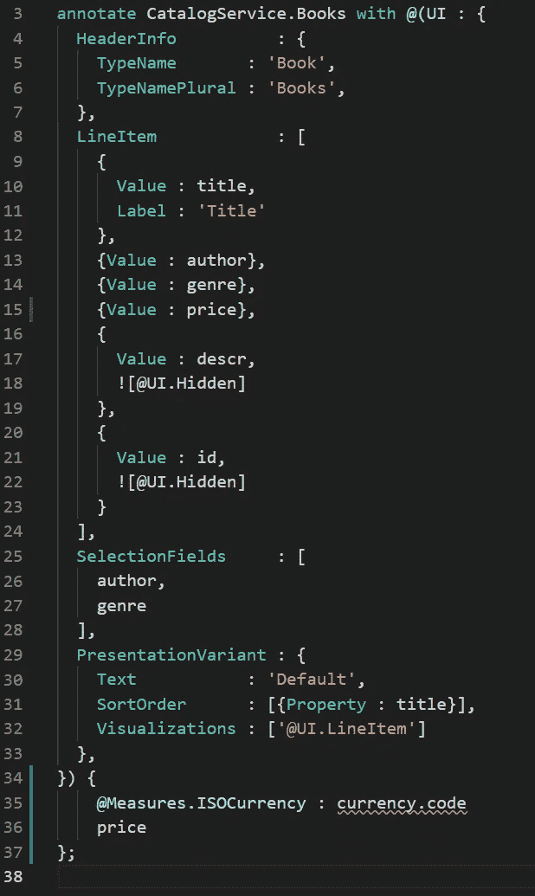

在文件末尾的大括号中，我们提供了@Measures。等货币注释后跟一个冒号，然后是*货币代码*，然后在新的一行上输入我们的字段*价格*。与*单位*或*比例*相反，*等货币*注释表示特定于货币的格式，这也是这里的常见选项。在冒号之后，我们列出了字段*货币*，这是我们在步骤 1 中在 CDS 中定义的。记住，这个字段实际上通过一个外键将我们链接到一个货币表。CDS 通过使用点符号使我们很容易链接到那个表中的数据。我们选择*代码*来显示货币代码，例如 USD 或 JPY。最后，在换行符上，我们提供了我们想要将货币信息链接到的表的*字段*。用简单的英语来说，我们可以把它翻译成类似于“显示价格字段和链接到这个表的货币实体的*代码*字段的值”

让我们来看看结果:

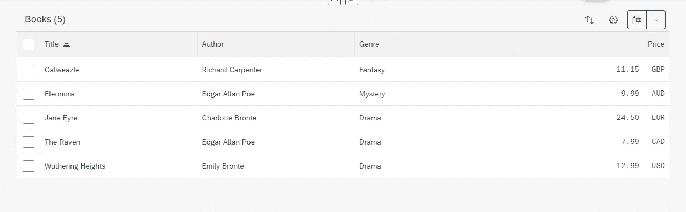

看起来很完美！

# 附加步骤:隐藏过滤器和其他用户界面清理

在回顾我们迄今为止的进展时，我注意到在本系列的第 4 部分中我们忘记了一个小步骤。如果您单击 UI 中的 Adapt Filters 按钮，您将看到以下内容。请注意我们不希望出现的字段:

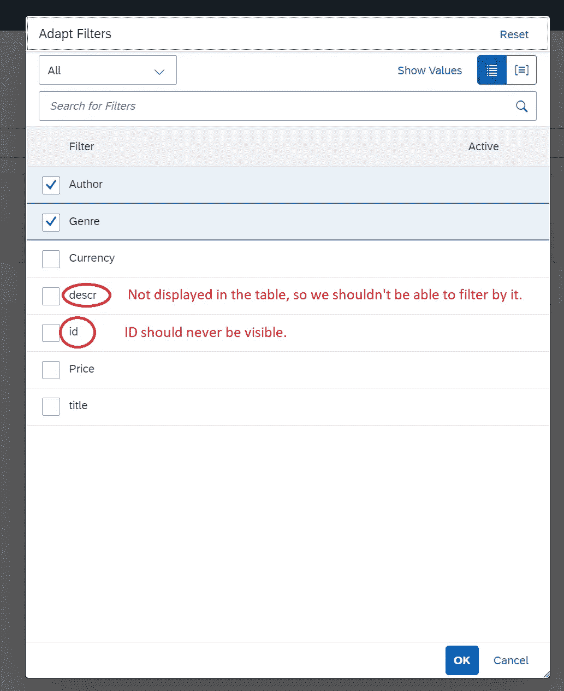

让我们花点时间来解决这些问题。

让我们从 id*开始，因为这是最简单的。回想一下，我们已经在表中隐藏了 id，并在*app/browse/fiori-service . CDs 中使用以下 *LineItem* 注释:**

```
 {
      Value : id,
      .Hidden]
    }
```

然而，正如我们所看到的，这只是在表中隐藏了它。我们想把它藏起来，不在任何地方展示。更重要的是，我们不希望在这个应用程序或我们稍后制作的任何其他费奥里元素应用程序中显示这一点，所以让我们将@UI.hidden 注释移动到 *app/common.cds* 。首先，将其从 *fiori-service 中删除。*接下来将以下内容添加到 *app/common.cds:*

```
id     @UI.Hidden;
```

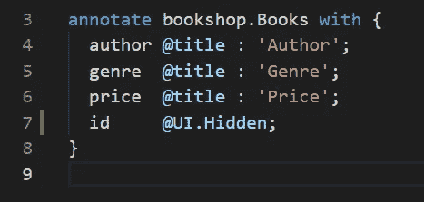

接下来是描述。描述不那么简单，因为有时我们会想要显示 *descr* 字段，所以我们不能只使用@UI 隐藏它。隐藏在 *common.cds* 中。相反，让我们回到 *fiori-service.cds* 并添加@UI。HiddenFilter 注释如下所示:

```
 @UI.HiddenFilter
  descr;
```

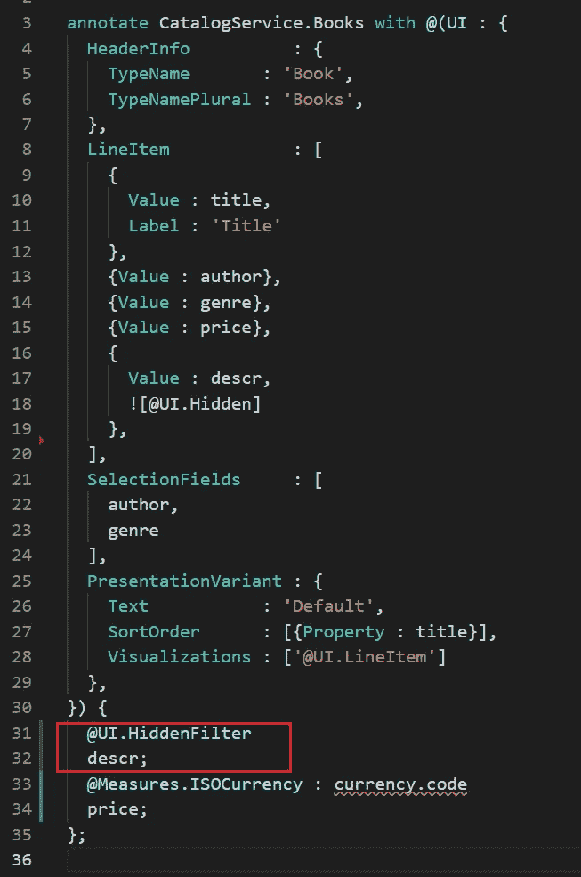

现在*描述*和 *id* 将从过滤器和表格中隐藏。

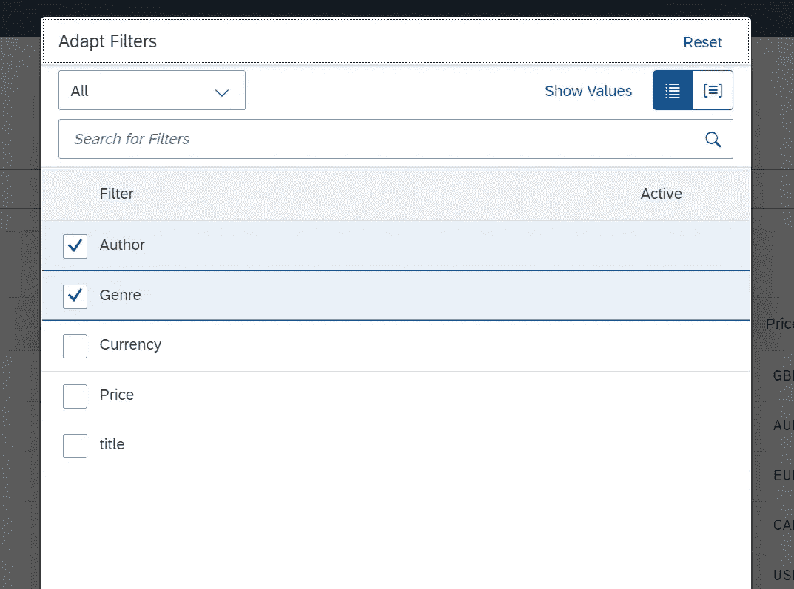

不过，你会注意到，*标题*以小写显示，而不是大写。这是因为我们只在 *LineItems* 注释中提供了标签。这意味着当这个字段出现在其他地方时，费奥里元素不知道如何称呼它，所以它只使用在实体模型中定义的字段名称。让我们通过将我们的标签注释从*标题*从 *fiori-service.cds* 中移走，并将其与其他标签一起添加到 *common.cds* 中来解决这个问题。到目前为止，您应该已经知道如何做到这一点，所以我不会在这里展示代码，但是如果您需要复习，请查看本系列的第 4 部分(添加链接)。结果如下:

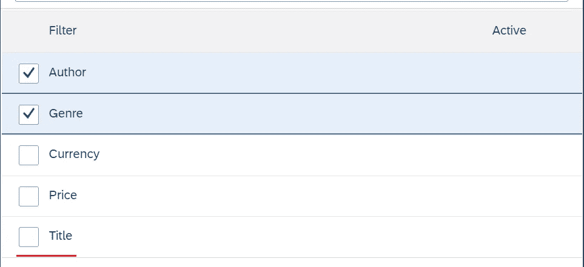

现在，最后一次用户界面清理。尝试点按桌面上的齿轮图标，看看会出现什么:

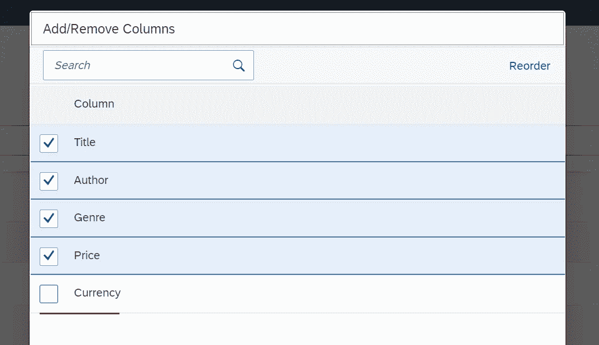

是货币领域。让我们选择它，然后单击“ok ”,看看会发生什么。

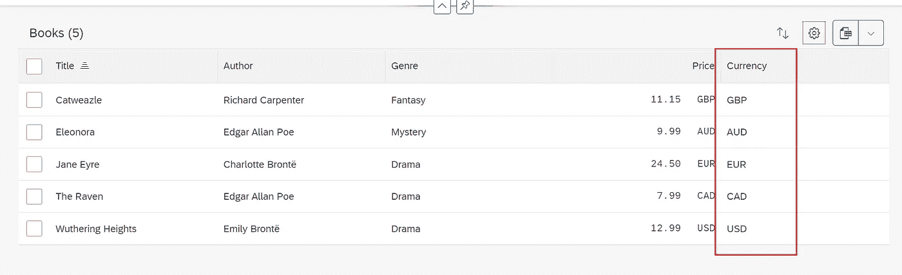

这不是我们想要的！让我们使用 LineItem 注释来隐藏它。这里需要注意的棘手部分是,*货币*字段实际上并不存在——在后台，CDS 将其转换为一个名为*货币代码*的字段，该字段充当链接到货币表的外键。因此，为了实际隐藏该列，我们需要提供公告的*值*作为*货币代码*，而不是*货币。*

```
 {
      Value : currency_code,
      .Hidden]
    },
```

现在，UI 清理的最后一点。你会注意到在齿轮按钮旁边有一个带两个箭头的按钮，一个向上，另一个向下。这允许用户根据自己的喜好配置排序顺序。让我们点击它。

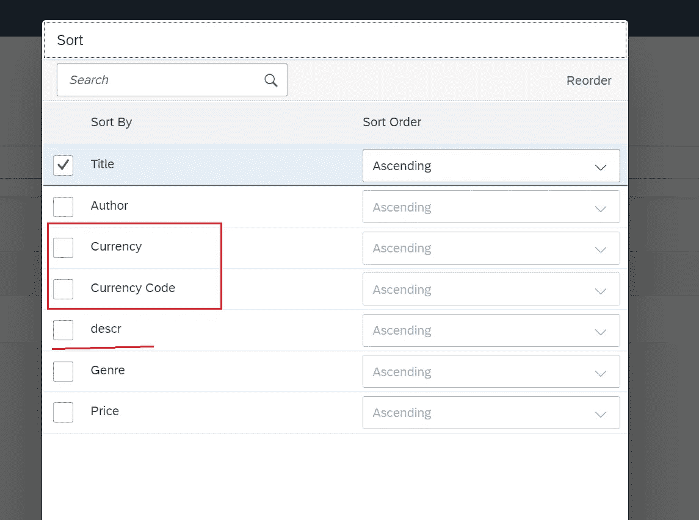

描述字段再次弹出，我们还显示了货币和货币代码，但它们是一回事。由于我们没有在表中的任何地方显示描述，如果我们也能隐藏它就好了，但不幸的是，在撰写本文时，我还没有找到这样做的方法。我们能为*描述*做的最好的事情就是给它一个合适的@ *title* 注释，这样它至少看起来不错。然后对于双币种，我们将使用 *UI 全局隐藏其中一种。隐藏的*。将这两个注释添加到 *common.cds* 中，如下所示:

```
 descr    [@title](http://twitter.com/title) : 'Description';
  currency [@UI](http://twitter.com/UI).Hidden;
```

这是结果:

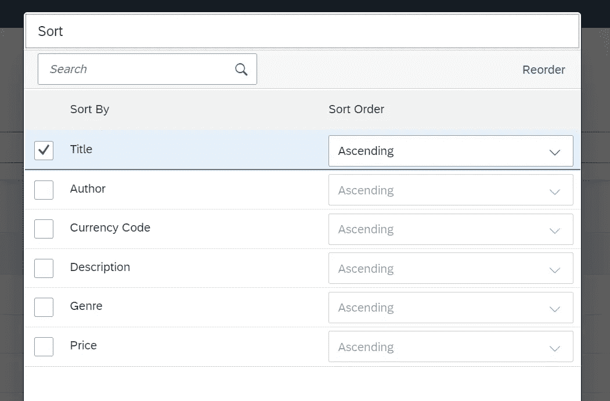

好多了！

# 结论

这就把我们带到了完整的 CAP Java 的第 5 部分的结尾。在这一部分中，我们学习了如何处理带有附加单元的字段，我们还花了一些时间清理我们的费奥里元素 UI，将一些字段作为过滤器隐藏起来，还使用@Title 注释添加了额外的标签。下周请继续关注，我们将学习如何实现评级栏。

本教程中有什么不清楚的吗？请在下面留下问题，我会尽快回复您。有什么不对吗？请在下面留下评论，让我知道(更正的来源将是最有帮助的)。谢谢大家的评论！

# 支持

你喜欢这个博客吗？想确保我能继续创作吗？然后考虑在 [Patreon](https://www.patreon.com/toadhousetutorials) 上订阅！