# React 中的萨斯汉堡菜单

> 原文：<https://medium.com/nerd-for-tech/sass-burger-menu-in-react-6c6af7ded570?source=collection_archive---------9----------------------->

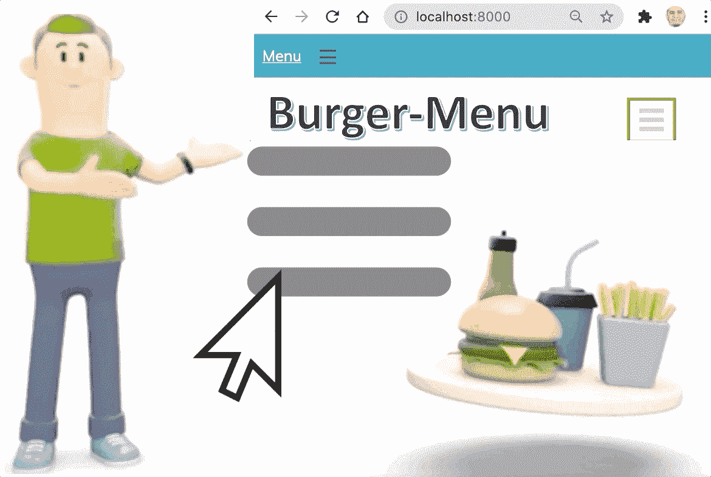

在这篇文章和短片中，我将解释如何在你的网站上创建著名的汉堡菜单。我将通过一个实际的实现来解释它。

这是将显示在页面上的最终结果

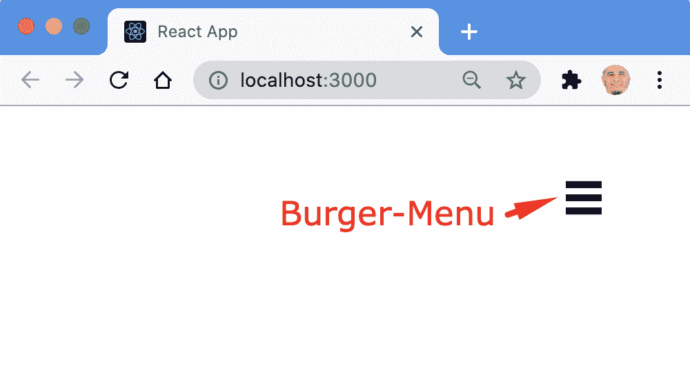

本文是下一篇文章的延续:

[](https://www.linkedin.com/pulse/what-sass-styling-react-css-rany-elhousieny-phd%E1%B4%AC%E1%B4%AE%E1%B4%B0/) [## 什么是萨斯？使用 Sass CSS 进行样式反应

### Sass 代表“语法上令人敬畏的样式表”。它是 CSS 的扩展。

www.linkedin.com](https://www.linkedin.com/pulse/what-sass-styling-react-css-rany-elhousieny-phd%E1%B4%AC%E1%B4%AE%E1%B4%B0/) 

我们将继续我们在上一篇文章中开始的项目，它可以在 Github[https://github.com/ranyelhousieny/react-sass](https://github.com/ranyelhousieny/react-sass)上找到

[](https://github.com/ranyelhousieny/react-sass) [## ranyelhousieny/react-sass

### 通过在 GitHub 上创建一个帐户，为 ranyelhousieny/react-sass 开发做出贡献。

github.com](https://github.com/ranyelhousieny/react-sass) 

========

# 什么是“汉堡菜单”？


我知道，这总是让我饿:)然而，这不是真正的汉堡。你在网站菜单上看到的就是这三条相互重叠的实线。尤其是当它们在移动设备上收缩的时候。它们看起来像两个小圆面包之间的汉堡(如上图所示)。当你点击它时，它应该会展开菜单项。

转到 App.scss 并删除那里的所有内容。我们不需要任何东西

首先，让我们将代码添加到 App.js 文件中，不进行样式化。在 App.js 中，删除 return()中的所有代码，并添加以下两个 di

我们将只在标题前有两个

如下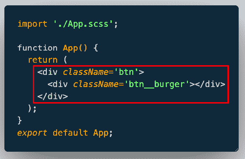

```
<div className='btn'>
     <div className='btn__burger'>
     </div>
</div>
```

如您所见，我们有两个 Sass 类 btn 和嵌套的 btn__burger。它们还没有实现。保存并确保 npm start 正在运行，因为我们将在浏览器上监控进度

# 现在，让我们在 App.scss 中添加样式

1.  让我们删除 App.scss 中的所有内容，开始清理

现在让我们添加汉堡的中间线

2.在 App.scss 中添加一个类。btn 和它里面的嵌套类&__burger

3.在嵌套类中，画一条高度为 6px、宽度为 2rem 的黑线，如下所示:

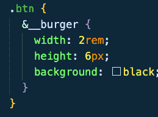

它看起来会像那样

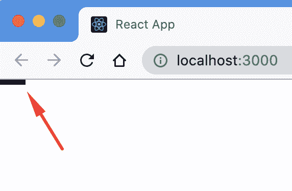

让我们通过从顶部和右侧添加 5 个 rem 将其向下移动，并如下固定位置

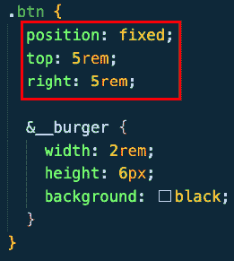

它看起来会像这样

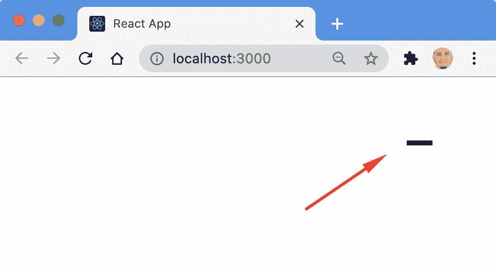

这些步骤可以在这个视频中找到

为了构建包子(其他两行)，我们将使用 CSS ::before 和::after 伪元素，这允许我们将内容插入到页面中，而不需要在 js 或 HTML 中。

# 什么是 CSS 伪元素？

CSS 伪元素用于样式化元素的特定部分，如第一个字母或一行，如本例所示。使用 CSS 伪元素，我们将在 App.js 文件之前和之后插入一行，而不需要添加更多的元素。

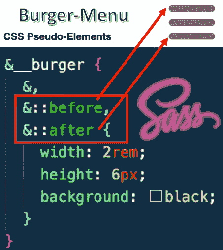

因为我们将在前后插入完全相同的行，所以我将对三个元素使用相同的代码，如下所示:

1.  我们在中间一行加上&。

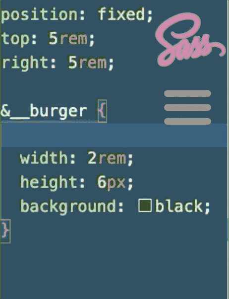

2.然后，我们在中间上方的那一行前面加上&

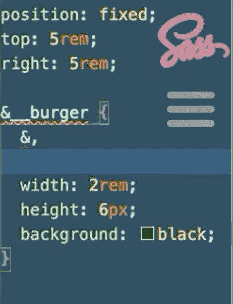

3.最后，我们在中间行(底部的圆面包)下面的行后添加&::并将整个代码包装在{}中

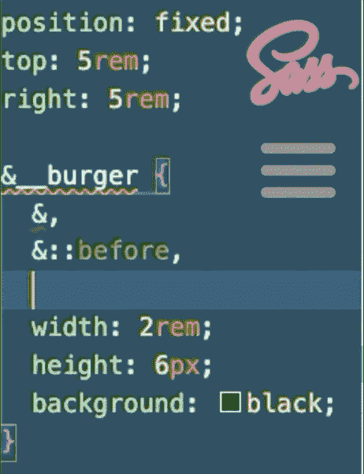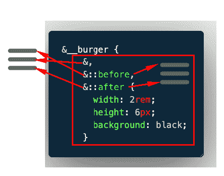

这不会显示在页面上，直到我们添加位置和内容

这些步骤在下面的短片中:

# 放置小圆面包

她是我们如何定位他们 12px 以上和 12px 以下

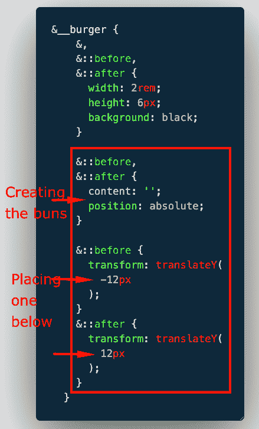

首先我们把空的内容和两者的位置都加为绝对的

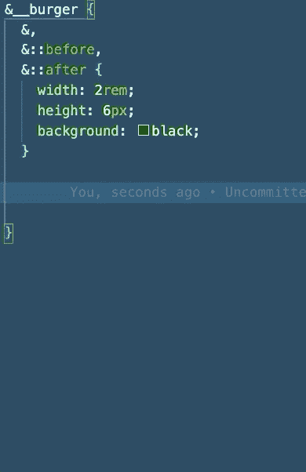

现在，通过添加 Y -12px 平移的变换来添加顶部的发髻，如下所示

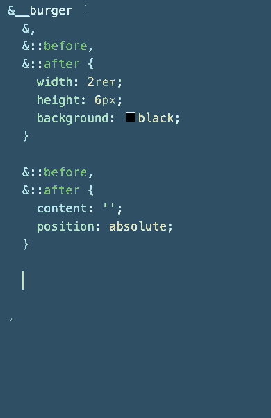

当您保存时(如果没有运行，则启动 npm start ),它将在浏览器上显示如下

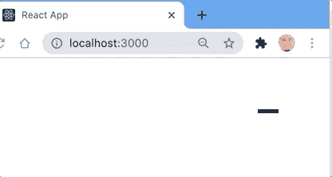

你可以对底部的发髻做同样的事情，但在这种情况下，移动+12px

这将显示如下:

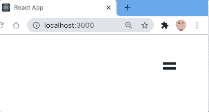

这是最新步骤的视频

这里你有你的汉堡菜单图标使用 Sass。在接下来的文章中，我将展示如何制作动画，并在你点击它时显示菜单