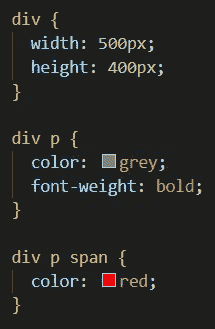
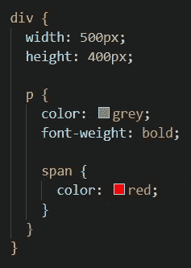
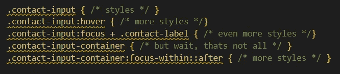
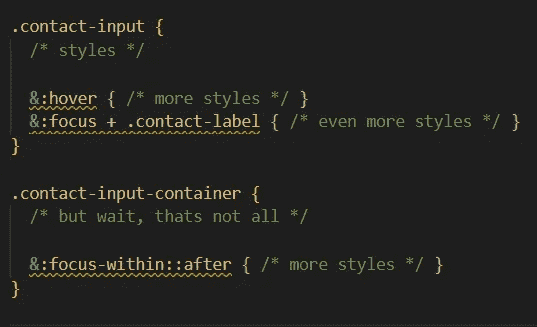
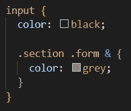
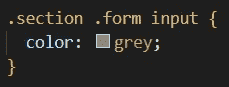
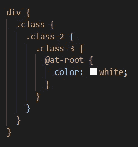

# Sass 嵌套，' & '和@at-root

> 原文：<https://medium.com/nerd-for-tech/sass-nesting-and-at-root-e14140b4246d?source=collection_archive---------5----------------------->

在我上一篇关于 [Sass](/nerd-for-tech/use-sass-to-create-better-media-queries-f5f149dc618c) 的文章的基础上，我们再来谈谈嵌套。我将使用。scss 文件类型，但这也适用于 sass 文件。在普通的 CSS 中，你可以这样写你的样式:

Sass 允许嵌套您的样式和选择器，以保持您的代码有组织和干净。没有人喜欢上下滚动多个文件，对吗？

在最近几周更新我的一个项目时，我注意到这种嵌套语法还有一个额外的好处，那就是允许你用你的选择器获得更好的可读性。有时他们在 CSS 中会有点失控。

常规 CSS

Scss 版本

# 父选择器:&

如果您是 Sass 的新手，您可能想知道` & '选择器是什么或做什么。它被称为父选择器或&符号。可以在嵌套样式中使用它来选择目标选择器的直接父级。我发现它对于像 hover 和 focus 这样的伪类非常有用。

大多数情况下，您会在选择器的左侧看到父选择器，但是您也可以在右侧的另一个选择器之后使用它。这可以让你更好地控制你的风格，同时保持一切井井有条！

经过处理后，它变成了这个 CSS:

# @根规则

如果您发现自己被深深地嵌套了，并且想要引用原始的根选择器，请使用@at-root 规则！

您可能想知道为什么需要这样做？你可以在原始的上下文中做样式，对吗？

我的回答是肯定的，完全正确。在这种情况下，你根本不需要它。

@at-root 通常与可选的(带: )或(不带: )媒体查询特性一起使用，以便更好地控制您想要的任何样式。如果你不熟悉这个话题，这可能是一个令人困惑和模糊的定义，但是让我们把它留到下一天。