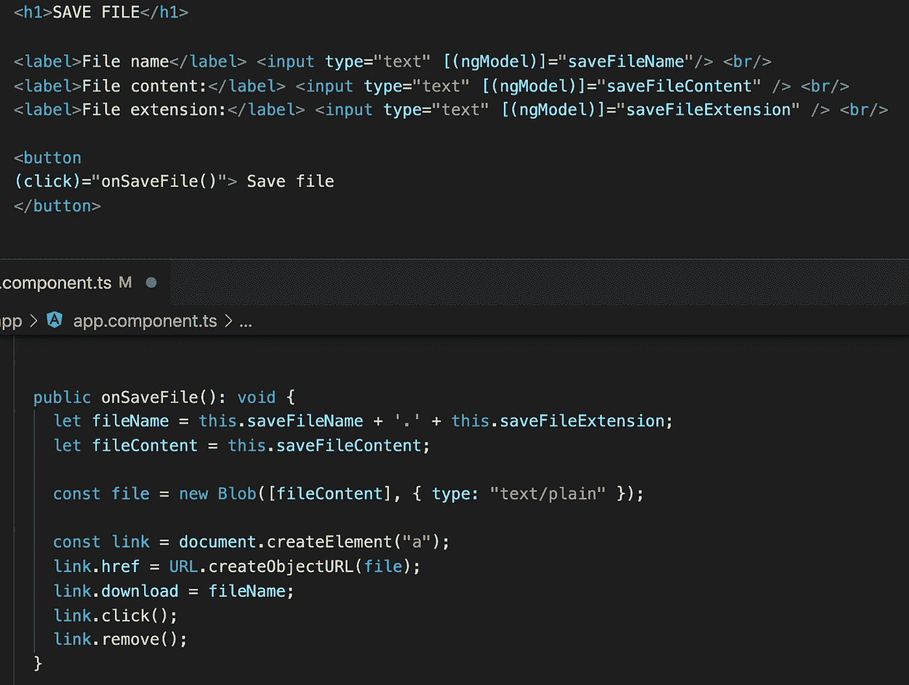
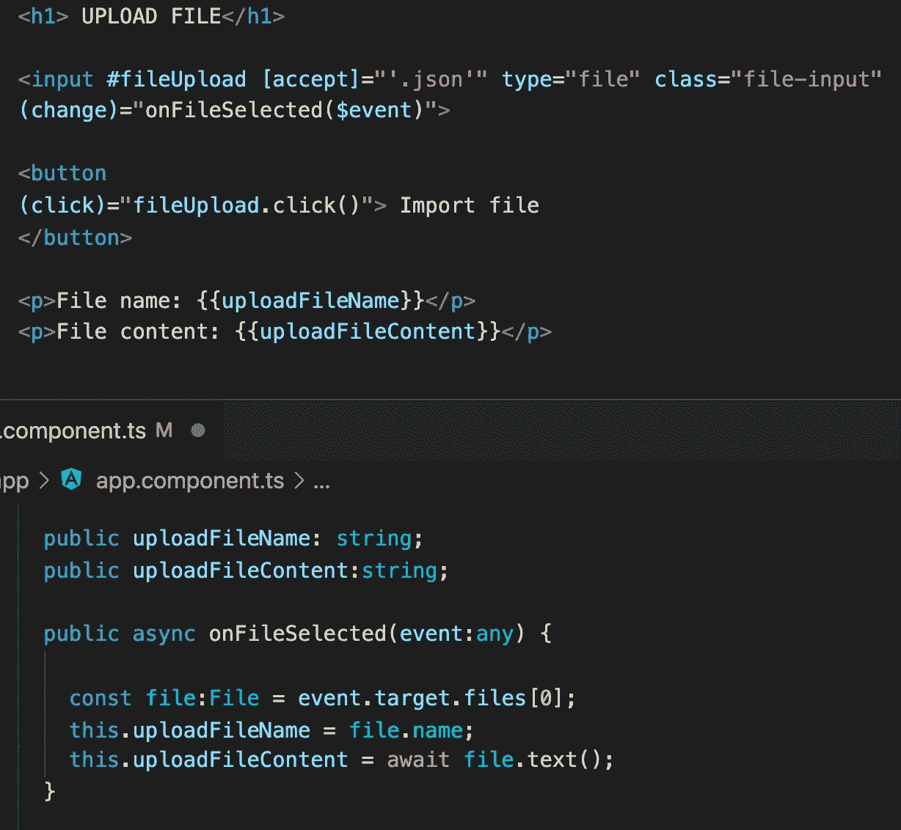
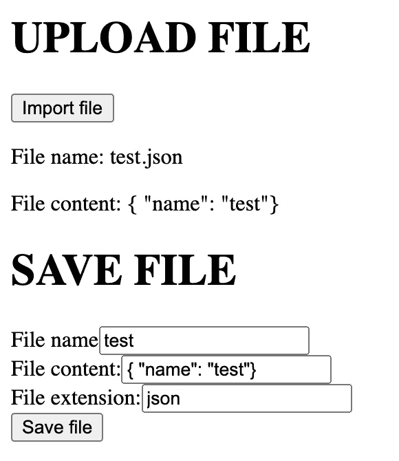

# 在 angular 中保存和上传文件

> 原文：<https://medium.com/nerd-for-tech/save-and-upload-file-in-angular-7d4a212c2c58?source=collection_archive---------1----------------------->

每个网站都包含不同的用户信息。一些用户可能会发现将这些信息保存在他们的计算机上很有用。这意味着我们需要让用户能够下载文件中的信息，然后上传到我们的网站并展示它。我们如何做到这一点？

要保存一个文件，我们需要创建三个输入(文件名、内容和扩展名)。当用户点击“保存文件”按钮，我们创建一个 blob 文件和不可见的链接。我们用这个链接为我们的文件创建一个 Url，然后我们手动点击并下载文件。

要上传文件，我们需要创建一个接受文件和按钮的输入。当用户点击一个按钮时，我们就点击了文件输入。在事件“更改”的文件输入中，我们绑定了我们的方法。每当用户选择时，我们调用我们的方法来读取文件。

因此，我们有一个小表单来上传和保存文件。

如果你需要仔细看看这个项目[，这里是链接](https://github.com/8Tesla8/save-file-angular) [。](https://github.com/8Tesla8/angular-theme-scss)

*原载于 2021 年 9 月 24 日 http://tomorrowmeannever.wordpress.com***。**