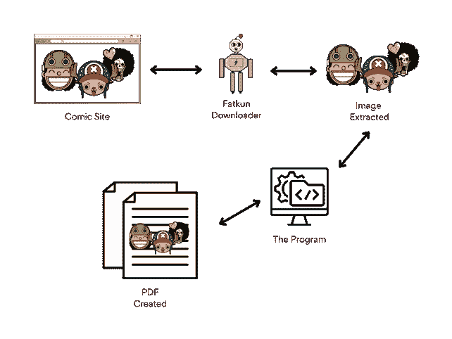
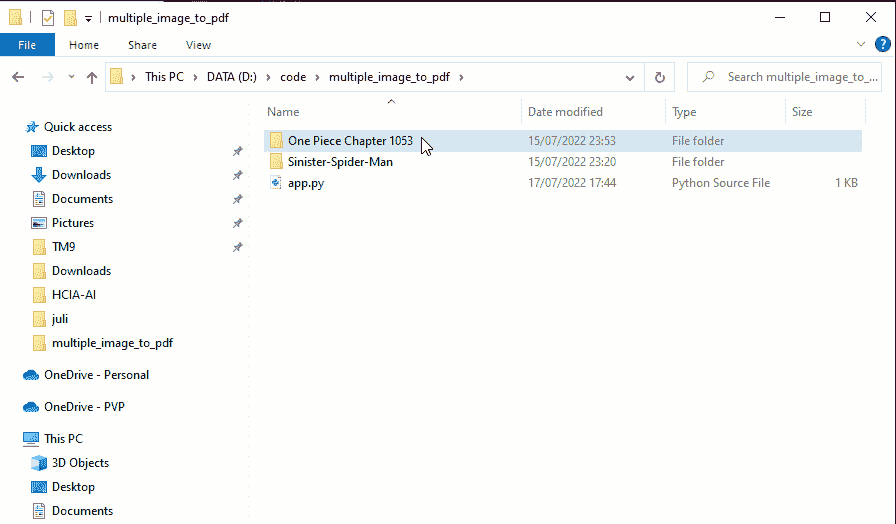

# 将多张图片保存为 PDF 文件，也称为漫画图像

> 原文：<https://medium.com/nerd-for-tech/save-multiple-pictures-as-a-pdf-file-a-k-a-comics-image-to-pdf-40a7a3a8f292?source=collection_archive---------3----------------------->


埃里克·麦克林在 Unsplash[上的照片](https://unsplash.com/s/photos/comics?utm_source=unsplash&utm_medium=referral&utm_content=creditCopyText)

说实话，这个故事对我来说是得心应手的，这也是我写这个故事的原因。好吧，这个故事发生在我在一家全球知名企业培训的时候——哈哈，开玩笑。我发现课程材料是一组图片，因为我不经常上网，所以我想下载成 pdf 格式。这个问题可以很容易地通过按`ctrl+j`并保存为 pdf。但是，我想专注于图像，没有任何分心。最后我把那个网站的图都下载了，但是新的问题来了。

> 如何将所有图片合并成一个 pdf 文件？

几经挣扎，终于找到了解决这个问题的方法。但是，因为我认为在这里分享这些材料是不明智的，我想到了另一个问题，并找到了这个问题。

> 如何在漫画网站上实现？如何将网络漫画上的所有图片合并成 pdf 格式，以便随时随地轻松传播？

抱歉问了这么多问题，✌.是的，我可以回答这个问题。我们去流动部分。

# 流动



有几个免费的在线漫画网站。但是比如我们去[看海贼王漫画在线](https://ww9.readonepiece.com/)。当你阅读时，也许你明白我们正试图在海贼王漫画网站上实现它。你喜欢一块吗？。好的，流程是这样的。

1.  我们将开放一个包含漫画的网站。
2.  使用 fatkun 批处理下载器，我们从网站下载所有的图像。关于这方面的更多信息，你可以在这里阅读我的文章。
3.  我们的程序将结合所有的图像，并把它们变成 pdf 格式。

# 代码

这是我使用的完整源代码。

```
from pathlib import Path
from PIL import Imageloc = input(“Folder location: “)imageList = []for p in Path(loc).glob(“*.[jpg][png]*”):
    imageList.append(Image.open(f”{loc}\{p.name}”).convert(“RGB”))im1 = imageList[0]
im2 = imageList[1::1]filename = input(“What name of file to be saved: “)
im1.save(filename, save_all=True, append_images=im2)
```

我们来分解一下。从上面的源代码，你可以很快看到我正在导入两个库`pathlib`和`pillow`。`pathlib`库根据文件的位置读取图像，`pillow`用于预处理图像。之后，我们将要求用户输入目录位置，并将其保存到`loc`变量中。此外，我们声明了一个名为`imageList`的列表变量。接下来，我们读取之前声明的文件夹中的所有格式化图像文件(jpg 和 png)。

受支持的图像为 RGB 格式，可以 pdf 格式读取。为了确保该程序适用于每种图像格式，如灰度，我们首先将其转换为 RGB。所有的图像都以 PDF 格式保存。为了让它工作，我们将`imageList`中的第一个图像放入变量`im1`中，然后将其余的图像保存在变量`im2`中。`[1::1]`意味着我们将从第一个索引开始读取所有图像，直到剩余的。

最后，我们的程序将从所有图像中创建一个 PDF 格式的文件。程序会向我们询问文件的名称。在我们键入图像名称后，这个动作将完成我们的程序，程序将创建 PDF。

# 死刑

为了弄清楚，请看下面的文档。



# 结论

在这个故事中，我谈到了如何将多个图像保存为 PDF。不知道谁会用。但是，我相信会有人找到这篇有用的文章，也许不是现在，但是很快。有好看的代码！！！

感谢阅读。

# 源代码

我已经为这个项目创建了一个存储库。如果你有兴趣访问回购，这里有链接。

[](https://github.com/theDreamer911/multiple-image-to-pdf) [## GitHub-The dreamer 911/multiple-image-to-pdf:这个 repo 里面的程序将帮助合并…

### 这个 repo 里面的程序将帮助合并图像和 PDF 文件。当你想阅读的时候，它会很有帮助…

github.com](https://github.com/theDreamer911/multiple-image-to-pdf)