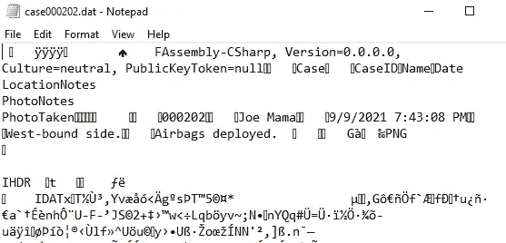
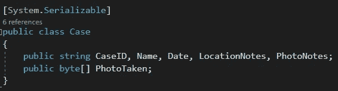
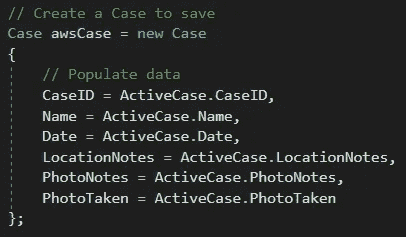
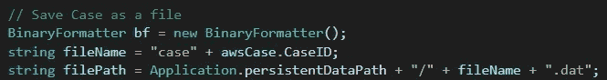
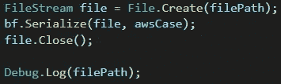

# 在 Unity 中保存对象

> 原文：<https://medium.com/nerd-for-tech/saving-an-object-in-unity-16766e2e3ca?source=collection_archive---------11----------------------->

**目标:**将对象保存到用户的系统中以备后用。

存储为. dat 文件的对象。不完全是用户友好的…

我们想要保存的对象是一个案例文件。它由几个字符串和一张转换成字节数组的照片组成。(参见[https://medium . com/nerd-for-tech/encoding-decoding-a-picture-in-unity-82af 70 b 36853](/nerd-for-tech/encoding-decoding-a-picture-in-unity-82af70b36853)了解如何将照片转换为字节。)

当用户点击提交按钮时，我们将保存他们输入的信息。首先，我们将创建一个*案例*的新实例，并将用户的输入复制到其中。

然后，我们将通过打开一个新的*二进制格式化程序*将案例保存为一个文件。我们将指定文件名和存储文件的路径，然后用*将它们全部附加上去。dat* 文件扩展名。

接下来，我们将打开一个 *FileStream* 来创建路径上的文件。然后我们将序列化对象并保存它。最后，我们将关闭*文件流*并记录文件路径。

如果我们按照路径，我们可以看到我们的文件成功保存！

在下一篇文章中，我们将学习如何将这个文件上传到 Amazon Web Services (AWS ),这样几乎可以从任何地方访问数据！