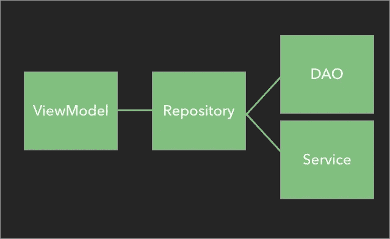

# 将数据保存在房间数据库中。使用 MVVM 从 API 调用更新

> 原文：<https://medium.com/nerd-for-tech/saving-data-in-room-db-from-api-call-retrofit-using-mvvm-e4f9806d8ffd?source=collection_archive---------1----------------------->


今天我将告诉你如何将数据从 API 保存到 room DB 中。这基本上称为“离线捕获”，我们从 API 获取数据，并在房间中保存和检索离线功能，我不会深入房间和所有内容，因为正如您所知

# 真理的唯一来源(SSOT)

如果你想让你的应用程序离线，你应该首先遵循 SSOT 规则。那是什么？很高兴你问了。

*SSOT 指的是这样一个概念，即某些数据只有一个官方来源供数据消费者(即人类和软件)使用，以获得该数据的真实当前版本。*

我们应该相信一个消息来源。在这种情况下，它将是房间 DB。您的房间数据库是真实信息的唯一来源，应用程序的其他部分通过存储库访问它。

# 目标

> ViewModel 调用存储库方法，并不关心如何检索数据。
> 
> ViewModel 调用存储库方法，并不关心如何检索数据。
> 
> 存储库需要远程服务(翻新、firebase 等。)来获取新数据。



# 目标的待办事项

*   我们将基本上做 API 的工作，并已经从使用翻新的 API 获取数据，但对于该场景，我们希望将一个屏幕数据存储到房间并检索它。
*   存储库从远程获取并将其插入数据库。
*   存储库从数据库查询并将其发送到视图模型(带有成功状态)

# 属国

```
*//Room Library* implementation "androidx.room:room-runtime:2.2.6"
implementation "androidx.room:room-ktx:2.2.6"
kapt "androidx.room:room-compiler:2.2.6"
*//kotlin coroutines* implementation "org.jetbrains.kotlinx:kotlinx-coroutines-core:1.4.1"
implementation "org.jetbrains.kotlinx:kotlinx-coroutines-android:1.4.1"

*//Hilt for dependency* implementation 'com.google.dagger:hilt-android:2.31.2-alpha'
implementation "androidx.hilt:hilt-lifecycle-viewmodel:1.0.0-alpha03"
kapt 'com.google.dagger:hilt-compiler:2.31.2-alpha'

*//Retrofit* implementation 'com.squareup.retrofit2:retrofit:2.9.0'
implementation 'com.squareup.retrofit2:converter-gson:2.9.0'

implementation "androidx.lifecycle:lifecycle-viewmodel-ktx:2.3.1"
implementation "androidx.lifecycle:lifecycle-livedata-ktx:2.3.1"
implementation "androidx.lifecycle:lifecycle-common-java8:2.3.1"
implementation 'androidx.lifecycle:lifecycle-extensions:2.2.0'
```

# 样品

目前，我正在做一个项目，该项目的场景是从 API 获取数据，并只将一个屏幕数据保存到房间数据库中，所以我决定为房间数据库的清晰简洁的工作编写这个。

所以基本的第一步是创建 DAO 类，你可以在网上的任何地方找到它如何创建 DAO，所以基本上，DAO 看起来像这样。\

我们将制作实体模型，它基本上被称为模型类，我们将使用我们已经制作的模型类作为房间实体，因为我们不需要制作另一个模型类

# 实体(模型类)

```
@Entity
 data class GetUserRewardPointResponse (
    @PrimaryKey(autoGenerate = true)
    val Id:Int,
     val ClientInformationId:String?,
     val CardNumber:String?,
     val IssueDate:String?,
     val ExpiryDate:String?,
     val MembershipType:String?,
     val BalancePoint:String?,
     val RewardPointsRate:String?,
     val BalancePointamount:String?,

         )
```

# 道与服务

```
@Dao
interface AppDao {

    @Insert(onConflict = OnConflictStrategy.*IGNORE*)
    fun insertItems(getUserRewardPointResponse: GetUserRewardPointResponse)

    @Query("SELECT * FROM GetUserRewardPointResponse")
    fun getAllDataSet(): LiveData<List<GetUserRewardPointResponse>>

}
```

然后第二步是创建一个类，称之为应用程序数据库，你也可以在网上任何地方找到它，因为它很常见，但为了简洁明了，我再次提到这些步骤

所以，第二步

# 应用程序数据库

```
@Database(entities = [GetUserRewardPointResponse::class], version = 1, exportSchema = false)
abstract class AppDatabase : RoomDatabase(){

    abstract fun appDao(): AppDao
}

private lateinit var *INSTANCE* : AppDatabase

fun getDatabase(context: Context): AppDatabase {

    *synchronized*(AppDatabase::class.*java*) **{** if (!::*INSTANCE*.*isInitialized*) {
            *INSTANCE* = Room.databaseBuilder(
                context.*applicationContext*,
                AppDatabase::class.*java*,
                "database"
            ).build()
        }
    **}** return *INSTANCE* }
```

然后在我们的视图模型中，因为我使用了 MVVM，所以在视图模型中，我会调用 API，看起来就像这样。

```
fun insertData(model: GetUserRewardPointResponse){
    GlobalScope.*launch* **{** *getDatabase*(MainApplication.context).appDao().insertItems(model)
    **}** }
```

然后在我们的片段中，我们通过改进调用 API，这给了我们两个方法，成功时返回，失败时返回。

我们已经从 API 中获取并设置了数据，所以为了再次将它插入到 room DB 中，我们将这样做。

# 将数据插入 Room-DB

```
when (**it**.status) {
    Resource.Status.*LOADING* -> {
        loadingDialog.show()
    }
    Resource.Status.*SUCCESS* -> {
        **it**?.*let* **{** data **->** loadingDialog.dismiss()
            data.data?.*let* **{** if (**it** != null) {
                    mViewModel.insertData(
                        GetUserRewardPointResponse(
                            0,
                            **it**[0].BalancePoint,
                            **it**[0].CardNumber,
                            **it**[0].IssueDate,
                            **it**[0].ExpiryDate,
                            **it**[0].MembershipType,
                            **it**[0].BalancePoint,
                            **it**[0].RewardPointsRate,
                            **it**[0].BalancePointamount
                        )
                    )
                    setData(**it**[0])

                }
            **}

        }** }
```

最后，为了检索和提供数据，我们已经知道了，因为我不会深入讨论，所以我们知道我们必须触发 Room DB 的 observer，所以在这里，我必须将它调用到 on-CreatedView 中，因为它将在创建片段视图时运行！！

```
*//Room db Observer//* mViewModel.allItems.observe(*viewLifecycleOwner*, *Observer* **{
    it**.*let* **{** if (**it**.*isNotEmpty*()) {
            try {
                setData(**it**[0])
            } catch (e: Exception) {

            }

        }
    **}
}**) 
```

# 从 Room-DB 中删除数据

我们还将了解如何从房间数据库中完全删除数据，因为当用户注销时，注销 Api 成功回调，我们将从表中完全删除用户的详细信息，因此当用户下次登录时，将再次生成用户表并将数据保存到其中。

“我们也将在 MVVM 这样做”

步骤 1 与我们将数据插入房间的方式相同

所以在 DAO 类中，我们将这样做

第一步:

```
@Query("DELETE FROM GetUserRewardPointResponse")
fun deleteAll()
```

第二步:

在我们的片段视图模型中，我们将做同样的事情，比如插入，如下所示。

```
fun deleteData(model: GetUserRewardPointResponse){
    GlobalScope.*launch* **{** *getDatabase*(MainApplication.context).appDao().deleteAll()
    **}**
```

第三步:

我们现在将在 api 的成功回调中调用我们的 ViewModel，因为它注销了用户，所以它也将在注销时删除用户表，

```
Resource.Status.*SUCCESS* -> {
    loadingDialog.dismiss()
    mViewModel.deleteData(getUserRewardPointResponse)
    navigateToLoginScreen()
}
```

# 摘要

我不想完全解释这个房间。也许下一篇博文会是关于这个的。但在这篇博文中，我想向你展示如何组合你的房间，让你的应用离线。我对 RxJava 2 并不高深。我是说，如果你有什么建议的话，能收到你的来信真是太好了。

请欣赏它，因为这是我的第一个媒体故事，所以我可以在未来写更多！也

快乐编码。