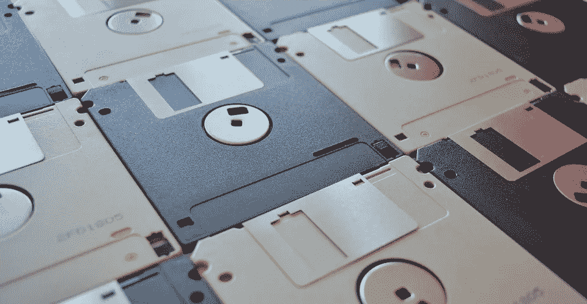
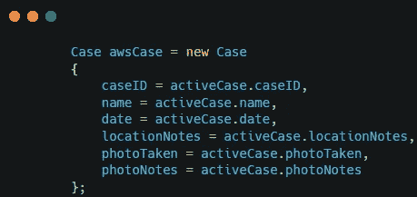
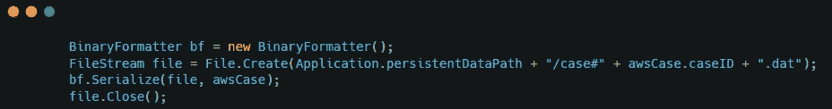
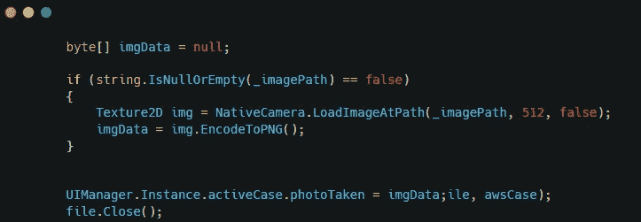
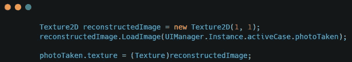
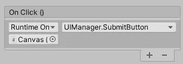

# 在 Unity 中保存数据

> 原文：<https://medium.com/nerd-for-tech/saving-data-in-unity-baf8564cea27?source=collection_archive---------0----------------------->

为了让我的保险应用程序工作，它需要能够保存以前案件的数据。为此，我需要将每个案例保存为一个文件。

第一步是用当前案例的信息制作一个新案例。

下一步是创建一个新文件来写入所有信息。

我需要使用**系统。IO** 命名空间与文件和命名空间**系统一起工作。runtime . serialization . formatters . binary**将信息转换为二进制，以便能够将其写入文件。

下一步是以一种我能够将它存储在文件中的方式格式化图片。我这样做是通过将图片保存为一个字节数组，可以通过重构来显示图片。

照片拍摄时，我保存了照片保存的路径。当数据被处理后，我用图片数据制作了一个纹理 2D 图像，并将其转换成 PNG 格式。PNG 数据是保存到活动案例文件中的数据。

为了在总览面板上显示这个，我重新创建了这张图片，并将其作为一个纹理。

当我单击“提交”按钮时，它将为保存的数据创建一个文件。

