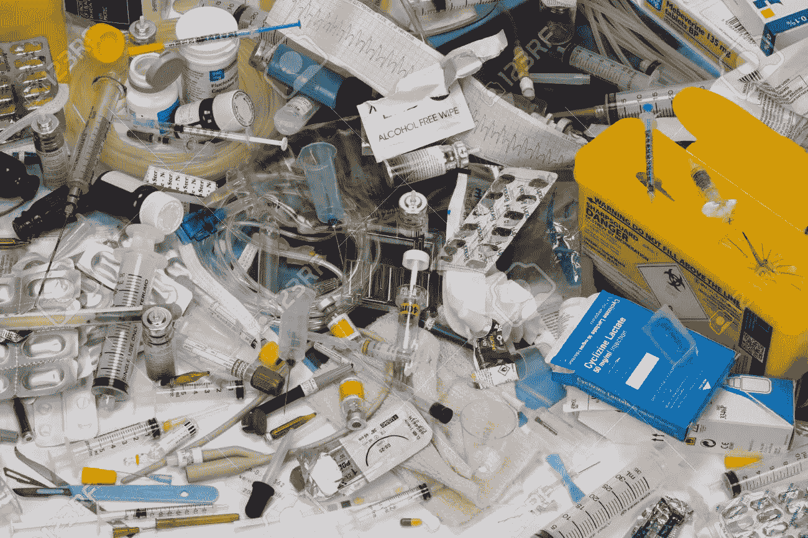

# 拯救生命不应该这么昂贵

> 原文：<https://medium.com/nerd-for-tech/saving-lives-shouldnt-be-this-costly-faa5ce678653?source=collection_archive---------18----------------------->

图片来源:123RF

## 越来越多的医疗垃圾对公共健康和我们星球的未来构成了威胁

当我们想到气候变化时，我们经常指出能源、交通和农业等行业是全球排放的主要来源。然而，有一个玩家经常被忽视:医疗保健。

> *如果医疗保健是* …