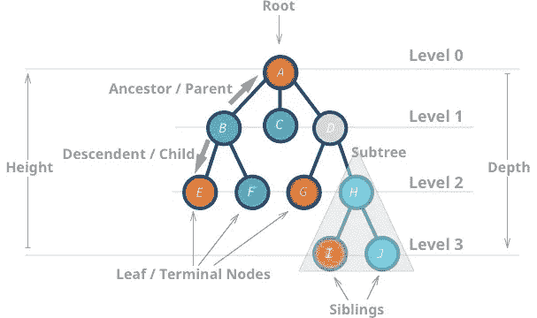
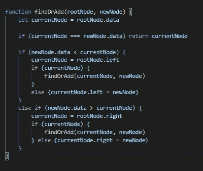

# 脚手架和树木

> 原文：<https://medium.com/nerd-for-tech/scaffolding-and-trees-3030023380cb?source=collection_archive---------17----------------------->

从自然和其他方面建立和发展战略。

听到脚手架这个词你第一个想到的是什么？对我来说，这是走在纽约的人行道上，突然担心自己的生命，因为有人在梯子上建造大型结构来覆盖人行道，目的是保护像我这样的行人免受建筑碎片的伤害。

在心理学和教育理论中，有一个相当不同的概念，也称为支架。用心理学术语来说:

> “支架式教学是一种教学技术，在这种教学技术中，教师通过逐步提高学习者建立在原有知识基础上的能力来提供个性化的支持。”

基本上，它是这样一种观点，即对于一个人来说，通过建立在他们已经拥有的与新知识相似的知识上来学习一个新概念要容易得多。在学习编程时，我发现自己不断地试图通过告诉自己这件事让我想起我已经知道的东西来将新的信息融入我的大脑。我在为自己搭建脚手架，因为，让我们面对现实吧，学习新事物是很难的，尤其是当你对新事物没有参照系的时候。

树(自然的和程序化的)实际上是脚手架概念的一个很好的视觉表现。我们从一个节点/一块知识开始，慢慢地在它的基础上建立，根据我们看到的与其他数据块的关系连接数据块。

我想通过向自己介绍一个新概念来展示支架式思维过程是如何工作的。让我们来讨论一下我们的叶子朋友。

我想了解树作为一种数据结构是什么。首先，我们做一些谷歌搜索，看看:

> 树是一种数据结构，其中一个节点可以有零个或多个子节点。每个节点包含一个**值**。像图一样，节点之间的连接叫做**边**。树是图的一种，但不是所有的图都是树。”

还有一张图！

这张图片很好地总结了这一点

我心目中的树模型现在就像一棵绿树，有树干(根节点)、树枝(后续子节点)和树叶(结构末端的节点不连接其他节点)。

现在我想了解一些事情。

1.  我们为什么需要这些？
2.  我们如何使用它们？

# 为什么

每个父节点有两个子节点的树，根据子节点落在父节点两边的顺序称为二叉树或二分搜索法树，对于有效的排序和搜索特别有用。想一想我已经知道的对数据结构(如数组)进行排序和搜索至少需要一个循环，有时需要多个循环，我承认已经实现了信息之间关系的逻辑的结构在定位特定信息时非常有效。

# 怎么做

我想探索二分搜索法树如何使用递归提供一个有效的搜索框架。我以前在处理数组时使用过递归，所以我可以将这种经验应用到处理树中。数组由子数组组成，就像树节点由其他节点组成一样！

BST 要求父节点左侧的数据少于存储在父节点上的数据，而父节点上的数据少于存储在右侧的数据。知道了这个关系，我们就可以写一个函数，它接受一个根节点和一个新节点。如果当前节点为空，该函数将比较存储在根节点和新节点的数据，如果数据少，则将其插入左侧，如果数据多，则将其插入右侧。如果当前节点确实存在，我们通过函数发送当前节点和新节点，直到到达一个空白节点，我们可以将新节点插入其中。当我们以这种方式遍历树时，我们对照存储在新节点的数据检查每个当前节点的数据，如果匹配，就返回它。

二分搜索法或插入算法

# 让我们反思一下

关于树，我学到了什么？

*   它们对于数据间关系的建模非常有用。
*   我可以用我的递归知识来帮助遍历和搜索它们。
*   它们构成了一个非常吸引人的心智模型，我的大脑很容易记住和添加。
*   脚手架的理想选择！

支架知识的最后一块拼图是实践。既然我已经将这个新的数据结构构建到我的知识之树中，我将需要利用每一个机会来练习，以巩固我的知识并长出新的叶子和树枝！