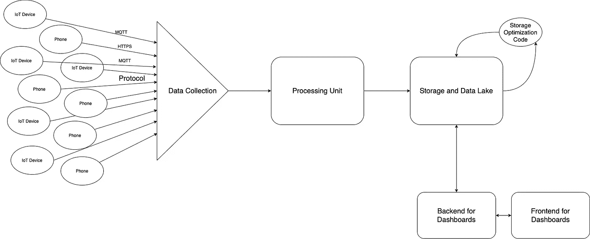

# AWS 简化了可扩展的近实时数据分析架构

> 原文：<https://medium.com/nerd-for-tech/scalable-near-real-time-data-analytics-architecture-made-easy-with-aws-397f197adc0?source=collection_archive---------4----------------------->

许多现代数据分析用例需要接近实时的基础架构。作为一名企业家，刚从大学毕业，有一个想法和一个大梦想，但经验很少，我努力寻找一个可靠的架构，既经济实惠，又性能良好。

很自然，我四处打听。朋友，关系，AWS 支持，以及更多的人。我写这个博客是为了分享我收集的一些知识，以及我自己对一些真正简单的方法的想法，这些方法可以实现几乎不需要维护的近实时分析基础设施。

请随意评论我谈到的任何体系结构，并分享您的想法！另外，如果有错误的信息和建议，请随时在 [LinkedIn](https://www.linkedin.com/in/sayantapadar/) 上 ping 我！

> 改变的第一步是意识。第二步是接受。—纳撒尼尔·布兰登

# 成分

首先，让我们谈谈什么是最重要的部分，这应该是经过深思熟虑的。

1.  草案
2.  数据收集
3.  处理单元(摄入)
4.  存储和数据湖

# 草案

这完全取决于你的用例。让我列出一些更常用的。

1.  HTTP/HTTPS —流行、安全，当然，你已经听说过了。面向文档的请求/响应工作流。
2.  MQTT/MQTT——轻量级、更好的响应时间、吞吐量，适用于电池/电源和带宽受限的设备。[这篇文章](/mqtt-buddy/mqtt-vs-http-which-one-is-the-best-for-iot-c868169b3105)很值得一读。
3.  AQMP——非常适合服务器对服务器的通信。[这篇文章](https://www.educba.com/amqp-vs-mqtt/)很值得一读。
4.  TCP —经典、高吞吐量。在带宽限制下不太好。非常适合服务器与服务器之间的通信。

还有更多的协议。我将把它保留在这 4 个我用过或见过的常用词中。

# 数据收集

这是将所有传入数据导向处理(摄取)单元的漏斗。

> ***关键必备—*** [***高可用性***](https://www.digitalocean.com/community/tutorials/what-is-high-availability) ***，*** [***可扩展性***](/@cielo.raymundo1/scalability-101-617b626e5a20)

最重要的是，您的漏斗总是需要存在，以接收来自最终用户设备的传入消息。如果漏斗关闭，就会丢失大量数据。我将分享一些我用过的或者经常看到被使用的服务/架构。

1.  [AWS Kinesis 数据流](https://docs.aws.amazon.com/streams/latest/dev/building-producers.html) —托管服务。所以根本不用担心基础设施。有据可查。使用 HTTPS。

    看看 [Kinesis Firehose](https://aws.amazon.com/kinesis/data-firehose/) 看大图。我将在本文中多次提到 Kinesis Firehose。

    我最喜欢 *Kinesis Firehose* 的地方就是它的缓存能力。在调用流程流的下一部分之前，您可以选择缓存最多 6 分钟的数据，或者最多 128MB 的数据。如果分析用例可以接受几分钟的“延迟”，这将大大有助于成本优化。
2.  融合 kafuent Kafka——既是一个*完全托管的服务*,也是一个可以在自己的*自我管理的*托管环境中使用的包。很好的记录，很好的社区支持。

    附带了过多的插件——源连接器和宿连接器。比如 REST 连接器、MQTT 连接器、AWS/Azure/GCP 服务的连接器等等。

    您可以使用它来构建一个基础设施，终端设备可以使用 HTTPS 或 MQTT 来发布数据。并将数据传输到处理单元、永久存储、第三方服务等等。

# 处理单元—您的代码

这当然是你最应该关注的地方。让这一切成为可能的代码！我将讨论一些您可以使用的基础设施想法——少担心基础设施，多担心代码。

> ***关键要素—可扩展性***

总是提前为大规模的使用高峰做好准备。毕竟，一个企业是带着繁荣的希望建立的。当你刚刚达到 100 万用户的时候，如果后端开始失败，那不是很糟糕吗？

通读后，请务必谷歌出 ***垂直缩放*** 和 ***水平缩放*** 。

我将再次谈论一些我个人使用过的或经常使用的服务/架构。

1.  [AWS Lambda](https://aws.amazon.com/lambda/) —完全托管-部署您的代码，AWS 处理所有其他事情，高度可用，可根据您的需求进行扩展，非常适合小型团队。缺点——它对部署包的大小有一个上限，但是有几种方法可以绕过它；过于频繁的调用往往会增加开销。仔细阅读定价。如果使用得当，它还具有惊人的成本效益。
2.  [AWS EKS(弹性 Kubernetes 服务)](https://docs.aws.amazon.com/eks/latest/userguide/what-is-eks.html) —这是一篇关于 Kubernetes 的[好文章](https://kubernetes.io/docs/concepts/overview/what-is-kubernetes/)。EKS 为您的自我管理集群提供了一个管理控制平面。如果需要更多的资源和更频繁的调用，这是比 Lambda 更好的成本优化选择。
3.  自我管理的 Kubernetes——这已经成为某种“行业标准”。集装箱化和 Kubernetes。然而，这需要注意基础设施的维护。一定要看看 [AWS EC2 自动缩放组](https://docs.aws.amazon.com/autoscaling/ec2/userguide/AutoScalingGroup.html)，让生活变得简单一点。Docker 是最受欢迎的集装箱服务。不过也看看[集装箱](https://containerd.io/)。

# 存储和数据湖

和上面一样，这也很大程度上取决于你的用例。主要尝试使用以下方法的组合:

1.  缓存—通常是更昂贵的存储，主要用于保存非常常用的数据。比数据库加载和写入速度更快。如果使用得当，还可以为您带来急需的成本优化。查看[AWS elastic cache](https://aws.amazon.com/elasticache/?trkCampaign=acq_paid_search_brand&sc_channel=ps&sc_campaign=acquisition_IN&sc_publisher=Google&sc_category=Database&sc_country=IN&sc_geo=APAC&sc_outcome=acq&sc_detail=aws%20redis&sc_content={adgroup}&sc_matchtype=e&sc_segment=477000491510&sc_medium=ACQ-P|PS-GO|Brand|Desktop|SU|Database|Solution|IN|EN|Sitelink&s_kwcid=AL!4422!3!477000491510!e!!g!!aws%20redis&ef_id=CjwKCAjwqvyFBhB7EiwAER786eMTl5VW9Bk6mkgQHhzTeHZnZAFDdFC7KesXH34syClUpRpajqKRbhoCLhgQAvD_BwE:G:s&s_kwcid=AL!4422!3!477000491510!e!!g!!aws%20redis)。
2.  数据库——我在这里同时谈到了 SQL 和 NoSQL。一般来说，我更喜欢两者结合使用。我更喜欢将关系数据保存在 SQL 数据库中，比如用户表、用户信息表等；以及 NoSQL 数据库中的文档类型数据，例如喜欢的歌曲、推荐等。

    [AWS RDS](https://aws.amazon.com/rds) 和 [AWS RDS Aurora](https://aws.amazon.com/rds/aurora/) 都是很棒的服务。Aurora 是全托管的，支持动态自动伸缩，这是一个很大的优势。但是，如果您清楚地了解您的扩展需求，AWS RDS 往往更具成本效益。但是，您必须自己处理缩放。

    [AWS DynamoDB](https://aws.amazon.com/dynamodb/) ， [AWS DocumentDB](https://aws.amazon.com/documentdb) ， [MongoDB Atlas](https://www.mongodb.com/cloud/atlas) 都是很棒的全托管 NoSQL 数据库。DynamoDB 的成本效率令人难以置信，但也有一些限制，写操作的成本是读操作的 3 倍。DocumentDB
3.  存档——这里我只说一下 [S3](https://aws.amazon.com/s3/) 。它支持**所有**用例的存储。您可能经常需要、不会经常需要、可能根本不需要的数据，但最好保存起来，以防万一。一切。请务必查看本页以获得更清晰的理解。

对于数据分析，所有收集的数据可能都很重要，我总是喜欢关注 ***高效查询。***

> ***关键要素—高效查询***

查询是建立高效数据湖的关键。您需要一个体系结构来查询超过 TB 的数据。在一个好的数据湖中，我通常会看到

1.  可接受的查询响应时间
2.  划分良好的数据。查询整个**档案是非常不可取的。**
3.  一致的文档结构。这使得查询更加高效。
4.  如有可能，文件以 [Avro 或拼花格式](https://blog.clairvoyantsoft.com/big-data-file-formats-3fb659903271)存储。

同样没错，Hadoop 很神奇。但是这里我就不说 Hadoop 和算法了。

一定要看看 [AWS Glue](https://docs.aws.amazon.com/glue/latest/dg/what-is-glue.html) 和 [AWS Athena](https://aws.amazon.com/athena) ，我个人在几乎所有的项目中都使用过。它处理爬虫、元数据数据库，并通过 Athena 提供高效的查询框架。

这是一篇[好文章](https://aws.amazon.com/blogs/big-data/build-a-data-lake-foundation-with-aws-glue-and-amazon-s3/)用 S3 和 AWS 胶水做一个好的数据湖。

# 摘要

你的架构完全取决于你的用例。根据您的需求进行混搭。当您选择使用什么时，您的主要考虑事项应该包括

1.  允许的延迟—设备事件与其在您的分析仪表板中的反映之间的延迟。
2.  选择哪些数据需要经常访问，哪些数据需要缓存。
3.  您设备的环境—带宽限制、电源限制、资源限制。
4.  观众——试着判断你的观众是否会突然大幅增加。

就像我之前说的，请评论分享更多想法，为了读者和我！这是我的第一篇博客，所以如果你发现错误的信息，请[通知我](https://www.linkedin.com/in/sayantapadar/)。有经验的博客和作者，也请平我建议更好的方式来表达我的想法。