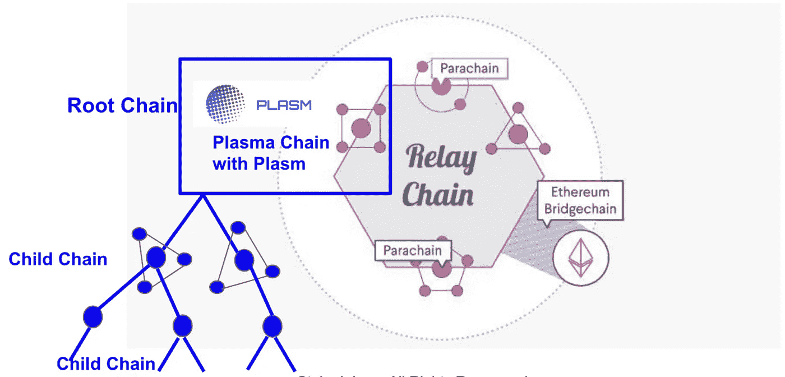

# 扩展区块链—第 1 层和第 2 层技术相遇

> 原文：<https://medium.com/nerd-for-tech/scaling-the-blockchain-layer-1-2-techniques-meet-43f68ee24afa?source=collection_archive---------0----------------------->

[https://www.plasmnet.io/](https://www.plasmnet.io/)

以太坊等公共区块链需要能够扩展，以实现其被认为是传统系统的可行替代方案的雄心，这反过来将允许它们获得广泛的采用和应用。

这些扩展解决方案可以“内置于”区块链本身(第 1 层解决方案)或“构建于其上”，以减轻基本链的压力(第 2 层解决方案)。这两个解决方案类别可能会相互补充。

# 区块链可伸缩性简介

虽然人们开始意识到区块链技术的巨大潜力和许多应用，但在实现这些雄心壮志之前，公共区块链的道路上还有许多障碍。最突出的问题是区块链的可扩展性。

可扩展性被定义为[系统、网络或流程处理不断增长的工作量的能力，或其被扩大以适应这种增长的潜力](https://dl.acm.org/citation.cfm?doid=350391.350432)。尽管可伸缩性在区块链环境中是一种挑战，但讨论主要围绕网络的事务吞吐量。这一点从最近以太坊上的聚光灯中显而易见，这些聚光灯关注的是拥塞期间的网络速度——主要是由初始硬币发行和围绕不可替代代币的[游戏](https://www.cryptokitties.co/)等事件引起的。

## 第 1 层技术

扩展这些平台的方法之一是通过修改其基本协议，或“第 1 层”。由于它们的直接性质，这些变化通常通过一个[硬分叉](https://en.wikipedia.org/wiki/Fork_%28blockchain%29#Hard_fork)来实现。

以太坊第 1 层解决方案的一个例子是[“分片”](https://github.com/ethereum/wiki/wiki/Sharding-FAQs)，它解决了网络瓶颈的“单行道”问题。目前，*每个*节点必须依次处理*每个*事务，将网络的事务吞吐量限制到每个节点可以处理的最大值。通过将链分成段或“碎片”,这一限制被解除，因为每个节点可以并行处理不同的事务。

随着草间弥生金丝雀网络(Polkadot 实验)的发布，分片技术的研发工作目前由 Web3 基金会牵头。

**Polkadot:异构多链**

Polkadot 是一个异构的多链框架，支持区块链网络在共享安全的保护下协同工作。

此外，还有一个创建区块链的框架，称为 Substrate。目前，波尔卡多特本身和副链都是用基板制作的。希望在未来，我们认为区块链将被并行，因为没有一个完美的区块链可以独自支持所有的治理模式和客户需求。因此，有 900 多个公共区块链已经建成，越来越多的区块链正在建立。波尔卡多特和基板授权这一运动创造完美的定制区块链的基础上，用户的需求。

互操作性是扩展解决方案之一。Polkadot 通过将事务分布在多个并行区块链(称为副链(碎片))上来提供事务可伸缩性。

**(i)基板运行时模块库(SRML)**

Substrate 和一致的运行时模块是用 Rust 开发的，Rust 是一种静态类型的语言，通过其内存安全特性提供了速度和可靠性。

这些功能包被称为模块，或者更具体地说，运行时模块。与 Substrate 预打包在一起的这一系列运行时模块共同形成了一个模块目录，称为 Substrate 运行时模块库，或 SRML。

这些模块非常有用。它们为我们从其他区块链框架中期待的一系列功能添加了功能，并且可以在 Github 上浏览。让这些模块随时可用使开发人员不必重新发明轮子并重新实现它们——并且在实现全新功能的地方，它们也可以作为运行时模块来开发。

随着基板的开发，SRML 模块得到了维护，这也使它们变得可靠。可靠性是运行时模块的另一个关键优势——随着它们被采用，维护它们变得更加现实。

## 第 2 层技术

由于协议的完整性和安全性对协议的成功至关重要，因此对区块链基础层的更改非常难以执行。由于这种敏感性，第 2 层解决方案也正在开发中，它将补充第 1 层方法，提供可扩展的高效区块链。

自从第二层解决方案的最初概念[国家频道](https://www.jeffcoleman.ca/state-channels/)——包括[雷电](https://raiden.network/)，反事实，和比特币之光[宁网络](https://lightning.network/)出现以来，已经有了广泛的研究

**Plasma** 也是以太坊的第 2 层解决方案，它为构建安全、可伸缩和快速的“非链”分散式应用程序提供了一个框架。等离子体有多种实现方式，包括:

**1。最小存活血浆(MVP)**

**2。更有活力的血浆(MoreVP)**

**3。等离子 Snapp**

**4。血浆现金**

**5。血浆借记**

**6。等离子桥**

在所有第 2 层解决方案中，等离子体是唯一一种对主链处理性能依赖性最小的缩放解决方案。在血浆中，操作者管理其侧链而不牺牲分散性。这意味着许多交易可以集中处理，不需要共识过程，但侧链上的所有参与者可以通过提交欺诈证据安全退出。

现有集中式系统中使用的扩展解决方案可以原样使用。因此使得实现高处理性能成为可能，这对于本地分布式分类帐是不可行的。等离子体将被认为是未来不可或缺的技术，因为它可以显著提高所有分布式分类帐的处理性能。

**然而，等离子体**并不是以太坊唯一提出的第 2 层解决方案，可以合理地预期它将与其他第 2 层解决方案共存，并作为第 1 层解决方案的补充。

第 2 层解决方案对基础协议没有任何改变，而是构建在基础协议之上，允许操作在“链外”进行，同时仍然保留主链提供的好处，即安全性和终结性。

第 2 层解决方案的一个明显的好处是，它们的实现不一定需要硬分叉，但是它们的范围远远大于集成问题；与第 1 层解决方案一起，它们可以显著提高“基础”区块链的实际应用和可用性。

**(二)乐观虚拟机**

**乐观虚拟机**是以太坊基金会的**等离子组**发明的。 **OVM** 是设计用于支持所有第 2 层协议的虚拟机。这是所有第 2 层可伸缩性结构的可能统一。

**浆**

尽管 Polkadot 生态系统本身就是一个扩展解决方案，但我们需要第 2 层技术来进一步扩展单个副链。**乐观虚拟机(OVM)** 运行时模块的 Rust 实现被称为 **Plasm** 。

通过使用 Substrate，任何人都可以轻松地创建一个定制的区块链，任何开发人员都可以在几分钟内创建一个具有等离子体、国家频道和乐观汇总技术的高速链。因为等离子体是基质的一个模块，我们可以制造等离子体中心的区块链。基于以上所述，有两种方法可以使用血浆。

1.导入血浆到你的基质链进行缩放。

2.在一个以等离子体为中心的副链上建立一个应用程序或子链。

我们需要以等离子为中心的副链至少有 4 个潜在的原因:更大的可扩展性、Polkadot 的副链插槽、Polkadot2.0 和桥接。

**更大的可扩展性**

首先，Polkadot 通过将事务分布在多个并行区块链上，成为一个高度可扩展的网络。我们将看到许多类型的副链，如物联网链、游戏链、能源链和支付链。除此之外，还会有像桥链、智能合同链、等离子链和 dex 链这样的公益链。其中一些用例需要在一个副链上有巨大的事务吞吐量。Plasm 使得在不牺牲分散性的情况下构建需要高性能的用例成为可能。

**波尔卡多的副链槽**

Polkadot 是一个异构的多链框架。它使区块链网络能够在共享安全的保护下协同工作。许多区块链将通过 Polkadot 连接，但连接链的数量是有限的，您需要赢得插槽拍卖才能加入网络。如果你没有足够的点数来赢得吃角子老虎机拍卖，等离子副链可能是你的一个好选择，因为你可以将你的链连接到等离子副链。这意味着你的链条间接连接到波尔卡多特。从这个角度来看，我认为我们可以说等离子副链是常见的好链。

**桥(原子互换和智能合约)**

Polkadot 兼容其他区块链，如比特币和以太坊。尽管我们必须考虑许多技术细节，如数字签名、散列函数、散列时间锁定契约等等，但用 Plasm 在它们之间架起一座桥梁应该是可能的。我们可以在 Plasm Parachain 和另一个区块链(例如以太坊)之间建立一座桥梁，从而为生态系统带来巨大的价值，因为 Plasm 提供了一个安全可靠的解决方案，通过 plasma 子链将资产从 A 移动到 B。

**波尔卡多特 2.0**

Plasm 是一个分级结构的缩放解决方案。它是一个框架，允许创建使用主链作为信任层的子链。我们假设我们可以在 Polkadot2.0 中使用 Plasm 技术的某些部分，其中一个中继链连接到另一个中继链，提供无限的可伸缩性。预计 2020 年。

**结论**

以等离子体为中心的副链不仅本身能够支持等离子体应用，还能够支持状态信道应用或任何其他第 2 层协议，如乐观汇总和 ZK 汇总。请继续关注关于如何在草间弥生网络上实现一个以等离子为中心的副链的指南！(即将推出)