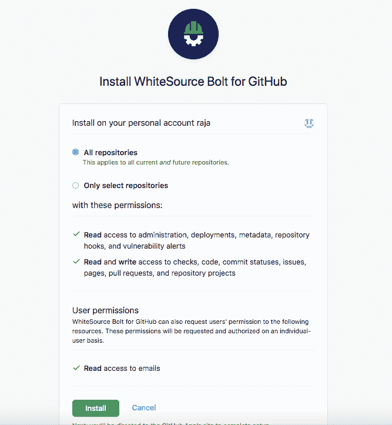
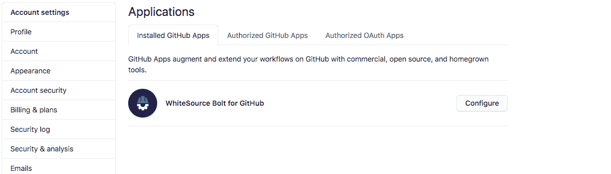

# 扫描 Docker 项目中的安全漏洞

> 原文：<https://medium.com/nerd-for-tech/scanning-docker-projects-for-security-vulnerabilities-db6c555e532d?source=collection_archive---------10----------------------->


照片由 [Eagan Hsu](https://unsplash.com/@eags_?utm_source=unsplash&utm_medium=referral&utm_content=creditCopyText) 在 [Unsplash](https://unsplash.com/s/photos/security?utm_source=unsplash&utm_medium=referral&utm_content=creditCopyText) 上拍摄

每个开发的软件都有潜在的漏洞。软件团队不断监控开发的应用程序，并尽快改进其漏洞。许多公司每年都花费大量资金来保护软件应用程序。漏洞只不过是代码、软件设计流程或安全许可中的弱点。为了更好地理解它，我们可以看看 SQL 注入的弱点。这是软件中非常常见的代码漏洞。我将使用一个示例代码来解释 SQL 注入。

这个代码是由一个开发新手使用任何语言从数据库中查询数据而编写的。

```
const query = "SELECT * FROM emp_list where name='"+name+"'"
```

黑客给出以下输入来操纵查询以暴露数据。

```
name=" raja ' or '1'='1"
```

给定输入生成的查询如下所示。这个查询将公开所有数据。

```
SELECT * FROM emp_list where name='Raja' or '1'='1'
```

那么为什么会暴露数据呢？因为我们使用了串联。这就引出了 SQL 注入。这是新手开发者很常见的问题。他们忘记了使用准备好的语句类型，而不是语句方法。

像这样的，漏洞太多了。你可以浏览网上提供的详细的[漏洞列表](https://owasp.org/www-community/vulnerabilities/)来获得更好的想法。

美国政府创建了一个国家漏洞数据库(NVD)，许多组织使用它来防范各种安全问题。它是所有漏洞的共享数据库。每一个新的漏洞都会被报告给 NVD，然后由 NVD 团队进行分析。此后，他们根据测试结果批准或拒绝漏洞声明。

截至目前，NVD 包含 165，089 个 CVE(常见漏洞和暴露)。查看他们的[仪表盘](https://nvd.nist.gov/general/nvd-dashboard)了解更多信息。


[图像来源](https://nvd.nist.gov/general/nvd-dashboard)

# 为什么我们需要漏洞扫描器？

漏洞总是在软件应用程序中引起一个大问题。如果你的应用程序被黑客攻击，你可能会失去你的客户。如果是财务数据，那么客户就亏了。在这种情况下，漏洞会给客户和公司带来巨大的损失。应用程序中的漏洞会造成多大的损失？IBM 的 2020 年[报告](https://www.ibm.com/security/data-breach)可以给你一个很好的思路。

# 数据泄露的成本—来自 [IBM](https://www.ibm.com/security/data-breach) 的 2020 年报告

1.  数据泄露的平均总成本为 386 万美元。
2.  发现和遏制违规行为所需的平均时间为 280 天。
3.  如果您在不到 200 天的时间内发现一个 bug，您可以节省 100 万美元。
4.  医疗保健行业损失了 713 万美元，比任何其他行业都多。
5.  美国损失了 864 万美元，这对一个国家来说是巨大的损失。
6.  远程工作导致了更多的数据泄露。它花费了 13.7 万美元。

从上面的报告中，我们可以看到漏洞造成了巨大的损失。扫描有助于我们在软件发送给客户之前发现软件中的问题。然后，我们可以解决这些问题，使应用程序更加安全。因此，扫描有助于我们减少漏洞造成的损失。扫描在基于 Docker 的项目中特别有用，这些项目使用了许多第三方库。由于管理 Docker 项目是一项单调乏味的任务，扫描工具可以帮助我们解决 Docker 项目中存在的漏洞。

市场上有许多可用的扫描工具。在这里，我们将看到[白源螺栓](https://www.whitesourcesoftware.com/free-developer-tools/bolt/)工具，这是一个开源软件。WhiteSource Bolt 分析源代码的安全问题。它支持 200 多种语言。白源螺栓工具分析软件应用项目中使用的相关工具/库。它详细报告了项目中使用的第三方库中存在的漏洞以及如何修复这些漏洞。


[图像来源](https://www.whitesourcesoftware.com/)

WhiteSource Bolt 为我们提供了两种扩展。

1.  GitHub 扩展
2.  Azure 扩展

在本文中，我们将了解如何使用 WhiteSource Bolt 安装、配置和扫描 GitHub repo。

# 安装 WhiteSource 螺栓

安装白源螺栓是一个简单的过程。我们可以直接用 GitHub 来配置。无需在本地安装白源螺栓。

所以首先，去 GitHub 登陆。然后进入白源 Bolt 插件[页面](https://github.com/marketplace/whitesource-bolt)。向下滚动，你可以找到**免费安装**按钮。点击按钮为您的 GitHub 帐户安装 WhiteSource Bolt。然后，点击**完成订单并开始安装**按钮。

它会要求您选择一个存储库。您可以选择所有回购或特定回购。然后点击**安装**按钮完成安装。



授权白源 Bolt 访问 GitHub。在 WhiteSource Bolt 上注册您的电子邮件。仅此而已！安装成功。现在，我们可以开始使用白源螺栓检查漏洞。在这里，我们将看到两个例子。每当您将代码提交到您的存储库时，WhiteSource Bolt for GitHub 都会扫描您的存储库。扫描限于每个存储库每天 5 次扫描。

# 扫描存储库

要扫描存储库，我们首先需要配置要扫描的存储库。进入 GitHub [设置页面](https://github.com/settings/installations)。然后单击配置按钮。



在这里，您可以添加要扫描的存储库，并单击 save 按钮开始扫描。如果您的回购包含漏洞，那么 WhiteSource Bolt 工具将使用“问题”选项卡显示回购中存在的所有漏洞。扫描需要一些时间。所以等拿到漏洞列表吧。

# 示例回购 1:

[https://github.com/bharathirajatut/fitbit-api-example-java2](https://github.com/bharathirajatut/fitbit-api-example-java2)

派生此存储库，然后配置此存储库进行扫描。该回购将抛出大约 136 个漏洞。这是一个 Java 应用程序。扫描列出了第三方 jar 文件中存在的所有漏洞以及如何修复它们。

# 回购 2 示例:

[https://github.com/bharathirajatut/vulnerable-node](https://github.com/bharathirajatut/vulnerable-node)

派生此存储库，然后配置此存储库进行扫描。这是一个基于 Docker 的项目。这个 Docker 项目包含另外 10 期。这种类型的扫描将帮助我们解决软件应用程序项目中存在的漏洞。

您还可以观看[视频](https://www.whitesourcesoftware.com/free-developer-tools/bolt/github-thank-you/)，了解更多关于 WhiteSource Bolt 的信息。请记住，WhiteSource Bolt 分析的是你的项目中使用的第三方库，比如 jar 文件、npm 包等。，而不是项目中的源代码。对于源代码扫描，你必须使用白源工具。

# 摘要

安全性是软件开发组织的一个主要问题。每年，许多公司花费大量资金来解决安全问题。但尽管如此，我们每年都听到如此多的科技巨头和初创公司遭到黑客攻击。所以扫描将有助于减少漏洞。开发了许多社区驱动的工具来解决安全需求。WhiteSource Bolt 是一个很好的倡议，它为漏洞扫描提供了一个开源工具。