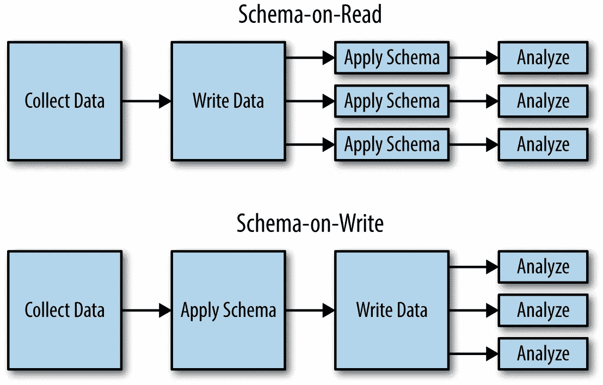

# 按需模式[读取]

> 原文：<https://medium.com/nerd-for-tech/schema-on-demand-read-9b79cb4420a7?source=collection_archive---------4----------------------->

我这一代人见证了从电视到在线视频平台的转变。早些时候，我们有一个观看《沙克蒂曼》或《T2》的时间表。现在我们想看什么时候就看什么时候，想去哪里就去哪里，想怎么看就怎么看。这就是按需服务的力量。我们需要时会消费任何东西。

数据处理和分析也发生了类似的转变。嘣。**阅读模式。**我称之为按需模式。

图片来源:[https://www . oreilly . com/learning/Hadoop-what-you-need-to-know](https://www.oreilly.com/learning/hadoop-what-you-need-to-know)

大数据以原始格式存储，模式是在我们实际使用/读取数据时创建的，而不是在存储/写入数据时创建的。在写数据的时候，我们通常不关心进来的是什么。在 ELT (Extract Transform Load)中，只有在提取和访问数据进行分析时，才会定义模式。数据以未转换状态存储在叶级。只有在提取和访问数据以满足分析需求时，才定义模式。

虽然我们在 S3 存储数据，但我们并不担心上传的数据类型。我们把它当作物品。没有底层文件系统。Athena 是一个按需创建模式的服务。

在 Hadoop 生态系统中，Spark 使用反射支持按需模式。HBase 将一切都视为字节数组，并且在存储数据时不创建任何模式。它创建读取模式。Kibana 还使用模式读取方法，允许用户在原始日志上运行搜索和聚合。

希望它有助于理解按需模式及其含义。