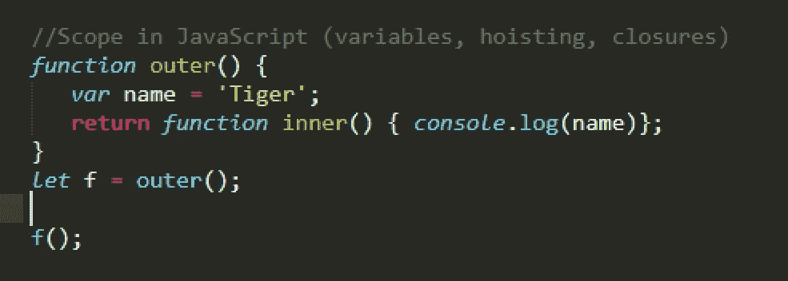

# JavaScript 中的作用域(变量、提升、闭包)

> 原文：<https://medium.com/nerd-for-tech/scope-in-javascript-variables-hoisting-closures-afaa9a98d3?source=collection_archive---------5----------------------->



理解范围对于避免在编码时可能不明显但会在以后造成大问题的问题是非常重要的。这也可能会有点混乱，所以我写这篇文章是为了让我和其他人更清楚。

我将讨论变量、提升和闭包。

# **什么是范围？**

在一本正规的字典里，你会得到这样的关于范围的定义:*某事物处理的或与之相关的领域或主题的范围。在 JavaScript 中，同样定义是有效的。在代码中声明变量的位置将决定如何以及从哪里访问它们。*

JavaScript 中有两种类型的作用域:全局和局部。

全局范围是在块或函数外部声明的。对于 JavaScript，在浏览器上运行 JavaScript 时的全局范围是“窗口”。

# 变量

在 JavaScript 中声明变量有不同的方式，我们如何做(不仅仅是在哪里)将影响它们的范围。那三种方式分别是`**var**` **、**、`**let**`、、**、**、`**const**`、**。就作用域而言，** `Const` 类似于`let`，不同之处在于你不能改变用 const(常量)声明的变量的值。

看看下面的代码，我们可以在一个函数中设置`var a`，也可以在该函数的一个块中设置。

```
function f (){
    **var a = "a";** if (1 === 1){        
        **var a = "AA";**    
        console.log(a);
    }    
    console.log(a);
}f();
```

当我们调用该函数时，两个 console.logs 都将输出相同的内容:“AA”。**这是因为** `**var**` **没有提供块作用域**，所以 if 块内的`var a`实际上是在覆盖 if 块外的。

当我们在相同的代码上使用`let`而不是`var`时会发生什么？

```
function f (){ **let a = "a";**
    if (1 === 1){        
        **let a = "AA";**    
        console.log(a);
    }    
    console.log(a);
}f();
```

现在，console.logs 将打印“AA”和“a”。**用** `**let**` **声明变量将允许块范围**。`Let`是 JavaScript 中较新的东西，所以有很多代码使用`var`来声明变量。但是，向前看，最好使用`let`或`const`。

函数外和函数内的一个`var`怎么样？

```
**var a = "A";**function f (){
    **var a = "B";**
    if (1 === 1){
        **var a = "C";  **  
        console.log(a);
    }    
    console.log(a);
}f();
console.log(a);
```

上面的代码将打印:“C”，“C”，“A”。所以函数内部的代码和我们之前看到的一样，第二个赋值(“C”)覆盖了第一个(“B”)。但是，在函数外部声明的函数保留了它的原始值。

在上面的代码中使用 let 而不是`var`会使每个“a”都有自己的作用域，所以这三个都将保留它们的初始值。

上述代码中在函数外部声明的变量具有全局范围，可以从网页上的所有脚本和函数中访问。

当使用 JavaScript 时，确保在使用变量之前声明它们，因为如果你忘记声明一个变量而只是赋值，你将会创建全局变量。请注意以下代码之间的差异，如果没有在函数外部定义，这些代码将引发错误:

```
function f (){
    **var a = "B";**
}f();
console.log(a);
```

这段代码将工作并显示“B ”,因为 JavaScript 用`a=”B”`语句将变量声明为全局变量。**在 JavaScript 中，已赋值但未声明的变量将被声明为全局变量。**

```
function f (){
    **a = "B";**
}f();
console.log(a);
```

但是，您可以将代码设置为使用严格模式，在这种情况下，JavaScript 不会将变量创建为全局变量，而是会得到一个错误:

```
**"use strict";**function f (){
    a = "B";
}f();
console.log(a);
```

注意:只有在真正需要的时候才使用全局变量。

传递给函数的参数充当函数的局部变量。

```
function fa (**a**){    
    if (1===1){
        **var a ="C"**;
        console.log(**a**);
    }
    console.log(**a**);
}fa(**"A"**);
```

上面的代码将打印“C”和“C”。但是用`let`代替`var`:

```
function fa **(a)**{    
    if (1===1){
        **let a ="C";**
        console.log(a);
    }
    console.log(a);
}fa(**"A"**);
```

会打印“C”和“A”。

# 提升

提升意味着 JavaScript 将变量或函数声明移动到它们上下文的顶部。这意味着在 JavaScript 中，函数和变量在声明之前就可以被访问。这个代码是可以的，它将打印 1。

```
a = 1;
console.log(a);**var a;** 
```

注意，我们并不真的需要`var a`语句来运行代码，因为`a = 1`语句已经在全局范围内创建了一个变量。

然而，如果我们像下面的代码那样使用 `let`而不是`var,`，我们将在`a=1`语句中得到一个引用错误(在初始化之前不能访问‘a’)。

```
a = 1;
console.log(a);**let a**;
```

**对于用** `**let**` **或** `**const**` **声明的变量，代码块*知道变量的*，** **，但在声明**之前不能使用。需要记住的一点是，在声明`let` 之前使用它会导致错误，但是对`const` 变量做同样的事情不会导致错误，但是它不会工作。

**JavaScript 提升*声明*而不是*初始化*** 。这意味着这段代码将打印未定义的,因为变量就在那里，console.log 知道它，但不知道它的初始化:

```
console.log(a);**a = 1;****var a;**
```

在上面的代码中，`console.log(a)`知道有一个变量 a，并将它打印出来，但是对 1 的赋值还没有被提升，所以当`console.log` 发生时，变量从`var a`开始被设置为未定义。

以这种方式编码会产生问题，并使代码更难被其他人阅读，所以最好在使用变量之前声明它们。

# 关闭

正如我前面提到的，在函数外部声明的变量是全局变量，它们可以在网页上的任何地方被访问，所以，在函数内部，我们可以访问在全局范围内声明的变量。

此外，JavaScript 允许函数内部的函数(嵌套函数)。当一个函数在另一个函数中定义时，内部函数可以访问外部函数的变量范围。这就是函数闭包。

*词法* *作用域*使用变量在源代码中声明的位置来确定该变量在哪里可用。在嵌套函数中，词法范围用于确定嵌套函数可以访问哪些变量。

这里有一些例子来阐明这一点(请查看所有的例子来清楚地理解闭包)。

```
function **outer()** { var name = 'Tiger';
  function **inner()** { 
   console.log(name);
  }
}
outer();
```

上面的代码是可以的，但是它不会打印任何东西，因为我们没有真正调用内部函数。

```
function **outer()** { var name = 'Tiger';
  function **inner()** { 
   console.log(name);
  } **inner();**
}
outer();
```

上面会印“老虎”。

此代码也将工作:

```
function **outer()** { var name = 'Tiger'; **inner();**

   function **inner(**) { 
     console.log(name);
    } **inner();**
}
**outer();**
```

我们在 outer 内部调用 inner 两次，一次在函数定义之前，一次在函数定义之后。它们都将工作，它将打印:“老虎”，“老虎”。

请注意，inner 是在 outer 内部定义的，因此这段代码将不起作用。我们将得到一个内部未定义的错误。

```
function outer() { var name = 'Tiger'; function **inner()** { 
      console.log(name);
   }}
outer();
**inner();**
```

上面的例子很棒，但这不是我们从 JavaScript 闭包中得到的全部。

在上面的例子中，我们从外部函数内部调用内部函数，所以我们是在外部函数还在执行的时候调用的。但是如果外部函数返回内部函数，然后我们在外部函数完成后调用内部函数呢？

```
function **outer()** { var name = 'Tiger'; **return function inner() { console.log(name)};**}let **f = outer(); //will get the inner function in the f variable**
console.log("About to call the inner function that got returned from the outer function");
**f();**
```

即使我们将返回的内部函数放在 f 变量中，并且外部函数已经完成，当我们用 f()调用它时，内部函数仍然可以访问那个名称值；这是因为闭包的缘故，闭包保持对函数被创建时可用的变量的访问。

在嵌套函数时，我们并不局限于一个层次。我们也可以有这个代码，它仍然会工作。

```
function **outer()** { var name = 'Tiger'; function **inner()** { 
       var name2 = " Are ";
       **return function inner2()** {console.log(name + name2 +         "Awesome");}
    }; **return inner();** //call inner, which returns a function and return it.}let **f = outer();****f();**
```

上面的代码会打印出来:老虎很牛逼。

谢谢你检查这个。我希望它有助于解释作用域在 JavaScript 上是如何工作的。

我想过在这篇文章中加入“this”关键字，但我想我会在其他时间单独讨论这个问题。如果你认为它应该被包括在这里，请让我知道。